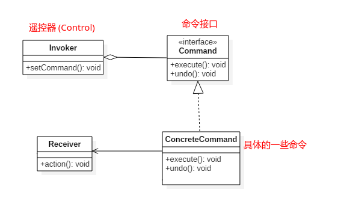
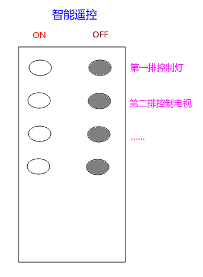
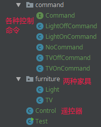
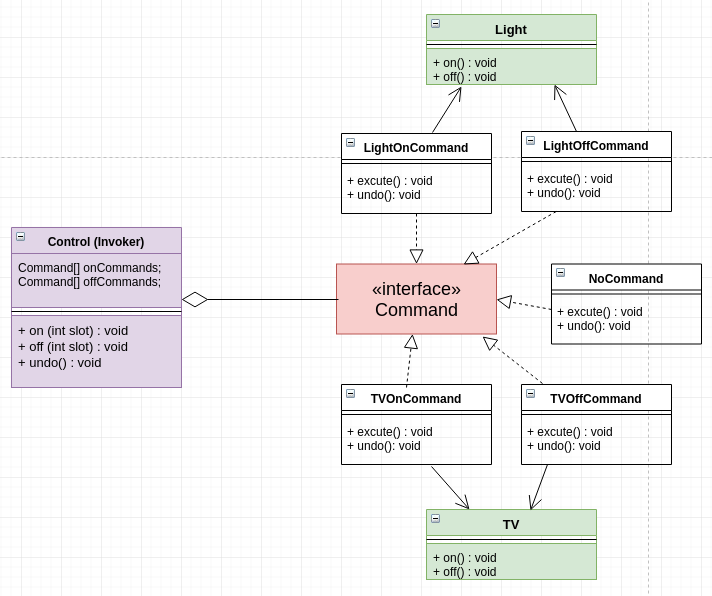

# 命令模式

- [一、基本概念](#一基本概念)
- [二、结构](#二结构)
- [三、案例](#三案例)
  - [1、不好的设计](#1不好的设计)
  - [2、用命令模式改进的设计](#2用命令模式改进的设计)
- [四、总结](#四总结)

## 一、基本概念

属于行为型模式。

将命令封装成对象中，具有以下作用：

- 使用命令来参数化其它对象；
- 将命令放入队列中进行排队；
- 支持可撤销的操作(`undo`操作)；

将请求、命令、动作等封装成对象，这样可以让项目使用这些对象来参数化其他对象。使得命令的请求者(`Control`)和执行者`Light or TV`解耦。(这里的`Control、Light、TV`是我们下面的例子中要用到的)。

## 二、结构
基本结构:

- `Command`：命令；
- `Receiver`：命令接收者，也就是命令真正的执行者(电视或者灯)；
- `Invoker`：通过它来调用命令； (遥控器)



## 三、案例

> 我们要模拟用一个遥控器控制灯和电视，其中遥控器第一排的按钮控制灯，第二排的按钮控制电视，而且，每一排有两个按钮，第一个是`ON`，第二个是`Off`。

如下图:



### 1、不好的设计

给出两个实体类: `Light`和`TV`：

```java
public class Light {
    //打开某个灯
    public void on(){
        System.out.println("Light On!");
    }

    //关闭某个灯
    public void off(){
        System.out.println("Light Off!");
    }
}
```

```java
public class TV {

    public void on(){
        System.out.println("TV On!");
    }

    public void off(){
        System.out.println("TV Off!");
    }
}
```

然后就是我们的遥控器:

```java
//控制类
public class Control {
    private Light light;
    private TV tv;//
    private final int slotNum = 10;

    public Control(Light light, TV tv) {
        this.light = light;
        this.tv = tv;
    }

    public void on(int slot) {
        switch (slot) {
            case 1:
                light.on();
                break;
            case 2:
                tv.on();
                break;
        }
    }

    public void off(int slot) {
        switch (slot) {
            case 1:
                light.off();
                break;
            case 2:
                tv.off();
                break;
        }
    }
}
```

测试：

```java
public class Test {

    public static void main(String[] args){
        Light light = new Light();
        TV tv = new TV();
        Control control = new Control(light, tv);
        control.on(1);
        control.on(2);
        control.off(2);
        control.off(1);
    }
}
```

输出:

```java
Light On!
TV On!
TV Off!
Light Off!
```

这样的设计确实实现了我们的需求，但是这样的设计的缺点在于: **我们的遥控器和我们的具体的家具很紧密的耦合，而且当我们需要扩展遥控器的时候，需要修改遥控器的代码**。

### 2、用命令模式改进的设计

先给出整体代码结构图:



以及整体的逻辑图:



代码:

```java
public interface Command {
    void execute();
    void undo();
}
```

控制灯的开关的两个命令类如下，另外还有两个控制电视的开关的两个类我就不写了，和下面的一样，**拥有TV的引用**，然后在`excute()`和`undo()`的时候调用对应的`on()`和`off()`即可。代码可以[**看这里**](command/)

```java
public class LightOnCommand implements Command{

    private Light light ; //哪个电灯

    public LightOnCommand(Light light) {
        this.light = light;
    }

    @Override
    public void execute() {
        light.on();   //直接打开
    }

    @Override
    public void undo() {
        light.off(); //原来是打开的就是关掉
    }
}
```

```java
public class LightOffCommand implements Command{
    private Light light;

    public LightOffCommand(Light light) {
        this.light = light;
    }

    @Override
    public void execute() {
        light.off();
    }

    @Override
    public void undo() {
        light.on(); //原来是关掉的，现在就是打开
    }
}
```

然后有一个特殊的`NoCommand`类，**这个是当我们的遥控器的某个槽没有控制某个东西的时候设置的值**，这个类很有用。比如我们想要控制某个槽，那个槽如果是空的，可能报空指针异常，但是如果一开始都赋值为`NoCommand`，就不会发生这种情况。

```java
public class NoCommand implements Command {
    @Override
    public void execute() {
    }

    @Override
    public void undo() {
    }
}
```

下面看我们的新的遥控器类:

```java
//控制类
public class Control {
    private Command[] onCommands; //一列的 开启按钮
    private Command[] offCommands; //一列 关闭按钮
    private final int slotNum = 10;

    //为了实现undo操作
    private Stack<Command> stack = new Stack<>();

    public Control() {
        //初始化
        offCommands = new Command[slotNum]; //10排
        onCommands = new Command[slotNum];

        //下面就是NoCommand的作用, 并不是每一个按钮都对应着家电，有可能是空的,这样下面就不要判断是不是空了
        Command noCommand = new NoCommand();
        for (int i = 0; i < onCommands.length; i++) {
            onCommands[i] = noCommand;
            offCommands[i] = noCommand;
        }
    }

    //遥控器并不知道绑定的是什么家具   解耦合
    //把命令对象设置到遥控器上 : 很重要 , 把命令封装成类 作为参数命令传进来，绑定到某个插槽
    public void setOnCommand(int slot, Command onCommand) {
        onCommands[slot] = onCommand;
    }
    public void setOffCommand(int slot,Command offCommand) {
        offCommands[slot] = offCommand;
    }

    // 下面是三个控制器执行的方法
    public void on(int slot){
        onCommands[slot].execute();
        stack.push(onCommands[slot]);//记录
    }
    public void off(int slot){
        offCommands[slot].execute();
        stack.push(offCommands[slot]);
    }
    public void undo(){
        stack.pop().undo(); //具体的回退   要回退的话，首先要记住按了哪些按钮， 可以使用栈的结构
    }
}
```

测试:

```java
public class Test {
    public static void main(String[] args) {
        Light light = new Light();
        TV tv = new TV();

        LightOnCommand lightOnCommand = new LightOnCommand(light);
        LightOffCommand lightOffCommand = new LightOffCommand(light);
        TVOffCommand tvOffCommand = new TVOffCommand(tv);
        TVOnCommand tvOnCommand = new TVOnCommand(tv);

        Control control = new Control();
        control.setOnCommand(1, lightOnCommand);
        control.setOffCommand(1, lightOffCommand);
        control.setOnCommand(2, tvOnCommand);
        control.setOffCommand(2, tvOffCommand);

        control.on(1);
        control.on(2);
        control.undo();//类似我们撤销(Ctrl + Z)的操作
        control.off(1);
    }
}
```

输出和原始设计一样。

## 四、总结

优点:  1、降低了系统耦合度。 2、新的命令可以很容易添加到系统中去；

缺点: 使用命令模式可能会导致某些系统有过多的具体命令类；

系统需要支持命令的撤销(Undo)操作和恢复(Redo)操作，也可以考虑使用命令模式，见命令模式的扩展