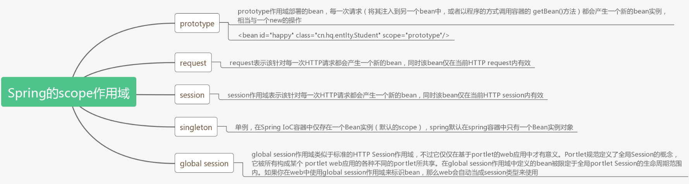
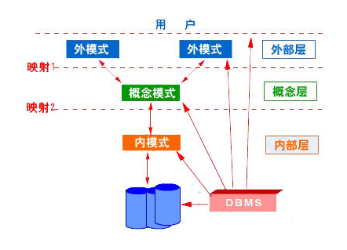

### 1、一

```java
public class Test2 {

    public static void main(String[] args) {
        char c = 'g';
        String myStr = Character.toString(c);
        System.out.println("String is: " + myStr);

        myStr = String.valueOf(c);
        System.out.println("String is: " + myStr);
    }
}
```

输出为:

```java
String is: g
String is: g
```

### 2、二

**一个空栈，如果有顺序输入：a1，a2，a3。。。an（个数大于3），而且输出第一个为an-1,那么所有都出栈后，（D）**

A. 输出的最后元素一定为`an`；

B. 输出的最后元素一定为`a1`；

C. 不能确定元素`a1~an-2`在输出顺序；

D. `an-2`一定比`an-3`先出；

解析:

* 既然an-1先出栈，说明 an-2, an-3已经入栈并且还未出栈，所以D肯定是对的，B的话an始终不进栈，a1~an-2都出栈了以后再进栈，这时候弹出的是an为最后一个；
* 我刚开始选择了B：因为我觉得a1-an-2都已经顺序入栈了，a1就一定会最后出栈。但我忘记了还有一个an，当a1出栈后an可以再进栈，那么最后一个出栈的将是an；

### 3、三

**总部给某分公司分配的网络地址是`172.16.2.0/24`,该分公司有三个部门，每个部门计算机不多于30台,在网络配置时，进行子网划分，可以使用的子网掩码是**（B/C）

A、255.255.255.128
B、255.255.255.192
C、255.255.255.224
D、255.255.255.240

**解析**：

1、分公司分配的网络地址是`172.16.2.0/24`，子网掩码就是`11111111.11111111.11111111.00000000`,（24个1）；  

 2、分公司3个部门，那么至少用2位才能分配3个以上（`00,01,10,11`）；  

 3、那么分部的子网掩码就要大于`11111111.11111111.11111111.11000000`（128）了；  

 4、又由于每个部门电脑不多于30台，那么至少也要给人家留出30台的主机地址，所以子网掩码不能是`11111111.11111111.11111111.11110000`（240），因为0000不能表示30台主机。

### 4、四

**甲乙丙3个进程对某类资源的需求分别是7个、8个、3个。且目前已分别得到了3个、3个和2个资源，若系统还至少能提供（A ）个资源，则系统是安全的**。

A、1          

B、4

C、2

D、8

### 5、五

**32位处理器是指处理器的（B）是32位的**

A、控制总线

B、数据总线

C、地址总线

D、所有的总线

> 32位处理器，计算机中的位数指的是[CPU](https://baike.baidu.com/item/CPU)一次能处理的最大位数。32位计算机的CPU一次最多能处理32位数据

### 6、六

 **某打车公司将驾驶里程（drivedistanced）超过5000里的司机信息转移到一张称为seniordrivers 的表中,他们的详细情况被记录在表drivers 中，正确的sql为**（）

正确答案: `select * into seniordrivers from drivers where drivedistanced >=5000`。

### 7、七

 **关于SpringMVC，以下说法错误的是**？（D）

A、SpringMvc的核心入口是DispatcherServlet；

B、@RequestMapping注解既可以用在类上也可以用在方法上；

C、@PathVariable作用是取出url中的模板变量作为参数；

D、controller默认是单例，通过@Scope(“prototype”)注解改为多例，成员变量共享；

**解析**

1、@Scope(“prototype”)表示每获取一个bean创建一个对象。这虽然看起来是多例。但成员变量并不共享。
要想成员变量共享，可设置为“session”或“globalSession”

2、单例模式下会共享普通成员变量和静态成员变量，多例模式下普通成员变量不共享,静态成员共享。

### 8、八

**off-heap是指那种内存**（B）

A、JVM GC能管理的内存；

B、JVM进程管理的内存；

C、在JVM老年代内存区；

D、在JVM新生代内存；

**解析**

off-heap叫做堆外内存，将你的对象从堆中脱离出来序列化，然后存储在一大块内存中，这就像它存储到磁盘上一样，但它仍然在RAM中。对象在这种状态下不能直接使用，它们必须首先反序列化，也不受垃圾收集。序列化和反序列化将会影响部分性能（所以可以考虑使用FST-serialization）使用堆外内存能够降低GC导致的暂停。堆外内存不受垃圾收集器管理，也不属于老年代，新生代。

### 9、九

下面程序运行结果:

```java
public static void main(String[] args) {
    List<String> list = new ArrayList<String>();
    list.add("F1");
    list.add("F2");
    list.add("F3");
    for (String temp : list) {
        if ("F3".equals(temp)) {
            list.remove(temp); 
        }
    }
    for (String temp : list){
        System.out.println(temp);
    }
}
```

答案(A)。

A、抛异常

B、F1F2

C、F1F2F3

D、F1

**解析**

在用Iterator遍历ArrayList的时候，如果调用ArrayList的remove方法使得ArrayList的大小发生了改变，那么会抛出`ConcurrentModificationException`异常。

在这里`for (String temp : list)`遍历操作就是通过Iterator实现的。

对于集合的三种遍历方式删除：

**1.普通for循环：可以删除**，　注意每次删除之后索引要--

**2.Iterator遍历：可以删除**，不过要使用Iterator类中的remove方法，如果用List中的remove方法会报错。

**3.增强for循环foreach：不能删除**， 强制用List中的remove方法会报错

### 10、十

**以下那个不属于Spring Scope（作用域）的范围**（C）

A、prototype

B、request

C、application

D、session

**解析**



### 11、十一

以下程序输出:

```java
public class ClassA {
    static int count = 0;
    static {
        count++;
        System.out.println("A");
    }
    public ClassA() {
        System.out.println("B");
    }
}
public class ClassB {
    static {
        ClassA t2;
        System.out.println("C");
    }
    public static void main(String[] args) {
        Class c1;
        Class c2;
        Class c3;
        try {
            c1 = ClassA.class;
            c2 = Class.forName("ClassA");
            ClassA a = new ClassA();  
            c3 = a.getClass();
        } catch (ClassNotFoundException e) {
            e.printStackTrace();
            return;
        }
        if (c2 == c1&& c1 == c3) {
            System.out.println("D");
        } else {
            System.out.println("E");
        }
        System.out.println(ClassA.count);
    }
}
```

答案: `C  A   B  D  1`。

**解析**

1、被标明为启动类的类（即包含main()方法的类）要初始化，所以ClassB最先初始化；

2、ClassB没有父类，所以初始化自身的静态变量和静态块赋值（按照声明顺序），输出“C”；

3、ClassA a = new ClassA(); 初始化ClassA，输出“AB”；

4、**因为类的加载信息只会在永久代里留存一份，所以c1，c2，c3实际上共用同一个ClassA.class对象**，所以输出“D”；

5、静态块static{}只会执行一次，所以count=1；


### 12、十二

**开闭原则相关的面向对象设计原则**（AB）

A、里氏代换原则(Liskov Substitution Principle LSP)

B、依赖倒转原则（Dependence Inversion Principle）

C、接口隔离原则（Interface Segregation Principle）

D、复用原则

**解析**

单一职责原则

​	应该有且仅有一个原因引起类的变更(一个接口或一个类只有一个原则，它就只负责一件事) 

里式替换原则

​	子类型必须能替换掉它们的基类型

依赖倒置原则

​    	高层模块不应该依赖低层模块，两者都应该依赖其抽象

​    	抽象不应该依赖细节

​    	细节应该依赖抽象

接口隔离原则

​	客户端不应该依赖它不需要的接口

​	类间的依赖关系应该建立在最小的接口上

 迪米特法则

​	只与直接朋友进行通信

### 13、十三

关系模式如R=({A,B,C,D,E},{AB→CE,E→AB,C→D})属于第几范式（B）

A、1NF

B、2NF

C、3NF

D、4NF

**解析**

E可以推出全部，所以它是主键，第三范式要求消除传递依赖，这里E->AB，AB->CE，E又可以推出CE。这里存在传递依赖，所以是2NF。

**2NF是关系中存在传递依赖，但不存在部分依赖的关系，3NF是关系中既不存在部分依赖，也不存在传递依赖的关系**。

>  **部分函数依赖**：设X,Y是关系R的两个属性集合，存在X→Y，若X’是X的真子集，存在X’→Y，则称Y部分函数依赖于X。
>  例子:通过AB能得出C，通过A也能得出C，通过B也能得出C，那么说C部分依赖于AB。
>
>  **完全函数依赖**：设X,Y是关系R的两个属性集合，X’是X的真子集，存在X→Y，但对每一个X’都有X’!→Y，则称Y完全函数依赖于X。
>
>  **传递函数依赖**：设X,Y,Z是关系R中互不相同的属性集合，存在X→Y(Y !→X),Y→Z，则称Z传递函数依赖于X。
>  例子:通过A得到B，通过B得到C，但是C得不到B，B得不到A，那么成C传递依赖于A

### 14、十四

关于数据库三级模式结构说法正确的是(BC)

A、三级模式包括外模式，内模式，物理模式

B、内模式对应的是物理级

C、外模式是某个或某几个用户所看到的数据库的数据视图，是与某一应用有关的数据的逻辑表示

D、物理模式又称存储模式，对应于物理级

**解析**:

<div align = "center"></div><br>

 ①模式（schema）：

模式也称逻辑模式，是数据库中全体数据的逻辑结构和特征的描述，是所有用户的公共数据视图。

 ②外模式（external schema）：

外模式也称子模式（subschema）或用户模式，它是数据库用固话（包括应用程序员和最终用户）能够看见和使用的局部数据的逻辑结构和特征的描述，是数据库用户的数据视图，是与某一应用有关的数据的逻辑表示。

③内模式（internal schema）：

内模式也称存储模式（storage schema），一个数据库只有一个内模式。它是数据物理存储和存储方式的描述，是数据在数据库内部的组织方式。

### 15、十五

下列选项中关于Java中super关键字的说法正确的是（A）

A、**super关键字是在子类对象内部指代其父类对象的引用**

B、super关键字不仅可以指代子类的直接父类，还可以直接指代父类的父类

**解析**:

* super是java提供的一个关键字，super用于限定该对象调用它从父类继承得到的Field或方法。

* super关键字不能出现在static修饰的方法中，因为static修饰的方法是属于类的。

* 如果在构造器中使用super，则super用于限定该构造器初始化的是该对象从父类继承得到的field，而不是该类自己定义的field。

* 需要注意的是，**super关键字只能指代直接父类，不能指代父类的父类**。

