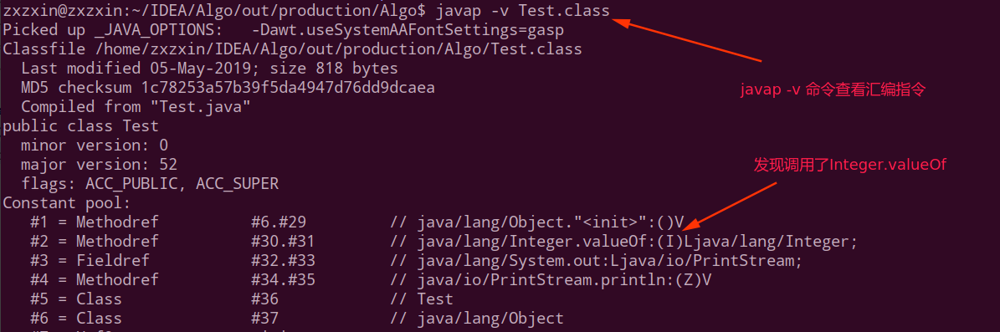
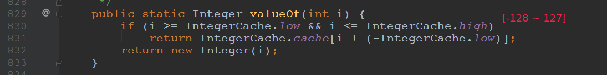
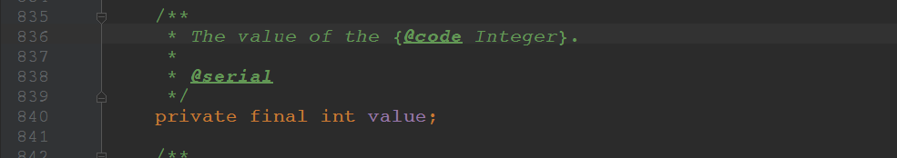

# Java值传递和swap函数解析

首先，简单的`swap`肯定不能交换两个变量的值。

```java
public class Test {

    public static void main(String[] args) {
        Integer a = 1, b = 2;
//      Integer a = 128, b = 129; //也不能交换

        System.out.println("a = " + a + ", b = " + b);

        swap(a, b);

        System.out.println("a = " + a + ", b = " + b);
    }

    static void swap(Integer a, Integer b) {
        Integer t = a;
        a = b;
        b = t;
    }
}
```

我们简单的理解，Java有值传递(简单类型)和引用传递(引用类型)，(其实只有值传递，因为引用类型传递的是地址的值而已)。

其次，我们知道，Integer在`-128~127`之间有缓存，也就是说在这个访问内的Integer对象会直接从缓存中拿，拿到的对象地址是相同的。

测试:

```java
public class Test {

    public static void main(String[] args){
        Integer a1 = 127, a2 = 127;
        System.out.println(a1 == a2);

        Integer b1 = 128, b2 = 128;
        System.out.println(b1 == b2);
    }
}
```

输出:

```java
true
false
```

查看汇编指令和Integer的源码:





但是不论是在`[-128~127]`还是不属于这个访问的数，上述的`swap`函数都不能交换原有的`a、b`的值。

* 因为如果是基本类型，修改的只是副本；
* 如果是引用类型，修改的只是地址；

如果真的要改呢? **可以通过反射来改Integer中一个final private 的属性 value**。



看下面程序，利用反射更改`Integer`中`value`的值:

```java
public class Test {

    public static void main(String[] args) throws Exception {
        Integer a = 128, b = 129;

        System.out.println("a = " + a + ", b = " + b);

        swap(a, b);

        System.out.println("a = " + a + ", b = " + b);
    }

    // 反射
    static void swap(Integer a, Integer b) throws Exception {
        Field field = Integer.class.getDeclaredField("value");

        field.setAccessible(true); // 访问私有变量
        int tmp = a;
        field.set(a, b);
        field.set(b, tmp);
    }
}

```

结果输出:

```java
a = 128, b = 129
a = 129, b = 128
```

好像是对的，真的是对的吗？ 将`Integer a = 128, b = 129`换成`Integer a = 1, b = 2`就发现输出了下面的内容:

```java
a = 1, b = 2
a = 2, b = 2
```

为什么?

还是上面的`-128 ~ 127`的缓存问题。

因为当你`filed.set(a, b)`的时候，因为`tmp`和`a`是同一块内存，所以`tmp`也设置成了`2`，所以最后`b==2`。

解决方案就是将`int tmp = a`换成`Integer tmp = new Integer(a)`即可:

```java
// 反射
static void swap(Integer a, Integer b) throws Exception {
    Field field = Integer.class.getDeclaredField("value");

    field.setAccessible(true); // 访问私有变量
    //        int tmp = a;
    Integer tmp = new Integer(a);
    field.set(a, b);
    field.set(b, tmp);
}
```


## 补充问题，什么是值传递和引用传递？

* 值传递是对基本型变量而言的，传递的是该变量的一个副本，改变副本不影响原变量；
* 引用传递一般是对于对象型变量而言的，传递的是该**对象地址**的一个副本, 并不是原对象本身 。(所以改变地址的内容还是会改变原来的对象)；
* 一般认为，java内的基础类型数据传递都是值传递，java中实例对象的传递是引用传递

> **提供几个讲的比较好的博客**:
>
> * https://www.zhihu.com/question/31203609/answer/50992895
> * https://zwmf.iteye.com/blog/1738574
> * https://www.cnblogs.com/volcan1/p/7003440.html

