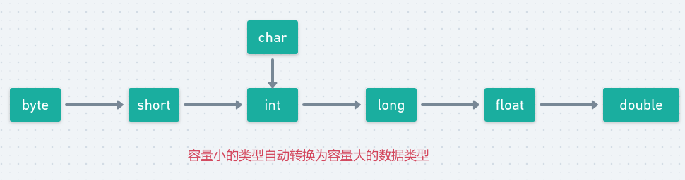
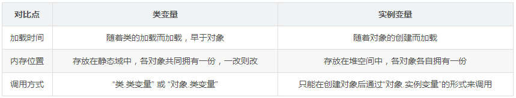
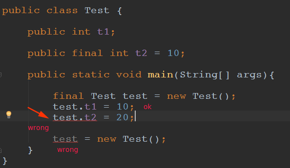

# 目录

* [1、面向对象的特征有哪些？](#1面向对象的特征有哪些)
* [2、谈谈对Java中多态的理解？](#2谈谈对java中多态的理解) 
* [3、在项目中哪些地方使用过多态？](#3在项目中哪些地方使用过多态)
* [4、在项目中的哪些地方使用过protected修饰符？](#4在项目中的哪些地方使用过protected修饰符)
* [5、基本数据类型之间是怎么转换的？](#5基本数据类型之间是怎么转换的)
* [6、Integer类型值的缓存机制是怎样的？](#6integer类型值的缓存机制是怎样的)
* [7、Java中重写与重载的区别是什么？](7java中重写与重载的区别是什么)
* [8、谈谈对static关键字的理解？](#8谈谈对static关键字的理解)
* [9、Java中变量的初始化顺序是怎样的？](#9java中变量的初始化顺序是怎样的)
* [10、谈谈对final关键字的理解？如何初始化final所修饰的成员变量？](#10谈谈对final关键字的理解如何初始化final所修饰的成员变量)

***

## 1、面向对象的特征有哪些？

* **抽象**: 将一类对象的共同特征总结出来构造类的过程，包括数据抽象和行为抽象两方面，分别对应于类的属性和方法。
* **封装**: 通常认为封装是把数据和操作数据的方法绑定起来，对数据的访问只能通过已定义的接口。面向对象的本质就是将现实世界描绘成一系列完全自治、封闭的对象。总结：**封装主要体现在两个方面，类是对数据和数据操作的封装，类中的方法是对实现细节的封装。**
* **继承**：从已有类得到继承信息创建新类的过程。继承让变化中的软件系统有了一定的延续性，同时继承也是封装程序中可变因素的重要手段。
* **多态**：指允许不同子类型的对象对同一消息作出不同的响应，简单来说就是用同一对象引用调用同一方法却做了不同的事情。

## 2、谈谈对Java中多态的理解？

**多态是指允许不同子类型的对象对同一消息作出不同的响应**。

多态包括编译时多态和运行时多态。

* 方法重载（overload）实现的是**编译**时的多态性（也称为前绑定）。
* 而方法重写（override）实现的是**运行**时的多态性（也称为后绑定）。

运行时多态是面向对象最精髓的东西，要实现运行时多态需要：

* 方法重写：子类继承父类并重写父类中已有的或抽象的方法；
* 对象造型：将**父类型的引用指向子类型的对象，这样父类的引用调用同样的方法时即会根据子类对象的不同而表现出不同的行为**。(向上转型)

## 3、在项目中哪些地方使用过多态？ 

 举个例子:：实验室预约软件包含学生、教师和管理员三种角色，三者都有login方法，但三者登录后进入的页面却是不同的，即在登录时会有不同的操作。三种角色都继承父类的login方法，但对不同的对象却有不同的行为。

## 4、在项目中的哪些地方使用过protected修饰符？

**受保护（protected）对子类相当于公开，对不是同一包中的没有父子关系的类相当于私有**。项目中没怎么使用过，但有一种场景比较适合使用protected修饰符。 

 Object类中对clone方法的声明即用到了protected访问修饰符，这是因为Object类的clone方法只能实现浅克隆，而并不能实现常使用的深克隆，这就要求子类在需要克隆对象时尽量重写clone方法，此时即声明为protected的，以保证在需要克隆对象时，必须要求待克隆对象所在的类实现Cloneable接口并重写clone方法。

有关深拷贝和浅拷贝参考这篇博客: https://www.cnblogs.com/xuanxufeng/p/6558330.html

## 5、基本数据类型之间是怎么转换的？

**自动类型转换：** 容量小的类型自动转换为容量大的数据类型，如下:



* 多种类型的数据混合运算时，系统先自动将所有数据转换成容量最大的那种数据类型，再进行计算；
* 当把任何基本类型的值和字符串值进行连接运算时(+)，基本类型的值将自动转化为字符串类型；

考虑下面代码输出:

```java
public class Test {

    public static void main(String[] args){
        int a = 10, b = 20, c = 30;
        System.out.println(a + " " + b + c); //输出:  10 2030
    }
} 
```

**强制类型转换：** 自动类型转换的逆过程，将容量大的转换为容量小的数据类型。 

-    使用时要加上强制转换符“()”，但可能造成精度降低或溢出。    
-    字符串不能直接转换为基本类型，需要借助基本类型对应的包装类来实现。   

**扩展问题1：float f=3.4;是否正确？** 

 参考答案：不正确。**3.4是双精度数**，将双精度型（double）赋值给浮点型（float）属于下转型（down-casting，也称为窄化）会造成精度损失，因此需要强制类型转换float f =(float)3.4; 或者写成float f =3.4F；

**扩展问题2：short s1 = 1; s1 = s1 + 1;有错吗?short s1 = 1; s1 += 1;有错吗？** 

参考答案：对于short s1 = 1; s1 = s1 + 1;由于1是int类型，因此s1+1运算结果也是int 型，需要强制转换类型才能赋值给short型。而short s1 = 1; s1 += 1;可以正确编译，因为s1+= 1;相当于s1 = (short)(s1 + 1);其中有隐含的强制类型转换。

## 6、Integer类型值的缓存机制是怎样的？

上一道经典笔试题:

```java
public class Test {

    public static void main(String[] args){

        // 手动创建对象，不会引用常量池中的对象 (就算是-128 ~ 127也不会)
        Integer a = new Integer(3);

        // 将3自动装箱成Integer类型
        Integer b = 3;
        int c = 3;
        System.out.println(a == b); // false 两个引用没有引用同一对象
        System.out.println(a == c); // true a自动拆箱成int类型再和c比较（易错）

        // 易错：比较的是对象的引用；
        // 自动装箱时-128到127引用常量池中的对象，否则新建对象
        Integer f1 = 100, f2 = 100, f3 = 150, f4 = 150;
        System.out.println(f1 == f2); // true  // -128~127是常量池中的对象
        System.out.println(f3 == f4); // false // 不是常量池中的对象
    }
}
```

## 7、Java中重写与重载的区别是什么？

**简而言之**:

重载：**方法签名相同，参数列表不同**（与返回值无关） 

重写：**同名同参同返回**，前面的权限修饰符不能比父类的更封闭，抛出的异常不能更宽泛。

> 例如，父类方法抛出了一个受检异常IOException，重写该方法时不能抛出Exception，对于受检异常而言，只能抛出IOException及其子类异常，也可以抛出非受检异常。  

注意：**不能根据根据返回类型来区分重载**，因为在调用方法时并不会判断方法的返回值类型是什么，如果根据返回值类型来区分重载，则程序会不知道去调用哪个方法。

方法重载是一个类的多态性表现，而方法重写是子类与父类的一种多态性表现。

重载:

* 发生在同一个类中，**方法名必须相同，参数类型不同、个数不同、顺序不同**，方法返回值和访问修饰符可以不同，发生在编译时。

重写:

* 发生在父子类中，方法名、参数列表必须相同，**返回值范围小于等于父类，抛出的异常范围小于等于父类，访问修饰符范围大于等于父类**；如果父类方法访问修饰符为private，则子类就不能重写该方法。

## 8、谈谈对static关键字的理解？

关键字static表示「静态的」，**主要思想是保证无论该类是否产生对象或无论产生多少对象的情况下，某些特定的数据在内存空间中只有一份**。 

  static不能修饰构造器。 

  其中，被修饰后的成员具有如下特点： 

-    随着类的加载而加载，故优先于对象存在；    
-    所修饰的成员，被该类的所有对象所共享；    
-    访问权限允许时，可不创建对象，直接被类调用。   

  关键字static大体上有一下五种用法：

- 静态导入、静态变量、静态方法、静态代码块、静态内部类；

**静态变量**:



**静态方法**:


> 注意：静态的结构随着类的加载而加载，其生命周期早于非静态的结构，同时被回收也要晚于非静态的结构。

**静态代码块：** 

静态代码块仅在类加载时运行一次，主要用于对Java类的静态变量（类属性）进行初始化操作。 

执行顺序：静态代码块 > 构造代码块（非静态代码块） > 构造方法。 

  **静态内部类：** 

内部类的一种，静态内部类不依赖于外部类，即可以不依赖于外部类实例对象而被实例化，且不能访问外部类的非静态成员（属性和方法）。

## 9、Java中变量的初始化顺序是怎样的？

在有继承关系的情况下，变量初始化顺序如下：

- 父类的静态变量和静态代码块`static{}`；
- 子类的静态变量和静态代码块`static{}`；
- 父类的实例变量和实例代码块`{}`；
- 父类的构造方法；
- 子类的实例变量实例代码块`{}`；
- 子类的构造方法；

测试：

父类:

```java
public class Base {

    static {
        System.out.println("父类静态代码块...");
    }
    
    {
        System.out.println("父类实例代码块...");
    }
    
    public Base(){
        System.out.println("父类构造方法...");
    }
}
```

子类:

```java
public class Child extends Base {
    static {
        System.out.println("子类静态代码块...");
    }

    {
        System.out.println("子类实例代码块...");
    }

    public Child() {
        System.out.println("子类构造方法...");
    }
}
```

测试:

```java
public class Main {

    public static void main(String[] args){
        Child c = new Child();
    }
}

输出:
父类静态代码块...
子类静态代码块...
父类实例代码块...
父类构造方法...
子类实例代码块...
子类构造方法...
```

创建对象时构造器的调用顺序是：先初始化静态成员，然后调用父类构造器，再初始化非静态成员，最后调用自身构造器。

## 10、谈谈对final关键字的理解？如何初始化final所修饰的成员变量？

关键字final表示「最终的」，可用来修饰类、属性和方法。

* 修饰类：表示该类不能被继承，以提高程序的安全性和可读性，如String、System、StringBuffer类等。    
* 修饰方法：**表示方法不能被重写**，如Object类的`getClass`方法。    
* 修饰属性：表示变量一次赋值以后值不能被修改（常量），其名称通常大写。   

补充：关键字final修饰的基本类型变量和引用类型变量有区别吗？ 

对于基本类型变量，final使变量数值在一次赋值后不变；对于引用类型变量，final使变量引用在一次赋值后不变，即不能再引用其他对象，**但被引用对象本身的属性是可以修改的**(易错)。

测试:



**如何初始化final所修饰的成员变量**？ 

  关键字final修饰的成员变量没有默认初始化值，其初始化方式主要有： 

-    在声明时，直接对其进行显式初始化。    
-    声明完后，在代码块中对其显式初始化。    
-    声明完后，在构造器中对其显式初始化，但注意需要在所有构造器中均对其进行初始化操作。   

  基本原则：保证在对象创建之前即需要对final修饰的属性进行初始化操作。 