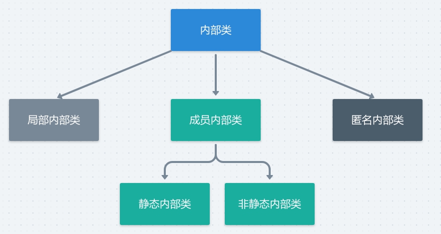
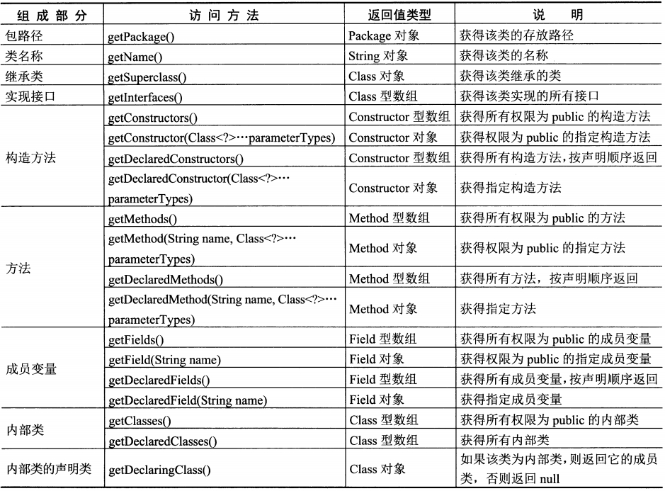

# 目录

* [1、接口与抽象类有什么区别？](#1接口与抽象类有什么区别)
* [2、接口与抽象类分别在什么场景下使用？](#2接口与抽象类分别在什么场景下使用)
* [3、谈谈对内部类的理解？](#3谈谈对内部类的理解)
* [4、Object类中的几个重要方法](#4object类中的几个重要方法)
* [5、重写equals方法的原因、方式和注意事项？](#5重写equals方法的原因方式和注意事项)
* [6、重写hashCode方法的原因、方式和注意事项？](#6重写hashcode方法的原因方式和注意事项)
* [7、如何获取Class类的实例？](#7如何获取class类的实例)
* [8、Class类的实例可以做什么？](#8class类的实例可以做什么)

***

## 1、接口与抽象类有什么区别？

**接口是对行为的抽象**，其可以含有属性和方法。

* 属性被隐式指定为public static final的，即全局常量。
* 方法被隐式执行为public abstract的，即抽象方法。

也就是说，**接口中的所有方法都必须为抽象方法**，不能有具体实现。所以说，接口是对行为的抽象。

**抽象类是对类（一类事物）的抽象**， 包含抽象方法的类一定是抽象类，但抽象类不一定有抽象方法，只要用`abstract`修饰即可为抽象类。

抽象类可以含有属性、方法和构造器。 

* 方法可以是普通方法也可以是抽象方法，若为抽象方法则必须为**public或protected的**，缺省情况下默认为public的，**因为抽象方法必须要被子类继承和实现**。    
* 构造器虽然有，但因为抽象类含有无具体实现的方法，所以抽象类不能进行实例化。

区别:

**抽象类是对类（一类事物）的抽象，而接口是对行为的抽象**。再具体一点说，抽象类是对一类事物整体（包括属性和行为）进行抽象，而接口是对类的局部（仅对行为）进行抽象。如飞机、鸟和飞行而言，应分别将其设计为类、类和接口。

> 语法区别:
>
> * 成员变量：抽象类中的成员变量可以是各种类型的，而接口中的成员变量只能是常量，即`public static final`修饰的。    
> * 成员方法：抽象类中的成员方法可以是抽象的也可以是普通的（有具体实现的），而接口中的成员方法只能是public static修饰的。    
> * 静态结构：抽象类中可以有静态代码块和静态方法，而接口中不能有静态代码块和静态方法。 
> * 构造方法：抽象类中可以有构造器，而接口中没有，但两者都不能进行实例化，但可以定义抽象类和接口类型的引用。    
> * 继承与实现：一个类只能继承一个抽象类，而一个类却可以实现多个接口。

总结:

- 接口中所有的方法隐含的都是抽象的。而**抽象类则可以同时包含抽象和非抽象的方法**；
- **即抽象类可以提供成员方法的具体实现，而接口只存在用`public abstract` 修饰的没有方法体的方法**； 
- 类可以实现很多个接口，但是只能继承一个抽象类；
- 类可以不实现抽象类和接口声明的所有方法，当然，在这种情况下，类也必须得声明成是抽象的。 抽象类可以在不提供接口方法实现的情况下实现接口；
- **Java接口中声明的变量默认都是`final`的。抽象类可以包含非`final`的变量**；
- **Java接口中的成员函数默认是public的。抽象类的成员函数可以是`private`，`protected`或者是`public`**；
- 接口是绝对抽象的，不可以被实例化，抽象类也不可以被实例化；
- 抽象类中可以有静态代码块与静态方法，而接口没有 ;

## 2、接口与抽象类分别在什么场景下使用？

问题同【你在项目中哪些地方使用过接口和抽象类？具体是怎么使用的？】

建议阅读「门与警报」的例子。 

门都有打开和关闭两个行为，此时若需要门具备警报行为，应该如何实现呢？ 

其实，门的打开和关闭属于门本身固有的行为，而警报功能属于门非固有的行为（附加行为）。最佳解决方案是，将门设计为一个抽象类，包括打开和关闭两种行为，而将警报设计为一个接口，包括警报行为，进而设计一个警报门继承抽象类并实现警报接口即可。

## 3、谈谈对内部类的理解？

在Java中，可以将一个类定义在另一个类里面或一个方法内，这样的类即被称为内部类，其框架体系如下：



**成员内部类**

成员内部类访问外部类：成员内部类可以无条件访问外部类的所有成员属性和成员方法（包括private成员和静态成员），使用「this.成员名」调用内部类的成员，使用「外部类名.this.成员名」调用外部类的成员。但需注意，**静态内部类只能访问外部的静态成员**。 

外部类访问成员内部类：必须先在外部类中创建一个成员内部类的对象，再通过指向该对象的引用来访问内部类的成员。但对于静态内部类和非静态内部类而言，实例化内部类的方式不同：

创建方式:

```java
public class A {

    public static class B{

    }
    public class C{

    }
}
```

测试:

```java
public class Test {
    public static void main(String[] args){
        A a = new A(); 
        A.B b = new A.B();
        A.C c = a.new C();
    }
}
```

**局部内部类**

举个例子

```java
public class Test {

    public void m1(){
        int num = 10; // 虽然没有显示标明是final，但是java内部已经标明

        // 局部内部类
        class InnerClass{

            public void m2(){
                System.out.println(num); // num自动是final的
            }
        }

//        num = 20; // 不能修改， 因为num是final的
        new InnerClass().m2();
    }

    public static void main(String[] args){
        Test t1 = new Test();
        t1.m1(); // 输出 10
    }
}
```

> 局部内部类的特点(了解):
>
> * 不能使用任何的访问修饰符；
> * 会生成两个.class文件，一个是`Test.class` ，另一个是`Test$InnerClass.class`；
> * 局部内部类只能访问方法中声明的final类型的变量；

**匿名内部类**

匿名内部类指没有名字的内部类，故其只能使用一次，通常用来简化代码编写

-    匿名内部类**必须继承一个父类或实现一个接口**，进而对继承方法进行实现或重写。    
-    匿名内部类是唯一一种没有构造器的类，其在编译时由系统自动起名为`「外部类名序号.class」`，如`「Outter序号.class」`，如`「Outter1.class」`。    
-    匿名内部类一定是在new的后面，仅用于创建该匿名内部类的一个实例。   

 应用场景：最常用的情况就是在多线程的实现上，因为要实现多线程必须继承Thread类或是继承Runnable接口。

## 4、Object类中的几个重要方法

**getClass():** 用于获取此Object的运行时类对象，运行时类是 Java 反射机制的源头。

**clone():** 用于创建并返回此对象的一个副本，其实质上是一种【浅拷贝】。

**finalize():** 垃圾回收器在准备回收对象前，会先调用该方法；子类可通过重写该方法，以在垃圾回收前整理系统资源或执行其他清理操作。

## 5、重写equals方法的原因、方式和注意事项？

**为什么要重写equals()方法？** 

 Object类中equals()方法的默认实现主要是用于判断两个对象的引用是否相同。而在实际开发过程中，通常需要比较两个对象的对应属性是否完全相同，故需要重写equals()方法。 

  **如何重写equals()方法？** 

  假设equals()方法的形参名为`otherObj`，稍后需要将其转换为另一个叫做`other`的变量。 

* （1）、检测this与otherObj是否引用同一对象：  `  if(this == otherObject) return true; `

* （2）、检测otherObj是否为空： `if(otherObject == null) return false`; 
* （3）、判断this与otherObj是否属于同一个类，具体分两种情况： 
  * a)、如果equals()方法的语义在**每个子类中均有所改变**，则使用getClass()方法进行检测： `if(getClass() != otherObject.getClass()) return false; `
  * 如果equals()方法在所有子类中均有统一的语义，则使用instanceof关键字进行检测：  ` if (!(otherObject instanceof ClassName)) return false; `


* （4）、将otherObj转换为相应类的类型变量： `ClassName other = (ClassName) otherObject; `

* （5）、对所有需要比较的域进行一一比较，若全匹配则返回true，否则返回false。 

关于equals()语义的补充说明：假设现有Employee与Manager两个类，Manager类继承Employee类。若仅将ID作为相等的检测标准，则仅用在Employee类中重写equals()方法，并将该方法声明为final的即可，这就是所谓的「拥有统一的语义」。 

> **重写equals()方法需要注意什么？** 
归根结底，还是想问equals()方法的主要特性。Java语言规范要求equals()方法具有如下特性： 
-    自反性：对于任何非空引用x，x.equals(x)应该返回true。    
-    对称性：对于任何引用x和y，当且仅当y.equals(x) 返回true时，x.equals(y)也应该返回true。    
-    传递性：对于任何引用x、y和z，如果x.equals(y) 返回true，y.equals(z)返回true，x.equals(z)也应该返回true。    
-    一致性：如果x和y引用的对象没有发生变化，反复调用x.equals(y)应该返回同样的结果。    
-    非空性：对于任何非空引用x，x.equals(null)应该返回false。

Object的默认`equals`实现:

```java
// Object类中equals()方法的默认实现
public boolean equals(Object obj) {
    return (this == obj);
}
```

## 6、重写hashCode方法的原因、方式和注意事项？

 **为什么要重写hashCode()方法？** 

 Object类中hashCode()方法默认是将对象的存储地址进行映射，并返回一个整形值作为哈希码。 

 **若重写equals()方法，使其比较两个对象的内容，并保留hashCode()方法的默认实现，那么两个明明「相等」的对象，哈希值却可能不同**。

所以注意: **如果两个对象通过equals()方法比较的结果为true，那么要保证这两个对象的哈希值相等**。

**因此，在重写equals()方法时，建议一定要重写hashCode()方法**。

 **如何重写hashCode()方法？** 

由于Object类的 hashCode() 方法是本地的（native），故其具体实现并不是由Java所完成的。 

 需要实现hashCode()方法时，可以直接调用`Objects.hash(Object... values)`方法来获取对应的哈希值。其内部的具体实现是调用`Arrays.hashCode(Object[])`方法来完成的。 

**重写hashCode()方法需要注意什么？** 

-    应用程序执行期间，只要一个对象用于equals()方法的属性未被修改，则该对象多次返回的哈希值应相等。    
-    **如果两个对象通过equals()方法比较的结果为true，那么要保证这两个对象的哈希值相等**。    
-    **如果两个对象通过equals()方法比较的结果为false，那么这两个对象的哈希值可以相等也可以不相等，但理想情况下是应该不相等，以提高散列表的性能**。

选用31的原因:

* 原因一：更少的乘积结果冲突

  31是质子数中一个“不大不小”的存在，如果你使用的是一个如2的较小质数，那么得出的乘积会在一个很小的范围，很容易造成哈希值的冲突。而如果选择一个100以上的质数，得出的哈希值会超出int的最大范围，这两种都不合适。而如果对超过50,000 个英文单词（由两个不同版本的 Unix 字典合并而成）进行 `hashcode()` 运算，并使用常数 31, 33, 37, 39 和 41 作为乘子，每个常数算出的哈希值冲突数都小于7个（国外大神做的测试），那么这几个数就被作为生成hashCode值得备选乘数了。

* 原因二：31可以被JVM优化

  JVM里最有效的计算方式就是进行位运算了：

    * 左移 << : 左边的最高位丢弃，右边补全0（把 << 左边的数据*2的移动次幂）。
    * 右移 >> : 把>>左边的数据/2的移动次幂。
    * 无符号右移 >>> : 无论最高位是0还是1，左边补齐0。 　　

    所以 ： `31 * i = (i << 5) - i`（ 验证:代入`i == 2` 得到:  左边 `31 * 2=62`，右边   `2 * 2 ^ 5 - 2=62`）  --> 两边相等，JVM就可以高效的进行计算了。

## 7、如何获取Class类的实例？

```java
public class Test {

    public static void main(String[] args) throws ClassNotFoundException {

        //1.通过运行时类的.class属性获取
        Class<User> clazz1 = User.class;
        System.out.println(clazz1);

        //2.通过运行时类的对象获取
        User user = new User();
        Class clazz2 = user.getClass();
        System.out.println(clazz2.getName());

        //3.通过Class类的静态方法获取
        String className = "User";
        Class clazz3 = Class.forName(className);
        System.out.println(clazz3);

        //4.通过类的加载器获取
        ClassLoader cl = user.getClass().getClassLoader();
        Class clazz4 = cl.loadClass(className);
        System.out.println(clazz4.getName());
    }
}
```

输出：

```java
class User
User
class User
User
```

> 提示：在启动时，包含main方法的类被加载。它会加载所有需要的类。这些被加栽的类又要加载它们需要的类，以此类推。对于一个大型的应用程序来说，这将会消耗很多时间，用户会因此感到不耐烦。可以使用下面这个技巧给用户一种启动速度比较快的幻觉。不过，要确保包含main方法的类没有显式地引用其他的类。首先，显示一个启动画面；然后，通过调用Class.forName手工地加载其他的类。

## 8、Class类的实例可以做什么？ 

获取到运行时类的Class实例后，通过Class类的实例可以： 

-    通过newInstance()方法创建对应运行类的对象。    
-    获取其对应类的完整结构，如构造器、属性、方法、内部类、父类、所在的包、异常和注解等。    
-    调用对应的运行时类的指定结构，如属性、方法和构造器。    
-    反射的应用，即动态代理。   

  所以说，Class类是反射的源头，这也是Java中「反射」技术的主要内容。 

  **注意事项：** 

请注意，**一个Class对象实际上表示的是一个类型，而这个类型未必一定是一种类**。例如，int不是类，但int.class是一个Class类型的对象。 

另外，**调用Class类实例的newInstance()方法动态创建类对象时，需要对应的运行时类中有空参的构造器**。 

通过Class类的实例获取运行时类的所有描述信息的代码较长，在此仅给出对应的方法描述，如下：

