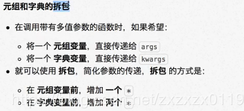
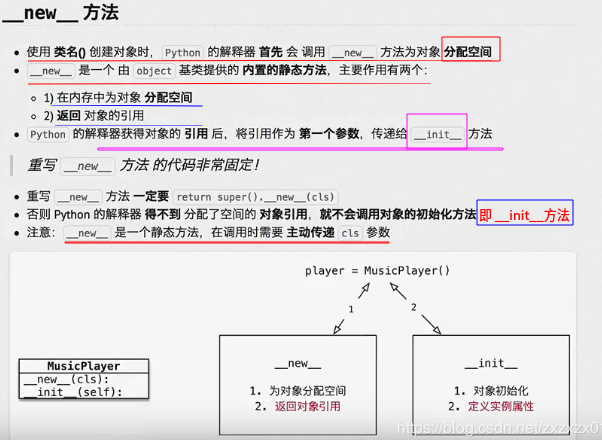

 ## Python基础知识总结
* 基础中的基础
* 列表、元组(tuple)、字典、字符串
* 变量和引用
* 函数
* 面向对象(封装、继承、多态)
* 异常
* 模块、包
* 文件
***
### 基础中的基础

* 解释型语言和编译型语言差距；

* Python概述


* 解释器执行原理


* which python3可以查看python3的位置(linux下)； 
* 交互式环境中使用exit()或者ctrl+D退出；
* 9 // 2表示取结果的整数，乘方使用**；
* 乘法可以用在 字符串中 也就是说  "_ " * 5  会输出5个 "_"；
* <font color = blue>数据类型分为 数字型和非数字型: (1)数字型 : 整形、浮点型、布尔型、复数型。(2)非数字型: 字符串、列表、元组、字典。</font><font color = green>type(变量名)查看变量类型；
* python3中没有long，只有int；
* 变量的输入:  input()函数。**注意: input()函数输入的数据类型都是字符串类型；**
* 在python中，如果变量名需要两个或多个单词组成时，可以按照下面的方式: ①每个单词都是小写；②单词和单词之间使用_下划线连接；③使用驼峰规则；
* print函数如果不想输出换行，在后面加上一个end=""(例如print("a",end=""))；单纯的只想输出一个换行可以使用print()或者print("")；
* \t(制表符(对齐))和\n转义字符；
* 关于函数的注释，写在函数的下面，加上三个"""。以及文档注释，例如： 

```python
def sum_2_sum(a, b):
    """计算a和b的和
    :param a:第一个参数
    :param b:第二个参数
    :return:
    """
    return a + b
```
* **因为函数体相对比较独立，函数定义的上方，应该和其他代码(包括注释)保留两个空行；**
* import导入的文件可以python解释器将模块解释成一个pyc二进制文件(类似Java的.class?)；
* python中关键字后面不需要加括号(如del 关键字)；
* 方法和函数的异同: ①方法和函数类似，同样是封装了独立的功能；②**方法需要通过对象来调用，表示针对这个对象要做的操作**③函数需要记住，但是方法是对象的"函数"，方法不需要记住(IDE提示或者IPython中TAB补全)；
* 变量赋值的几种特殊的方式: 

```py
a = b = c = 1  # 三个都是1
a, b, c = 1, 2, "hello"  # a = 1, b = 2, c = "hello"

a, b = 0, 1
a, b = b, a+b  # 右边表达式的执行顺序是从左往右的。
"""
上面的代码类似: 
n = b
m = a+b
a = n
b = m
"""
print(a)  # 1
print(b)  # 1
```
* 逻辑运算符:`and、or、not`，成员运算符`in、not in`，身份运算符`is、is not`；

***
### 列表、元组(tuple)、字典、集合、字符串
* 列表可以嵌套；
```python
x = [['a', 'b', 'c'], [1, 2, 3]]
print(x[0])  # ['a', 'b', 'c']
print(x[0][1])  # 'b'
```
* 元组不同于列表的是: 元组不能修改，用()表示；(不能增删改)
* 元组一般保存**不同类型**的数据；
* <font color = red>注意: 只有一个元素的元组: single_tuple = (5,) ，也就是说元组中只包含一个元素时，需要在元素后面添加逗号；不能这样写 single_tuple = (5)，这样是一个整形的变量；</font>另外，创建元组也可以不加上括号；

```python
tup = "a", "b", "c", "d"
print(tup)
print(type(tup))

tup2 = ("a",)  # 一个元素的元组 (后面必须加上一个括号)
print(tup2)
print(type(tup2))

```
输出:
```python
('a', 'b', 'c', 'd')
<class 'tuple'>
('a',)
<class 'tuple'>
```

* <font color = blue>元组的用途: ① 作为函数的参数和返回值；②格式化字符串(格式字符串本身就是一个元组)；(3)让列表不可以被修改，保护数据安全；
* 格式化字符串和元组的关系，看下面的三个print输出是一样的: 

```python
# 元组和格式化字符串的关系
info_tuple = ("小明", 21, 1.85)
print("%s 年龄是 %d 身高是 %.2f" % ("小明", 21, 1.85))
print("%s 年龄是 %d 身高是 %.2f" % info_tuple)

info_str = "%s 年龄是 %d 身高是 %.2f" % info_tuple
print(info_str)
```
* 元组和列表可以相互转换 : ①使用list(元组)将元组转换成列表；②使用tuple将列表转换成元组；
* 字典: ① 键必须是唯一的 ②值可以取任意类型，但是键只能使用字符串、数字或者元组(键只能是不可变类型)。
* **遍历字典的时候for k in dict 中的k是键，而不是值。（普通的for），不过也可以通过items()方法遍历键值对: **

```python
dict_student = {'name': 'xiaoming', 'age': '18', 'qq': "1234"}

# 遍历方式一
for k in dict_student:  # k 是key
    print(k, end=" ")
    print(dict_student[k])

print("*" * 20)
# 遍历方式二
for k, v in dict_student.items():
    print(k, v)
```

* 字符串中的转义字符：\n表示换行，而\r表示回车，字符串中的函数isspace()判断的时候\t\n\r都是表示的空白字符；
* isdecimla()、isdigit()、isnumeric()都不能判断字符串中的小数，(可以判断字符串中的整数)；
* 集合set的使用: <font color = red>可以使用大括号 { } 或者 set() 函数创建集合，注意：创建一个空集合必须用 set() 而不是 { }，因为 { } 是用来创建一个空字典。</font> 集合还有一些方法`add()、update()、pop()`等；

```python
student = {'Tom', 'Jim', 'Mary', 'Tom', 'Jack', 'Rose'}
print(student)  # 输出集合，重复的元素被自动去掉

if 'Rose' in student:
    print('Rose 在集合中')
else:
    print('Rose 不在集合中')

# set可以进行集合运算
a = set('abracadabra')
b = set('alacazam')

print(a - b)  # a和b的差集
print(a | b)  # a和b的并集
print(a & b)  # a和b的交集
print(a ^ b)  # a和b中不同时存在的元素
```
输出：
```py
{'Jim', 'Mary', 'Jack', 'Rose', 'Tom'}
Rose 在集合中
{'b', 'd', 'r'}
{'b', 'l', 'c', 'd', 'z', 'm', 'a', 'r'}
{'c', 'a'}
{'b', 'm', 'l', 'r', 'd', 'z'}
```
* 相关公共方法: len、del、max、min(只会比较字典的key)；
* in、not in的使用(类似数据库...)；
* pass关键字的使用: 比如if ... 下面没有写语句，python会提示报错，但是你可以写一个pass就不会报错了；也就是说如果在开发程序时，不希望立即编写分支内部的代码，可以使用pass作为一个占位符；可以保证程序代码结构正确；
* TODO关键字的使用，在编写程序框架的时候，可以用TODO标示某个地方还没有做某事；
* 迭代器的使用

```python
import sys  # 引入 sys 模块

lst = [1, 2, 3, 4]
it = iter(lst)  # 创建迭代器对象

# 使用for 遍历迭代器
for x in it:
    print(x, end=" ")
print()

it = iter(lst)  # 之前那个已经到了最后了，再次获取
# 使用next + while遍历
while True:
    try:
        print(next(it), end=" ")
    except StopIteration:  # 防止无限循环
        sys.exit()  # 退出程序
print()
```
输出： 

```py
1 2 3 4 
1 2 3 4 
```

* 字符串中切片的使用:  ①类似截取，但是可以指定步长；②python中支持倒序索引，最后一个是-1，倒数第二个是-2.....；


```python
# 切片的使用
num_str = "12345678"

print(num_str[2:6])  # [2,5]
print(num_str[2:])  # 从2位置到结束
print(num_str[0:6])  # 输出[0,5]的
print(num_str[:6])  # 一开始到5的
print(num_str[:])  # 全部输出
print(num_str[::2])  # 指定步长  第三个参数指定步长
print(num_str[1::2])  # 从第一个开始　步长为2

print("*" * 20)
print(num_str[-1])  # 输出最后一个位置的
print(num_str[2:-1])  # 从第二个开始到倒数第二个

print("*" * 20)
# 一个面试题 逆序输出
print(num_str[-1::-1])  # 步长为-1代表向左切片，从最后一个开始切
print(num_str[::-1])
```
输出: 

```py
3456
345678
123456
123456
12345678
1357
2468
********************
8
34567
********************
87654321
87654321
```

***

### 变量和引用

* 变量和数据都是保存在内存中的；
* 在python中函数的参数传递以及返回值都是引用传递的；
*  变量和数据是分开存储的；
- 变量中记录数据的地址，就叫做引用；
- 使用id()函数可以查看变量中保存的数据所在的内存地址；
-  注意: 如果变量已经被定义，当给一个变量复制的时候，本质上是修改了数据的引用。①  变量不再对之前的数据引用；②变量改为对新复制的数据引用；
* 可变类型和不可变类型

> <font color = blue>不可变类型: 内存中的数据不允许修改: 
> > ① 数字类型: `int`、`bool`、 `float`、`complex`、`long`
> >  ② 字符串 :`str`
> >  ③ 元组 :`tuple`
> 
> <font color = blue>可变类型: 内存中的数据可以被修改
> >① 列表 `list`
> >② 字典 `dict`

>* 可变类型：变量赋值 a=5 后再赋值 a=10，这里实际是新生成一个 int 值对象 10，再让 a 指向它，而 5 被丢弃，不是改变a的值，相当于新生成了a；
> * 不可变类型: 变量赋值 la=[1,2,3,4] 后再赋值 la[2]=5 则是将 list la 的第三个元素值更改，本身la没有动，只是其内部的一部分值被修改了。

<font color = red>函数参数传递时注意: 
> * 不可变类型：类似 c++ 的值传递，如 整数、字符串、元组。如fun（a），传递的只是a的值，没有影响a对象本身。比如在 fun（a）内部修改 a 的值，只是修改另一个复制的对象，不会影响 a 本身。
>  *  可变类型：类似 c++ 的引用传递，如 列表，字典。如 fun（la），则是将 la 真正的传过去，修改后fun外部的la也会受影响；
* 局部变量和全局变量
> `局部变量：函数内部定义的变量，只能在函数内部使用；`
> `全局变量:   函数外部定义的变量，所有函数内部都可以使用这个变量；(不推荐使用)`

注意: <font color= red>在python中，不允许修改全局变量的值，如果修改，会在函数中定义一个局部变量；

```
num = 10


# python中，不允许修改全局变量

def method1():
    num = 99  # 这里没有修改全局变量num，而是自己又定义了一个局部变量，执行完这个函数，局部变量就会回收
    print(num)


def method2():
    print(num)  # 虽然在method1中修改了 num 但是却不会修改


method1()
method2()

# 输出
# 99
# 10
```
* <font color = blue>可以使用global关键字修改全局变量的值。
* <font color = blue>全局变量的命名规则: 前面加上`g_` 或者`gl_`；

***
### 函数

* 函数如果返回的是一个元组就可以省略括号；
* 如果返回的是一个元组，可以使用多个变量直接接收函数的返回结果；(注意变量的个数和返回的元组的个数相同)

例如: 

```
def measure():
    """测量湿度和温度"""
    temp = 39
    wetness = 50

    # 下面返回的是一个元组，为什么写成没有括号的样子，因为如果返回的是一个元组就可以省略括号
    # return (temp, wetness)
    return temp, wetness


res = measure()
print(res)
print(type(res))  # tuple


# 很骚的，直接使用多个变量接收函数返回的元组
gl_temp, gl_wetness = measure()
print(gl_temp)
print(gl_wetness)
```
* 交换两个变量a、b的值的三种解法(第三种python专用)

```python
a = 6
b = 100

# 解法1
c = a
a = b
b = c
print(a)
print(b)

# 解法2

a = a + b
b = a - b
a = a - b
print(a)
print(b)

# 解法3 python专用
# a, b = (b, a)
a, b = b, a
print(a)
print(b)
```
* <font color = red>如果在函数中使用赋值语句，并不会影响调用函数时传递的实参变量；无论传递的参数可变还是不可变； 
* <font color = red>只要针对参数使用赋值语句，会在函数内部修改局部变量的引用，不会影响到外部变量的引用； 

测试: 

```python
def demo(num, num_list):
    print("函数内部的代码")

    num = 100
    num_list = [1, 2, 3]

    print(num)
    print(num_list)
    print("函数执行完成")


gl_num = 99
gl_list = [4, 5, 6]
demo(gl_num, gl_list)
print(gl_num)  # 99
print(gl_list)  # [4, 5, 6]
```
输出：

```py
函数内部的代码
100
[1, 2, 3]
函数执行完成
99
[4, 5, 6]
```
一张图解释:


* 	如果传递的参数是可变类型，在函数内部，使用方法修改了数据的内容，同样会影响到外部的数据。

```python
def demo(num_list):
    print("函数内部的代码")
    num_list.append(666)
    print(num_list)
    print("函数代码执行结束")


gl_list = [1, 2, 3]
demo(gl_list)
print(gl_list)
```
输出:

```py
函数内部的代码
[1, 2, 3, 666]
函数代码执行结束
[1, 2, 3, 666]
```
示意图: 


<font color = red>上面写了，这里再重复一遍可变类型和不可变类型和参数传递的关系: 
> * 不可变类型：类似 c++ 的值传递，如 整数、字符串、元组。如fun（a），传递的只是a的值，没有影响a对象本身。比如在 fun（a）内部修改 a 的值，只是修改另一个复制的对象，不会影响 a 本身。
>  *  可变类型：类似 c++ 的引用传递，如 列表，字典。如 fun（la），则是将 la 真正的传过去，修改后fun外部的la也会受影响；

* 列表变量调用 += 的时候相当于是调用extend，这个是一个特列；

```
def demo(num, num_list):
    print("函数开始")

    # 赋值语句 不会改变外部
    num += num

    # 但是列表是一个特例，+=列表相当于 extend 所以会改变外部
    num_list += num_list
    # num_list = num_list + num_list  # 这样就不会改变实参

    print(num)
    print(num_list)

    print("函数结束")

gl_num = 9
gl_list = [1, 2, 3]

demo(gl_num, gl_list)

print(gl_num)
print(gl_list)
```
输出： 

```py
函数开始
18
[1, 2, 3, 1, 2, 3]
函数结束
9
[1, 2, 3, 1, 2, 3]
```

* 缺省参数： ①定义函数时，可以给某个参数指定一个默认值，指定了默认值的参数叫做缺省参数；②一般使用最常见的值作为缺省参数；③缺省参数的定义位置：<font color = red>必须保证带有默认值的缺省参数定义在参数列表的末尾；

```python
def print_info(name, gender=True):
    gender_text = "男生"
    if not gender:
        gender_text = "女生"
    print("%s 是 %s" % (name, gender_text))

print_info("小明")  # 缺省参数 使用最常见的值，作为缺省参数
print_info("小美", False)

```
还要注意，**如果后面有多个参数，且只给具体的某一个指定默认值，就要具体的指定参数的名字:**

```python
def print_info(name, title="", gender=True):
    gender_text = "男生"
    if not gender:
        gender_text = "女生"
    print("%s 是 %s" % (name, gender_text))

print_info("小明") 
print_info("小美", False)  # 这个是错误的
print_info("小美", gender=False)  # 这里必须指定为gender

```
输出: 


这个原理类似<font color = blue>降序排序: 

```python
gl_list = [6, 3, 9]
gl_list.sort(reverse=True)
print(gl_list)
```
* 多值参数


```python
def demo(num, *args, **kwargs):  # 多值参数 *接收元组 **接收字典
    print(num)
    print(args)
    print(kwargs)


demo(1, 2, 3, 4, 5, name="小明", age=18)
```
输出: 
```py
1
(2, 3, 4, 5)
{'name': '小明', 'age': 18}
```
使用多值参数的好处，例如下面的例子计算求和，如果不使用* args 也就是不使用多值的元组的时候，我们传递参数的时候就需要传递一个元组，但是这样的话就直接传递一串数字就好了。

```python
def sum_number(*args):
    res = 0
    for n in args:
        res += n
    return res


print(sum_number(1, 2, 3, 4, 5))
# print(sum_number((1, 2, 3, 4, 5)))  # 如果不加上*的话就要加上这个表示元组的括号
```
* 多值参数元组和字典的拆包



首先看下面代码的输出，这个代码是出乎意料的: 

```python
def demo(*args, **kwargs):
    print(args)
    print(kwargs)


gl_tuple = (1, 2, 3)
gl_dict = {"name": "小明", "age": 18}

demo(gl_tuple, gl_dict)
```
输出： 

```py
((1, 2, 3), {'name': '小明', 'age': 18})
{}
```
加上拆包：

```python
def demo(*args, **kwargs):
    print(args)
    print(kwargs)


gl_tuple = (1, 2, 3)
gl_dict = {"name": "小明", "age": 18}

demo(*gl_tuple, **gl_dict)  # 注意这里加上了拆包 类似与之前的传递参数
```
输出:

```py
(1, 2, 3)
{'name': '小明', 'age': 18}
```

***
### 面向对象(封装、继承、多态)
* 类中: ①特征被称为属性；②行为被称为方法；③三要素:类名、属性、方法；
* <font color = blue>dir函数可以查看对象的所有方法；
* dir显示的方法中，`__方法名__`格式的方法是`Python`提供的`内置方法/属性`；　


* 类中的方法第一个参数必须是`self`(类似Java中的this?)；

创建第一个类:

```python
class Cat:
    def eat(self):
        print("小猫爱吃鱼!")
    def drink(self):
        print("小猫爱喝水!")


tom = Cat()  # 和Java不同，不需要使用　new
tom.eat()
tom.drink()

print(tom)  # 输出对象变量
print("%x" % id(tom))  # 输出16进制的地址
print("%d" % id(tom))  # 输出10进制的地址
```
输出：


* 引用的强调


* <font color = blue>Python如果不想修改类，可以直接给对象增加属性(不同于其他语言!)(这种方式不推荐)</font>；
* <font color= red>self关键字(Java中的this关键字): 哪一个对象调用的这个方法，self就是哪个对象的引用，可以通过self.访问对象的属性和方法；</font>
* 初始化方法`__init__`：
><font color = blue>当使用`类名()`创建对象时，会`自动`执行以下操作：</font>
> >①. 为对象在内存中<font color = red>分配空间 -- 创建对象；</font>
> >②. 为对象的属性 <font color = red>设置初始值 -- 初始化方法(`init`)；</font>
>
><font color = blue>这个初始化方法就是`__init__`方法，`__init__`是对象的`内置方法`。
><font color = blue>`__init__`方法是专门用来定义一个类具有哪些属性的方法!


* 在初始化方法`__init__`内部定义属性: 

> * <font color = blue>在`init`方法内部使用`self.属性名 = 属性的初始值`就可以定义属性；</font>
>  * 定义属性之后，再使用`该类`创建的对象，都拥有该属性；

使用: 

```python
class Cat:
    def __init__(self):
        print("这是一个初始化方法")
        self.name = "Tom"

    def eat(self):
        print("%s 爱吃鱼" % self.name)


tom = Cat()
print(tom.name)
tom.eat()
```
输出:  

```python
这是一个初始化方法
Tom
Tom 爱吃鱼
```
* 初始化方法`__init__`中带参数，构造对象；

```python
class Cat:
    def __init__(self, new_name):
        print("这是一个初始化方法")
        self.name = new_name

    def eat(self):
        print("%s 爱吃鱼" % self.name)


tom = Cat("Tom")
print(tom.name)
tom.eat()

lazy_cat = Cat("大懒猫")
print(lazy_cat.name)
lazy_cat.eat()

```

* `__del__`方法的调用


```python
class Cat:
    def __init__(self, new_name):
        print("初始化方法被调用")

    def __del__(self):
        print("del方法被调用")


# tom是一个全局变量 等到程序全部执行完成之后才会销毁
tom = Cat("Tom")

# 可以手动调用 del tom 提前销毁 tom对象
# del tom
print("*" * 50)
```
输出： (注意: 如果不注释 # del tom，`__del__`方法的调用就在输出横线的上方)

```py
初始化方法被调用
**************************************************
del方法被调用
```

* `__str__`方法(类似Java中的toString())
> * 在python中，使用`print`输出**对象变量**，默认情况下输出这个变量 `引用的对象`是`由哪一个类创建的对象`，`以及在内存中的地址(16进制表示)` ；
> * 如果在开发中，希望使用`print`输出`对象变量`时，能够打印`自定义内容`，就可以利用`__str__方法`；
> * 注意:`__str__`方法必须返回一个字符串；

```py
class Cat:
    def __init__(self, new_name):
        self.name = new_name

    def __str__(self):  # 返回的是一个字符串
        return "我是小猫【%s】" % self.name


tom = Cat("Tom")
print(tom)
```
输出：

```py
我是小猫【Tom】
```

* **面向对象案例一 : <font color = blue>房子和家具**

```python
class HouseItem:
    def __init__(self, name, area):
        self.name = name
        self.area = area

    def __str__(self):
        return "家具名称: %s, 家具面积: %s " % (self.name, self.area)


class House:
    def __init__(self, house_type, area):  # 房子类型, 总面积
        self.house_type = house_type
        self.area = area
        self.free_area = area  # 一开始剩余面积等于总面积
        self.item_list = []  # 家具列表一开始是空的
        pass

    def __str__(self):
        # python 能够自动的将一对括号内内部的代码　连接在一起
        return ("户型: %s\n总面积: %.2f【剩余: %.2f】\n家具: %s"  # 如果没有使用括号，这里就要有一个 \ 换行标符
                % (self.house_type, self.area,
                   self.free_area, self.item_list))  # 注意这里使用了一个括号

    def add_item(self, item):  # 在列表中添加家具
        if self.free_area < item.area:
            print("房子已满，不能再放家具了！")
            return
        self.item_list.append(item.name)
        self.free_area -= item.area

# 创建家具
bed = HouseItem("席梦思", 40)
chest = HouseItem("衣柜", 2)
table = HouseItem("餐桌", 20)

# 创建房子
my_home = House("两室一厅", 60)
print(my_home)

# 添加家具
my_home.add_item(bed)
print(my_home)
my_home.add_item(chest)
print(my_home)
my_home.add_item(table)
print(my_home)
```
输出: 

```py
户型: 两室一厅
总面积: 60.00【剩余: 60.00】
家具: []
户型: 两室一厅
总面积: 60.00【剩余: 20.00】
家具: ['席梦思']
户型: 两室一厅
总面积: 60.00【剩余: 18.00】
家具: ['席梦思', '衣柜']
房子已满，不能再放家具了！
户型: 两室一厅
总面积: 60.00【剩余: 18.00】
家具: ['席梦思', '衣柜']
```
* **面向对象案例二 : <font color = blue>枪和士兵**

```python
class Gun:  # 枪类
    def __init__(self, model): 
        self.model = model
        self.bullet_mount = 0

    def add_bullet(self, count):
        self.bullet_mount += count

    def shoot(self):
        if self.bullet_mount <= 0:
            print("【%s】没有子弹了..." % self.model)

        self.bullet_mount -= 1
        print("%s 突突突...【剩余子弹: %d】" % (self.model, self.bullet_mount))


class Soldier:
    def __init__(self, name):
        self.name = name
        # 这个使用None关键字 假定新兵没有枪
        self.gun = None  # Node类似Java中的null

    def fire(self):
        # 1.判断士兵是否有枪
        # if self.gun == None:  # 不推荐
        if self.gun is None:
            print("【%s】 还没有枪..." % self.name)
            return
        # 2. 高喊口号
        print("冲鸭...【%s】" % self.name)
        # 3. 让枪装填子弹
        self.gun.add_bullet(50)
        # 4.让枪发射子弹
        self.gun.shoot()


# 创建枪的对象
ak47 = Gun("AK47")
ak47.add_bullet(50)
ak47.shoot()

# 创建士兵对象
xusanduo = Soldier("许三多")
xusanduo.fire()  # 没有枪，打不了
xusanduo.gun = ak47  # 给士兵一把ak47的枪
xusanduo.fire()


```

* 身份运算符( `== 类似Java中的equals，而 is(身份运算符) 却类似 java中的 == `)；


```python
a = [1, 2, 3]
b = [1, 2, 3]

print(a == b)  # True
print(a is b)  # False

```
* 私有属性和私有方法: <font color = red>只需要在属性名或者方法名前面加上两个下划线(真的6...)，私有属性只能在类的内部使用；
* 但是`Python`中没有真正意义的私有，这个私有只是<font color = red>伪私有</font>。<font color = blue>可以使用`_类名__属性`或者`_类名__方法`强制访问私有属性或方法；

```python
class Woman:
    def __init__(self, name):
        self.name = name
        self.__age = 18  # 加上两个_表示私有属性

    def secret(self):
        # 注意对象内部可以访问私有属性
        print("%s 的年龄是 %d" % (self.name, self.__age))


xiaomei = Woman("小美")

# print(xiaomei.__age)  # 报错,不能直接访问私有方法
xiaomei.secret()  # 这个可以

# 但是也可以通过 " _类名__属性/方法"  来强制访问私有属性或方法
print(xiaomei._Woman__age)  # 强制访问

```
输出: 

```py
小美 的年龄是 18
18
```

* 关于继承中的重写，和Java中差不多，直接覆盖即可；

```python
class Animal:

    def eat(self):
        print("吃!")

    def drink(self):
        print("喝!")

    def run(self):
        print("跑!")

    def sleep(self):
        print("睡")


class Dog(Animal):  # 继承直接加上括号，不需要extends 关键字

    def bark(self):
        print("汪汪汪!")


class XiaoTianQuan(Dog):  # 继承可以传递，既继承了Animal也继承了Dog

    def fly(self):
        print("飞!")

    def bark(self):  # 重写方法
        print("嗷嗷嗷!")


xiao_tian = XiaoTianQuan()
xiao_tian.eat()
xiao_tian.drink()
xiao_tian.bark()
xiao_tian.fly()
```
* 扩展相关方法中使用super()关键字，和Java也差不多；

```python
class XiaoTianQuan(Dog):  # 继承可以传递，既继承了Animal也继承了Dog

    def fly(self):
        print("飞!")

    def bark(self):  # 重写方法
        super().bark()  # 先调用父类的方法  #注意这个super()关键字在python2.x中没有
        print("嗷嗷嗷!")
```
* 注意子类不能访问父类的私有属性

```python
class A:
    def __init__(self):
        self.num1 = 3  
        self.__num2 = 33

    def __test(self):
        print("num1 = %d, num2 = %d" % (self.num1, self.__num2))


class B(A):
    def demo(self):  # 测试能不能访问父类的私有方法
        # 访问父类的私有属性
        print("访问父类的私有属性 %d" % self.__num2)

        # 访问父类的私有方法
        self.test()

a = A()
b = B()
b.demo()  # 报错

```
* 但是子类可以通过公有方法间接的来访问父类的私有属性；

```python
class A:
    def __init__(self):
        self.__num2 = 33

    def __test(self):
        print("__num2 = %d" % self.__num2)

    def test(self):
        # 访问自己类的 私有属性
        print("私有属性__num2 = %d" % self.__num2)
        # 访问自己类的 私有方法
        self.__test()


class B(A):
    def demo(self):
        self.test()  # 通过访问公共方法 test来间接访问 私有属性

b = B()
b.demo()  # 报错

```
* 多继承(Java中使用的是接口)

```python
class A:
    def test_a(self):
        print("A类中的test_a方法!")


class B:
    def test_b(self):
        print("B类中的test_b方法!")


class C(A, B):
    pass

c = C()
c.test_a()
c.test_b()
```
* 注意，<font color = blue>使用多继承的时候，如果两个父类中有相同的方法，尽量避免使用多继承， 避免产生混淆。</font><font color = red>可以使用`__mro__(方法搜索顺序)`用于在多继承时，判断方法、属性的调用路径；</font>

```python
class A:
    def test1(self):
        print("A类中的test_1方法!")

    def test2(self):
        print("A类中的test_2方法!")


class B:
    def test1(self):
        print("B类中的test_1方法!")

    def test2(self):
        print("B类中的test_2方法!")


class C(A, B):
    pass

c = C()
c.test1()
c.test2()
print(C.__mro__)  # 输出C的继承路径

```
输出：


* 新式类(python3)与旧式类(python2)


* 多态

案例: 人和普通狗和哮天犬玩耍

```python
class Dog(object):
    def __init__(self, name):
        self.name = name

    def game(self):
        print("%s 蹦蹦跳跳的玩耍..." % self.name)


class XiaoTianQuan(Dog):
    def game(self):
        print("%s 飞到天上玩耍.." % self.name)


class Person(object):
    def __init__(self, name):
        self.name = name

    def play_with_dog(self, dog):
        print("%s 和 %s 一起玩耍..." % (self.name, dog.name))
        dog.game()

p = Person("小明")

dog = Dog("旺财")
p.play_with_dog(dog)

dog = XiaoTianQuan("哮天犬")
p.play_with_dog(dog)
```
输出:

```py
小明 和 旺财 一起玩耍...
旺财 蹦蹦跳跳的玩耍...
小明 和 哮天犬 一起玩耍...
哮天犬 飞到天上玩耍..
```
* 类的结构
> <font color = blue>使用`类名()`创建对象，创建对象的动作分两步: 
> > * ①在内存中为对象分配空间；
> > * ②调用初始化方法`__init__`为对象初始化；


* 类也是一个特殊的对象


* 属性的获取机制 


```python
class Tool(object):
    count = 0  # 这个是类属性

    def __init__(self, name):
        self.name = name
        Tool.count += 1  # 统计创建了多少个实例方法


tool1 = Tool("斧头")
tool2 = Tool("榔头")
tool3 = Tool("水桶")
print(Tool.count)  # 3

# 也可以查看对象的count属性　-- > 属性的获取机制
print(tool3.count)  # 3

```
* 定义类属性和类方法


代码：

```python
class Tool(object):

    count = 0

    @classmethod
    def show_tool_count(cls):  # 类方法
        print("工具对象的数量 %d " % cls.count)   # 这个和self类似，取的是类内部的属性和方法

    def __init__(self, name):
        self.name = name
        Tool.count += 1


tool1 = Tool("斧头")
tool2 = Tool("榔头")
tool3 = Tool("扳手")
Tool.show_tool_count()  # 3
```

静态方法


   

```python
class Dog(object):

    @staticmethod
    def run():  # 注意这里第一个参数不需要self或者cls
        print("狗在跑...")


# 调用的方式和类方法的方式一样　通过 类名.静态方法 调用静态方法
Dog.run()
```
* 三种方法(静态方法、类方法、实例方法)的综合使用(<font color = blue>注意: 如果既要访问类属性，又要访问实例属性，就定义实例方法</font>)；

```python
class Game(object):
    top_score = 0

    def __init__(self, player_name):
        self.player_name = player_name

    @staticmethod
    def show_help():  # 静态方法
        print("游戏帮助信息..")

    @classmethod
    def show_top_score(cls):  # 类方法
        print("目前为止的最高分 %d" % cls.top_score)

    def start_game(self):
        print("%s 开始游戏了..." % self.player_name)


Game.show_help()
Game.show_top_score()
game = Game("小明")
game.start_game()
```
* 单例模式以及`__new__方法` 



```python
class MusicPlayer:
    def __new__(cls, *args, **kwargs):  # 重写父类的__new__方法，必须返回
        print("创建对象，分配空间")
        # 为对象分配空间
        instance = super().__new__(cls)  # 因为__new__方法是一个静态方法，所以要传递cls关键字 (如果是类方法就不需要)
        # 一定要返回，不然就不能分配空间，创建的对象就为None
        return instance

    def __init__(self):
        print("播放器初始化")

player = MusicPlayer()
print(player)
```
输出: 

```py
创建对象，分配空间
播放器初始化
<__main__.MusicPlayer object at 0x7f47f2bd09b0>
```
如果只重写`__new__方法`，没有返回相关的引用，创建的对象就为None。

```python
class MusicPlayer:
    def __new__(cls, *args, **kwargs):  # 重写父类的__new__方法，必须返回
        print("创建对象，分配空间")

    def __init__(self):
        print("播放器初始化")

player = MusicPlayer()
print(player)
```
输出: 

```py
创建对象，分配空间
None
```
* 实现单例模式

```python
class MusicPlayer(object):
    instance = None  # 类实例变量
    
    def __new__(cls, *args, **kwargs):  

        if cls.instance is None:
            cls.instance = super().__new__(cls)

        return cls.instance

player1 = MusicPlayer()
player2 = MusicPlayer()
print(player1)  # <__main__.MusicPlayer object at 0x7fd7b631a978>
print(player2)  # <__main__.MusicPlayer object at 0x7fd7b631a978> 和上面的一样
```
* 上面的单例模式虽然`__new__`方法只会执行一次，但是`__init__`还是会执行多次，如何只让初始化只执行一次呢，可以定义一个类变量记录；

```python
class MusicPlayer(object):
    instance = None  # 类实例变量
    init_flag = False

    def __new__(cls, *args, **kwargs):

        if cls.instance is None:
            cls.instance = super().__new__(cls)

        return cls.instance

    def __init__(self):

        if MusicPlayer.init_flag:  # 已经执行过
            return
        print("初始化播放器")
        MusicPlayer.init_flag = True


player1 = MusicPlayer()
player2 = MusicPlayer()
print(player1)
print(player2)
```
***
### 异常
* 异常的语法结构


* 异常基本语法以及指定异常；

```python
try:
    num = int(input("请输入: "))
    res = 8 / num
    print(res)
except ValueError:
    print("请输入数字!")
except ZeroDivisionError:
    print("除0错误!")

```
* 未知错误的异常处理代码演示；

```python
try:
    num = int(input("请输入: "))
    res = 8 / num
    print(res)
except ValueError:
    print("请输入数字!")
except Exception as result:
    print("未知错误 %s" % result)
else:  # 注意这个是没有发生异常才会执行
    print("尝试成功!")
finally:
    print("无论是否发生异常都执行的代码!")


print("*" * 50)
```
测试:

```py
请输入: 0
未知错误 division by zero
无论是否发生异常都执行的代码!
**************************************************
```

* 和Java一样，也有异常的传递性；

```python
def demo1():
    return int(input("请输入一个数: "))

def demo2():
    demo1()

try:
    demo2()
except Exception as result:
    print("未知错误 %s" % result)

```
测试: 

```py
请输入一个数: a
未知错误 invalid literal for int() with base 10: 'a'
```

* 类似Java中的`throw`关键字，`raise`抛出异常对象；

```python
def input_password():
    pwd = input("请输入密码: ")
    if len(pwd) >= 6:
        return pwd
    raise Exception("密码长度小于8...")


try:
    input_password()
except Exception as result:
    print(result)
```
运行结果: 

```py
请输入密码: sdf
密码长度小于8...
```

***
### 模块、包
* `dir()`内置函数可以查看一个模块里面的所有函数名称；
* 导入模块的时候可以使用`as`关键字来给模块起一个<font color = red>别名(别名最好使用大驼峰命名法)；
* from import只导入部分工具，这种方式在调用具体的函数的时候不需要指定`模块名.`来调用；
* 如果使用from import导入的模块有两个相同的工具(函数)，则后导入的会覆盖前面导入的函数；如果确实想要都用到这两个相同名字的函数，可以使用起别名的方式解决；

```py
from python.exception.测试模块1 import say_hello as Moudel_say_hello
from python.exception.测试模块2 import say_hello

say_hello()  # 调用的是模块2的say_hello()
Moudel_say_hello()  # 调用的是模块1的say_hello()
```
* `from import * `的导入方式，这样和直接`import 模块名`看似是一样的，但是这种方式和from import一样，调用的时候不需要指定 `模块名.`，还是很方便的，<font color = blue>但是开发中不推荐使用，因为有可能多个模块之间有相同的函数，这样也会导致覆盖的问题；
* <font color = red>给文件起名千万不要和系统的文件模块名字相同，因为搜索模块的顺序是先从当前目录下搜索模块，最后才是python解释器中的模块；</font>


```py
import random  # 同一个目录下不要有 random.py这个文件 ,不然就会先导入同目录下的，而不会导入python库中的

print(random.__file__)  
num = random.randint(0, 10)
print(num)
```
* `__name__`属性以及导入模块和测试的问题


例如在python/exception包下面有两个文件`测试模块3.py`和`py10___name__属性的使用.py`两个文件:
`py10___name__属性的使用.py`代码如下: 
```python
def say_hello():
    print("你好!")


def main():
    say_hello()  # 测试


if __name__ == "__main__":  # 如果不加上这个，导入这个模块的时候就会从上到下依次执行代码
    print(__name__)
    print("小明开发的模块！")
    main()
```
`测试模块3.py`文件:

```py
import python.exception.测试模块3

print("*" * 5)
```
运行结果不会输出`py10___name__属性的使用.py`中的测试代码。

* 包的概念: ①<font color = red>包是含有多个模块的特殊目录；</font>②包下有一个`__init__.py`文件;
* 在开发中，希望导入一个包，这个包中有多个模块，这时要使用包中的某个模块，需要在`__init__.py`中使用`from . import 模块名`的方式"注册"这个模块，别人才能使用这个模块；


例如: 
`python/py_message`包下面有三个文件: `__init__.py`、`send_message.py`、`receive_message.py`三个文件，外界想使用后面两个文件: 则三个文件的代码如下 : 
①`__init__.py`文件：
```py
from . import send_message
from . import receive_message
```
②`send_message.py`文件: 
```py
def send(text):
    print("正在发送 %s" % text)
```
③`receive_message.py`文件:
```py
def receive():
    return "这是来自 100XX的短信!";
```
测试文件(<font color = blue>和上面三个文件不在同一个包下): 

```py
import python.py_message  # 导入的不是一个模块，而是一个包

python.py_message.send_message.send("hello")
txt = python.py_message.receive_message.receive()
print(txt)
```

* 制作发布压缩包三个步骤: ①创建`setup.py`文件，关于这个文件格式看[官方文档](https://docs.python.org/2/distutils/apiref.html)；②构建模块，在终端执行`python3 setup.py build`；③生成发布压缩包，在终端执行`python3 setup.py sdist`；

* 安装模块: 可以将包中的模块安装到python系统中，只需要两步: ①解压 `tar -zxvf  压缩包名.tar.gz`；②安装`sudo python3 setup.py install`；
* 卸载模块:  直接在安装的目录删除即可(python安装的目录的模块下)；
* 安装第三方的包: `sudo pip3 installl ... `；
***
### 文件
* 文件的存储方式


* 文件基本操作(<font color = blue>python中是一个函数(open)+三个方法) 


* read方法


```py
# 1. 打开文件 获取文件对象
file = open("README")

# 2. 读取文件 (默认情况下读取文件的所有内容)
txt = file.read()
print(txt)

# 3. 关闭文件
file.close()
```
* 关于文件指针的概念，在读取文件的时候，默认文件指针在<font color = red>文件的开始，在读取文件的时候会不断的移动，读取完之后到达文件的末尾。</font><font color = blue>所以，如果使用read()读取了一次文件之后，再读取一次就不能读取到数据了；

```py
file = open("README")
txt = file.read()
print(txt)
print(len(txt))

print("*" * 40)

print(file.read())  # 再次读取，因为文件指针已经移动到文件的末尾，所以读取不到
# 3. 关闭文件
file.close()
```
输出： 
```py
hello
hello
11
****************************************
```
* 读取文件的方式


```python
file = open("README", "w")  # w代表的是写入文件(覆盖)  a代表的是追加

file.write("write hello to README")

file.close()
```
* 分行读取文件 :  `readline` : 用来读取大文件的正确姿势。(`read`方法默认是直接读取整个文件)。`readline`每次读取一行之后，就会将文件指针往下移动一行；

```python
file = open("README")

while True:
    txt = file.readline()
    if not txt:
        break
    print(txt, end="")  # 因为读取的时候以及读取了一个空行，这里就输出空行了

file.close()
```
* 文件复制案例(小文件)

```python
file_read = open("README")
file_write = open("README[复件]", "w")

text = file_read.read()
file_write.write(text)

file_read.close()
file_write.close()
```
* 大文件复制

```python
file_read = open("README")
file_write = open("README[复件]", "w")

while True:
    text = file_read.readline()
    if not text:  # 注意判断一下
        break
    file_write.write(text)

file_read.close()
file_write.close()

```
* OS模块的命令使用


* 让`python2`也支持中文，只需要在py文件的行首增加一行代码`#  *-* coding:utf-8 *-*`即可(python2默认使用的是ascii码编码)；
* 指定了上面的格式之后，如果遍历字符串，还是会乱码，处理的方式是在字符串前面加上一个`u`，例如`str = u"hello"`,意思就是按照`utf-8`编码格式处理；
* `eval()函数`，会将字符串的内容当做<font color = red>表达式处理(python语句)</font>；<font color = blue>但是不要滥用这个函数，这个函数可以被注入内容(类似sql注入)，例如输入`__import__('os').system.('ls')`等</font>

***
