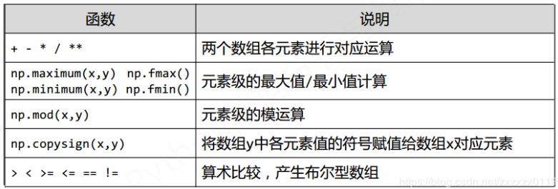

## Python库一Numpy库学习总结

* N维数组ndarray
*  Numpy数据存储
* 随机函数、统计函数、梯度函数
***
### 一、N维数组对象ndarray

##### 基本构成
ndarray是一个多维数组对象，由两部分构成：

* 实际的数据；
* 描述这些数据的元数据（数据维度、数据类型等)；

ndarray数组一般要求所有元素类型相同（同质），数组下标从0开始。

注意: 
* 在NumPy中维度(dimensions)叫做轴(axes)，轴的个数叫做秩(rank)；
* ndarray中的每个元素在内存中使用相同大小的块。 ndarray中的每个元素是数据类型对象的对象（称为 dtype）；
* 从ndarray对象提取的任何元素（通过切片）由一个数组标量类型的 Python 对象表示；
* <font color  =red>ndarray大部分创建的数组默认都是浮点数(出了arange等函数)，为什么？因为大部分科学计算都是浮点数，很少只有整数的数据；

 下图显示了ndarray，数据类型对象（dtype）和数组标量类型之间的关系。


##### ndarray对象的属性

代码演示: 

```python
import numpy as np

a = np.array([[0, 1, 2, 3, 4],
              [9, 8, 7, 6, 5]])

print(a.ndim)
print(a.shape)
print(a.size)
print(a.dtype)  # int64 这个不是python3中的类型 而是numpy自定义的数据类型
print(a.itemsize)  # 每个元素的大小(字节为单位)
```
输出：

```py
2
(2, 5)
10
int64
8
```
##### ndarray的元素类型
* bool、
* <font color = blue>intc、intp、</font>int8、int16、int32、int64、
* uint8、uint16、uint32、uint64、
* float16、float32、float64
* complex64、complex128

|数据类型| 描述 |
|--|--|
|bool  | 存储为一个字节的布尔值（真或假）  |
| int| 默认整数，相当于 C 的long，通常为int32或int64|
|intc |相当于 C 的int，通常为int32或int64 |
|intp | 用于索引的整数，与C语言中size_t一致，int32或int64|
|int8|字节长度的整数，取值：[‐128, 127]|
| int16| 16位长度的整数，取值：[‐32768, 32767]|
|int32 |32位长度的整数，取值：[‐2<sup>31</sup>, 2<sup>31</sup>‐1] |
|int64 | 64位长度的整数，取值：[‐2<sup>63</sup>, 2<sup>63</sup>‐1]|
|uint8 |8位无符号整数，取值：[0, 255]|
| uint16 | 16位无符号整数，取值：[0, 65535]|
|uint32 |32位无符号整数，取值：[0, 2<sup>32</sup>‐1]|
|uint64 | 64位无符号整数，取值：[0, 2<sup>64</sup>‐1]|
|float16 |16位半精度浮点数：1位符号位，5位指数，10位尾数 |
|float32 |32位半精度浮点数：1位符号位，8位指数，23位尾数 |
|float64|64位半精度浮点数：1位符号位，11位指数，52位尾数|
|complex64|复数类型，实部和虚部都是32位浮点数|
|complex|复数类型，实部和虚部都是64位浮点数|


##### ndarray也可以有非同质的对象

```python
import numpy as np

# 非同质的 ndarray对象，无法有效发挥NumPy优势，尽量避免使用
a = np.array([[0, 1, 2, 3, 4],
              [9, 8, 7, 6]])  # 不是一个矩阵

print(a.ndim)
print(a.shape)
print(a.size)  # 2
print(a.dtype)  # object 非同质ndarray元素为对象类型
print(a.itemsize)  # 每个元素的大小(字节为单位)
```
输出: 

```py
1
(2,)
2
object
8
```
##### 创建ndarray数组
创建的方式：

* 从Python中的列表、元组等类型创建ndarray数组；
* 使用NumPy中函数创建ndarray数组，如：arange, ones, zeros等；
* 从字节流（raw bytes）中创建ndarray数组；
* 从文件中读取特定格式，创建ndarray数组；

<font color = red>下面看前两种常见的创建方式：

<font color = blue>① 从Python中的列表、元组等类型创建ndarray数组: 

基本格式如下: 
```python
x = np.array(list/tuple)
x = np.array(list/tuple, dtype=np.float32)
```
注意: 当np.array()不指定dtype时，NumPy将根据数据情况关联一个dtype类型；

```python
import numpy as np

# 使用列表创建ndarray对象
x = np.array([0, 1, 2, 3])
print(x)

# 使用元组创建ndarray对象
x = np.array((3, 2, 1, 0))
print(x)

# 使用列表和元组混合创建ndarray对象  --> 包含的个数相同即可
x = np.array([[1, 2], [3, 4], (0.1, 0.2)])  # 二维的
print(x)
```
输出: 

```py
[0 1 2 3]
[3 2 1 0]
[[1.  2. ]
 [3.  4. ]
 [0.1 0.2]]
```
<font color = red> np.array函数的完整参数如下: 

```py
numpy.array(object, dtype = None, copy = True, order = None, subok = False, ndmin = 0)
```
|参数|描述|
|--|--|
| object| 任何暴露数组接口方法的对象都会返回一个数组或任何（嵌套）序列(元组、列表等) |
| dtype| 数组的所需数据类型，可选。|
| copy| 可选，默认为true，对象是否被复制。|
| order| C（按行）、F（按列）或A（任意，默认）。|
| subok |默认情况下，返回的数组被强制为基类数组。 如果为true，则返回子类。 |
|ndmin| 指定返回数组的最小维数。|

② <font color = blue>使用NumPy中函数创建ndarray数组，如：arange, ones, zeros等 

 

测试：

```python
import numpy as np

# 使用arange来创建(类似python3中的range)
x = np.arange(10)
print(x)
print("*" * 20)

# 使用ones来创建
x = np.ones((3, 4))
print(x)
print("*" * 20)

# 三维的 -- ones的高级用法
x = np.ones((2, 3, 4))
print(x)
print("*" * 20)

# 根据zeros来创建
x = np.zeros((2, 3), dtype=np.int32)
print(x)
print("*" * 20)

# 根据full来创建
x = np.full((2, 3), 6)
print(x)
print("*" * 20)

# 根据eye来创建  创建一个正方形 对角线为1 其余为0
x = np.eye(3)
print(x)
print("*" * 20)
```
输出:

```py
[0 1 2 3 4 5 6 7 8 9]
********************
[[1. 1. 1. 1.]
 [1. 1. 1. 1.]
 [1. 1. 1. 1.]]
********************
[[[1. 1. 1. 1.]
  [1. 1. 1. 1.]
  [1. 1. 1. 1.]]

 [[1. 1. 1. 1.]
  [1. 1. 1. 1.]
  [1. 1. 1. 1.]]]
********************
[[0 0 0]
 [0 0 0]]
********************
[[6 6 6]
 [6 6 6]]
********************
[[1. 0. 0.]
 [0. 1. 0.]
 [0. 0. 1.]]
********************
```

其他函数：　


测试: 

```python
import numpy as np

a = np.linspace(1, 10, 4)  # 在[1,10]中等间距的选4个数
print(a)

b = np.linspace(1, 10, 4, endpoint=False)  # [1,10)之间
print(b)

c = np.concatenate((a, b))  # 将a,b合并
print(c)
```
输出:

```py
[ 1.  4.  7. 10.]
[1.   3.25 5.5  7.75]
[ 1.    4.    7.   10.    1.    3.25  5.5   7.75]
```
##### ndarray数组的变化
两种变化: 

 * <font color = blue>维度变化；


 * 元素类型变化 : astype函数；


①维度变化: reshape和resize以及flatten的使用: 

```python
import numpy as np

a = np.ones((2, 3, 4), dtype=np.int32)
print(a)

print("-------使用reshape生成b------")
# reshape   不改变原来的数组 创建一个新的ndarray
b = a.reshape((2, 12))  # 将[2,3,4] 变成[2,12] 注意都是24个元素
print(b)

print("--------原来的a没有变化------")
# 输出原来的
print(a)

print("--------使用resize改变a-------")
# resize改变原来的　ndarray
a.resize((2, 12))
print(a)

print("--------使用flatten对a降维生成一维c数组------")
c = a.flatten()
print(c)
```
输出: 

```py
[[[1 1 1 1]
  [1 1 1 1]
  [1 1 1 1]]

 [[1 1 1 1]
  [1 1 1 1]
  [1 1 1 1]]]
-------使用reshape生成b------
[[1 1 1 1 1 1 1 1 1 1 1 1]
 [1 1 1 1 1 1 1 1 1 1 1 1]]
--------原来的a没有变化------
[[[1 1 1 1]
  [1 1 1 1]
  [1 1 1 1]]

 [[1 1 1 1]
  [1 1 1 1]
  [1 1 1 1]]]
--------使用resize改变a-------
[[1 1 1 1 1 1 1 1 1 1 1 1]
 [1 1 1 1 1 1 1 1 1 1 1 1]]
--------使用flatten对a降维生成一维c数组------
[1 1 1 1 1 1 1 1 1 1 1 1 1 1 1 1 1 1 1 1 1 1 1 1]
```
②元素类型变化: astype函数，以及ndarray转换成列表的tolist()方法: 

```python
import numpy as np

a = np.ones((2, 3), dtype=np.int)
print(a)

print("*" * 20)
# 注意astype生成的是一个拷贝的类型 没有修改原来的数组,即使新的类型和原来的类型一致
b = a.astype(np.float)
print(b)

print("-------使用tolist()方法从ndarray中生成列表list-------")
print(b.tolist())  # 注意生成的列表也是二维的
```
输出：　
```py
[[1 1 1]
 [1 1 1]]
********************
[[1. 1. 1.]
 [1. 1. 1.]]
-------使用tolist()方法从ndarray中生成列表list-------
[[1.0, 1.0, 1.0], [1.0, 1.0, 1.0]]
```
##### ndarray数组的运算

注意:<font color =red> 数组与标量之间的运算作用于数组的每一个元素。</font>

常用的一元函数：


常用的二元函数：　




例子: 

```python
import numpy as np

a = np.arange(12).reshape((2, 6))
print(a)
print("*" * 20)

b = np.square(a)  # 平方
print(b)
print("*" * 20)

c = np.sqrt(a)  # 平方根
print(c)
print("*" * 20)

print(np.maximum(a, b))  # 元素级的最大值 输出a,b中较大的
print("*" * 20)

print(b > a)  # 各个位置的比较
```
输出: 
```py
[[ 0  1  2  3  4  5]
 [ 6  7  8  9 10 11]]
********************
[[  0   1   4   9  16  25]
 [ 36  49  64  81 100 121]]
********************
[[0.         1.         1.41421356 1.73205081 2.         2.23606798]
 [2.44948974 2.64575131 2.82842712 3.         3.16227766 3.31662479]]
********************
[[  0   1   4   9  16  25]
 [ 36  49  64  81 100 121]]
********************
[[False False  True  True  True  True]
 [ True  True  True  True  True  True]]

```
***
### 二、Numpy数据存储
##### 一维或二维数据存储
<font color = blue>  存储到csv文件：
```py
np.savetxt(fname, array, fmt='%.18e', delimiter=None)
```
相关参数使用说明: 
* fname : 文件、字符串或产生器，可以是.gz或.bz2的压缩文件；
* array : 存入文件的数组；
* fmt : 写入文件的格式，例如：%d %.2f %.18e；
* delimiter : 分割字符串，默认是任何空格；

例子: 

```py
import numpy as np

a = np.arange(80).reshape((4, 20))
np.savetxt("a.csv", a, fmt="%d", delimiter=",")

b = np.arange(80).reshape((4, 20))
np.savetxt("b.csv", b, fmt="%.1f", delimiter=",")
```
在同目录下生成的`a.csv`和`b.csv`文件内容如下: 
`a.csv`: 

```py
0,1,2,3,4,5,6,7,8,9,10,11,12,13,14,15,16,17,18,19
20,21,22,23,24,25,26,27,28,29,30,31,32,33,34,35,36,37,38,39
40,41,42,43,44,45,46,47,48,49,50,51,52,53,54,55,56,57,58,59
60,61,62,63,64,65,66,67,68,69,70,71,72,73,74,75,76,77,78,79
```
`b.csv`: 

```py
0.0,1.0,2.0,3.0,4.0,5.0,6.0,7.0,8.0,9.0,10.0,11.0,12.0,13.0,14.0,15.0,16.0,17.0,18.0,19.0
20.0,21.0,22.0,23.0,24.0,25.0,26.0,27.0,28.0,29.0,30.0,31.0,32.0,33.0,34.0,35.0,36.0,37.0,38.0,39.0
40.0,41.0,42.0,43.0,44.0,45.0,46.0,47.0,48.0,49.0,50.0,51.0,52.0,53.0,54.0,55.0,56.0,57.0,58.0,59.0
60.0,61.0,62.0,63.0,64.0,65.0,66.0,67.0,68.0,69.0,70.0,71.0,72.0,73.0,74.0,75.0,76.0,77.0,78.0,79.0
```

<font color = blue>从csv文件中读取到ndarray数组中：</font>

```py
np.loadtxt(fname, dtype=np.float, delimiter=None， unpack=False)
```
相关参数使用说明: 
 * fname : 文件、字符串或产生器，可以是.gz或.bz2的压缩文件；
 * dtype : 数据类型，可选；
 *  delimiter : 分割字符串，默认是任何空格；
 * unpack : 如果True，读入属性将分别写入不同变量

例子: 

```py
import numpy as np

a = np.loadtxt("a.csv", dtype=np.int, delimiter=",")
print(a)

print("*"*20)

b = np.loadtxt("b.csv", dtype=np.float, delimiter=",")
print(b)
```
控制台输出: 

```py
[[ 0  1  2  3  4  5  6  7  8  9 10 11 12 13 14 15 16 17 18 19]
 [20 21 22 23 24 25 26 27 28 29 30 31 32 33 34 35 36 37 38 39]
 [40 41 42 43 44 45 46 47 48 49 50 51 52 53 54 55 56 57 58 59]
 [60 61 62 63 64 65 66 67 68 69 70 71 72 73 74 75 76 77 78 79]]
********************
[[ 0.  1.  2.  3.  4.  5.  6.  7.  8.  9. 10. 11. 12. 13. 14. 15. 16. 17.
  18. 19.]
 [20. 21. 22. 23. 24. 25. 26. 27. 28. 29. 30. 31. 32. 33. 34. 35. 36. 37.
  38. 39.]
 [40. 41. 42. 43. 44. 45. 46. 47. 48. 49. 50. 51. 52. 53. 54. 55. 56. 57.
  58. 59.]
 [60. 61. 62. 63. 64. 65. 66. 67. 68. 69. 70. 71. 72. 73. 74. 75. 76. 77.
  78. 79.]]
```
##### 多维数据的存储
分为两种：　

* 通过`tofile()`和`fromfile()`来存储和读取<font color = gree>任意文件</font>。(<font color = blue>该方法需要读取时知道存入文件时数组的维度和元素类型)</font>。<font color = red>可以通过元数据文件来存储额外信息。
* 通过压缩名为`.npz`的`Numpy`便捷文件读取；

<font color = blue>第一种:  tofile()和fromfile()

`tofile()方法`：　
```py
a.tofile(fname, sep='', format='%s')
```
* fname : 文件、字符串；
* sep : 数据分割字符串，如果是空串，写入文件为二进制；
* format : 写入数据的格式

例子:

```py
import numpy as np

a = np.arange(30).reshape((2, 3, 5))
print(a)

a.tofile("a.dat", sep=",", format='%d')  # 写入

a.tofile("b.dat", format="%d")  # 如果只指定这两个参数，就会生成二进制文件
```

`fromfile()`方法: 

```py
np.fromfile(fname, dtype=float, count=‐1, sep='')
```
* fname : 文件、字符串；
* dtype : 读取的数据类型；
* count : 读入元素个数，‐1表示读入整个文件；
*  sep : 数据分割字符串，如果是空串，写入文件为二进制；

例子: 

```py
import numpy as np

a = np.fromfile("a.dat", dtype=np.int, sep=",").reshape((2, 3, 5))
print(a)

b = np.fromfile("b.dat", dtype=np.int).reshape((2, 3, 5))
print(b)
```
<font color = blue>第二种:便捷文件

`save()`和`load()`方法: 
```py
np.save(fname, array) 或 np.savez(fname, array)
```
* fname : 文件名，以.npy为扩展名，压缩扩展名为.npz；
* array : 数组变量；

```py
np.load(fname)
```
* fname : 文件名，以.npy为扩展名，压缩扩展名为.npz；

 简单使用的例子: 
```py
import numpy as np

a = np.arange(30).reshape((2, 3, 5))
print(a)

np.save("a.npy", a)

print("*" * 20)
b = np.load("a.npy")
print(b)
```
***
### 三、随机函数、统计函数、梯度函数

##### 随机函数 


相关函数简单测试：

```python
import numpy as np

a = np.random.rand(2, 3)  # 生成shape为[2,3]的ndarray
print(a)
print("*"*20)

# 可以指定一个种子 后面的随机数就是一样的
np.random.seed(10)
print(np.random.randint(10, 20, (2, 3, 4)))
np.random.seed(10)
print(np.random.randint(10, 20, (2, 3, 4)))
print("*"*20)

# shuffle 第一轴随机排列
b = np.random.randint(10, 20, (2, 3, 4))
print(b)
np.random.shuffle(b)
print(b)
```
输出：

```py
[[0.51662904 0.58163111 0.23986954]
 [0.46218182 0.73855155 0.31681944]]
********************
[[[19 14 10 11]
  [19 10 11 18]
  [19 10 18 16]]

 [[14 13 10 14]
  [16 18 11 18]
  [14 11 13 16]]]
[[[19 14 10 11]
  [19 10 11 18]
  [19 10 18 16]]

 [[14 13 10 14]
  [16 18 11 18]
  [14 11 13 16]]]
********************
[[[15 13 19 16]
  [19 11 19 14]
  [12 16 17 18]]

 [[18 19 12 10]
  [16 17 18 11]
  [17 11 14 10]]]
[[[18 19 12 10]
  [16 17 18 11]
  [17 11 14 10]]

 [[15 13 19 16]
  [19 11 19 14]
  [12 16 17 18]]]
```
##### 统计函数

简单的几个演练: 

```python
import numpy as np

a = np.arange(15).reshape(3, 5)
print(a)
print("*" * 20)

# 整个数组的和
print(np.sum(a))

# 每一排的和: 第二维度上 (注意第一维度是最外层的维度)
print(np.sum(a, axis=1))

# 加权平均值
print(np.average(a, axis=0, weights=[10, 5, 1]))
```
输出:


##### 梯度函数的使用


简单测试: 

```python
import numpy as np

# 一维梯度
a = np.random.randint(0, 20, (5,))
print(a)

print(np.gradient(a))

# 多维梯度
b = np.random.randint(0, 50, (3, 5))
print(np.gradient(b))
```
输出：
```py
[ 4 12  1  2 12]
[ 8.  -1.5 -5.   5.5 10. ]
[array([[ 13. ,   4. ,   1. ,  26. ,   5. ],
       [ -1.5,  15.5,  16. ,   5.5,   1. ],
       [-16. ,  27. ,  31. , -15. ,  -3. ]]), array([[-16. ,  -6. ,   5. ,  -4.5, -15. ],
       [-25. , -12. ,  16. ,  -2.5, -36. ],
       [ 18. ,  11.5,  -5. , -19.5, -24. ]])]
```

***
**关于Numpy更多总结可以看[这篇博客](https://blog.csdn.net/a373595475/article/details/79580734)**

