# checkout、stash、标签、diff

## 一、gitcheckout和git reset --的区别

`git checkout -- test.txt`的作用: **丢弃掉相对于暂存区中最后一次添加的文件内容所做的变更**。

演示:

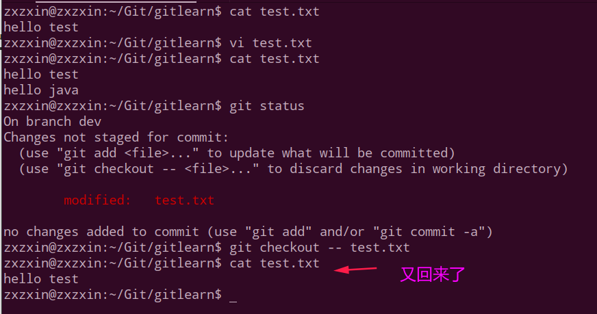

第二个，注意和`git reset HEAD test.txt`的区别:

**将之前添加到暂存区(stage)的内容从暂存区移除到工作区**

演示: 

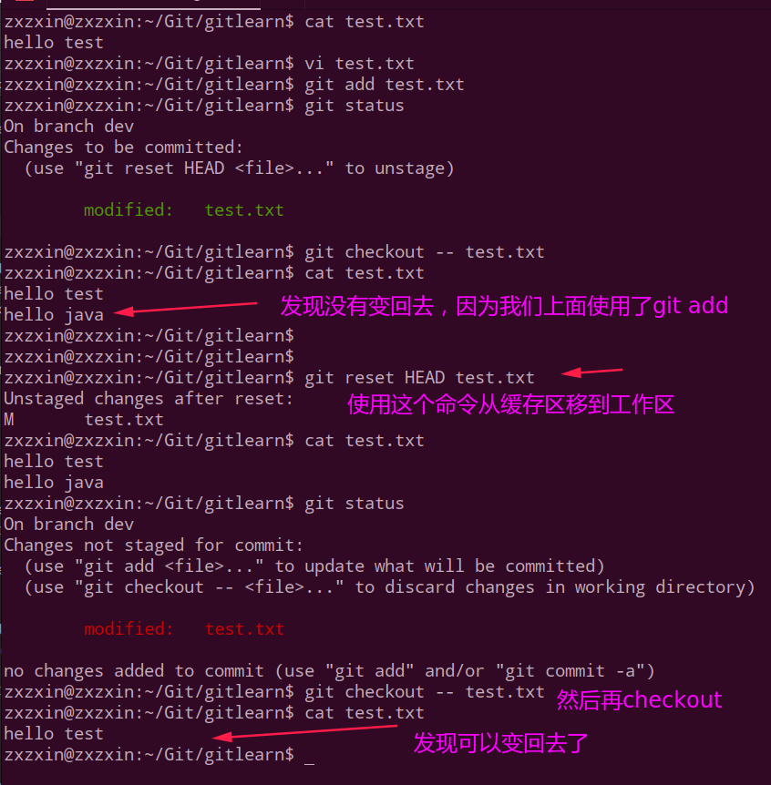

## 二、git checkout游离状态

之前我们知道`git branch`可以切换到历史提交。而`git reset HEAD commid-id`可以切换到某个历史状态，然而`git checkout`也可以切换到某个历史状态，但是`git checkout `切换到的是一个游离的状态，我们必须要提交或者`stash`，不然会报错。

下面开始演示，先做准备工作: 创建`test.txt`并修改提交几次。

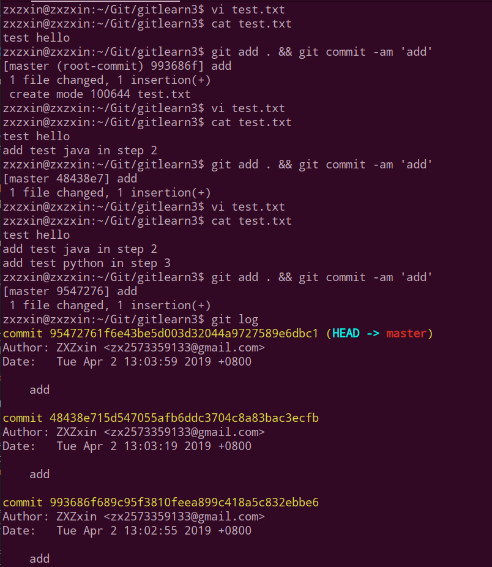

然后开始我们的演示。

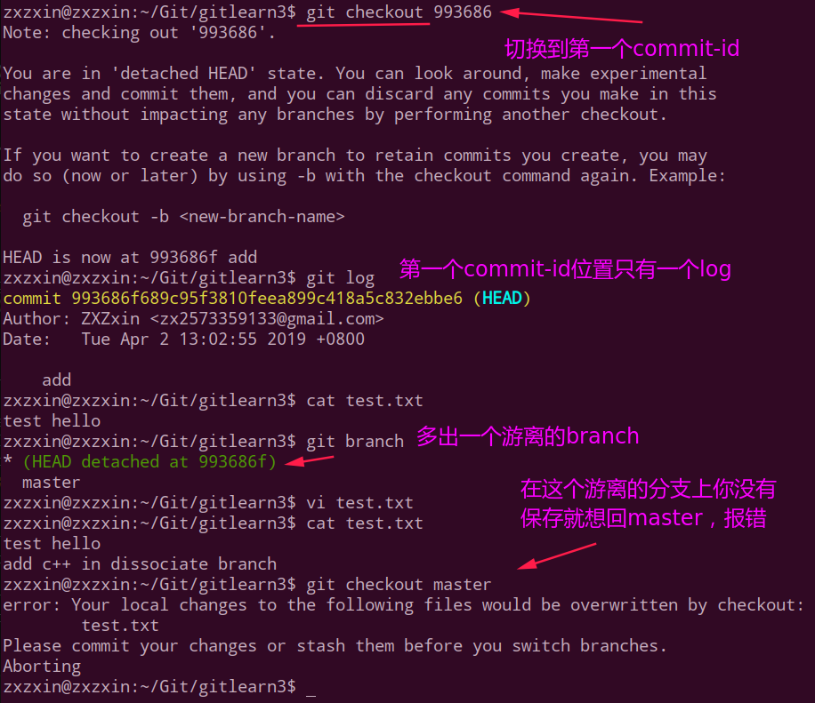

可以看到git报错了，所以我们必须通过`add和commit`保存起来，最好再创建一个分支，如下:

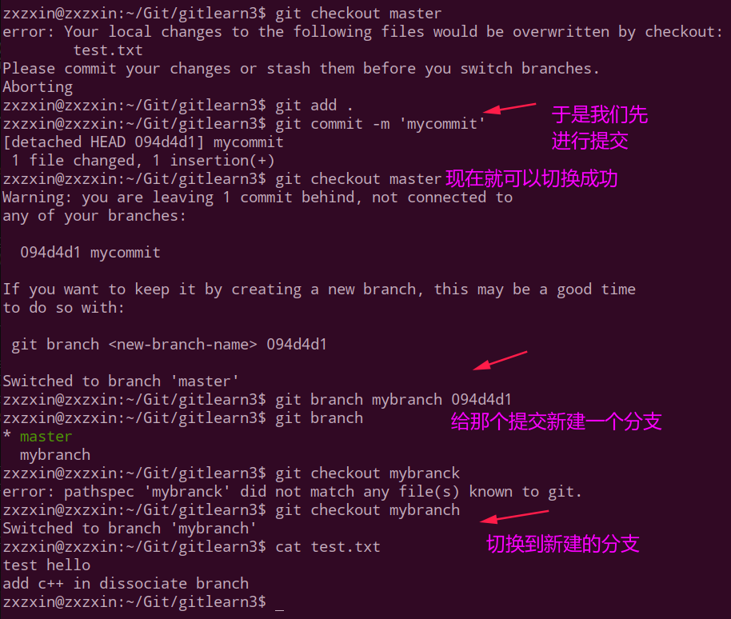

总结图:

 
 

## 三、stash使用

常见使用命令：

* 保存现场
  * `git stash`
  * `git stash list`
* 恢复现场
  * `git stash apply`(stash内容并不删除，需要通过`git stash drop stash@{id}` 手动删除)作用，保存在`master`之前创建的分支上做的修改(想要回到`master`)。
  * `git stash pop`（恢复的同时也将stash内容删除）
  * `git stash apply stash@{id}`，回到某一个`stash`。

 

演示: 

先搭建基础环境:

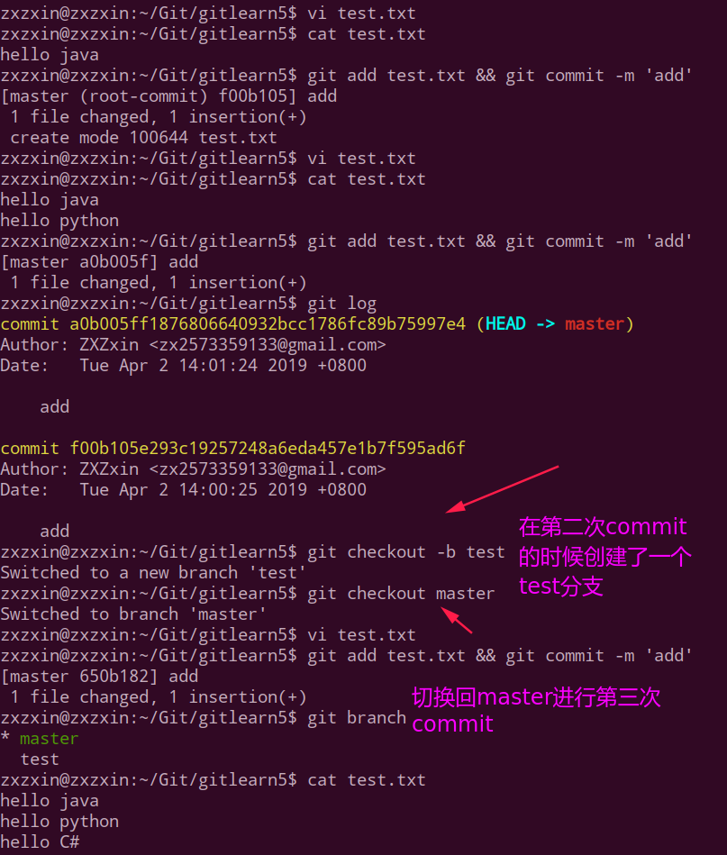

然后我们回到`test`分支上进行修改，不做提交，想回到`master`上:

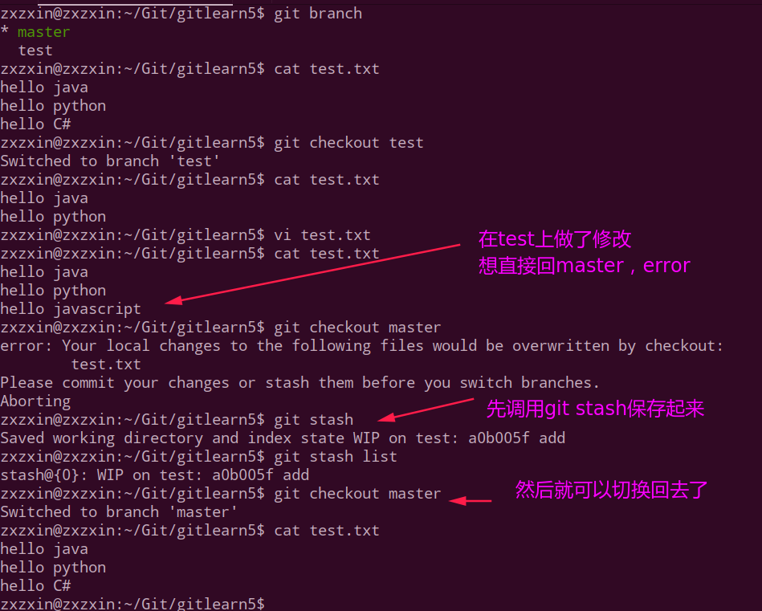

下面看使用`stash pop`恢复:

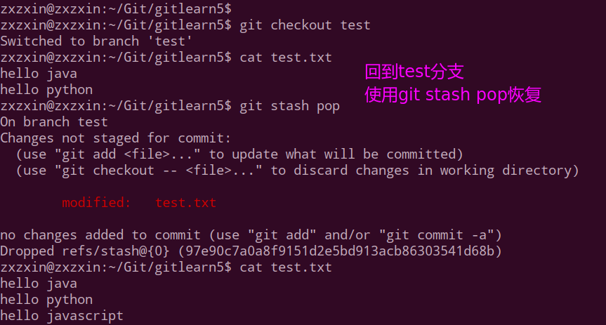

下面使用`stash apply`和`stash drop`命令:

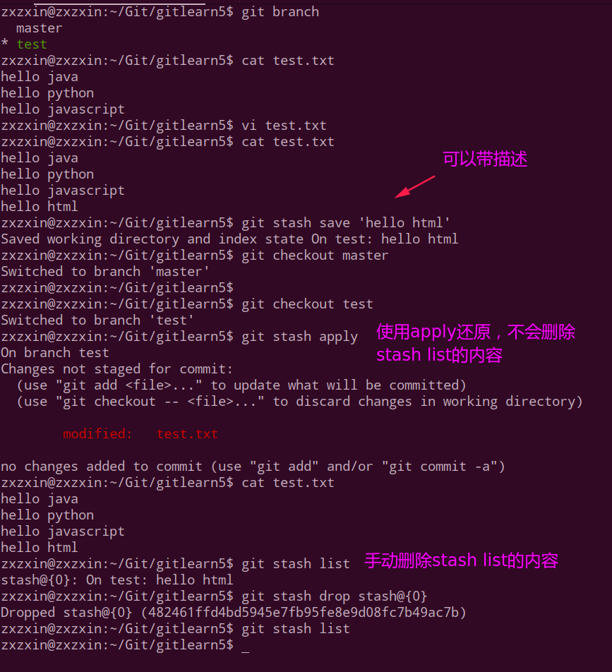

## 四、标签

主要是`git tag`这个标签。

简单使用: 

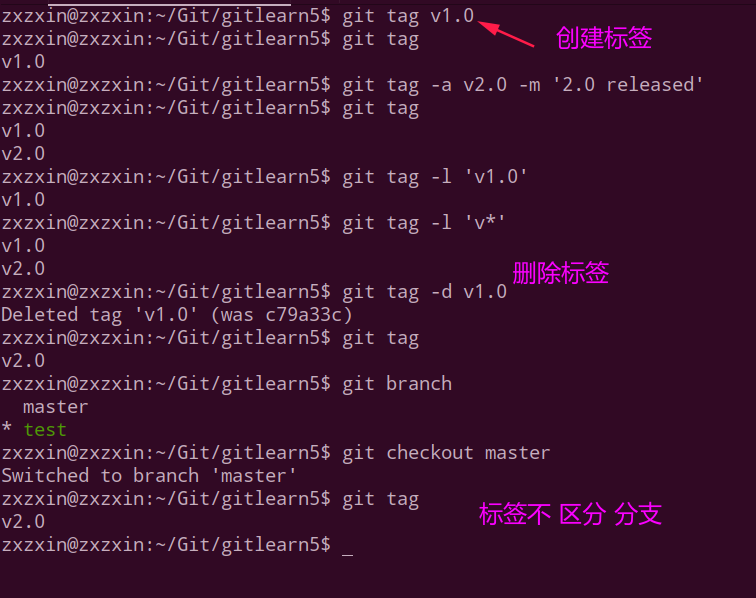

## 五、diff

这里先介绍一下`git blame`，作用: **找到上一次修改的人和详细信息**

然后在介绍`git diff`之前，先看`linux`系统中内置的`diff`命令。

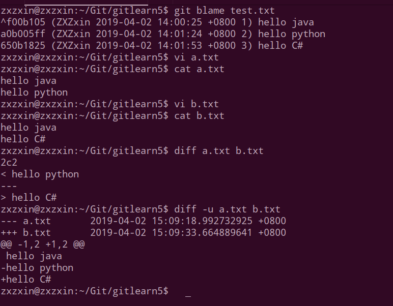

`git diff`有四种差别性比较:

* 工作区和暂存区的差别，命令`git diff`；
* 工作区和某一次提交的差别；
  * 最新的提交和工作区的差别，`git diff HEAD`。
  * 特定`commit-id`和工作区的差别，`git diff commit-id`。
* 暂存区和某一个提交的差别；
  * 最新的提交和暂存区之间的差别，`git diff --cached`。
* 两个提交之间的差别；

先看第一个: 工作区和暂存区的差别:

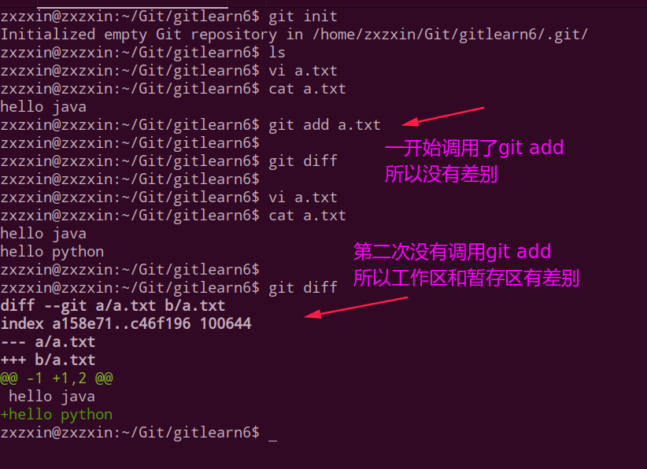

最近一次提交和工作区之间的差别以及最新的提交和暂存区之间的差别。

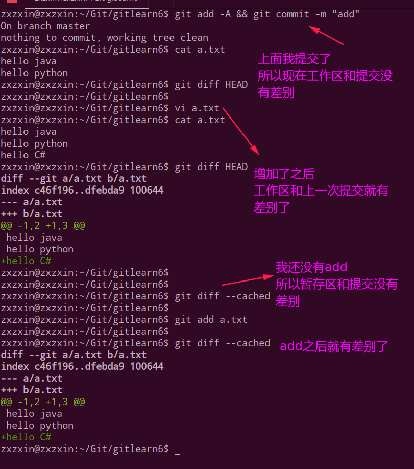