# 远程分支、本地分支、refspec

## 一、本地分支和远程分支

### 1、别名的使用

先说一下别名的使用:

`git config --global alias.别名 要设置的命令` (`--globab`代表配置整个用户访问，如果是`--local`则是仓库的范围)

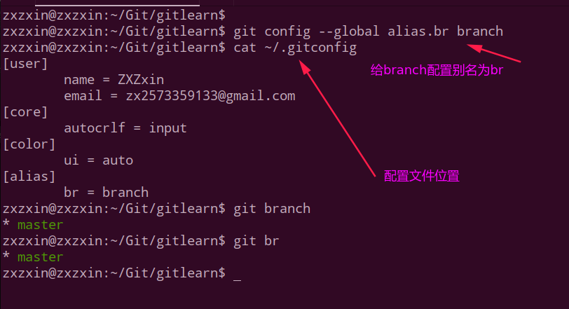

### 2、本地分支和远程分支的对应关系

下面开始演示本地分支和远程分支的一些操作:

我们知道，分支名字实际上是一个提交的`id`，当我们使用`git checkout -b newbranch`的时候，这个`newbranch`指向的是当前创建的提交点。(当前分支和`newbranch`指向同一个`commit`点)

我们还是使用两个人协作的场景，张三在`gitlearn`仓库中，李四在`gitlearn2`仓库中:

下面我先在`gitlearn2`中新建两个分支。

此时我们使用`git branch -av`查看的是，发现本地有三个分支，而执行远程的只有一个`origin/master`分支。

此时我们想直接在`develop`分支上`push`到远程，就会报错:

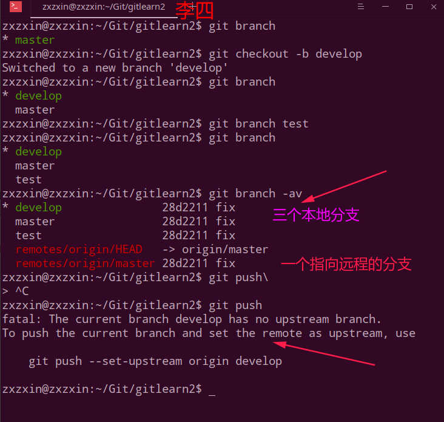
 

为什么报错呢？因为我们本地的`develop`分支在远程并没有一个对应的分支。

于是我们执行`git`给我们提示的那个命令: `git push --set-upstream origin develop`。这个命令的意思就是会将当前的`develop`和远程新建的一个`develop`分支进行对应，我们下次`push`的时候，本地的`develop`分支就会直接`push`到远程的`develop`分支上。

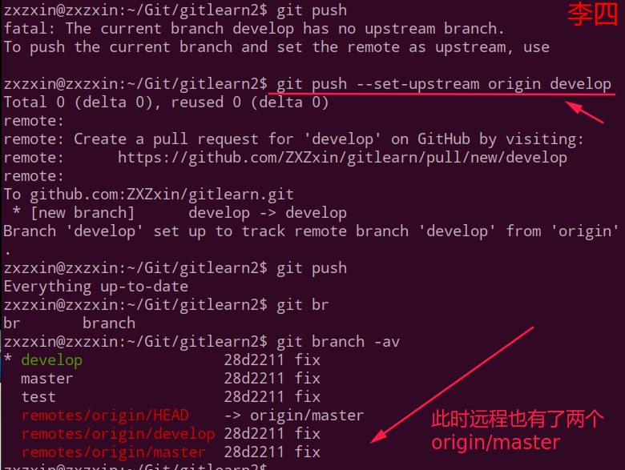
 

然后我们在张三这边视图将`develop`拉去过来，(`git pull`会将远程所有的分支的信息都拉取过来)，**并且我们在本地分支上建立一个`develop`分支和远程的`origin/develop`对应起来**:

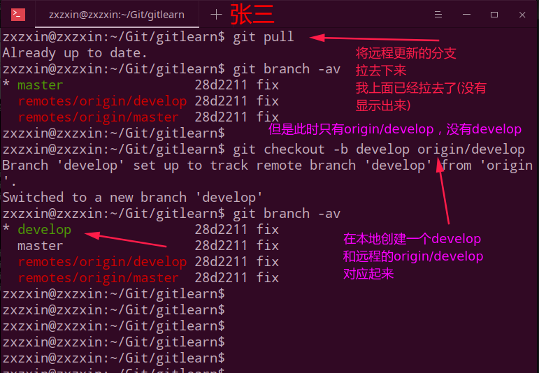
 

上面使用了`git push --set-upstream origin develop`这个命令来进行本地分支和远程分支的调用，有没有其他命令也可以做到呢？有: `git push -u origin 分支名`。

下面在李四这边再将`test`分支也和远程的`test`分支对应起来。

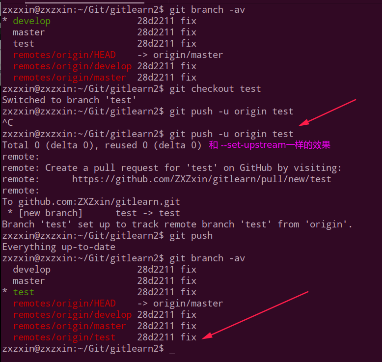
 

下面在张三这边再演示`git checkout -b 本地分支 origin/远程分支`的替代品，我们可以使用`git checkout --track origin/test`：

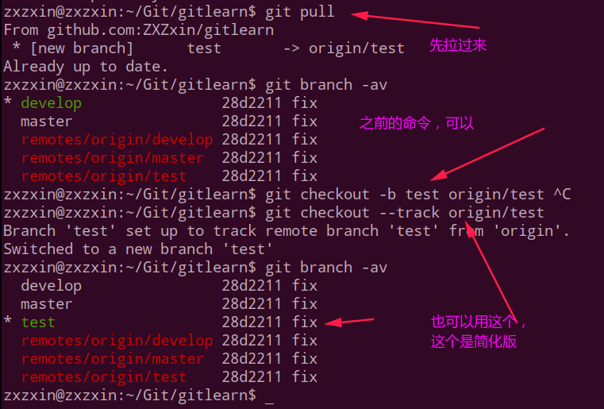
 

### 3、删除远程分支

先说一下`git push`完整写法:

 `git push`其实是一个简写，完整的写法是`git push origin src:dest`，`origin`是远程的别名，`src`是本地分支的名字，`dest`是远程分支的别名。
>
> `origin`就是一个别名，它是在你clone一个托管在Github上代码库时，git为你默认创建的指向这个远程代码库的**标签**， origin指向的是repository，master只是这个repository中默认创建的第一个branch。

`git`的老版本中只有一个删除命令，比如我们要删除`develop`分支: `git push origin :develop`：

比如我们在李四这边的`gitlearn2`中删除`develop远程分支(不是本地的,本地的使用 git branch -d )`

下面分别看删除本地分支和远程分支的操作: 

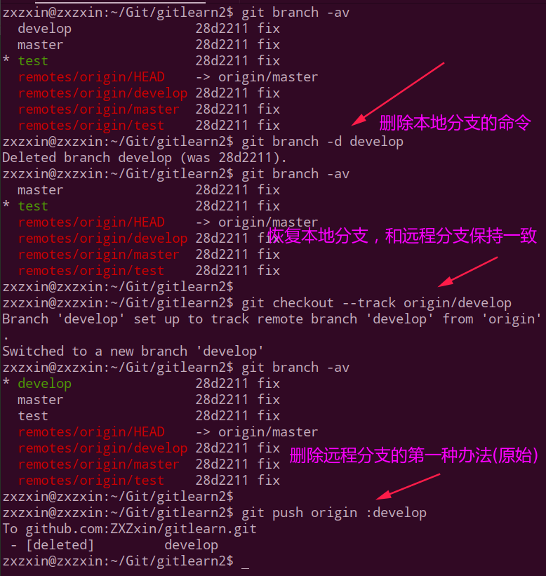
 

查看远程分支，develop分支已经被删除了。

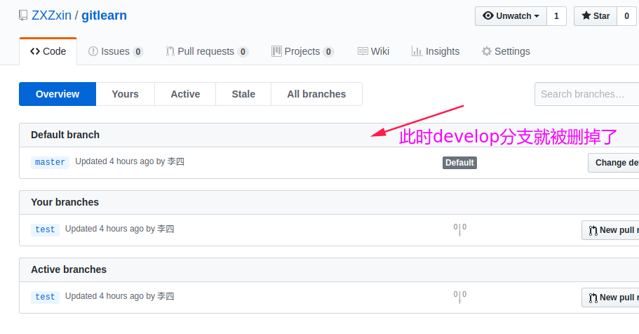
 

远程分支删除了之后能不能恢复呢？当然可以，加入git版本库的一切东西都可以恢复!!

我们可以使用之前将某个本地分支对应到远程分支的`--set-upstream`来创建对应的远程分支:

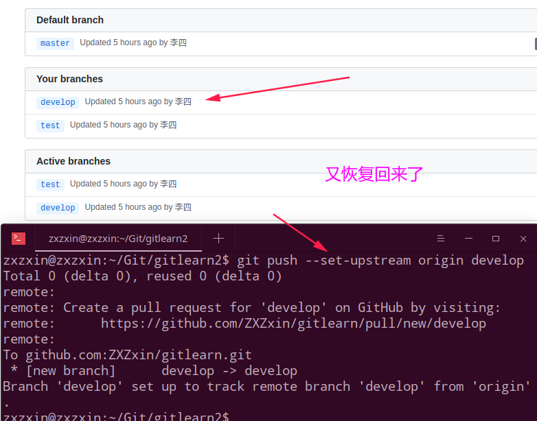
 

**另外，可以使用git最新提供的删除远程分支的命令: `git push origin --delete 分支名`来删除，这样更加直观**。

且，我们这里可以用第二种恢复(建立)远程分支的方法，**这种方法可以指定本地分支和远程分支不同的名字**。比如本地分支叫`develop`，远程分支叫`develop2`，命令就是`git push --set-upstream origin develop:develop2`:

演示:

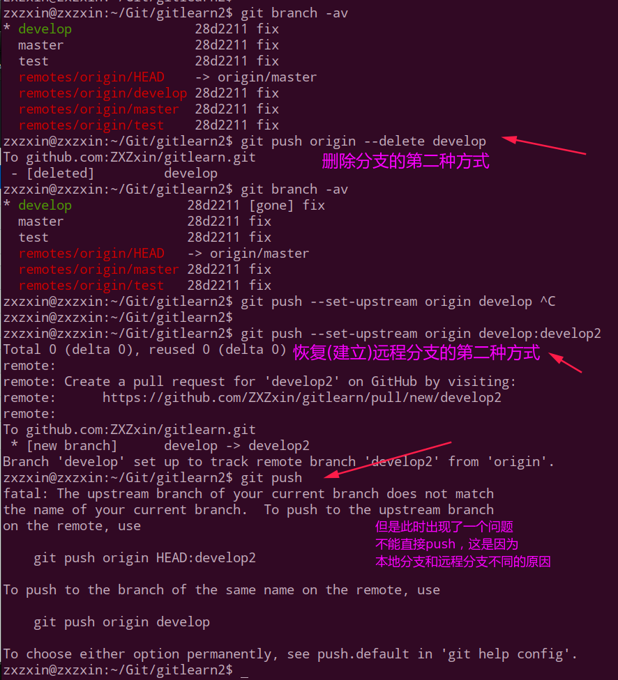

但是这里出现了一个问题，上图我也说了，这种**本地分支和远程分支**不同的情况，会导致不能直接`git push`，所以`git`还是希望我们尽量将本地分支和远程分支保持同样的名字。

所以解决问题的方式有两种，上面也提示了，使用`git push origin HEAD:develop2 `、或者`git push origin develop`。   

> **`HEAD`永远指向分支，而分支指向的是具体的提交点**。

下面演示这两种方法: (最后演示了一个`git push`的完整操作语法: `git push origin src:dest`)

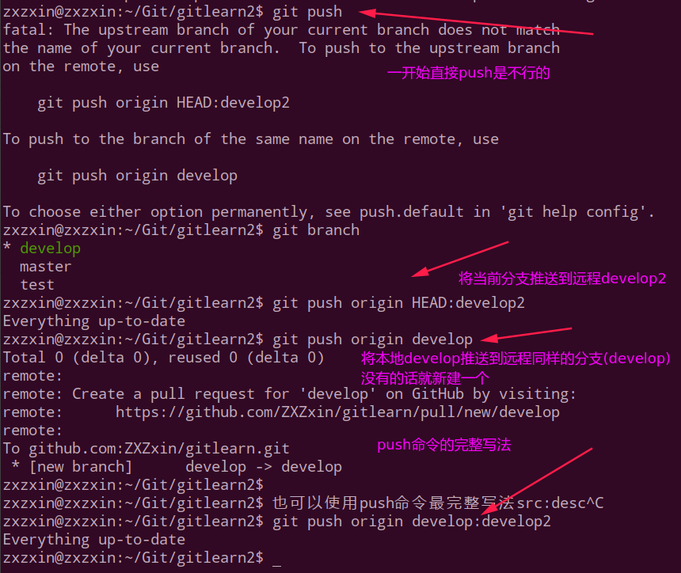

因为我们使用`git push origin develop`，此时又会在远程创建一个`develop`分支，所以我们看到远程有了三个分支:

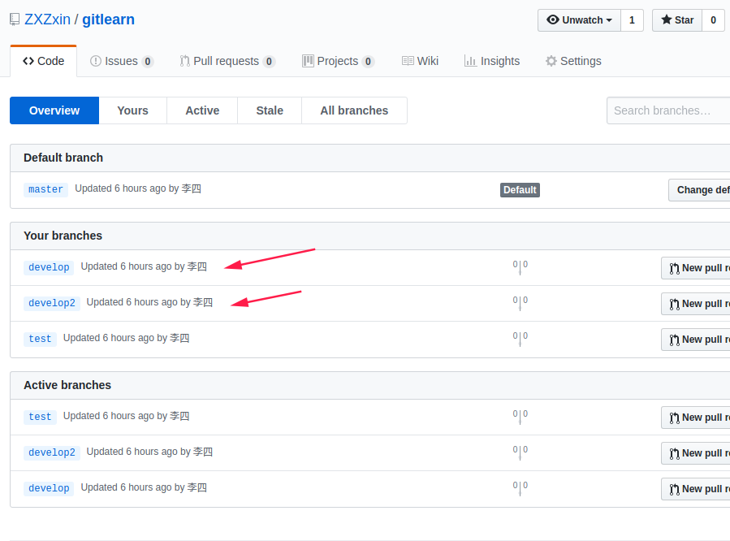

### 4、重命名远程分支

`git`没有直接提供重命名的方式，我们需要先删除需要重命名的远程分支，然后再重新将之前的连接起来：

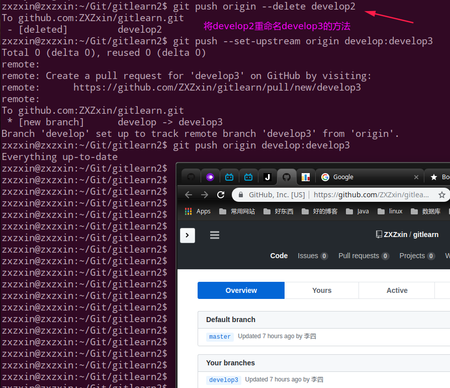

