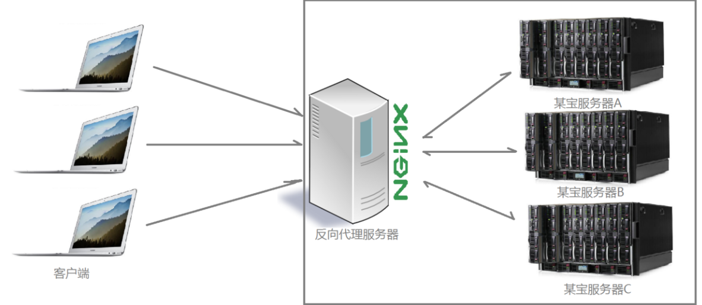
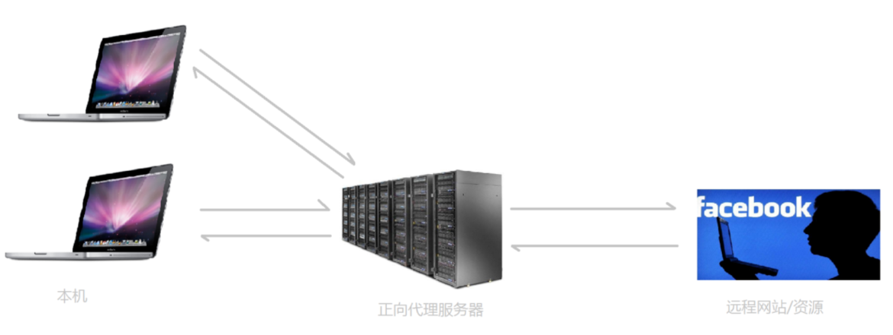
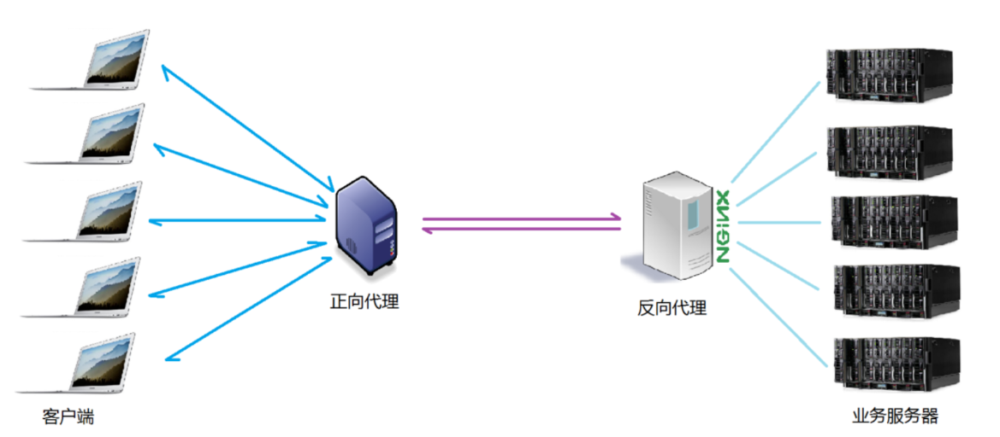
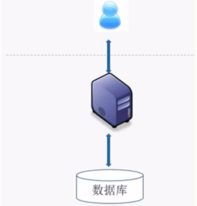
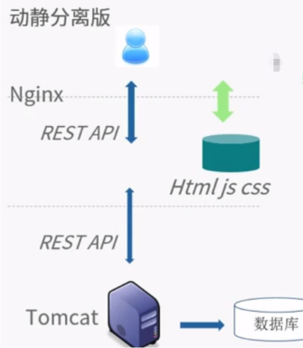

# Nginx

转载部分: 

https://www.cnblogs.com/xingyunblog/p/9066865.html

https://www.jianshu.com/p/6215e5d24553 （Nginx原理可参考这个）

总结：

> nginx是一款自由的、开源的、高性能的HTTP服务器和反向代理服务器；
>
> 同时也是一个IMAP、POP3、SMTP代理服务器；
>
> nginx可以作为一个HTTP服务器进行网站的发布处理，
>
> 另外nginx可以作为反向代理进行负载均衡的实现。

## 一、什么是反向代理？

要解释反向代理，我们就不得不先说下什么是代理？

**那么什么是代理呢？**

举个例子：**代理** 就如同生活中的专卖店~客人到adidas专卖店买了一双鞋，这个专卖店就是代理，被代理角色就是adidas厂家，目标角色就是用户。

**那么什么是反向代理呢？**

我们很多人应该都用过淘宝，要知道每天同时连接到淘宝网站的访问人数已经爆表，单个服务器远远不能满足人民日益增长的购买欲望了，此时就出现了一个大家耳熟能详的名词：分布式部署；

也就是通过部署多台服务器来解决访问人数限制的问题；淘宝网站中大部分功能也是直接使用nginx进行反向代理实现的，并且通过封装nginx和其他的组件之后起了个高大上的名字：[Tengine](http://tengine.taobao.org/) 

然后我们一起看个图：

上图表示的是全国各地的用户在淘宝客户端发出请求，经过了Nginx 反向代理服务器，nginx服务器接收到之后，按照一定的规则分发给了后端的业务处理服务器进行处理。

此时~请求的来源也就是客户端是明确的，但是请求具体由哪台服务器处理的并不明确了。Nginx扮演的就是一个反向代理角色。

反向代理（Reverse Proxy）方式是指以代理服务器来接受internet上的连接请求，然后将请求转发给内部网络上的服务器，并将从服务器上得到的结果返回给internet上请求连接的客户端，此时代理服务器对外就表现为一个服务器。

**总结下：反向代理，主要用于服务器集群分布式部署的情况下，反向代理隐藏了服务器的信息**

一般聪明的人会有举一反三的思维，当你听到反向代理，也许就会想有没有正向代理呢？答案是有.

**什么是正向代理？**

举 个例子：如今的网络环境下，我们如果由于技术需要要去访问国外的某些网站，此时你会发现位于国外的某网站我们通过浏览器是没有办法访问的，此时大家可能都会用一个操作FQ（VPN）进行访问，FQ的方式主要是找到一个可以访问国外网站的代理服务器，我们将请求发送给代理服务器，代理服务器去访问国外的网站，然后将访问到的数据传递给我

上述这样的代理模式称为正向代理.

正向代理最大的特点: **客户端非常明确要访问的服务器地址；服务器只清楚请求来自哪个代理服务器，而不清楚来自哪个具体的客户端；正向代理模式屏蔽或者隐藏了真实客户端信息**。

正向代理和反向代理一起使用就会像下图这样：

对比:

## 二、Nginx 如何实现负载均衡？

 相信上面的讲述使得你已经明白了代理相关的知识，那么我们继续来看什么是负载均衡？

 想要知道什么是负载均衡，我们就得明白两个概念，什么是负载量？什么是均衡？

**上面客户端发送的、nginx反向代理服务器接收到的请求数量，就是我们说的负载量**

 什么又是均衡呢？

 **请求数量按照一定的规则进行分发到不同的服务器处理的规则，就是一种均衡规则**

所以负载均衡就是：**将服务器接收到的请求按照规则分发的过程**

 负载均衡在实际项目操作过程中，有硬件负载均衡和软件负载均衡两种

硬件负载均衡也称为硬负载，特点：造价昂贵成本较高，数据的稳定性安全性好。

更多的公司考虑到成本原因，会选择使用软件负载均衡，软件负载均衡是利用现有的技术结合主机硬件实现的一种消息队列分发机制。

**nginx支持的负载均衡调度算法方式如下**：

> **weight轮询（默认）**：接收到的请求按照顺序逐一分配到不同的后端服务器，即使在使用过程中，某一台后端服务器宕机，nginx会自动将该服务器剔除出队列，请求受理情况不会受到任何影响。 这种方式下，可以给不同的后端服务器设置一个权重值（weight），用于调整不同的服务器上请求的分配率；权重数据越大，被分配到请求的几率越大；该权重值，主要是针对实际工作环境中不同的后端服务器硬件配置进行调整的。
>
> **ip_hash**：每个请求按照发起客户端的ip的hash结果进行匹配，**这样的算法下一个固定ip地址的客户端总会访问到同一个后端服务器**，这也在一定程度上解决了集群部署环境下session共享的问题。
>
> **fair**：智能调整调度算法，动态的根据后端服务器的请求处理到响应的时间进行均衡分配，响应时间短处理效率高的服务器分配到请求的概率高，响应时间长处理效率低的服务器分配到的请求少；结合了前两者的优点的一种调度算法。但是需要注意的是nginx默认不支持fair算法，如果要使用这种调度算法，请安装upstream_fair模块
>
>  **url_hash**：按照访问的url的hash结果分配请求，每个请求的url会指向后端固定的某个服务器，可以在nginx作为静态服务器的情况下提高缓存效率。同样要注意nginx默认不支持这种调度算法，要使用的话需要安装nginx的hash软件包

## 三、Nginx 另外一种实现负载均衡的方式

其实关于Nginx 实现负载均衡，除了上面那种模式外，还有一种Nginx处理静态资源实现负载均衡的架构。

我们先来看看原始的企业架构：

这种原始架构的特点：

- 单节点
- 几乎无容灾
- 负载能力低
- 维护简单

 所以为了改善这种架构，引入了一种动静分离的模式：

 

 这种架构模式，使用Nginx 来处理所有的html、js、css 静态资源请求，**这样Tomcat 压力就会减轻一些**，这样操作也能实现一定程度的负载均衡。

## 四、优点

1、保护了真实的web服务器，保证了web服务器的资源安全；

2、节约了有限的ip地址资源；

3、减少web服务器压力，提高响应速度；

4、负载均衡，内部可以采用多台服务器组成集群，外部还是可以用一个地址访问；

5、可以解决ajax跨域问题；

## 五、Nginx虚拟主机

- 所谓虚拟主机，在 Web 服务里就是一个独立的网站站点，这个站点对应独立的域名（也可能是IP 或端口），具有独立的程序及资源，可以独立地对外提供服务供用户访问。
- 在 Nginx 中，使用一个` server{} `标签来标识一个虚拟主机，一个 Web 服务里可以有多个虚拟主机标签对，即可以同时支持多个虚拟主机站点。
- 虚拟主机有三种类型：基于域名的虚拟主机、基于端口的虚拟主机、基于 IP 的虚拟主机。