# Notes

## 一、总概

项目基于SpringCloud微服务，功能是监视网络中的资产，对产生的日志和报警信息完成分析与处置等工作。主要负责的模块是 资产画像和告警大屏。

1、Noah日志采集系统采集日志到ElasticSearch中，通过ES的桶聚合等模式过滤统计出某个资产访问通过什么协议端口访问了其他资产，多种日志查询采用线程池和CountDownLatch查询；

2、使用Spring Task定时任务每隔5分钟更新PGSQL和Reids相关数据，实现大屏间隔一段时间更新告警和资产等信息，因为大屏模块使用分布式环境部署，所以更新数据用到Redis分布式锁；

3、使用PGSQL的等级分桶函数width_bucket来实现统计近一个月每天的威胁趋势统计分析图；

4、项目遇到的相关问题：微服务之间Feign调用的Header参数传递问题、RestTemplate请求https报错、异步线程无法获取header中参数等；

场景分析:


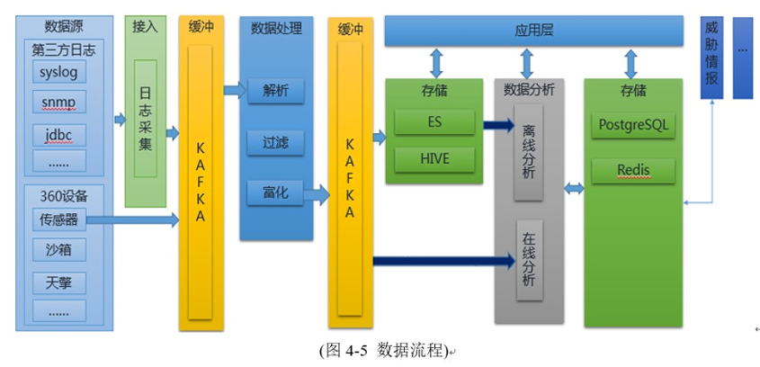

* 通过数据源接入第三方日志(安全人员发处理的)；
* NOAH进行日志采集； 
* 对日志进行过滤、解析；
* 然后存储到ES、HIVE中；
* 对ES中的数据进行数据分析；
* 存储到PGSQL中；
* 进行分析统计出威胁情报统计分析；

> 关于kafka缓冲:  在客户端发送消息给kafka服务器的时候，一定是有一个内存缓冲机制的。也就是说，消息会先写入一个内存缓冲中，然后直到多条消息组成了一个Batch，才会一次网络通信把Batch发送过去。


通过采集并分析各种类型日志、安全日志以及其他上下文数据来实现**威胁检测、合规和安全事件 管理**

**目标**：帮助客户构建信息安全管理体系，降低安全运营成本，使客户信息系统风险可控


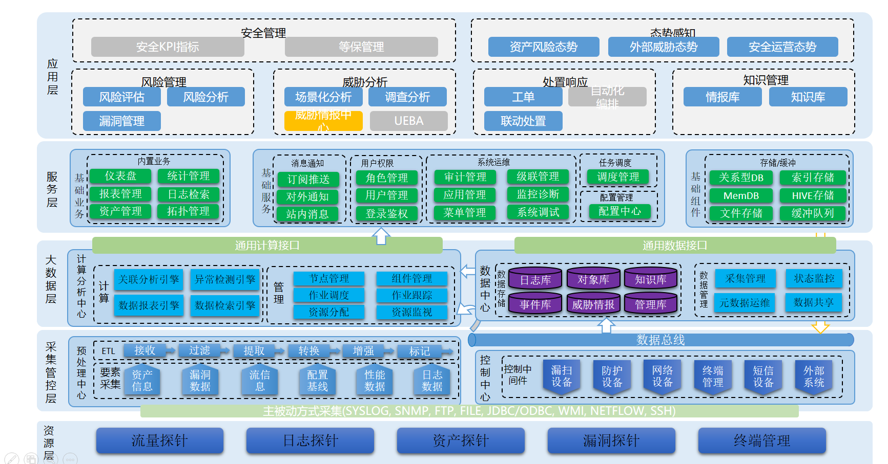


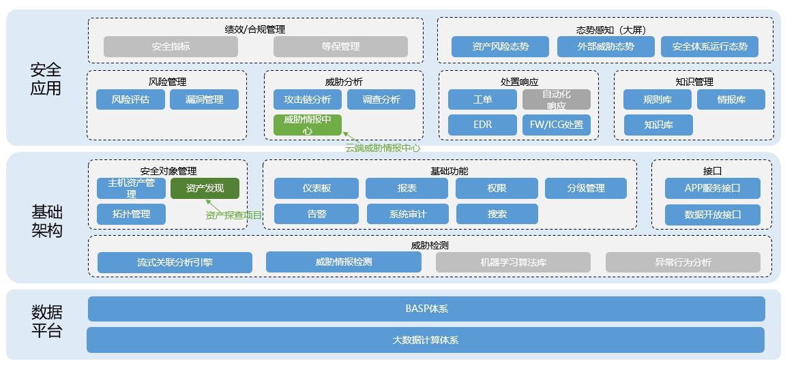

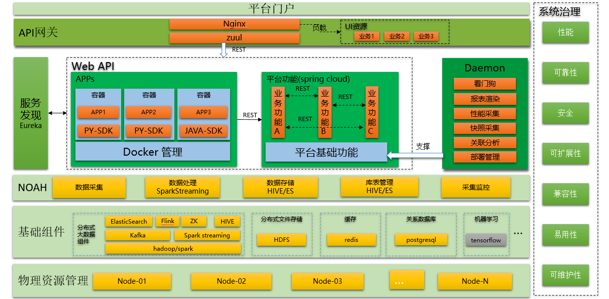

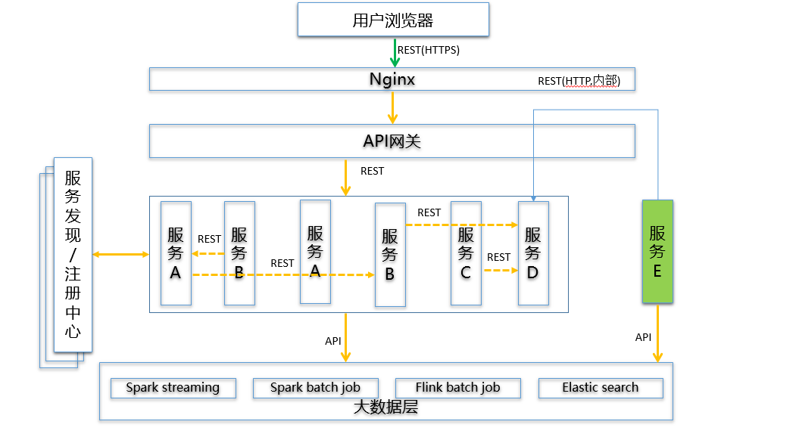


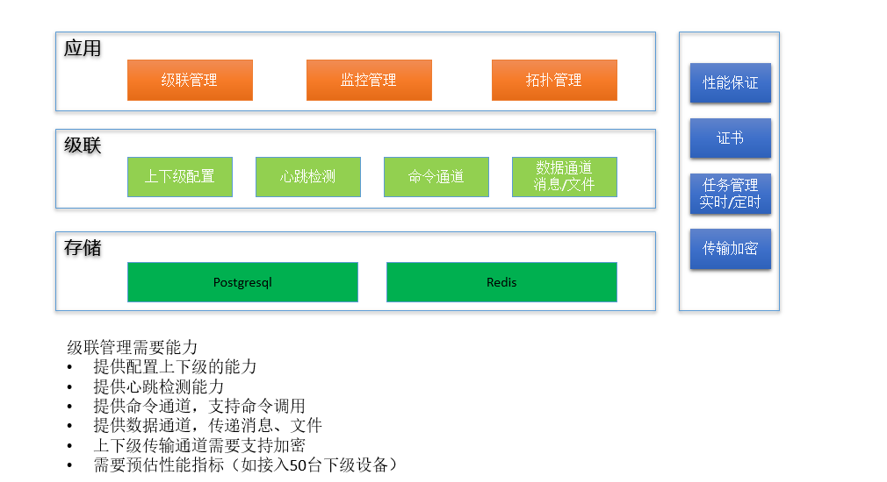


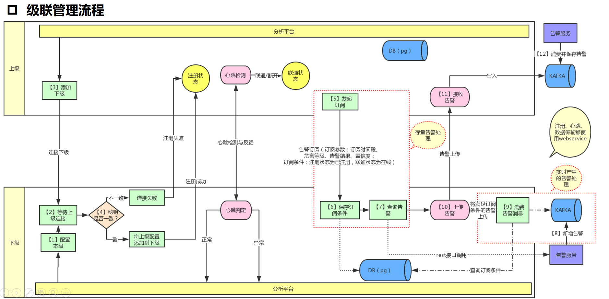


资产发现:

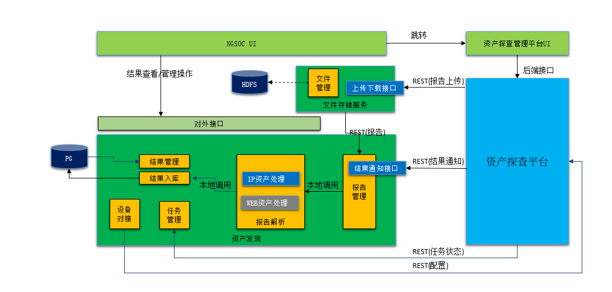

威胁告警架构

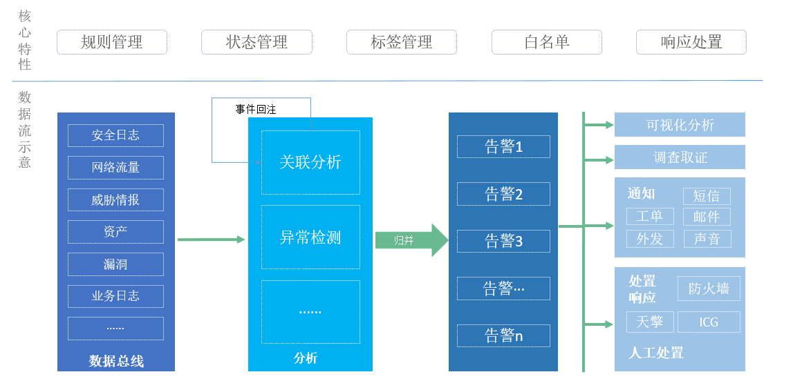

威胁告警数据:

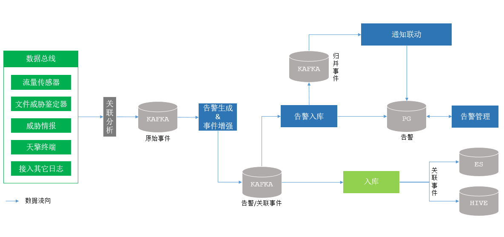


漏洞管理:

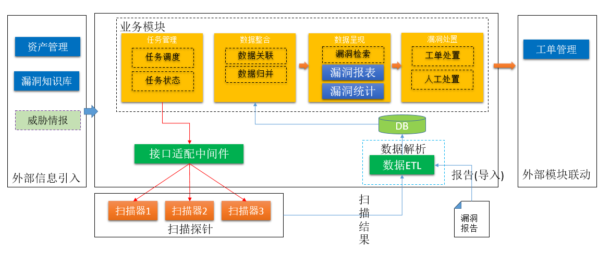

漏洞管理数据处理:

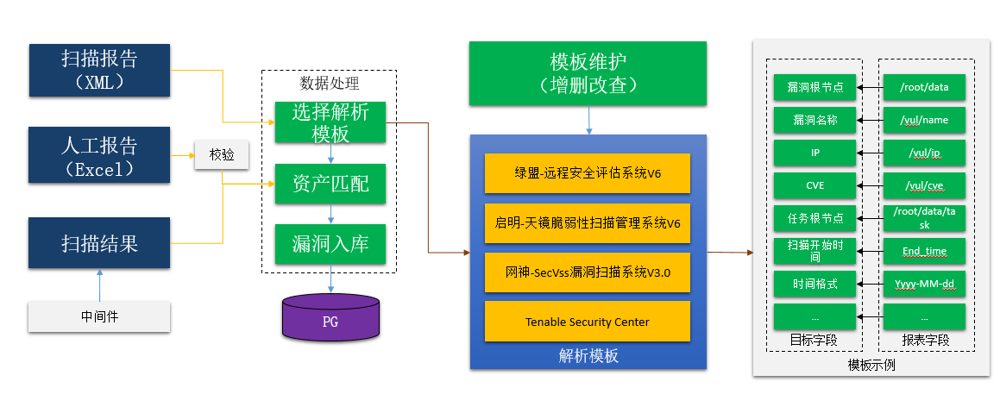

风险

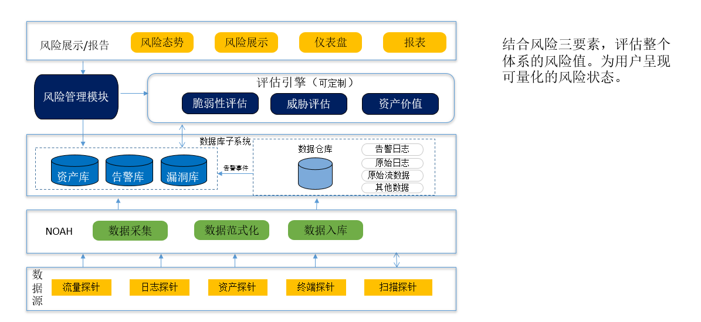

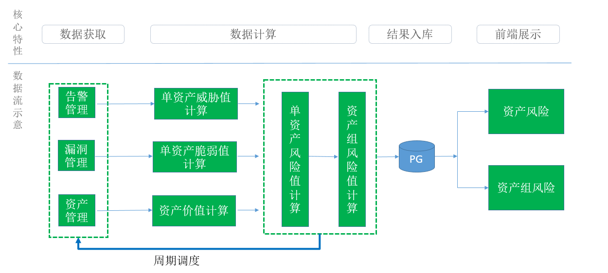


调查分析:

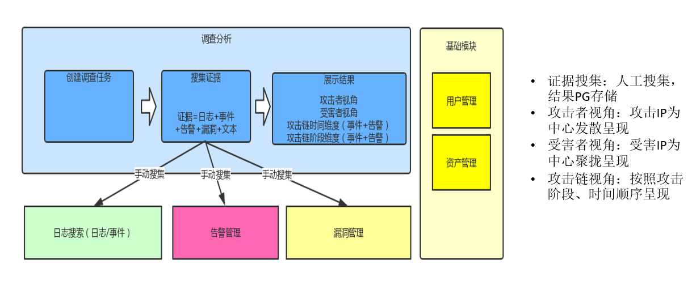

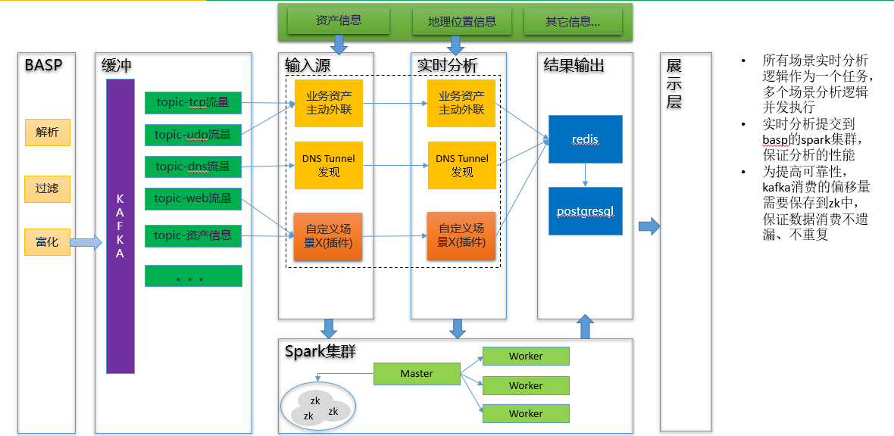

告警如何产生?

* 日志采集
* 配置对应规则解析
* 入库

-> 告警需要处置 、建议、显示状态

>  日志类型：防火墙日志、端安全管理系统日志、服务器日志、数据库日志、邮件系统日志


**工单模块是告警及漏洞的处置中心，可以将系统中的告警及漏洞分配给不同的责任人进行处置并对处置的进度及结果进行跟踪**。

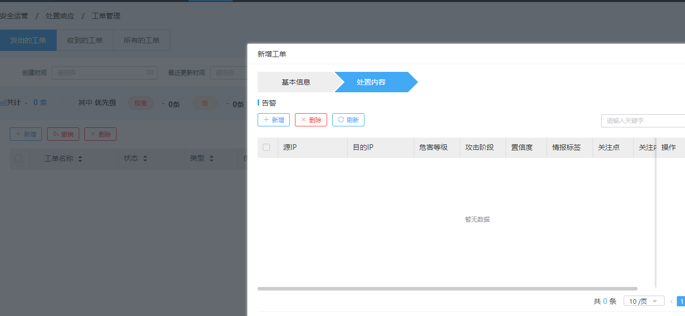


违规人员统计：跟资产IP挂钩，资产IP产生违规告警，则人员算违规人员。

资产包括接入单位中的所有资产数量，按资产类别统计：未知资产（即未在资产管理中注册的资产）、安全设备资产数量、网络设备资产数量、服务器资产数量、终端数量、其他。

安全运营态势大屏用于实时监控资产管理与日志采集、威胁检测与处理、规则运营与更新情况。


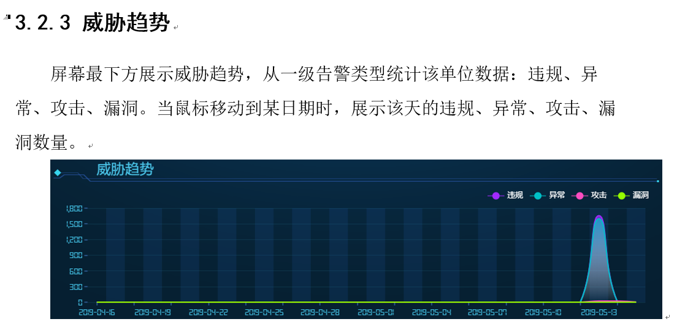

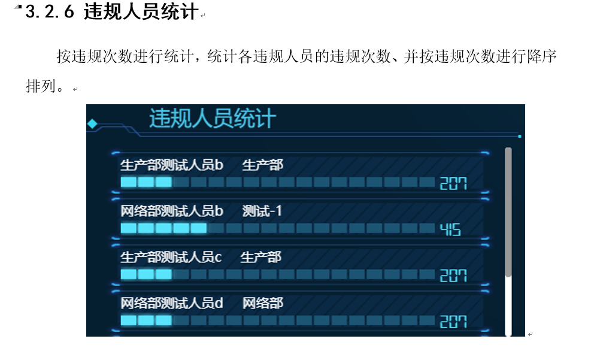


用户权限:


系统模块: 

资产、告警、日志检索、数据采集配置、人员、网段。

**告警类型统计全院数据：违规、异常、攻击、漏洞**

日志、报表、视图、处置、运营、

日志通过诺亚采集，得到不同的几种日志。包括tcp访问日志、dns日志、登陆日志。

这些日志会通过其他模块入库到ES中。

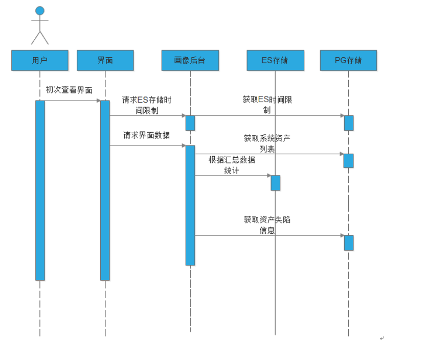

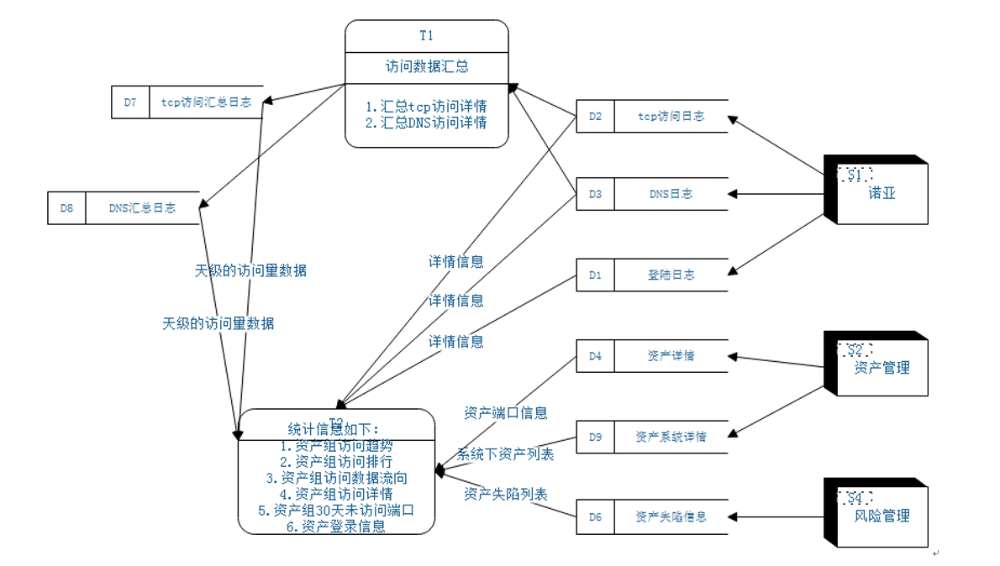

> NOAH大数据支撑平台设计为数据采集、处理、存储的基础数据处理平台。为分析型应用提供多源大数据的采集、处理、存储等基础能力，基于平台可以快速搭建业务分析应用，将开发人员的精力从基础的数据处理流程中解放出来，专注在业务开发中。

ES中主要字段内容:

```json
"dip" : "111.221.29.254",
"protocol" : "http",
"start_time" : 1565664986769,
"dport" : 443,
"occur_time" : 1565664988086,
"sip" : "10.74.156.13",
"end_time" : 1565664987133,
"sport" : 59346,
"sip" : "10.74.156.13",
"log_type" : "flow_tcp",
```

指定时间范围内该系统内所有资产的访问次数总和。

* 主查询维度：occur_time（发生时间）

* 统计方式：实时查询/异步查询

指定时间范围内的业务系统不同源IP访问次数，每个访问源IP都可以点击下钻，每次点会影响页面所有图形，主要影响维度为源IP。

* 主查询维度：sip（源IP）

* 统计维度：count计数

* 统计方式：实时查询/异步查询

> 资产名称/目的IP/端口/应用协议 检索 