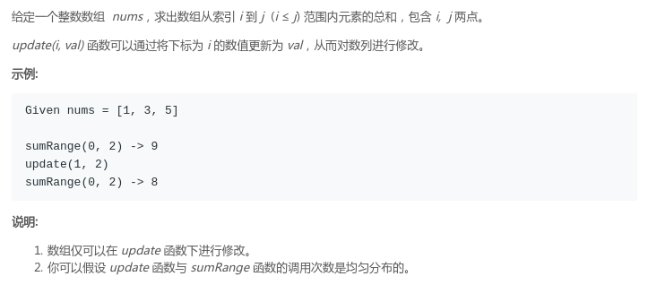
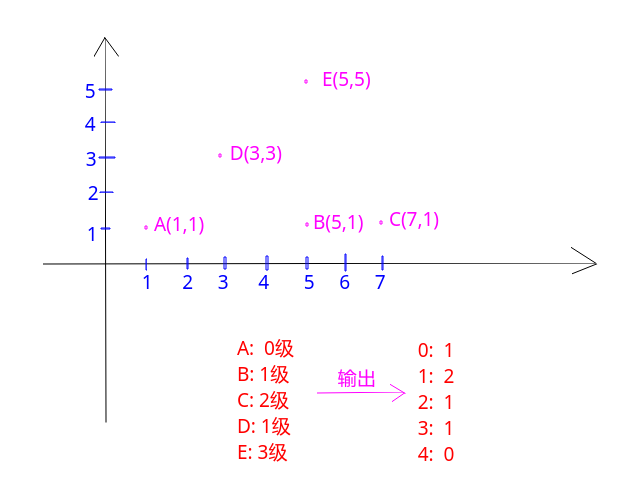

# ACM模板(Java) 

 - [大数](#大数)
 - [二分](#二分)
 - [枚举排列](#枚举排列)
 - [子集生成](#子集生成)
 - [n皇后](#n皇后)
 - [并查集](#并查集)
 - [树状数组](#树状数组)
 - [线段树](#线段树)
 - [KMP，Sunday，BM](#kmpsundaybm)
 - [01背包，完全背包](#01背包完全背包)
 - [最长(不)上升或下降子序列](#最长(不)上升或下降子序列)
 - [最长公共子序列](#最长公共子序列)
 - [拓扑排序](#拓扑排序)
 - [欧拉路径和回路](#欧拉路径和回路)
 - [搜索](#搜索)
 - [最小生成树](#最小生成树)
 - [最短路](#最短路)
 - [GCD和LCM](#gcd和lcm)
 - [埃拉托斯特尼筛法](#埃拉托斯特尼筛法)
 - [唯一分定理](#唯一分定理)
 - [扩展欧几里得](#扩展欧几里得)
 - [欧拉函数](#欧拉函数)
 - [快速幂](#快速幂)
 - [矩阵快速幂](#矩阵快速幂)
***
### 大数

加法，乘法模板 

```java
//题目链接 : http://poj.org/problem?id=2506
//题目大意 : 就是问你用2*1,1*2,2*2的砖拼成2*n的长方形,有多少种拼法
//解题思路 : 考虑n的时候,假设我们已经铺好了n-1块砖,第n块只能竖着放
            //假设我们已经铺好了n-2块砖,最后两列有3种方式,但是其中有一种方法和上面是相同的
            //所以f[n] = 2* f[n-2] + f[n-1] 
import java.io.*;
import java.util.*;

public class Main{

    //大数加法
    static String add(String str1, String str2){ 
        char[] s1 = str1.toCharArray();
        char[] s2 = str2.toCharArray();
        int n1 = s1.length, n2 = s2.length;
        int maxL = Math.max(n1, n2);
        int[] a = new int[maxL + 1];//注意a,b的数组大小都必须是maxL+1
        int[] b = new int[maxL + 1];
        for(int i = 0; i < n1; i++) a[i] = s1[n1 - i - 1] - '0';
        for(int i = 0; i < n2; i++) b[i] = s2[n2 - i - 1] - '0';
        for(int i = 0; i < maxL; i++){
            if(a[i] + b[i] >= 10){
                int tmp = a[i] + b[i];//注意一定要先抽取出来
                a[i] = tmp%10;
                a[i+1] += tmp/10;
            }else
                a[i] += b[i];
        }
        StringBuilder sb = new StringBuilder();
        if(a[maxL] != 0) sb.append((char)(a[maxL] + '0'));
        for(int i = maxL-1; i >= 0; i--) sb.append((char)(a[i] + '0'));
        return sb.toString();
    }

    // 大数乘法
    static String mul(String str1, String str2){
        char[] s1 = str1.toCharArray();
        char[] s2 = str2.toCharArray();
        int n1 = s1.length, n2 = s2.length;
        int[] a = new int[n1];
        int[] b = new int[n2];
        int[] c = new int[n1 + n2];
        for(int i = 0; i < n1; i++) a[i] = s1[n1 - i - 1] - '0';
        for(int i = 0; i < n2; i++) b[i] = s2[n2 - i - 1] - '0';
        for(int i = 0; i < n1; i++){
            for(int j = 0; j < n2; j++){
                c[i+j] += a[i] * b[j];
            }
        }
        for(int i = 0; i < n1 + n2 - 1; i++){
            if(c[i] >= 10){
                c[i+1] += c[i]/10;
                c[i] %= 10;
            }
        }
        int i;
        for(i = n1 + n2 - 1; i >= 0; i--) if(c[i] != 0) break;
        StringBuilder sb = new StringBuilder();
        for(; i >= 0; i--) sb.append( (char)(c[i] + '0'));
        return sb.toString();
    }

    public static void main(String[] args){
        Scanner in = new Scanner(new BufferedInputStream(System.in));
        PrintStream out = System.out;
        String[] s = new String[255];
        s[0] = "1"; s[1] = "1";
        for(int i = 2; i < 255; i++){
            String mul = mul("2", s[i-2]);
            s[i] = add(mul, s[i-1]);
        }
        while(in.hasNext()){
            int n = in.nextInt(); 
            out.println(s[n]);
        }
    }
}
```
求阶乘以及位数模板

```java
//http://nyoj.top/problem/28
//大数阶乘的模板
import java.io.*;
import java.util.*;

public class Main {
    //大数计算阶乘位数
    //lg(N!)=[lg(N*(N-1)*(N-2)*......*3*2*1)]+1 = [lgN+lg(N-1)+lg(N-2)+......+lg3+lg2+lg1]+1;
    static int factorialDigit(int n) {
        double sum = 0;
        for (int i = 1; i <= n; i++) {
            sum += Math.log10(i);
        }
        return (int) sum + 1;
    }

    //大数计算阶乘
    static String bigFactorial(int n) {
        int[] ans = new int[100001];
        int digit = 1;
        ans[0] = 1;
        for (int i = 2; i <= n; i++) {
            int num = 0;
            for (int j = 0; j < digit; j++) {
                int temp = ans[j] * i + num;
                ans[j] = temp % 10;
                num = temp / 10;
            }
            while (num != 0) {
                ans[digit] = num % 10;
                num /= 10;
                digit++;
            }
        }
        StringBuilder sb = new StringBuilder();
        for (int i = digit - 1; i >= 0; i--)
            sb.append( (char)(ans[i] + '0'));
        return sb.toString();
    }


    public static void main(String[] args) {
        Scanner in = new Scanner(new BufferedInputStream(System.in));
        PrintStream out = System.out;
        while(in.hasNext()){
            int n = in.nextInt();
            out.println(bigFactorial(n));
        }
    }
}
```

***
### 枚举排列

非去重写法:

```java
import java.io.*;
import java.util.*;

/**
 * 求 1 ~ n 的全排列，arr数组作为中间打印数组
 */
public class Main {

    static PrintStream out = System.out;

    static int n;

    static void permutation(int[] arr, int cur){
        if(cur == n){  // 边界
            for(int i = 0; i < n; i++)
                out.print(arr[i] + " ");
            out.println();
        }
        else for(int i = 1; i <= n; i++){  //尝试在arr[cur]中填充各种整数 (1~n)
            boolean flag = true;
            for(int j = 0; j < cur; j++)if(i == arr[j]){  // 如果i已经在arr[0]~arr[cur-1]中出现过，则不能选
                flag = false;
                break;
            }
            if(flag){
                arr[cur] = i;  //把i填充到当前位置
                permutation(arr, cur+1);
            }
        }
    }

    public static void main(String[] args) {
        Scanner in = new Scanner(new BufferedInputStream(System.in));
        n = in.nextInt();
        permutation(new int[n], 0);
    }
}
```

经典写法

```java
//全排列的非去重递归算法
public class Main {

    static PrintStream out = System.out;

    static int n;

    static void permutation(int arr[], int cur){
        if( cur == n){
            for(int i = 0; i < n; i++)
                out.print(arr[i] + " ");
            out.println();
        } else for(int i = cur; i < n; i++){
            swap(arr, i, cur);
            permutation(arr, cur+1);
            swap(arr, i, cur);
        }
    }
    static void swap(int[] arr, int a, int b){
        int t = arr[a];
        arr[a] = arr[b];
        arr[b] = t;
    }

    public static void main(String[] args) {
        Scanner in = new Scanner(new BufferedInputStream(System.in));

        n = in.nextInt();
        int[] arr = new int[n];
        for(int i = 0; i < n; i++) arr[i] = in.nextInt();
        permutation(arr, 0);
    }
}
```
***
### 子集生成
增量构造法，位向量法，二进制法(常用)

```cpp
public class Main {

    static PrintStream out = System.out;

    static int n;
    //打印0~n-1的所有子集
    //按照递增顺序就行构造子集 防止子集的重复
    static void print_subset(int[] arr, int cur){
        for(int i = 0; i < cur; i++)
            out.print(arr[i] + " ");
        out.println();
        int s = cur != 0 ? arr[cur-1] + 1 : 0;  //确定当前元素的最小可能值
        for(int i = s; i < n; i++){
            arr[cur] = i;
            print_subset(arr, cur+1);
        }
    }

    public static void main(String[] args) {
        Scanner in = new Scanner(new BufferedInputStream(System.in));
        n = in.nextInt();
        print_subset(new int[n],0);
    }
}
```

这个其实很简单，就是枚举每个位置`0`和`1`两种情况即可。
```cpp
/**
 * 1~n 的所有子集：位向量法
 */
public class Main {

    static PrintStream out = System.out;

    static boolean[] bits; //位向量bits[i] = 1,当且仅当i在子集 A 中

    static int n;

    static void print_subset(int cur) {
        if (cur == n+1) {
            for (int i = 1; i < cur; i++)
                if (bits[i])
                    out.print(i + " ");
            out.println();
            return;
        }
        bits[cur] = true;
        print_subset(cur + 1);
        bits[cur] = false;
        print_subset(cur + 1);
    }

    public static void main(String[] args) {
        Scanner in = new Scanner(new BufferedInputStream(System.in));
        n = in.nextInt();
        bits = new boolean[n + 1];
        print_subset(1);
    }
}
```
二进制枚举子集用的多，这里举个例子 `n = 3`；则要枚举`0 - 7` 对应的是有`7`个子集，每个子集去找有哪些元素`print_subset`中的 `1<<   i `，也就是对应的那个位置是有元素的，例如`1`的二进制是`0001`也就是代表`0`位置有元素，`0010`是`2`，代表第一个位置是`1`，`0100`代表第`2`个位置上有元素，相应的`1000 = 8`对应第`3`个位置上有元素。
总结来说也就是对应`1<< i`对应` i`上是`1`(从`0`开始)，其余位置是`0`。看图容易理解：


代码:

```java
// 0 ~ n-1的所有子集：二进制法枚举0 ~ n-1的所有子集
public class Main {
    public static void main(String[] args) {
        Scanner in = new Scanner(new BufferedInputStream(System.in));
        int n = in.nextInt();
        for(int mask = 0; mask < (1 << n); mask++){
            for(int i = 0; i < n; i++)
                if( ((mask >> i) & 1) == 1)  //和下面一样
//                if( ((1 << i) & mask) != 0)
                    System.out.print(i + " ");
            System.out.println();
        }
    }
}
```
### n皇后回溯

求解个数:

```java
import java.io.*;
import java.util.*;

public class Main {

    static PrintStream out = System.out;
    static int n, count;
    static boolean[] cols, d1, d2; // cols[i]代表的是 第i行的第cols列已经有了

    static void dfs(int r){  // 当前是r行
        if(r == n){
            count++;
        }else {
            for(int c = 0; c < n; c++){ //考察的是每一列
                int id1 = r + c;   //主对角线
                int id2 = r - c + n - 1; // 副对角线
                if(cols[c] || d1[id1] || d2[id2]) continue;
                cols[c] = d1[id1] = d2[id2] = true;
                dfs(r+1);
                cols[c] = d1[id1] = d2[id2] = false;
            }
        }
    }

    public static void main(String[] args) {
        Scanner in = new Scanner(new BufferedInputStream(System.in));
        n = in.nextInt();
        cols = new boolean[n];
        d1 = new boolean[n * 2 - 1];
        d2 = new boolean[n * 2 - 1];
        dfs(0);
        out.println(count);
    }
}
```

可以将三个数组合成一个第一维 = 3的二维数组，同时再用一个整形`cols`记录解:

```java
import java.io.*;
import java.util.*;

public class Main {

    static PrintStream out = System.out;
    static int n, count;
    static boolean[][] vis;
    static int[] cols;

    static void dfs(int r) {  //逐行放置皇后
        if (r == n) {
            count++;
            for (int i = 0; i < n; i++) {
                for (int j = 0; j < n; j++) {
                    if (cols[i] == j)
                        out.print("0 ");
                    else
                        out.print(". ");
                }
                out.println();
            }
            out.println("--------------");
        } else for (int c = 0; c < n; c++) {   //尝试在 cur行的 各 列 放置皇后
            if (vis[0][c] || vis[1][r + c] || vis[2][r - c + n - 1]) continue;//判断当前尝试的皇后的列、主对角线
            vis[0][c] = vis[1][r + c] = vis[2][r - c + n - 1] = true;
            cols[r] = c;     //r行的列是 c
            dfs(r + 1);
            vis[0][c] = vis[1][r + c] = vis[2][r - c + n - 1] = false;//切记！一定要改回来
        }
    }

    public static void main(String[] args) {
        Scanner in = new Scanner(new BufferedInputStream(System.in));
        n = in.nextInt();
        cols = new int[n];
        vis = new boolean[3][2 * n - 1];
        dfs(0);
        out.println(count);
    }
}
```

第二种写法(效率没有上的好):

```java
import java.io.*;
import java.util.*;

public class Main {

    static PrintStream out = System.out;
    static int n, count;
    static int[] cols;

    static void dfs(int r){  // 当前是r行
        if(r == n){
            count++;
            for(int i = 0; i < n; i++){
                for(int j = 0; j < n; j++){
                    if(cols[i] == j)
                        out.print("0 ");
                    else
                        out.print(". ");
                }
                out.println();
            }
            out.println("-------------------");
        }else {
            for(int c = 0; c < n; c++){ // 考察的是每一列
                cols[r] = c; // 尝试将 r行的皇后放在第c列
                boolean ok = true;
                for(int i = 0; i < r; i++) { //检查是否和已经放置的冲突
                    //检查列,"副对角线","主对角线"
                    if (cols[r] == cols[i] || r - i  == cols[r] - cols[i] || r - i == cols[i] - cols[r]){
                        ok = false;
                        break;
                    }
                }
                if(ok) dfs(r+1);
            }
        }
    }

    public static void main(String[] args) {
        Scanner in = new Scanner(new BufferedInputStream(System.in));
        n = in.nextInt();
        cols = new int[n];
        dfs(0);
        out.println(count);
    }
}
```

### 并查集
并查集。

基于高度`rank`版本的。

```cpp
//题目连接 : http://poj.org/problem?id=1611
//题目大意 : 病毒传染，可以通过一些社团接触给出一些社团(0号人物是被感染的)问有多少人(0~n-1个人)被感染
import java.io.*;
import java.util.*;

public class Main {

    static int[] f;
    static int[] rank;

    static int findRoot(int p) {
        while (p != f[p]) {
            f[p] = f[f[p]];
            p = f[p];
        }
        return p;
    }

    static void union(int a, int b) {
        int aR = findRoot(a);
        int bR = findRoot(b);
        if (aR == bR) return;
        if (rank[aR] < rank[bR]) {
            f[aR] = f[bR];
        } else if (rank[aR] > rank[bR]) {
            f[bR] = f[aR];
        } else {
            f[aR] = f[bR];
            rank[bR]++;
        }
    }

    public static void main(String[] args) {
        Scanner in = new Scanner(new BufferedInputStream(System.in));
        PrintStream out = System.out;
        while (in.hasNext()) {
            int n = in.nextInt();
            int m = in.nextInt();
            if(n == 0 && m == 0) break;
            f = new int[n];
            rank = new int[n];
            for(int i = 0; i < n; i++) {
                f[i] = i;
                rank[i] = 1;
            }
            for(int i = 0; i < m; i++){
                int c = in.nextInt();
                int root = in.nextInt();
                for(int j = 0; j < c - 1; j++) {
                    int num = in.nextInt();
                    union(root, num);
                }
            }
            int res = 1; // 0已经感染
            for(int i = 1; i < n; i++) if(findRoot(0) == findRoot(i)) res++;
            out.println(res);
        }
    }
}
```
基于集合大小`size`版本的。

```java
import java.io.*;
import java.util.*;

public class Main {

    static int[] f;
    static int[] sz; // size

    static int findRoot(int p) {
        while (p != f[p]) {
            f[p] = f[f[p]];
            p = f[p];
        }
        return p;
    }

    // 将元素个数少的集合合并到元素个数多的集合上
    static void union(int a, int b) {
        int aR = findRoot(a);
        int bR = findRoot(b);
        if (aR == bR) return;
        if (sz[aR] < sz[bR]) {
            f[aR] = f[bR];
            sz[bR] += sz[aR]; // 更新集合元素个数
        }else{
            f[bR] = f[aR];
            sz[aR] += sz[bR];
        }
    }

    public static void main(String[] args) {
        Scanner in = new Scanner(new BufferedInputStream(System.in));
        PrintStream out = System.out;
        while (in.hasNext()) {
            int n = in.nextInt();
            int m = in.nextInt();
            if(n == 0 && m == 0) break;
            f = new int[n];
            sz = new int[n];
            for(int i = 0; i < n; i++) {
                f[i] = i;
                sz[i] = 1;
            }
            for(int i = 0; i < m; i++){
                int c = in.nextInt();
                int root = in.nextInt();
                for(int j = 0; j < c - 1; j++) {
                    int num = in.nextInt();
                    union(root, num);
                }
            }
            int res = 1; // 0已经感染
            for(int i = 1; i < n; i++) if(findRoot(0) == findRoot(i)) res++;
            out.println(res);
        }
    }
}
```

### 树状数组

[**LeetCode - 307. Range Sum Query - Mutable**](https://leetcode.com/problems/range-sum-query-mutable/)例题:

题目:



树状数组代码:

```java
class NumArray {

    private int[] sums;// 树状数组中求和的数组
    private int[] data;//真实存放数据的数组
    private int n;

    private int lowbit(int x) {return x & (-x);}

    private int query(int i){
        int s = 0;
        while(i > 0){//树状数组中索引是1~n
            s += sums[i];
            i -= lowbit(i);
        }
        return s;
    }

    // fenWick update
    private void renewal(int i, int delta){// delta是增量，不是新值
        while(i <= n){//树状数组中索引是1~n
            sums[i] += delta;
            i += lowbit(i);
        }
    }

    public NumArray(int[] nums) {
        n = nums.length;
        sums = new int[n+1];
        data = new int[n];s
        for(int i = 0; i < n; i++) {
            data[i] = nums[i];
            renewal(i+1, nums[i]);
        }
    }

    public void update(int i, int val) {
        renewal(i+1, val - data[i]);
        data[i] = val;
    }

    public int sumRange(int i, int j) {
        return query(j+1) - query(i);
    }
}
```

再看一个例题[**POJ - 2352. Stars**](http://poj.org/problem?id=2352)

题目意思就是给你一些星星的坐标，每个星星的级别是他左下方的星星的数量，要你求出各个级别的星星有多少个，看样例就懂了。



题目中一个重要的信息就是输入**是按照`y`递增，如果`y`相同则`x`递增的顺序**给出的，所以，对于第`i`颗星星，它的`level`就是之前出现过的星星中，横坐标小于等于`i`的星星的数量。这里用树状数组来记录所有星星的`x`值。

代码中有个小细节就是`x++`这是因为`lowbit`不能传值为`0`，否则会陷入死循环。

```cpp															     
import java.io.*;
import java.util.*;

public class Main {

    static PrintStream out = System.out;

    static class FastReader {
        public BufferedReader br;
        public StringTokenizer token;

        public FastReader(InputStream in) {
            br = new BufferedReader(new InputStreamReader(in), 32768);
            token = null;
        }

        public String next() {
            while (token == null || !token.hasMoreTokens()) {
                try {
                    token = new StringTokenizer(br.readLine());
                } catch (IOException e) {
                    throw new RuntimeException(e);
                }
            }
            return token.nextToken();
        }

        public int nextInt() {
            return Integer.parseInt(next());
        }
    }

    static int[] sums; // 注意树状数组中 索引从1开始

    static int n;

    static int lowbit(int x) {
        return x & (-x);
    }

    static int query(int i) {
        int res = 0;
        while (i > 0) {
            res += sums[i];
            i -= lowbit(i);
        }
        return res;
    }

    // delta是增量， 不是新值
    static void update(int i, int delta) {
        while (i <= 32010) {   //注意这里是最大的x,没有记录所以用 32010,不能用n
            sums[i] += delta;
            i += lowbit(i);
        }
    }

    // write code
    static void solve(InputStream stream) {
        FastReader in = new FastReader(stream);
        n = in.nextInt();
        sums = new int[32010]; // 用x作为索引
        int[] level = new int[n];
        for (int i = 1; i <= n; i++) {
            int x = in.nextInt() + 1; //防止 x == 0的情况，lowbit会陷入死循环
            int y = in.nextInt();
            level[query(x)]++; // 求的是左边的和, 然后这个和就是一个级别，这个级别多了一个
            update(x, 1);// 从x向上都+1
        }
        for (int i = 0; i < n; i++) System.out.println(level[i]);
    }

    public static void main(String[] args) {
        solve(System.in);
    }
}
```
***
### 线段树

例题和上一个一样，[**LeetCode - 307. Range Sum Query - Mutable**](https://leetcode.com/problems/range-sum-query-mutable/): 线段树可以用数组来写，也可以用树引用来写。

数组方式

```java
class NumArray {

    class SegTree {

        int[] tree;
        int[] data;

        public SegTree(int[] arr) {
            data = new int[arr.length];
            for (int i = 0; i < arr.length; i++) data[i] = arr[i];
            tree = new int[4 * arr.length];   //最多需要4 * n
            buildTree(0, 0, arr.length - 1);
        } 
  
        public void buildTree(int treeIndex, int start, int end) {
            if (start == end) {
                tree[treeIndex] = data[start];
                return; 
            } 
            int treeLid = treeIndex * 2 + 1; 
            int treeRid = treeIndex * 2 + 2;  
            int m = start + (end - start) / 2;
            buildTree(treeLid, start, m);
            buildTree(treeRid, m + 1, end);
            tree[treeIndex] = tree[treeLid] + tree[treeRid]; //区间求和
        }

        public int query(int qL, int qR) {
            if (qL < 0 || qL >= data.length || qR < 0 || qR >= data.length || qL > qR) return -1;
            return query(0, 0, data.length - 1, qL, qR);
        } 
 
        private int query(int treeIndex, int start, int end, int qL, int qR) {
            if (start == qL && end == qR) {
                return tree[treeIndex];
            }   
            int mid = start + (end - start) / 2;
            int treeLid = treeIndex * 2 + 1;
            int treeRid = treeIndex * 2 + 2; 

            if (qR <= mid) { //和右区间没关系 ,直接去左边查找 [0,4]  qR <= 2 [0,2]之间查找
                return query(treeLid, start, mid, qL, qR);
            } else if (qL > mid) {//和左区间没有关系，直接去右边查找 [0,4] qL > 2  --> [3,4]
                return query(treeRid, mid + 1, end, qL, qR);
            } else {         //在两边都有，查询的结果  合并
                return query(treeLid, start, mid, qL, mid) + //注意是查询 [qL,m]
                        query(treeRid, mid + 1, end, mid + 1, qR);   //查询[m+1,qR]
            }
        }

        public void update(int index, int val) {
            data[index] = val; //首先修改data
            update(0, 0, data.length - 1, index, val);
        }
  
        private void update(int treeIndex, int start, int end, int index, int val) {
            if (start == end) {
                tree[treeIndex] = val; // 最后更新
                return; 
            } 
            int m = start + (end - start) / 2; 
            int treeLid = 2 * treeIndex + 1; 
            int treeRid = 2 * treeIndex + 2;
            if (index <= m) { //左边
                update(treeLid, start, m, index, val);
            } else {
                update(treeRid, m + 1, end, index, val);
            }
            tree[treeIndex] = tree[treeLid] + tree[treeRid]; //更新完左右子树之后，自己受到影响，重新更新和
        }
    }

    private SegTree segTree;

    public NumArray(int[] nums) {
        if (nums == null || nums.length == 0) return;
        segTree = new SegTree(nums);
    }

    public void update(int i, int val) {
        segTree.update(i, val);
    }

    public int sumRange(int i, int j) {
        return segTree.query(i, j);
    }
}
```

树的引用的代码:

```java
class SegNode{
    int start; // 表示的区间的左端点
    int end;   // 表示区间的右端点 , 当start == end的时候就只有一个元素
    int sum;
    SegNode left;
    SegNode right;

    public SegNode(int start, int end, int sum, SegNode left, SegNode right) {
        this.start = start;
        this.end = end;
        this.sum = sum;
        this.left = left;
        this.right = right;
    }
}

class NumArray {

    SegNode root;
    int[] arr;

    private SegNode buildTree(int s, int e){
        if(s == e)
            return new SegNode(s, e, arr[s], null, null);
        int mid = s + (e - s) / 2;
        SegNode L = buildTree(s, mid);
        SegNode R = buildTree(mid+1, e);
        return new SegNode(s, e, L.sum + R.sum, L, R);
    }

    private void update(SegNode node, int i, int val){
        if(node.start == node.end && node.start == i){
            node.sum = val;
            return;
        }
        int mid = node.start + (node.end - node.start) / 2;
        if(i <= mid)
            update(node.left, i, val);
        else
            update(node.right, i, val);
        node.sum = node.left.sum + node.right.sum; // 记得下面的更新完之后，更新当前的和
    }

    private int query(SegNode node, int i, int j){
        if(node.start == i && node.end == j)
            return node.sum;
        int mid = node.start + (node.end - node.start) / 2;
        if(j <= mid){ // 区间完全在左边
            return query(node.left, i, j);
        }else if(i > mid) { // 区间完全在右边
            return query(node.right, i, j);
        }else {
            return query(node.left, i, mid) + query(node.right, mid+1, j);
        }
    }

    public NumArray(int[] nums) {
        arr = new int[nums.length];
        for(int i = 0; i < nums.length; i++) arr[i] = nums[i];
        if(nums.length != 0) 
            root = buildTree(0, nums.length-1);
    }

    public void update(int i, int val) {
        arr[i] = val;
        update(root, i, val);
    }

    public int sumRange(int i, int j) {
        return query(root, i, j);
    }
}
```

### KMP，Sunday，BM

这三个算法解决的问题都是 : <font color = red>有一个文本串 S，和一个模式串 P，现在要查找 P 在 S 中的位置</font>，三种算法的思路这里限于篇幅不多说，[这篇博客](http://wiki.jikexueyuan.com/project/kmp-algorithm/define.html)对着三种算法讲解的比较详细。
**`KMP`的较直观的分析也可以看看[我的另一篇博客](https://blog.csdn.net/zxzxzx0119/article/details/81430392)**

```cpp

```

//题目连接 : http://acm.hdu.edu.cn/showproblem.php?pid=1711
//题目大意 : 找第二个数组在第一个数组中出现的位置，如果不存在，输出-1

```cpp
#include <stdio.h>

const int maxn = 1000000 + 10;

int n,m,a[maxn], b[10000 + 10],nexts[10000 + 10];

void getNext(int *p,int next[]) {   //优化后的求next数组的方法 

    int len = m;

    next[0] = -1;    //next 数组中的 最大长度值(前后缀的公共最大长度) 的第一个 赋值为  -1  

    int k = -1,j = 0;

    while (j < len - 1) {

        if (k == -1 || p[j] == p[k]) { //p[k]表示前缀 p[j] 表示后缀

            k++; j++;

            if(p[j] != p[k])next[j] = k;

            else next[j] = next[k];   //因为不能出现p[j] = p[ next[j ]]，所以当出现时需要继续递归，k = next[k] = next[next[k]]

        }

        else k = next[k];

    }

}

int KMPSerach(int *s, int *p) {

    int sLen = n,pLen = m;

    int i = 0, j = 0;

    while (i < sLen && j < pLen) {

        if (j == -1 || s[i] == p[j])i++, j++;

        else j = nexts[j];

    }

    if (j == pLen)return i - j;

    else return -1;

}

int main() {

    int T;

    scanf("%d", &T);

    while (T--) {

        scanf("%d%d", &n, &m);

        for(int i = 0; i < n; i++)scanf("%d", &a[i]);

        for(int i = 0; i < m; i++)scanf("%d", &b[i]);

        getNext(b,nexts); //获取next数组

        int ans = KMPSerach(a, b);

        if (ans != -1)printf("%d\n", ans + 1);

        else printf("-1\n");

    }

    return 0;

}

```

**`BM`算法，主要是根据两个规则去执行**

​```cpp
//题目链接：http://acm.hrbust.edu.cn/index.php?m=ProblemSet&a=showProblem&problem_id=1551
//题目大意：找一串字符中是否出现"bkpstor"这段字符

#include <stdio.h>
#include <string.h>
#include <algorithm>
using namespace std;
const int maxn = 1000;

int last(char *p, char c) { //找到文本串的  "坏字符"  在模式串中的位置
    for (int i = strlen(p) - 1; i >= 0; i--)if (p[i] == c)return i;
    return -1;
}

int BM_index(char *T, char *p) {
    int n = strlen(T);
    int m = strlen(p);
    int i = m - 1, j = m - 1;
    while (i <= n - 1) {
        if (T[i] == p[j])
            if (j == 0)return i;
            else i--, j--;
        else {
            i = i + m - min(j, 1 + last(p, T[i]));//文本的不符合的那个 位置 串移动的步数
            j = m - 1;//模式串的新位置
        }
    }
    return -1;
}

int Sum(char *T, char *P, int s) {//输出文本串中包含模式串的数量
    int e = BM_index(T + s, P);
    return e == -1 ? 0 : 1 + Sum(T, P, s + e + 1);
}

//测试数据 : 123bkpstor456bkpstor67  
int main() {
    char s[maxn];
    while (~scanf("%s",s)) {
        int cnt = BM_index(s, "bkpstor");
        //printf("%d\n",Sum(s,"bkpstor",0));出现次数输出2
        if (cnt == -1)printf("Safe\n");
        else printf("Warning\n");
    }
    return 0;
}
```
`Sunday`算法也是两个规则


​```cpp
//题目链接：http://acm.hrbust.edu.cn/index.php?m=ProblemSet&a=showProblem&problem_id=1551
//题目大意: 找一串字符中是否出现"bkpstor"这段字符
#include <stdio.h>
#include <string.h>
#include <algorithm>
const int maxn = 1000;
using namespace std;

int last(char *p, char c) {
    for (int i = strlen(p) - 1; i >= 0; i--)if (p[i] == c)return i;
    return -1;
}

int Sunday(char *s, char *p) {
    int sLen = strlen(s);
    int pLen = strlen(p);
    int i = 0, j = 0;
    while (i < sLen && j < pLen) {
        if (s[i] == p[j])i++, j++;
        else {
            int index = i + pLen - j;   // 字符串中右端对齐的字符
            if (last(p, s[index]) == -1) { i = index + 1; j = 0; }  //  没有在匹配串中出现则直接跳过
            else {
                i = index - last(p, s[index]); j = 0; //否则  其移动步长 = 匹配串中最  右端  的该字符到末尾的距离 + 1。
            }
        }
    }
    if (j == pLen)return i - j;
    return -1;
}

int main() {
    char s[maxn];
    while (~scanf("%s",s)) {
        int cnt = Sunday(s,"bkpstor");
        if (cnt == -1)printf("Safe\n");
        else printf("Warning\n");
    }
    return 0;
}

```
***
### <font id = "9">01背包，完全背包

背包问题可以分为很多种，这里只简单讨论`01`背包和完全背包，
**后来改写的`01`背包: [博客](https://blog.csdn.net/zxzxzx0119/article/details/82530940)**
参考博客：

https://blog.csdn.net/liusuangeng/article/details/38374405（很详细）
https://blog.csdn.net/xp731574722/article/details/70766804
https://blog.csdn.net/na_beginning/article/details/62884939#reply
https://blog.csdn.net/u013445530/article/details/40210587

```cpp
//题目连接 : http://acm.hdu.edu.cn/showproblem.php?pid=2602
#include <stdio.h>
#include <string.h>
#include <algorithm>
using namespace std;
const int maxn = 1000+5;
int w[maxn],v[maxn],dp[maxn][maxn],vis[maxn];

//打印解
void print(int n,int C){
    for(int i = n; i > 1; i--){
        if(dp[i][C] == dp[i-1][C-w[i]] + v[i]){
            vis[i] = 1;
            C -= w[i];
        }
    }
    vis[1] = (dp[1][C] > 0) ? 1: 0;
}

int main(){
    freopen("in.txt","r",stdin);
    int n,C,T;
    scanf("%d",&T);
    while(T--){
        scanf("%d%d",&n,&C);
        for(int i = 1;i <= n; i++) scanf("%d",&v[i]);
        for(int i = 1;i <= n; i++) scanf("%d",&w[i]);
        memset(dp,0,sizeof(dp)); //dp[0][0~C]和dp[0~N][0]都为0，前者表示前0个物品无论装入多大的包中总价值都为0，后者表示体积为0的背包都装不进去。
        memset(vis,0,sizeof(vis));
        for(int i = 1; i <= n; i++){
            for(int j = 0;j <= C; j++){
                dp[i][j] = dp[i-1][j];  //如果j不大于v[i]的话就dp[i][j] = dp[i-1][j];
                if(j >= w[i])  dp[i][j] = max(dp[i][j],dp[i-1][j-w[i]]+v[i]);
            }
        }
        printf("%d\n",dp[n][C]); //n个物品装入C容量的包能获得的最大价值
        //print(n,C);
        //for(int i = 1; i <= n; i++)if(vis[i])printf("%d ",i); //输出选中的物品
    }
    return 0;
}
```

```cpp
#include <stdio.h>
#include <algorithm>
#include <string.h>
const int maxn = 1000+5;
using namespace std;

int w[maxn],v[maxn],dp[maxn][maxn];

int main(){
    int T,n,C;
    scanf("%d",&T);
    while(T--){
        scanf("%d%d",&n,&C);
        for(int i = 1; i <= n; i++)scanf("%d",&v[i]);
        for(int i = 1; i <= n; i++)scanf("%d",&w[i]);
        memset(dp,0,sizeof(dp));  //dp全部初始化为0
        for(int i = n;i >= 1; i--){
            for(int j = 0; j <= C; j++){
                dp[i][j] = (i == n ? 0 : dp[i+1][j]);
                if(j >= w[i])dp[i][j] = max(dp[i][j],dp[i+1][j-w[i]]+v[i]);
            }
        }
        printf("%d\n",dp[1][C]);
    }
    return 0;
}
```

```cpp
#include <stdio.h>
#include <algorithm>
#include <string.h>
const int maxn = 1000+5;
using namespace std;

int w[maxn],v[maxn],dp[maxn];

int main(){
    int T,n,C;
    scanf("%d",&T);
    while(T--){
        scanf("%d%d",&n,&C);
        for(int i = 1; i <= n; i++)scanf("%d",&v[i]);
        for(int i = 1; i <= n; i++)scanf("%d",&w[i]);
        memset(dp,0,sizeof(dp));
        for(int i = 1; i <= n; i++){
            for(int j = C;j >= 0; j--){
                if(j >= w[i])dp[j] = max(dp[j],dp[j-w[i]]+v[i]);
            }
        }
        printf("%d\n",dp[C]);
    }
    return 0;
}
```

完全背包和`01`背包的差别在于<font color = red>每个物品的数量有无数个，在考虑第`i`件物品的时候，不是考虑选不选这件，而是选多少件可以达到最大价值


```cpp
for (int i = 1; i < n; i++){
    for (int j = 1; j <= v; j++){
        for (int k = 0; k*c[i] <= j; k++){
　　       if(c[i] <= j) dp[i][j] = max{dp[i-1][j],dp[i-1][j - k * c[i]] + k * w[i]};/*要么不取，要么取0件、取1件、取2件……取k件*/
　  　     else dp[i][j] = dp[i-1][j]/*继承前i个物品在当前空间大小时的价值*/
        }
    }   
}
```

优化:

注意完全背包的顺序问题 ：因为每种背包都是无限的。当我们把i从1到N循环时，dp[v]表示容量为v在前i种背包时所得的价值，这里我们要添加的不是前一个背包，而是当前背包。所以我们要考虑的当然是当前状态。为01背包中要按照v=V..0的逆序来循环。这是因为要保证第i次循环中的状态dp[i][v]是由状态dp[i-1] [v-c[i]]递推而来。这正是为了保证每件物品只选一次，保证在考虑“选入第i件物品”这件策略时，依据的是一个绝无已经选入第i件物品的 子结果dp[i-1][v-c[i]]。而现在完全背包的特点恰是每种物品可选无限件，所以在考虑“加选一件第i种物品”这种策略时，却正需要一个可能已选入第i种物品的子结果dp[i][v-c[i]]，所以就可以并且必须采用v=0..V的顺序循环。
完全背包还有考虑是否要求恰好放满背包等问题，可以好好研究：

参考博客: 
https://blog.csdn.net/Thousa_Ho/article/details/78156678
https://wenku.baidu.com/view/eea4a76b0b1c59eef8c7b497.html
https://www.cnblogs.com/shihuajie/archive/2013/04/27/3046458.html
```cpp
#include <stdio.h>
#include <string.h>
#include <algorithm>

using namespace std;
const int maxn = 50000 + 10;
const int INF = -0X7ffff;
int w[maxn],v[maxn],dp[maxn];

int main(){
    int T,n,C;
    scanf("%d",&T);
    while(T--){
        scanf("%d%d",&n,&C);
        for(int i = 1; i <= C; i++)dp[i] = INF;
        dp[0] = 0;
        for(int i = 0; i < n; i++)scanf("%d%d",&w[i],&v[i]);
        for(int i = 0; i < n; i++){
            for(int j = w[i]; j <= C; j++){ //从前往后递推，这样才能保证一种物品可以被使用多次
                dp[j] = max(dp[j],dp[j-w[i]] + v[i]);
            }
        }
        if(dp[C] > 0)printf("%d\n",dp[C]);
        else printf("NO\n");
    }
    return 0;
}
```
### 最长(不)上升或下降子序列
[Java编写与解释的博客](https://blog.csdn.net/zxzxzx0119/article/details/81224734)。
先说`O(N*N)`的解法，第`i`个元素之前的最长递增子序列的长度要么是`1`（单独成一个序列），要么就是第`i-1`个元素之前的最长递增子序列加`1`，这样得到状态方程：
```java
LIS[i] = max{1,LIS[k]+1}  (∀k<i，arr[i] > arr[k])
```
这样`arr[i]`才能在`arr[k]`的基础上构成一个新的递增子序列。
```cpp
//题目连接 : http://acm.nyist.edu.cn/JudgeOnline/problem.php?pid=17
#include <stdio.h>
#include <string.h>
#include <algorithm>
using namespace std;
const int maxn = 10000 + 10;

int dp[maxn]; /* dp[i]记录到[0,i]数组的LIS */
int maxx;/* LIS长度，初始化为1 */

int LIS(char *arr, int n) {
    for (int i = 0; i < n; i++) {
        dp[i] = 1;
        for (int j = 0; j < i; j++) // 注意i只遍历比它小的元素
            if (arr[j] < arr[i]) dp[i] = max(dp[i], dp[j] + 1);  //改成arr[j] <= arr[i]就可以求非减的
        maxx = max(maxx, dp[i]);
    }
    return maxx;
}

/* 递归输出LIS，因为数组dp还充当了“标记”作用 */
void printLis(char *arr, int index) {
    bool isLIS = false;
    if (index < 0 || maxx == 0)return;
    if (dp[index] == maxx) {
        --maxx;
        isLIS = true;
    }
    printLis(arr, --index);
    if (isLIS) printf("%c ", arr[index + 1]);
}

int main() {
    char s[maxn];
    int n;
    scanf("%d\n",&n);
    while(n--){
        maxx = 1;
        scanf("%s",s);
        printf("%d\n",LIS(s,strlen(s)));
        //printLis(s,strlen(s)-1);printf("\n");
    }
    return 0;
}
```
然后就是`nlog(n)`的解法：
参考博客: 
https://segmentfault.com/a/1190000002641054
https://blog.csdn.net/joylnwang/article/details/6766317

```cpp
//题目连接 : http://poj.org/problem?id=3903
#include <stdio.h>
#include <algorithm>
#include <vector>
#include <string.h>
using namespace std;

const int INF = 0x3f3f3f3f;
const int maxn = 100000 + 5;
int a[maxn], dp[maxn], pos[maxn], fa[maxn];
vector<int> ans;

//用于最长非递减子序列种的lower_bound函数
int cmp(int a,int b){
    return a <= b;
}

//最长上升子序列
//dp[i]表示长度为i+1的上升子序列的最末尾元素 找到第一个比dp末尾大的来代替 
int LIS(int n){
    memset(dp, 0x3f, sizeof(dp));
    pos[0] = -1;
    int i,lpos;
    for (i = 0; i < n; ++i){
        dp[lpos = (lower_bound(dp, dp + n, a[i]) - dp)] = a[i];
        pos[lpos] = i;    // *靠后打印
        fa[i] = (lpos ? pos[lpos - 1] : -1);
    }
    n = lower_bound(dp, dp + n, INF) - dp;
    for (i = pos[n - 1]; ~fa[i]; i = fa[i]) ans.push_back(a[i]);
    ans.push_back(a[i]);
    return n;
}

//非递减的LIS
int LISS(int n){
    memset(dp, 0x3f, sizeof(dp));
    pos[0] = -1;
    int i,lpos;
    for (i = 0; i < n; i++){
        dp[lpos = (lower_bound(dp, dp + n, a[i],cmp) - dp)] = a[i]; //注意这里cmp
        pos[lpos] = i;    // *靠后打印
        fa[i] = (lpos ? pos[lpos - 1] : -1);
    }
    n = lower_bound(dp, dp + n, INF) - dp;
    for (i = pos[n - 1]; ~fa[i]; i = fa[i]) ans.push_back(a[i]);
    ans.push_back(a[i]);
    return n;
}

int main(){
    // freopen("in.txt","r",stdin);
    int n;
    while(~scanf("%d",&n)){
        ans.clear();
        for(int i = 0;i < n; i++)scanf("%d",&a[i]);
        printf("%d\n",LIS(n));
       // for(int i = ans.size()-1; i >= 0; i--) printf("%d ",ans[i]);printf("\n"); //路径打印
    }
    return 0;
}

```
### 最长公共子序列
最长公共子序列利用动态规划的方式解决，具有最优子结构性质，和重叠子问题性质，`dp[i][j]`记录序列`Xi`和`Yi`的最长公共子序列的长度，当`i = 0`或`j  =0` 时，空序列时`Xi`和`Yi`的最长公共子序列，其余情况如下

这里也给出一篇讲的[好的博客](https://blog.csdn.net/hrn1216/article/details/51534607)

```cpp
//题目连接 : http://poj.org/problem?id=1458
#include <stdio.h>
#include <iostream>
#include <string.h>
using namespace std;
const int maxn = 1000 + 10;
int dp[maxn][maxn];
int path[maxn][maxn]; //记录路径

int LCS(char *s1,char *s2){
    int len1 = strlen(s1)-1,len2 = strlen(s2)-1;//注意例如 abcfbc的strlen(s1)为7,所以是strlen(s1) - 1
    for(int i = 0; i <= len1; i++) dp[i][0] = 0;
    for(int i = 0; i <= len2; i++) dp[0][i] = 0;
    for(int i = 1; i <= len1; i++){
        for(int j = 1; j <= len2; j++)
            if(s1[i] == s2[j]){
                dp[i][j] = dp[i-1][j-1] + 1;
                path[i][j] = 1;
            }
            else if(dp[i-1][j] >= dp[i][j-1]) {
                dp[i][j] = dp[i-1][j];
                path[i][j] = 2;
            }
            else {
                dp[i][j] = dp[i][j-1];
                path[i][j] = 3;
            }
    }
    return dp[len1][len2];
}

//打印解
void print(int i,int j,char *s){
    if(i == 0 || j == 0)return ;
    if(path[i][j] == 1){
        print(i-1,j-1,s);
        printf("%c ",s[i]);
    }else if(path[i][j] == 2){
        print(i-1,j,s);
    }else print(i,j-1,s);
}

int main(){
    char s1[maxn],s2[maxn];
    while(~scanf("%s%s",s1+1,s2+1)){ //注意s1[0]不取-注意例如 abcfbc的strlen(s1)为7
        memset(path,0,sizeof(path));
        printf("%d\n",LCS(s1,s2));
        //print(strlen(s1)-1,strlen(s2)-1,s1);
    }
    return 0;
}

```
***
### 拓扑排序
有向无环图上的一种排序方式，我的[这篇博客](https://blog.csdn.net/zxzxzx0119/article/details/81533388)也讲解了一下。可以两种写法: 

```cpp
//题目链接 : https://vjudge.net/contest/169966#problem/O
#include <bits/stdc++.h>

using namespace std;
const int maxn = 100 + 10;

int n, m;
int in[maxn];
vector<int>G[maxn];

void topo(){
    queue<int>q;
    for(int i = 1; i <= n ; i++)
        if(in[i] == 0)
            q.push(i);
    bool flag = true;
    while(!q.empty()){
        int cur = q.front();
        q.pop();
        if(flag){
            printf("%d",cur); 
            flag = false;
        }
        else
            printf(" %d",cur);
        for(int i = 0; i < G[cur].size(); i++){ 
            if(--in[G[cur][i]] == 0) 
                q.push(G[cur][i]); 
        }
    } 
}

int main(int argc, char const **argv)
{
    int from, to;
    while(~scanf("%d%d", &n, &m) && (n || m)){
        memset(in, 0, sizeof(in));
        for(int i = 1; i <= n; i++)
            G[i].clear();
        for(int i = 0; i < m; i++){
            scanf("%d%d", &from, &to);
            in[to]++; //度
            G[from].push_back(to);
        }
        topo();
        printf("\n");
    }
    return 0;
}

```

```cpp
#include <iostream>
#include <queue>
#include <string.h>
using namespace std;
#define maxn  5005

typedef struct { ///邻接表实现
    int next_arc;///下一条边
    int point;
} Arc; ///边的结构体，

Arc arc[maxn];///储存每条边
int node[maxn],vis[maxn],top[maxn];///储存每个顶点，node[i]表示第i个顶点指向的第一条边在arc中的位置
int n, m, t;

void dfs(int v) {
    for (int i = node[v]; i != -1; i = arc[i].next_arc) {
        if (!vis[arc[i].point]) {
            dfs(arc[i].point);
        }
    }
    vis[v] = 1;
    top[--t] = v;
}


int main() {
    int a, b;
    while (cin >> n >> m && (m || n)) {
        memset(node, -1, sizeof(node));
        memset(vis, 0, sizeof(vis));
        for (int i = 1; i <= m; i++) {
            cin >> a >> b;
            arc[i].next_arc = node[a];///第一次是出发点，以后是下一个
            arc[i].point = b;
            node[a] = i;
            vis[arc[i].point] = 0;
        }
        t = n;
        for (int j = 1; j <= n; j++) if (!vis[j]) dfs(j);
        for (int i = 0; i < n - 1; i++)
            cout << top[i] << " ";
        cout << top[n - 1] << endl;
    }
    return 0;
}
```
###  欧拉路径和回路

首先看定义 : 

 欧拉回路：

  - (1) 图`G`是连通的，不能有孤立点存在。
  - (2)  对于无向图来说度数为奇数的点个数为`0`，对于有向图来说每个点的入度必须等于出度。

欧拉路径：

  - (1) 图`G`是连通的，无孤立点存在。
  - (2)  对于无向图来说，度数为奇数的的点可以有`2`个或者`0`个，并且这两个奇点其中一个为起点另外一个为终点。对于有向图来说，可以存在两个点，其入度不等于出度，其中一个入度比出度大`1`，为路径的起点；另外一个出度比入度大`1`，为路径的终点。
    判断连通的方式有`DFS`或者并查集，然后再判断一下是否满足条件即可，之前做的欧拉回路的几个好题在我的[github仓库](https://github.com/ZXZxin/ACM/tree/master/%E5%9B%BE%E8%AE%BA/%E6%AC%A7%E6%8B%89%E5%9B%9E%E8%B7%AF)

```cpp
#include <bits/stdc++.h>

const int maxn = 1000 + 5;
using namespace std;

bool vis[maxn];
int in[maxn];
int n, m;
vector<int>G[maxn];

void dfs(int u){
    vis[u] = 1;
    for(int i = 0; i < G[u].size(); i++){ 
        if(!vis[G[u][i]])
            dfs(G[u][i]);
    }
}

int main(){
    //freopen("in.txt","r",stdin);
    int from, to;
    while(scanf("%d", &n) != EOF && n){
        scanf("%d", &m);
        memset(vis, 0, sizeof(vis));
        memset(in, false, sizeof(in));
        for(int i = 1; i <= n; i++)
            G[i].clear();
        bool flag = true;
        for(int i = 0; i < m; i++){
            scanf("%d%d",&from, &to);
            G[from].push_back(to);
            G[to].push_back(from);
            in[from]++;
            in[to]++;
        }
        dfs(1);
        for(int i = 1; i <= n; i++)
            if(in[i] % 2 != 0)
                flag = false;
        for(int i = 1; i <= n; i++)
            if(!vis[i])
                flag = false;
        cout << (flag ? 1 : 0) << endl;
    }
    return 0;
}

```

```cpp

#include <bits/stdc++.h>

const int maxn = 1000 + 5;
using namespace std;

int n, m, parent[maxn],ranks[maxn],in[maxn];

void init(){
    for(int i = 0; i < maxn; i++)
        parent[i] = i;  
    for(int i = 0; i < maxn; i++)
        ranks[i] = 1;
}

//int findRoot(int v){
//    return parent[v] == v ? v : parent[v] = findRoot(parent[v]);
//}

int findRoot(int v){ 
    while(parent[v] != v){ 
        parent[v] = parent[parent[v]];
        v = parent[v];
    }
    return v;
}

void unions(int a, int b){
    int aRoot = findRoot(a);
    int bRoot = findRoot(b);
    if (aRoot == bRoot)
        return;
    if (ranks[aRoot] < ranks[bRoot])
        parent[aRoot] = bRoot;
    else if(ranks[aRoot] > ranks[bRoot]){
        parent[bRoot] = aRoot;
    }else { 
        parent[aRoot] = bRoot;
        ranks[bRoot]++;
    }
}


int main(){
    //freopen("in.tat","r",stdin);
    int u, v;
    while(scanf("%d", &n) != EOF && n){
        init();
        scanf("%d", &m);
        memset(in,0,sizeof(in));
        for(int i = 0; i < m; i++){
            scanf("%d%d",&u, &v);
            unions(u, v);
            in[u]++;
            in[v]++;
        }
        bool flag = true;
        int temp = findRoot(1);
        for(int i = 1; i <= n; i++)
            if(findRoot(i) != temp)
                flag = false;
        for(int i = 1; i <= n; i++)
            if(in[i] % 2 != 0)
                flag = false; //判断度
        cout << (flag ? 1 : 0) << endl;
    }
    return 0;
}

```
###  搜索

这里举几个比较好的题目: [POJ3984](http://poj.org/problem?id=3984)，这个题目要求记录BFS最短路的路径，我这里使用三种方法: 

  - BFS+在结构体中记录路径
  - BFS+记录路径
  - DFS加回溯法

```cpp
//题目链接;http://poj.org/problem?id=3984
//题目大意：给你一个5*5的矩阵，让你找一条路，从左上点，到右下点
//解题思路:利用BFS求解最短路，利用vector记录路径

//BFS+在结构体中记录路径
#include <stdio.h>
#include <iostream>
#include <stack>
#include <string.h>
#include <string>
#include <queue>
#pragma warning(disable : 4996)
using namespace std;
const int maxn = 100 + 10;

int n;
int map[maxn][maxn];
bool vis[maxn][maxn];
int dir[4][2] = {{-1,0},{0,1},{1,0},{0,-1}};//对应上，右，下，左

struct Road {//路径记录
    int x,y,d;//d表示方向
    Road() {}//默认的构造函数
    Road(int a,int b,int c):x(a),y(b),d(c) {}//带参数的构造函数
};

struct node {//节点类型
    int x,y;
    vector<Road> v;//记录路径的结构体
};

bool check(node u) {
    if (!vis[u.x][u.y] && u.x >= 0 && u.x < n && u.y >= 0 && u.y < n && map[u.x][u.y] != 1)
        return true;
    else
        return false;
}

void BFS(int x, int y) {
    queue<node>q;
    node now,next;
    now.x = x;
    now.y = y;
    now.v.push_back(Road(x,y,-1));
    q.push(now);
    while (!q.empty()) {
        now = q.front();
        q.pop();
        if (now.x == n - 1 && now.y == n-1) {
            for(int i = 0; i < now.v.size(); i++){
                printf("(%d, %d)\n",now.v[i].x,now.v[i].y);
            }
            break;
        }
        for (int i = 0; i < 4; i++) {
            next.x = now.x + dir[i][0];
            next.y = now.y + dir[i][1];
            if (check(next)) {
                vis[next.x][next.y] = true;
                next.v = now.v;
                next.v[now.v.size()-1].d = i;
                next.v.push_back(Road(next.x,next.y,-1));
                q.push(next);
            }
        }
    }
}

int main() {
    //freopen("in.txt", "r", stdin);
    flag = false;
    n = 5;
    memset(vis, 0, sizeof(vis));
    for (int i = 0; i < n; i++) {
        for (int j = 0; j < n; j++) {
            scanf("%d", &map[i][j]);
        }
    }
    BFS(0, 0);
    return 0;
}
```

```cpp
//BFS+记录路径
#include <stdio.h>
#include <iostream>
#include <string.h>

using namespace std;
const int maxn = 100 + 10;

int dir[4][2] = {{-1,0},{0,1},{1,0},{0,-1}};
bool vis[maxn][maxn];
int map[maxn][maxn];

struct Node {
    int x,y,pre;
};

Node m_queue[maxn];

bool Check(int x,int y){
    if(!map[x][y] && !vis[x][y] && x >= 0 && x < 5&&y >= 0 && y < 5)return true;
    else return false;
}

void print(int u){
    if(m_queue[u].pre != -1){
        print(m_queue[u].pre);
        printf("(%d, %d)\n",m_queue[u].x,m_queue[u].y);
    }
}

void BFS(int x,int y){
    int head = 0,rear = 1;
    m_queue[head].x = x;
    m_queue[head].y = y;
    m_queue[head].pre = -1;
    vis[x][y] = true;
    while(head < rear){
        for(int i = 0; i < 4; i++){
            int xx = m_queue[head].x + dir[i][0];
            int yy = m_queue[head].y + dir[i][1];
            if(Check(xx,yy)){
                vis[xx][yy] = 1;
                m_queue[rear].x = xx;
                m_queue[rear].y = yy;
                m_queue[rear].pre = head;
                rear++;
            }
            if(xx == 4&&yy == 4)print(rear - 1);
        }
        head++;//出队
    }
}


int  main(){
    //freopen("in.txt","r",stdin);
    int n = 5;
    memset(vis,0,sizeof(vis));
    for(int i = 0; i < n; i++){
        for(int j = 0; j < n; j++){
            scanf("%d",&map[i][j]);
        }
    }
    printf("(0, 0)\n");
    BFS(0,0);
    return 0;
}
```

```cpp
//DFS加回溯法
#include <iostream>
#include <stdio.h>
#include <string.h>
#include <string>
#include <vector>
#include <stack>

using namespace std;
const int maxn = 100+10;
const int INF = 0x3f3f3f3f;

int n,k,ans = INF;
int map[maxn][maxn];
bool vis[maxn][maxn];
int dir[4][2] = {{-1,0},{0,1},{1,0},{0,-1}};

struct node {
    int x,y;
};
vector<node>dict;
stack<node>s;

void memcpy(stack<node>s){
    dict.clear();
    while(!s.empty()){
        dict.push_back(s.top());
        s.pop();
    }
}

bool Check(int x,int y){
    if(!vis[x][y] && map[x][y] != 1 && x >= 0 && x < n && y >= 0 && y < n)return true;
    else return false;
}

void DFS(int x,int y,int step){//深刻理解递归的含义
    node now;
    now.x = x;
    now.y = y;
    s.push(now);
    if(now.x == n - 1 &&now.y == n - 1){
        if(step < ans){//记录最短的路径
            ans = step;
            memcpy(s);
        }
    }
    for(int i = 0; i < 4; i++){
        int xx = now.x + dir[i][0];
        int yy = now.y + dir[i][1];
        if(Check(xx,yy)){
            vis[xx][yy] = true;
            DFS(xx,yy,step + 1);
            vis[xx][yy] = false;//回溯
        }
    }
    s.pop();//反弹的时候重新还原栈
}

int main(){
    //freopen("in.txt","r",stdin);
    n = 5;
    memset(vis,false,sizeof(vis));
    for(int i = 0; i < n; i++){
        for(int j = 0; j < n; j++){
            scanf("%d",&map[i][j]);
        }
    }
    DFS(0,0,0);
    for(int i = dict.size() - 1; i >= 0; i--){
        printf("(%d, %d)\n",dict[i].x,dict[i].y);
    }
    return 0;
}
```
这里再给出DFS的一个好题，印象比较深刻的

```cpp
//题目链接：https://vjudge.net/contest/169966#problem/V
//题目大意: 有一个正方形的 战场看，边长为1000，西南方向在坐标原点，战场上有n 个敌人，坐标x,y,攻击范围y
           //要你从西边界出发，东边界离开，求西边界和东边界上的坐标，坐标要尽量靠北，如果不能到达东边界输出IMPOSSIBLE
//解题思路: 按照 刘汝佳书上的思路，先判断有无解，从上边界开始DFS如果可以一直到达下边界，则相当于堵住了，无解
          //否则，也是从上边界开始，dfs和东西边界 相连的圆(如果没有就是1000)，找到最南边的圆的 与边界相交的那个点就 0k
          //主要还是DFS的运用
#include <iostream>
#include <stdio.h>
#include <string.h>
#include <algorithm>
#include <math.h>

const int maxn = 1000 + 10;
const double W = 1000.0;
using namespace std;

double x[maxn], y[maxn], r[maxn],Left,Right;
bool vis[maxn];
int n;

bool isinterect(int u, int v) {
    return sqrt((x[u] - x[v])*(x[u] - x[v]) + (y[u] - y[v])*(y[u] - y[v])) <= r[u] + r[v];
}

void check_circle(int u) {
    if (x[u] <= r[u])Left = min(Left, y[u] - sqrt(r[u] * r[u] - x[u] * x[u]));
    if (x[u] + r[u] >= W)Right = min(Right, y[u] - sqrt(r[u] * r[u] - (W-x[u]) * (W-x[u])));
}

bool dfs(int u) {// 检查是否有解
    if (vis[u] == true)return false;
    vis[u] = true;
    if (y[u] <= r[u])return true;  //刚好碰到边界  以及  相切都可以 
    for (int i = 0; i < n; i++)if (isinterect(u,i) && dfs(i))return true;// if (&& dfs(i) && isinterect(u,i) )是错的，要先判断是否相交然后再dfs
    check_circle(u);
    return false;
}

int main() {
    //freopen("in.txt", "r", stdin);
    while (scanf("%d", &n) != EOF) {
        memset(vis, false, sizeof(vis));
        Left = Right = W;
        bool flag = true;
        for (int i = 0; i < n; i++) {
            scanf("%lf%lf%lf", &x[i], &y[i], &r[i]);
        }
        for (int i = 0; i < n; i++) {
            if (y[i] + r[i] >= W) {  //从上往下  DFS
                if (dfs(i)) { flag = false; break; }//如果能够从最上面 DFS 到最下面 则无解
            }
        }
        if (flag) printf("0.00 %.2lf 1000.00 %.2lf\n", Left,Right);
        else printf("IMPOSSIBLE\n");
    }
    return 0;
}
```
###  <font id = "15">最小生成树
直接给出模板`prim`和`kruskal`(`prim`是堆优化的)

另外，我的另外[一篇博客](https://blog.csdn.net/zxzxzx0119/article/details/81540155)也总结了这两个算法。


```cpp
//Prim模板
//题目链接 : http://poj.org/problem?id=1287
#include <stdio.h>
#include <string.h>
#include <vector>
#include <queue>

using namespace std;
const int maxn = 100 + 10;
const int INF = 1<<30;

struct Node{
    int v,w;
    Node (){}
    Node (int v,int w):v(v),w(w){}
    bool operator < (const Node&rhs ) const {
        return rhs.w < w;
    }
};

int n,d[maxn];
bool vis[maxn];
int Map[maxn][maxn];

void init(){
    for(int i = 0; i < maxn; i++)vis[i] = false;
    for(int i = 0; i < maxn; i++)d[i] = INF;
}

int Prim(int s){
    priority_queue<Node>q;
    q.push(Node(s,0));
    int ans = 0;
    while(!q.empty()){
        Node Now = q.top(); q.pop();
        int v = Now.v;
        if(vis[v]) continue;
        ans += Now.w;
        vis[v] = true;
        for(int i = 1; i <= n; i++){
            int w2 = Map[v][i];
            if(!vis[i] && d[i] > w2){
                d[i] = w2;
                q.push(Node(i,d[i]));
            }
        }
    }
    return ans;
}

int main(){
    //freopen("in.txt","r",stdin);
    int m,a,b,c;
    while(~scanf("%d",&n)&&n){
        scanf("%d",&m);
        init();
        for(int i = 1; i <= n; i++){
            Map[i][i] = INF;
            for(int j = 1; j < i; j++)Map[i][j] = Map[j][i] = INF;
        }
        for(int i = 0; i < m; i++){
            scanf("%d%d%d",&a,&b,&c);
            if(c < Map[a][b])Map[a][b] = Map[b][a] = c; //注意重边，取小的
        }
        printf("%d\n",Prim(1));
    }
    return 0;
}
```
```cpp
//题目链接 : http://poj.org/problem?id=1287
//kruskal模板
#include <stdio.h>
#include <string.h>
#include <algorithm>
#include <queue>

using namespace std;
const int maxn = 1e5 + 10;

int Fa[maxn],Rank[maxn];

void init(){
    for(int i = 0; i <= maxn; i++)Fa[i] = i;
    for(int i = 0; i <= maxn; i++)Rank[i] = 1;
}

int Find(int v){
    return Fa[v] == v ? v : Fa[v] = Find(Fa[v]);
}

void Union(int x, int y){
    int fx = Find(x);
    int fy = Find(y);
    if (fx == fy)return;
    if (Rank[fx] < Rank[fy])
        Fa[fx] = fy;
    else{
        Fa[fy] = fx;
        if (Rank[fx] == Rank[fy])Rank[fy]++;
    }
}

struct Edge{
    int u,v,w;
    Edge(){}
    Edge(int u,int v,int w):u(u),v(v),w(w){}
}edge[maxn*2];


int cmp(const void *a,const void *b){
    Edge *aa = (Edge*)a;
    Edge *bb = (Edge*)b;
    return aa->w > bb->w ? 1 : -1; //降序
}

int krusal(int n,int m){
    qsort(edge,m,sizeof(edge[0]),cmp);
    int ans = 0;
    int cnt = 0;
    for(int i = 0; i < m; i++){
        int u = edge[i].u;
        int v = edge[i].v;
        if(Find(u) != Find(v)){
            Union(u,v);
            cnt++;
            ans += edge[i].w;
        }
        if(cnt == n-1)break;
    }
    return ans;
}

int main(){
    //freopen("in.txt","r",stdin);
    int n,m;
    while(~scanf("%d",&n)&&n){
        scanf("%d",&m);
        init();
        for(int i = 0; i < m; i++) scanf("%d%d%d",&edge[i].u,&edge[i].v,&edge[i].w); //注意这题有重边但是没事
        printf("%d\n",krusal(n,m));
    }
    return 0;
}
```
###  <font id = "16">最短路
`dijkstra`，`bellman_ford`，`floyd`，`SPFA`
最经典的[Hdu1874畅通工程续](http://acm.hdu.edu.cn/showproblem.php?pid=1874)

```cpp
//堆优化dijkstra
#include <bits/stdc++.h>
using namespace std;
const int maxn = 1e4 + 10;
const int INF = 1e9;

struct Node{
    int v,w;
    Node(int v,int w):v(v),w(w){}
    bool operator < (const Node&rhs) const {
        return rhs.w < w;
    }
};

vector<Node>G[maxn];
bool vis[maxn];
int d[maxn];
int n,m;

void init(){
    for(int i = 0; i < maxn; i++)G[i].clear();
    for(int i = 0; i < maxn; i++)vis[i] = false;
    for(int i = 0; i < maxn; i++)d[i] = INF;
}

int dijkstra(int s,int e){ //传入起点终点
    priority_queue<Node>q;
    q.push(Node(s,0));
    d[s] = 0;
    while(!q.empty()){
        Node now = q.top(); q.pop();
        int v = now.v;
        if(vis[v])continue;
        vis[v] = true;
        for(int i = 0; i < G[v].size(); i++){
            int v2 = G[v][i].v;
            int w = G[v][i].w;
            if(!vis[v2] && d[v2] > w+d[v]){
                d[v2] = w+d[v];
                q.push(Node(v2,d[v2]));
            }
        }
    }
    return d[e];
}

int main(){
    //freopen("in.txt","r",stdin);
    int s,e;
    while(~scanf("%d%d",&n,&m)){
        init();
        for(int i = 0; i < m; i++){
            int x, y, z;
            scanf("%d%d%d", &x, &y, &z);
            G[x].push_back(Node(y,z));
            G[y].push_back(Node(x,z));
        }
        scanf("%d%d",&s,&e);
        int ans = dijkstra(s,e);
        if(INF != ans)printf("%d\n",ans);
        else printf("-1\n");
    }
    return 0;
}
```

```cpp
#include <bits/stdc++.h>
const int maxn = 1000;
#define INF 0x1f1f1f1f
using namespace std;
bool flag[maxn];
int graph[maxn][maxn],low[maxn];

void DIJ(int n, int s) {
    memset(flag, false, sizeof(flag));
    flag[s] = true;
    for (int i = 0; i < n; i++)low[i] = graph[s][i];
    for (int i = 1; i < n; i++) {
        int min = INF, p;
        for (int j = 0; j < n; j++)
            if (!flag[j] && min > low[j]) {
                min = low[j];
                p = j;
            }
        flag[p] = true;
        for (int j = 0; j < n; j++)
            if (!flag[j] && low[j] > graph[p][j] + low[p])
                low[j] = graph[p][j] + low[p];
    }
}

int main() {
    int n, m, begin, t;
    while (~scanf("%d%d",&n,&m)) {
        for (int i = 0; i < n; i++)
            for (int j = 0; j < n; j++)
                if (i == j)
                    graph[i][j] = 0;
                else
                    graph[i][j] = INF;
        for (int i = 1; i <= m; i++) {
            int x, y, z;
            scanf("%d%d%d", &x, &y, &z);
            if (z < graph[x][y]) graph[x][y] = graph[y][x] = z;
        }
        cin >> begin >> t;
        DIJ(n, begin);
        if (low[t] < INF) cout << low[t] << endl;
        else cout << "-1" << endl;
    }
    return 0;
}
```

```cpp
#include <bits/stdc++.h>
#define INF 0x1f1f1f1f
using namespace std;
const int maxn = 1000;
vector<pair<int, int> >Edge[maxn];

int n, m, dist[maxn];
void init() {
    for (int i = 0; i < maxn; i++)Edge[i].clear();
    for (int i = 0; i < maxn; i++)dist[i] = INF;
}

int main() {
    int s, t;
    while (cin >> n >> m) {
        init();
        for (int i = 0; i < m; i++) {
            int x, y, z;
            cin >> x >> y >> z;
            Edge[x].push_back(make_pair(y, z));
            Edge[y].push_back(make_pair(x, z));
        }
        cin >> s >> t;
        priority_queue<pair<int, int>>q;
        dist[s] = 0;
        q.push(make_pair(-dist[s], s));
        while (!q.empty()) {
            int now = q.top().second;
            q.pop();
            for (int i = 0; i < Edge[now].size(); i++) {
                int v = Edge[now][i].first;
                if (dist[v] > dist[now] + Edge[now][i].second) {
                    dist[v] = dist[now] + Edge[now][i].second;
                    q.push(make_pair(-dist[v], v));
                }
            }
        }
        if (dist[t] < INF)cout << dist[t] << endl;
        else cout << "-1" << endl;
    }
    return 0;
}
```

```cpp
//(3)bellman_ford
#include <bits/stdc++.h>
#define maxn 1000
#define INF 0x1f1f1f1f
using namespace std;

struct Edge {
    int u, v;
    int weight;
};
Edge edge[maxn * 2];

int dist[maxn];

void bellman_ford(int s, int n, int m) {
    for (int i = 0; i < n; i++) dist[i] = INF;
    dist[s] = 0;
    for (int i = 0; i < n; i++)
        for (int j = 0; j < 2 * m; j++)
            if (dist[edge[j].u] > dist[edge[j].v] + edge[j].weight)
                dist[edge[j].u] = dist[edge[j].v] + edge[j].weight;
}

int main() {
    int n, m, s, t;
    while (cin >> n >> m) {
        for (int i = 0; i < m; i++) {
            scanf("%d%d%d", &edge[i].u, &edge[i].v, &edge[i].weight);
            edge[i + m].v = edge[i].u;
            edge[i + m].u = edge[i].v;
            edge[i + m].weight = edge[i].weight;
        }
        cin >> s >> t;
        bellman_ford(s, n, m);
        if (dist[t] < INF) cout << dist[t] << endl;
        else cout << "-1" << endl;
    }
    return 0;
}
```

```cpp
//(4)floyd
#include <bits/stdc++.h>
#define maxn 1000
#define INF 0x1f1f1f1f
using namespace std;

int graph[maxn][maxn];
int low[maxn];

void floyd(int n) {
    for (int k = 0; k < n; k++)
        for (int i = 0; i < n; i++)
            for (int j = 0; j < n; j++)
                graph[i][j] = min(graph[i][j], graph[i][k] + graph[k][j]);
}

int main() {
    int n, m, s, t;
    while (cin >> n >> m) {
        for (int i = 0; i < n; i++)
            for (int j = 0; j < n; j++)
                if (i == j)
                    graph[i][j] = 0;
                else
                    graph[i][j] = INF;
        for (int i = 1; i <= m; i++) {
            int x, y, z;
            scanf("%d%d%d", &x, &y, &z);
            if (graph[x][y] > z) graph[x][y] = graph[y][x] = z;
        }
        floyd(n);
        scanf("%d%d", &s, &t);
        if (graph[s][t] < INF) cout << graph[s][t] << endl;
        else cout << "-1" << endl;
    }
    return 0;
}
```

```cpp
//(5)SPFA
#include <bits/stdc++.h>
#define maxn  1000
#define INF 0x1f1f1f1f
using namespace std;

int graph[maxn][maxn],flag[maxn],dist[maxn];

void SPFA(int s, int n) {
    queue<int>q;
    memset(flag, false, sizeof(flag));
    for (int i = 0; i < n; i++) dist[i] = INF;
    q.push(s);
    dist[s] = 0;
    flag[s] = true;
    while (!q.empty()) {
        int temp = q.front();
        q.pop();
        flag[temp] = false;
        for (int i = 0; i < n; i++) {
            if (dist[i] > dist[temp] + graph[temp][i]) {
                dist[i] = dist[temp] + graph[temp][i];
                if (!flag[i]) {
                    q.push(i);
                    flag[i] = true;
                }
            }
        }
    }
}

int main() {
    int n, m, s, t;
    while (cin >> n >> m) {
        for (int i = 0; i < n; i++)
            for (int j = 0; j < n; j++)
                if (i == j)
                    graph[i][j] = 0;
                else
                    graph[i][j] = INF;
        for (int i = 0; i < m; i++) {
            int x, y, z;
            cin >> x >> y >> z;
            if (z < graph[x][y]) graph[x][y] = graph[y][x] = z;
        }
        cin >> s >> t;
        SPFA(s, n);
        if (dist[t] < INF) cout << dist[t] << endl;
        else cout << "-1" << endl;

    }
    return 0;
}

```

```cpp
//(6)pair+SPFA
#include <bits/stdc++.h>
#define INF 0x1f1f1f1f
using namespace std;

const int maxn = 1000;
vector<pair<int, int> >Edge[maxn];

int n, m,dist[maxn];
bool flag[maxn];

void init() {
    for (int i = 0; i < maxn; i++)Edge[i].clear();
    for (int i = 0; i < maxn; i++)flag[i] = false;
    for (int i = 0; i < maxn; i++)dist[i] = INF;
}

int main() {
    int s, t;
    while (cin >> n >> m) {
        init();
        for (int i = 0; i < m; i++) {
            int x, y, z;
            cin >> x >> y >> z;
            Edge[x].push_back(make_pair(y, z));
            Edge[y].push_back(make_pair(x, z));
        }
        cin >> s >> t;
        queue<int>q;
        dist[s] = 0;
        flag[s] = true;
        q.push(s);
        while (!q.empty()) {
            int now = q.front();
            q.pop();
            flag[now] = false;
            for (int i = 0; i < Edge[now].size(); i++) {
                int v = Edge[now][i].first;
                if (dist[v] > dist[now] + Edge[now][i].second) {
                    dist[v] = dist[now] + Edge[now][i].second;
                    if (!flag[Edge[now][i].first]) {
                        q.push(Edge[now][i].first);
                        flag[Edge[now][i].first] = true;
                    }
                }
            }
        }
        if (dist[t] < INF)cout << dist[t] << endl;
        else cout << "-1" << endl;
    }
    return 0;
}
```
这里给出一个比较特殊的最短路[题目](https://www.patest.cn/contests/gplt/L2-001)
> 1.最短路的条数
    2.多条时选择消防员(最短路经过的点的那些权值)多的那一条
    3.记录路径
```cpp
#include <bits/stdc++.h>
using namespace std;
const int maxn = 1e4 + 10;
const int INF = 1e9;
typedef long long LL;

struct Node{
    int v,w;
    Node(int v,int w):v(v),w(w){}
    bool operator < (const Node&rhs) const {
        return rhs.w < w;
    }
};

vector<Node>G[maxn];
bool vis[maxn];
int Pa[maxn],Weight[maxn],TotalWeight[maxn],TotalRoad[maxn];
int d[maxn];
int n,m,s,e;

void init(){
    for(int i = 0; i < maxn; i++)G[i].clear();
    for(int i = 0; i < maxn; i++)vis[i] = false;
    for(int i = 0; i < maxn; i++)d[i] = INF;
    for(int i = 0; i < maxn; i++)Pa[i] = -1; //记录路径
    for(int i = 0; i < maxn; i++)TotalRoad[i] = 0;
    for(int i = 0; i < maxn; i++)TotalWeight[i] = 0;
}

void PrintPath(int x){
    if(Pa[x] == -1) printf("%d",x);
    else {
        PrintPath(Pa[x]);
        printf(" %d",x);
    }
}

int dijkstra(int s,int e){ //传入起点终点
    priority_queue<Node>q;
    q.push(Node(s,0));
    d[s] = 0, Pa[s] = -1, TotalWeight[s] = Weight[s],TotalRoad[s] = 1;
    while(!q.empty()){
        Node now = q.top(); q.pop();
        int v = now.v;
        if(vis[v])continue;
        vis[v] = true;
        for(int i = 0; i < G[v].size(); i++){
            int v2 = G[v][i].v;
            int w = G[v][i].w;
            if(!vis[v2] && d[v2] > w+d[v]){
                d[v2] = w + d[v];
                TotalWeight[v2] = TotalWeight[v] + Weight[v2];
                Pa[v2] = v;
                TotalRoad[v2] = TotalRoad[v];
                q.push(Node(v2,d[v2]));
            }
            else if(!vis[v2] && d[v2] == w+d[v]){
                if(TotalWeight[v2] < TotalWeight[v] + Weight[v2]){ //如果消防员个数更多
                    TotalWeight[v2] = TotalWeight[v] + Weight[v2];
                    Pa[v2] = v;
                    //q.push(Node(v2,d[v2]));不需要入队了
                }
                TotalRoad[v2] += TotalRoad[v]; //加上之前的条数
            }
        }
    }
    return d[e];
}

int main(){
    //freopen("in.txt","r",stdin);
    int a,b,c;
    scanf("%d%d%d%d",&n,&m,&s,&e);
    for(int i = 0; i < n; i++)scanf("%d",&Weight[i]);
    init();
    for(int i = 0; i < m; i++){
        scanf("%d%d%d",&a,&b,&c);
        G[a].push_back(Node(b,c));
        G[b].push_back(Node(a,c));
    }
    int ans = dijkstra(s,e);
    //if(INF != ans)printf("%d\n",ans); else printf("-1\n");
    printf("%d %d\n",TotalRoad[e],TotalWeight[e]);
    PrintPath(e);
    printf("\n");
    return 0;
}
```
###  <font id = "17">GCD和LCM
注意一下`n`个数的`GCD`和`LCM`

```cpp
//题目连接 : http://acm.hdu.edu.cn/showproblem.php?pid=1019
#include <bits/stdc++.h>
using namespace std;
const int maxn = 100 + 10;

int gcd(int a,int b){
    return b == 0?a:gcd(b,a%b);
}

int lcm(int a,int b){
    return a/gcd(a,b)*b;
}

int ngcd(int v[],int n){
    if(n == 1) return v[0];
    return gcd(v[n-1],ngcd(v,n-1));
}

int nlcm(int v[],int n){
    if(n == 1) return v[0];
    return lcm(v[n-1],nlcm(v,n-1));
}
int main(){
    int n,m,a[maxn];
    scanf("%d",&n);
    while(n--){
        scanf("%d",&m);
        for(int i = 0; i < m; i++)scanf("%d",&a[i]);
        //printf("%d\n",ngcd(a,m)); 
        printf("%d\n",nlcm(a,m));
    }
    return 0;
}
```
###  <font id = "18">埃拉托斯特尼筛法
**素数和分解定理等看[另一篇博客总结](https://blog.csdn.net/zxzxzx0119/article/details/82810246)。**
比较经典的快速筛素数，给个[例题](http://poj.org/problem?id=3126)，用`BFS`和筛素数解决

```cpp
#include <stdio.h>
#include <string.h>
#include <queue>
using namespace std;
const int maxn = 10000 + 10;
int prime[maxn],s,e,vis[maxn];
bool is_prime[maxn],flag;

//素数筛选的模板 :   |埃式筛法|
int Sieve(int n) {
    int k = 0;
    for(int i = 0; i <= n; i++)is_prime[i] = true;
    is_prime[0] = false,is_prime[1] = false;
    for(int i = 2; i <= n; i++) {
        if(is_prime[i]) {
            prime[k++] = i;
            for(int j = i*i; j <= n; j += i)is_prime[j] = false; // 轻剪枝，j必定是i的倍数
        }
    }
    return k;
}

struct Node {
    int v,step;
    Node(){}
    Node(int v,int step):v(v),step(step){}
};

void cut(int n,int *a){  //将各位存到a数组中
    int index = 3;
    while(n > 0){
        a[index--] = n%10;
        n /= 10;
    }
}

int rev(int *a){  //还原
    int s = 0;
    for(int i = 0; i < 4; i++)s = s*10 + a[i];
    return s;
}

void BFS(int s,int step) {
    queue<Node>q;
    Node now,next;
    q.push(Node(s,step));
    vis[s] = 1;
    while(!q.empty()) {
        now = q.front();q.pop();
        if(now.v == e) {
            flag = true;
            printf("%d\n",now.step);
            return ;
        }
        int a[4],b[4];
        cut(now.v,a);
        for(int i = 0; i < 4; i++){
            memcpy(b,a,sizeof(b));
            for(int j = 0; j <= 9; j++){
                b[i] = j;
                next.v = rev(b);
                if(next.v < 10000 && next.v > 1000 && is_prime[next.v] && !vis[next.v] && (next.v != now.v)) {
                    vis[next.v] = 1;
                    next.step = now.step+1;
                    q.push(next);
                }
            }
        }
    }
}
int main() {
    int T;
    Sieve(maxn); //先把素数筛选出来
    scanf("%d",&T);
    while(T--) {
        flag = false;
        memset(vis,0,sizeof(vis));
        scanf("%d%d",&s,&e);
        BFS(s,0);
        if(flag == 0)printf("Impossible\n");
    }
    return 0;
}
```
###  <font id = "19"> 唯一分定理


具体的不细说，看一个比较简单的[模板题](https://acm.sdut.edu.cn/onlinejudge2/index.php/Home/Index/problemdetail/pid/1634.html)其余还有题目在我的代码仓库。

```cpp
//题目连接 : https://acm.sdut.edu.cn/onlinejudge2/index.php/Home/Index/problemdetail/pid/1634.html
#include <stdio.h>
using namespace std;
const int maxn = 30000;

int prime[maxn];
bool is_prime[maxn];

//素数筛选的模板 :   |埃式筛法|
int Sieve(int n) {
    int k = 0;
    for(int i = 0; i <= n; i++)is_prime[i] = true;
    is_prime[0] = false,is_prime[1] = false;
    for(int i = 2; i <= n; i++) {
        if(is_prime[i]) {
            prime[k++] = i;
            for(int j = i*i; j <= n; j += i)is_prime[j] = false; // 轻剪枝，j必定是i的倍数
        }
    }
    return k;
}

int main(){
    int T,n;
    scanf("%d",&T);
    int len = Sieve(maxn);
    while(T--){
        scanf("%d",&n);
        int ans[maxn],k = 0;
        for(int i = 0; i < len; i++){ //唯一分解定理
            while(n % prime[i] == 0){
                ans[k++] = prime[i];
                n /= prime[i];
            }
        }
        for(int i = 0; i < k; i++)printf(i == 0 ? "%d": "*%d",ans[i]);
        printf("\n");
    }
    return 0;
}
```
***
###  <font id = "20">扩展欧几里得

基本算法：对于不完全为 `0 `的非负整数 `a，b`，`gcd（a，b）`表示` a，b `的最大公约数，必然存在整数对` x，y `，使得 `gcd（a，b）=ax+by`。，具体用处在于:
 * 求解不定方程；
 *  求解模线性方程（线性同余方程）；
 * 求解模的逆元；

 给出一个讲的不错的[博客](https://www.cnblogs.com/frog112111/archive/2012/08/19/2646012.html)。
 这里给出一个求解不定方程组解的测试程序：

```cpp
//扩展欧几里得的学习
#include <stdio.h>

int exgcd(int a,int b,int &x,int &y){
    if(b == 0){
        x = 1;
        y = 0;
        return a;
    }
    int d = exgcd(b,a%b,x,y);  //d 就是gcd(a,b)
    int t = x;
    x = y;
    y = t-(a/b)*y;
    return d;
}

bool linear_equation(int a,int b,int c,int &x,int &y){
    int d = exgcd(a,b,x,y);  //d是gcd(a,b)//求出a*x+b*y = gcd(a,b)的一组解

    printf("%d*x + %d*y = %d(gcd(a,b))的一些解是\n",a,b,d);
    printf("%d %d\n",x,y); //第一组
    for(int t = 2; t < 10; t++){   //输出 a*x + b*y = gcd(a,b)的其他一些解
        int x1 = x + b/d*t;
        int y1 = y - a/d*t;
        printf("%d %d\n",x1,y1); //其余组
    }
    printf("\n\n"); //第一组


    if(c%d) return false;
    int k = c/d;    //上述解乘以 c/gcd(a,b)就是 a*x +b*y = c的解
    x *= k; y *= k;    //求得的只是其中一组解
    return true;
}

int main(){
    //freopen("in.txt","r",stdin)；
    int a = 6,b = 15,c = 9;  //求解 6*x + 15*y = 9的解
    int x,y;
    int d = exgcd(a,b,x,y);

    if(!linear_equation(a,b,c,x,y))printf("无解\n");

    printf("%d*x + %d*y = %d的一些解是\n",a,b,c);
    printf("%d %d\n",x,y); //第一组
    for(int t = 2; t < 10; t++){  //输出其他的一些解
        int x1 = x + b/d*t;
        int y1 = y - a/d*t;
        printf("%d %d\n",x1,y1); //其余组
    }
    return 0;
}
```
再给出一个比较简单的[模板题](http://poj.org/problem?id=1061)

```cpp
//题目链接：http://poj.org/problem?id=1061
//题目大意：中文题，给出青蛙A，B的起点坐标,以及跳跃距离m,n以及环的长度L，求什么时候能相遇
/*解题思路： 假设跳了T次以后，青蛙1的坐标便是x+m*T,青蛙2的坐标为y+n*T。它们能够相遇的情况为（x+m*T）-(y+n*T)==P*L，其中P为某一个整数，变形一下设经过T次跳跃相遇,得到(n-m)*T-P*L==x-y 我们设a=(n-m),b=L,c=x-y,T=x,P=y.
             得到ax+by==c，直接利用欧几里得扩展定理可以得到一组x,y但是这组x,y不一定是符合条件的最优解，
             首先,当gcd(a,b)不能整除c的时候是无解的，当c能整除gcd(a,b)时，把x和y都要变为原来的c/gcd(a,b)倍，
             我们知道它的通解为x0+b/gcd(a,b)*t要保证这个解是不小于零的最小的数，
             我们先计算当x0+b/gcd(a,b)*t=0时的t值，
             此时的t记为t0=-x0/b/gcd(a,b)（整数除法），代入t0如果得到的x小于零再加上一个b/gcd(a,b)就可以了*/
#include <stdio.h>
using namespace std;
typedef long long LL;

LL exgcd(LL a,LL b,LL &x,LL &y){
    if(b == 0){
        x = 1;
        y = 0;
        return a;
    }
    LL d = exgcd(b,a%b,x,y);
    LL t = x;
    x = y;
    y = t-(a/b)*y;
    return d;
}

int main(){
    //freopen("in.txt","r",stdin);
    LL x,y,m,n,L,T,P;
    while(cin>>x>>y>>m>>n>>L){
        LL a,b,c;
        a = n-m;
        b = L;
        c = x-y;
        LL d = exgcd(a,b,T,P);
        if(c%d!=0){ cout<<"Impossible"<<endl; continue; }
        T = T*(c/d);
        P = P*(c/d);

        LL k = T*d/b;
        k = T-k*b/d;
        if(k < 0) k = k+b/d;
        printf("%lld\n",k);
    }
    return 0;
}
```
***
### <font id = "21">欧拉函数
欧拉函数只是<font color = crimson>工具：
* 提供`1`到`N`中与`N`互质的数</font>；
* 对于一个正整数`N`的素数幂分解为`N = P1^q1 * P2^q2 * ... * Pn^qn`，则欧拉函数 `γ(N) = N*(1-1/P1) * (1-1/P2) * ... * (1-1/Pn)`。

这里也给出一个[博客讲解](https://blog.csdn.net/sentimental_dog/article/details/52002608)。

```cpp
//欧拉函数模板
//题目连接 : https://vjudge.net/contest/185827#problem/G
//题目意思 : 就是要你求1~n互素的对数(注意1~1不要重复)
#include <stdio.h>
#include <math.h>
const int maxn = 50000;
int phi[maxn+1], phi_psum[maxn+1];

int euler_phi(int n){
    int m = sqrt(n+0.5);
    int ans = n;
    for(int i = 2; i < m; i++)if(n % i == 0){
        ans = ans/i*(i-1);
        while(n % i == 0)n /= i;
    }
    if(n > 1)ans = ans/n*(n-1);
    return ans;
}


//筛素数的方法,求解1~n所有数的欧拉phi函数值
void phi_table(int n) {
    phi[1] = 0; //这里不计算第一个1,1和1,1是重复的，等下直接2*phi_psum[n] + 1
    for(int i = 2; i <= n; i++) if(phi[i] == 0)
        for(int j = i; j <= n; j += i) {
            if(phi[j] == 0) phi[j] = j;
            phi[j] = phi[j] / i * (i-1);
        }
}

int main() {
    int n;
    phi_table(maxn);
    phi_psum[0] = 0;
    for(int i = 1; i <= maxn; i++)phi_psum[i] = phi_psum[i-1] + phi[i];
    while(scanf("%d", &n) == 1 && n) printf("%d\n",2*phi_psum[n] + 1);
        
    return 0;
}
```
这里再贴上大牛的模板： 

```cpp
const int MAXN = 10000000;
bool check[MAXN+10];
int phi[MAXN+10];
int prime[MAXN+10];
int tot;//素数的个数

// 线性筛（同时得到欧拉函数和素表）
void phi_and_prime_table(int N) {
    memset(check,false,sizeof(check));
    phi[1] = 1;
    tot = 0;
    for(int i = 2; i <= N; i++) {
        if( !check[i] ) {
            prime[tot++] = i;
            phi[i] = i-1;
        }
        for(int j = 0; j < tot; j++) {
            if(i * prime[j] > N)break;
            check[i * prime[j]] = true;
            if( i % prime[j] == 0) {
                phi[i * prime[j]] = phi[i] * prime[j];
                break;
            } else {
                phi[i * prime[j]] = phi[i] * (prime[j] - 1);
            }
        }
    }
}
```

***
### <font id = "22">快速幂
**乘法快速幂看[这里](https://blog.csdn.net/zxzxzx0119/article/details/82816131)。**

```cpp
#include <stdio.h>

//计算(a*b)%c
long long mul(long long a,long long b,long long mod) {
    long long res = 0;
    while(b > 0){
        if( (b&1) != 0)  // 二进制最低位是1 --> 加上 a的 2^i 倍, 快速幂是乘上a的2^i ）
            res  = ( res + a) % mod;
        a = (a << 1) % mod;    // a = a * 2    a随着b中二进制位数而扩大 每次 扩大两倍。
        b >>= 1;               // b -> b/2     右移  去掉最后一位 因为当前最后一位我们用完了，
    }
    return res;
}

//幂取模函数
long long pow1(long long a,long long n,long long mod){
    long long res = 1;
    while(n > 0){
        if(n&1)
            res = (res * a)%mod;
        a = (a * a)%mod;
        n >>= 1;
    }
    return res;
}


// 计算 ret = (a^n)%mod
long long pow2(long long a,long long n,long long mod) {
    long long res = 1;
    while(n > 0) {
        if(n & 1)
            res = mul(res,a,mod);
        a = mul(a,a,mod);
        n >>= 1;
    }
    return res;
}

//递归分治法求解
int pow3(int a,int n,int Mod){
    if(n == 0)
        return 1;
    int halfRes = pow1(a,n/2,Mod);
    long long res = (long long)halfRes * halfRes % Mod;
    if(n&1)
        res = res * a % Mod;
    return (int)res;
}

int main(){
    printf("%lld\n",mul(3,4,10));
    printf("%lld\n",pow1(2,5,3));
    printf("%lld\n",pow2(2,5,3));
    printf("%d\n",pow3(2,5,3));
    return 0;
}
```

***
### <font id = "23">矩阵快速幂
这个也是比较常用的，主要还是在于常数矩阵的求解和递推公式的求解，这里给出一个[博客讲解](https://blog.csdn.net/wust_zzwh/article/details/52058209)和自己写过的一道模板题，**以及后面自己的[总结](https://blog.csdn.net/zxzxzx0119/article/details/82822588)。**

转换之后，直接把问题转化为求矩阵的`n-9`次幂。

```cpp
//题目链接：https://vjudge.net/contest/172365#problem/A
//题目大意：函数满足——If x < N f(x) = x.
//If x >= N f(x) = a0 * f(x - 1) + a1 * f(x - 2) + a2 * f(x - 3) + …… + a9 * f(x - N);
//ai(0<=i<=9) can only be 0 or 1 .
//要求f(k) % mod;
//解题思路：构造矩阵求解N*N矩阵

#include <stdio.h>
#include <string.h>
const int N = 10;
using namespace std;

int Mod;
struct Matrix  {
    int m[N][N];
    Matrix(){}
};

void Init(Matrix &matrix){
    for(int i = 0;i < N; i++)scanf("%d",&matrix.m[0][i]);
    for(int i = 1;i < N; i++){
        for(int j = 0;j < N; j++){
            if(i == (j+1))matrix.m[i][j] = 1;
            else matrix.m[i][j] = 0;
        }
    }
}

//矩阵相乘
Matrix Mul(Matrix &a,Matrix &b){
    Matrix c;
    for(int i = 0; i < N; i++){
        for(int j = 0;j < N; j++){
            c.m[i][j] = 0;
            for(int k = 0; k < N; k++)c.m[i][j] += a.m[i][k]*b.m[k][j];
            c.m[i][j] %= Mod;
        }
    }
    return c;
}

//矩阵幂
Matrix Pow(Matrix& matrix, int k) {
    Matrix res;
    for (int i = 0; i < N; ++i)
        for (int j = 0; j < N; ++j)
            if (i == j) res.m[i][j] = 1;
            else res.m[i][j] = 0;
    while (k) {
        if (k & 1) res = Mul(matrix,res);
        k >>= 1;
        matrix = Mul(matrix,matrix);
    }
    return res;
}

int main() {
    int k,a[N];
    while (~scanf("%d%d",&k,&Mod)) {
        Matrix matrix;
        Init(matrix);
        if (k < 10) { printf("%d\n",k % Mod); continue; }
        matrix = Pow(matrix,k-9);
        int sum = 0;
        for (int i = 0; i < N; i++)sum += matrix.m[0][i] * (9 - i) % Mod;
        printf("%d\n",sum%Mod);
    }
    return 0;
}
```
***


