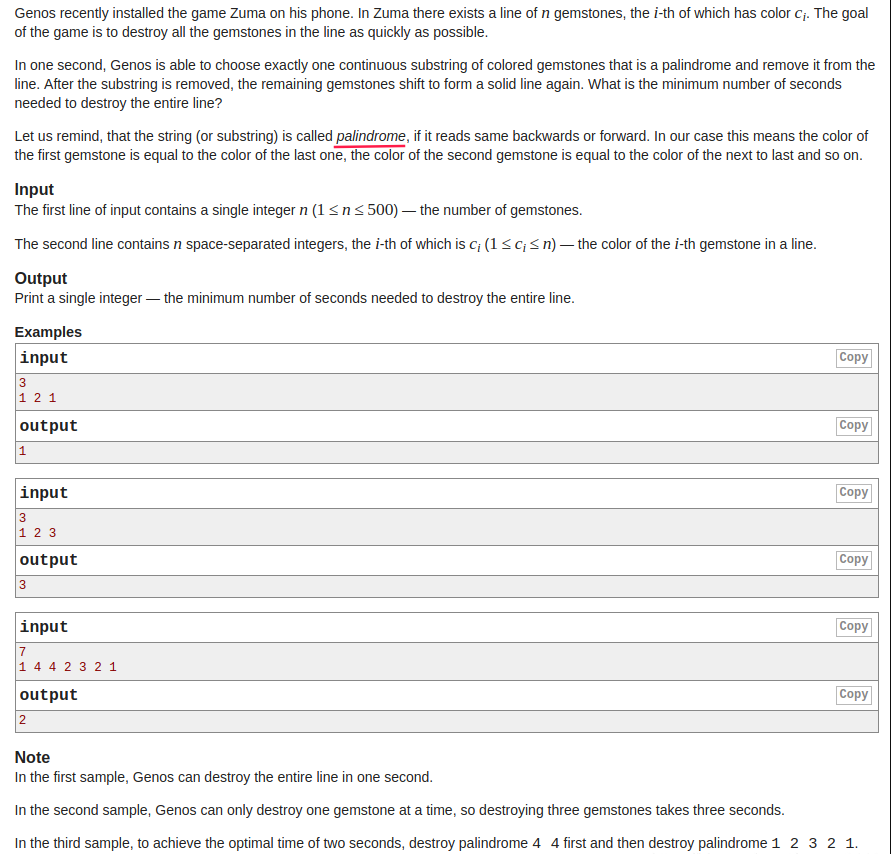
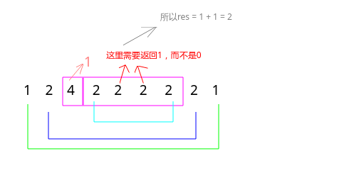

## Codeforces - 607B.Zuma (DP)

#### [题目链接](https://codeforces.com/problemset/problem/607/B)

> https://codeforces.com/problemset/problem/607/B

#### 题目
给你一个`n`和一个有`n`个元素的数组，你每次可以拿走一个连续的子串，如果这个串是回文串，则拿走的花费为`1`，然后剩下的连接起来，问你拿完整个串的最小花费。

#### 解析

感觉和真正的祖玛游戏还是有点差别，或者说一开始有点小小的误解。这个题目说的是<font color = red>回文串</font>的花费为`1`，所以我们是要尽可能的去找回文串。


递归的思路: 

* 递归函数参数是串的两个端点`L、R`，含义是求`[L, R]`内拿走的最小花费；
* 递归终止条件当`L > R`时中间没有数，返回`0`，当`L == R`时一个数，返回`1`；
* 然后<font color= red>当两个端点`arr[L] == arr[R]`时，我们要考虑，这两个点，当他们内部的串都拿走之后，这两个点自然就是一个回文串(只需返回内部的消费即可)，但是</font><font color =purple>这里很重要的是: 当`L == R-1`，也就是`[L, R]`中间没有数的时候，需要返回`1`，因为类似`2, 2`这种串也是需要`1`的花费，但是如果`L, R`之间有元素的话，就不要`+1`；
* 然后就是在`L, R`中间找一个划分点`k`，去递归`[L, k]`和`[k+1, R]`得到左右的最小花费， 然后这一层维护一个最小花费即可；



```java
import java.io.*;
import java.util.*;

public class Main{

    static int n;
    static int[] arr;  
    static int[][] dp;

    static int recur(int L, int R){ 
        if(L > R)
            return 0;
        if(L == R)
            return 1;
        if(dp[L][R] != -1)
            return dp[L][R];
        int res = Integer.MAX_VALUE;
        if(arr[L] == arr[R]) // 两个端点相同，则求出里面的最小值即可，外面的两个端点一点可以消去
            res = Math.min(res, recur(L+1, R-1) + (L == R-1 ? 1 : 0)); // 注意类似(2 2)要返回1,而不是返回0
        for(int i = L; i < R; i++) 
            res = Math.min(res, recur(L, i) + recur(i+1, R));
        return dp[L][R] = res;
    }

    public static void main(String[] args) {
        Scanner cin = new Scanner(new BufferedInputStream(System.in));
        PrintStream out = System.out;
        n = cin.nextInt();
        arr = new int[n];
        for(int i = 0; i < n; i++)
            arr[i] = cin.nextInt();
        dp = new int[n][n];
        for(int i = 0; i < n; i++)
            for(int j = 0; j < n; j++)
                dp[i][j] = -1;
        out.println(recur(0, n-1));
    }
}

```


递推代码: `dp[i, j]`自然就是`[i, j]`区间的最小花费。

```java
import java.io.*;
import java.util.*;

public class Main{ 
    
    public static void main(String[] args){ 
        Scanner cin = new Scanner(new BufferedInputStream(System.in));
        PrintStream out = System.out;

        int n = cin.nextInt();
        int[] arr = new int[n];
        for(int i = 0; i < n; i++)
            arr[i] = cin.nextInt();

        int[][] dp = new int[n][n];
        for(int i = 0; i < n; i++) 
            dp[i][i] = 1;
        for(int i = n-2; i >= 0; i--){ 
            for(int j = i+1; j < n; j++){
                int tmp = Integer.MAX_VALUE;
                if(arr[i] == arr[j])
                    tmp = Math.min(tmp, dp[i+1][j-1]) + (i == j-1 ? 1 : 0);
                for(int k = i; k < j; k++)
                    tmp = Math.min(tmp, dp[i][k] + dp[k+1][j]);
                dp[i][j] = tmp;
            }
        }
        out.println(dp[0][n-1]);
    }
}
```

