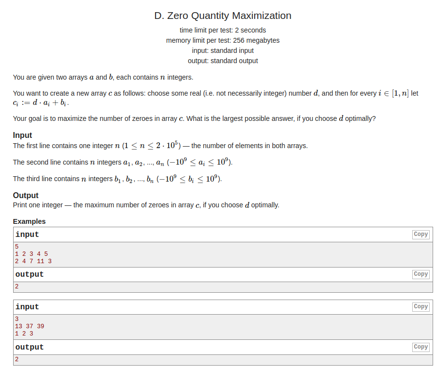
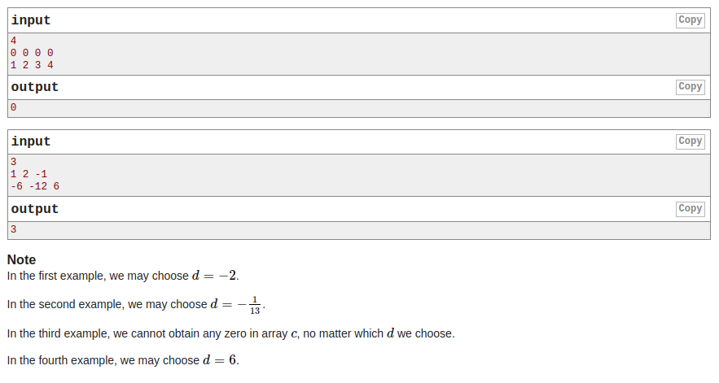

## Codeforces - 1133D. Zero Quantity Maximization(哈希)

#### [题目链接](https://codeforces.com/problemset/problem/1133/D)

> https://codeforces.com/problemset/problem/1133/D

#### 题目

就是给你`n`，然后两个数目为`n`个数组`a[]、b[]`，要你随便找一个数`d`（可以是浮点数和整数），使得`d * a[i] + b[i] = 0`的数目数目最多。求出最多的`0`。





### 解析

重点是怎么哈希，这里先求得两个数的最大公约数，然后相除，然后在`map`中的数只要是`a == a2 && b == b2`或者`a == -a2 && b == -b2`的就可以看做同一个。

一开始没有注意`if(a[i] == 0 && b[i] != 0) continue;`，在这里wrong了挺多次。这种情况是不可能为`0`的。

```java
import java.io.*;
import java.util.*;

public class Main {

    static PrintStream out = System.out;

    static class Pair {
        int f, s;

        public Pair(int f, int s) {
            this.f = f;
            this.s = s;
        }

        @Override
        public boolean equals(Object o) {
            Pair tr = (Pair) o;
            return (f == tr.f && s == tr.s) || (f == -tr.f && s == -tr.s);
        }
        @Override
        public int hashCode() {
            return 31 * f + s;
        }
    }

    // 12 16
    static int gcd(int a, int b) {
        int r = 0;
        while (b != 0) {
            r = a % b;
            a = b;
            b = r;
        }
        return a;
    }

    static void solve(InputStream stream) {
        Scanner in = new Scanner(new BufferedInputStream(stream));
        int n = in.nextInt();
        int[] a = new int[n];
        int[] b = new int[n];
        boolean good = false;
        for (int i = 0; i < n; i++) {
            a[i] = in.nextInt();
            if (a[i] != 0) good = true;
        }
        for (int i = 0; i < n; i++) {
            b[i] = in.nextInt();
            if (b[i] == 0) good = true;
        }
        if (!good) {
            System.out.println(0);
            return;
        }
        HashMap<Pair, Integer> map = new HashMap<>();
        int allZero = 0, fiZero = 0;
        for (int i = 0; i < n; i++) {
            if(a[i] == 0 && b[i] != 0) continue;//在这里wrong了挺多次
            if(a[i] != 0 && b[i] == 0)  {
                fiZero++;
                continue;
            }
            int d = gcd(a[i], b[i]);
            if (d != 0) {
                Pair p = new Pair(a[i] / d, b[i] / d);
                map.put(p, map.getOrDefault(p, 0) + 1);
            } else {
                allZero++;
            }
        }
        int res = fiZero; // 有可能是 0 -> X ，就直接取0了
        for (Pair key : map.keySet())
            res = Math.max(res, map.get(key));
        out.println(res + allZero);
    }

    public static void main(String[] args) {
        solve(System.in);
    }
}
```


