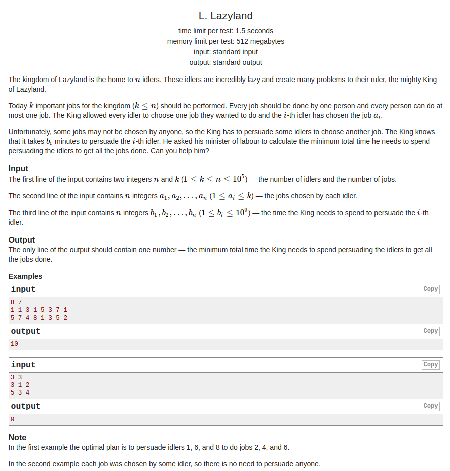

## Codeforces - 1089L. Lazyland

#### [题目链接](http://codeforces.com/problemset/problem/1089/L)

> http://codeforces.com/problemset/problem/1089/L

#### 题目大意
一个<font color= red>"懒岛"</font>，有`n`个懒人(`idlers`)，国王给这`n`个懒人分配`k`个任务，告诉你懒人们选择的任务编号`a[]`，现在的问题是，有些人选择了同样的任务，使得有些任务没有人做，于是国王要和这些选择了重复任务的某些人谈判，要他们选择别的任务，和每个人谈判有一个耗费的时间`b[]`，现在要你求国王和哪些人谈判使得所有任务都有人做，且时间最少，求最少的时间。


#### 解析
这个题目我是用优先队列(<font color = red>大根堆</font>)来维护最小的<font color = red>没有人选择的岗位的几个时间</font>: 

*  使用`set`去重，判断没有重复的工作总共有多少个，如果`k - set.size() == 0`则表示所有工作都有人选择了，则输出`0`；
*  否则，遍历`n`，先判断这个工作选择的人是否`> 1` ，如果不大于，就不要考虑了；
*  否则就要选择这些人，但是只能选择`noChoseJob`，于是维护一个`noChoseJob`大小的堆，并使用个`map`来记录相同工作之间时间的最大值；

```java
import java.io.*;
import java.util.*;

public class Main {

    final static int MAX = 100000;

    public static void main(String[] args) {
        Scanner cin = new Scanner(new BufferedInputStream(System.in));
        PrintStream out = System.out;
        int n = cin.nextInt(), k = cin.nextInt(); // idlers num , jobs num
        HashSet<Integer> set = new HashSet<>(); // judge
        int[] a = new int[n], b = new int[n];
        int[] times = new int[MAX];
        for (int i = 0; i < n; i++) {
            a[i] = cin.nextInt();
            set.add(a[i]);
            times[a[i]]++; // record the job be chosen number of times
        }
        for (int i = 0; i < n; i++)
            b[i] = cin.nextInt();
        int noChose = k - set.size(); 
        if (noChose == 0) { // all idlers have job
            out.println(0);
            return;
        }
        Queue<Integer> pq = new PriorityQueue<>((o1, o2) -> o2 - o1); // the big heap
        HashMap<Integer, Integer> maxMap = new HashMap<>();

        for(int i = 0; i < n; i++){
            if(times[a[i]] <= 1)
                continue;
            if(maxMap.get(a[i]) == null){
                maxMap.put(a[i], b[i]);
            }else{
                Integer pMax = maxMap.get(a[i]); 
                if(pMax < b[i]){
                    if(noChose == pq.size()){
                        if(pMax < pq.peek()) {
                            pq.poll();
                            pq.add(pMax);
                        }
                    }else { // if pq.size < noChoseJob, add directly
                        pq.add(pMax);
                    }
                    maxMap.put(a[i], b[i]); // update max
                }else {  // add b[i] to the pq directly
                    if(noChose == pq.size()){
                        if(b[i] < pq.peek()) {
                            pq.poll();
                            pq.add(b[i]);
                        }
                    }else {
                        pq.add(b[i]);
                    }
                }
            }
        }
        long res = 0;  // notice, must long
        while(!pq.isEmpty())
            res += pq.poll();
        out.println(res);
    }
}
```