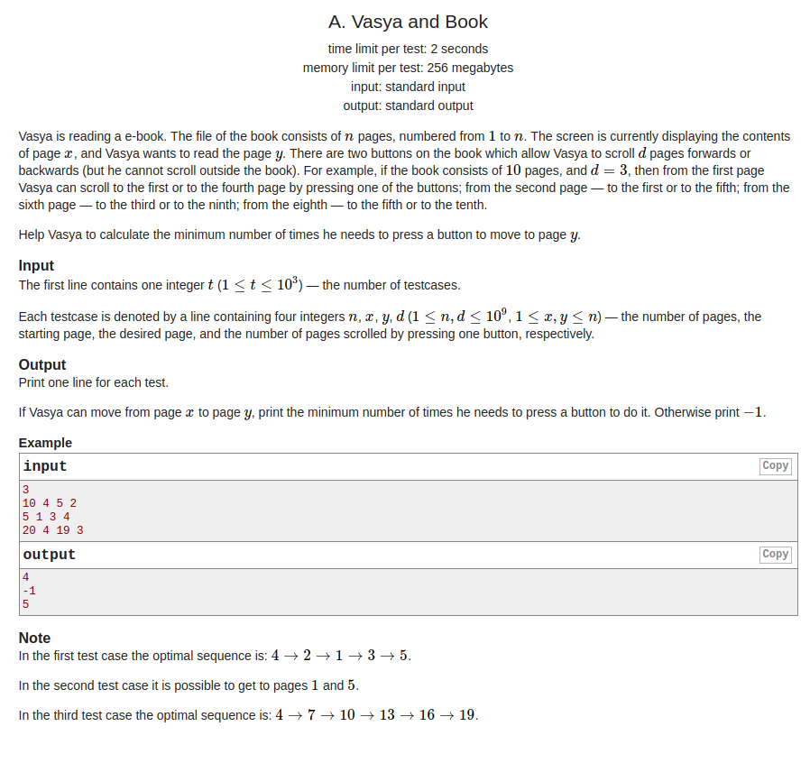
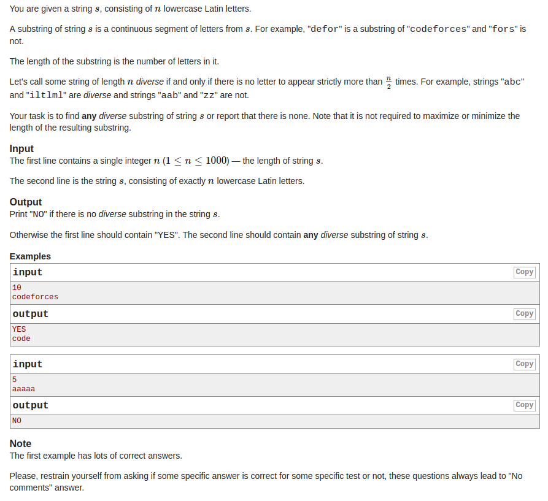

## Codeforces-1082A & 1073A & 330B &  GYM101502I

* [Codeforces - 1082A - Vasya and Book](#codeforces---1082a---vasya-and-book)
* [Codeforces - 1073A - Diverse Substring](#codeforces---1073a---diverse substring)
* [Codeforces - 330B - Road Construction](#codeforces---330broad---construction)
* [GYM - 101502I - Move Between Numbers](#gym---101502i---move-between-numbers)
***
### <font color = red id = "1">Codeforces - 1082A - Vasya and Book
#### [题目链接](http://codeforces.com/problemset/problem/1082/A)

> http://codeforces.com/problemset/problem/1082/A

#### 题目大意
就是给你四个数`n`、`x`、`y`、`d`，在可以将这个四个数看做在一个坐标轴上，要你从`x`位置走到`y`位置，每次只能走`d`步，然后如果超过了边界就直接走到边界，问你从`x`走到`y`位置的最小步数；


#### 解析
其实很简单，如果间隔距离刚好是`d`的整数倍，就肯定不要碰到两边，直接他们之间的距离`/d`就是答案，然后就走两边的情况，直接取一个最小值即可，这题`wa`了很多次，没注意`x > y`的情况。。。
```cpp
#include <bits/stdc++.h>

int main(int argc, char const **argv)
{ 
    std::ios::sync_with_stdio(false);
    std::cin.tie(0);
    int t, n, x, y, d;
    for(std::cin >> t; t--; ){ 
        std::cin >> n >> x >> y >> d;
        if(x == y){ 
            std::cout << 0 << std::endl;
            continue;
        }
        if( abs(y-x)%d == 0) // notice abs , wrong answer so many times!!!!
            std::cout << abs(y-x)/d << std::endl;
        else {
            int back = (x-1)%d == 0 ? (x-1)/d : (x-1)/d+1;
            int forward = (y-1)/d;
            int back2 = (n-y)/d;
            int forward2 = (n-x)%d == 0 ? (n-x)/d : (n-x)/d+1;
            if( (y-1)%d && (n-y)%d ) 
                std::cout << -1 << std::endl;
            else if( (y-1)%d == 0 && (n-y)%d == 0)
                std::cout << std::min(back+forward, back2+forward2) << std::endl;
            else if( (y-1)%d == 0)
                std::cout << back+forward << std::endl;
            else 
                std::cout << back2+forward2 << std::endl;
        }
    }
    return 0;
}
```

***
### <font color = red id = "2">Codeforces - 1073A - Diverse Substring
#### [题目链接](http://codeforces.com/problemset/problem/1073/A)

> http://codeforces.com/problemset/problem/1073/A

#### 题目大意
给你一个字符串`s`，求是否存在一个子串`sub_str`。满足`sub_str`中每个字母出现的次数都`<=strlen(sub_str)`。


#### 解析
这个题目一开始没有读懂，导致`wa`了挺多次，也是稍微有一些技巧，直接转换成判断相邻两个是否相同即可，如果任意两个都相等的话，就没有存在这样的子串。如果存在，就输出相邻的两个即可。
```cpp
#include <bits/stdc++.h>
const int MAX = 26;

int main(int argc, char const **argv)
{ 
    std::ios::sync_with_stdio(false);
    std::cin.tie(0);
    int n, c[MAX];
    std::cin >> n;
    char* str = new char[n];
    std::cin >> str;
    for(int i = 0; i < n-1; i++){ 
        if(str[i] != str[i+1]){ // 找到任意一个相邻的即可 
            std::cout << "YES" << std::endl;
            std::cout << str[i] << str[i+1] << std::endl;
            return 0;
        }  
    }
    std::cout << "NO" << std::endl;
    return 0;
}
```
***

### <font color = red id = "3">Codeforces - 330B - Road Construction

#### [题目链接](https://codeforces.com/problemset/problem/330/B)

> https://codeforces.com/problemset/problem/330/B

#### 题目大意
给你`n`、`m`，`n`代表`n`个顶点，`m`代表的是`m`条边，下面`m`行每行两个数`to`、`from`，代表不能将`to`和	`from`连接起来，<font color = red>问你最少需要连接多少对顶点，可以使得每个顶点到图中的任意一个顶点最多只需要两步，</font>输出最少对数，以及连接的顶点，只需要输出任意一种方案。	


#### 解析

* 首先要做到这个要求，一定需要连接`n-1`条边；
* 知道了一定是`n-1`之后，只需要找出一个没有在输入数据中出现的顶点，然后从这个和每一个顶点都连接一条边即可；


```java
import java.io.BufferedInputStream;
import java.util.Scanner;

public class Main {

    public static void main(String[] args){
        Scanner cin = new Scanner(new BufferedInputStream(System.in));
        int n = cin.nextInt(), m = cin.nextInt();
        boolean[] cant = new boolean[n+1]; // 1～n
        for(int i = 0; i < m; i++){
            int to = cin.nextInt();
            int from = cin.nextInt();
            cant[to] = true;
            cant[from] = true;
        }
        int conn = 0;
        for(int i = 1; i <= n; i++){
            if(!cant[i]){
                conn = i;
                break;
            }
        }
        System.out.println(n-1); 
        for(int i = 1; i <= n; i++){
            if(conn != i)
                System.out.println(conn + " " + i);
        }
    }
}

```
***


### <font color = red id = "4"> GYM - 101502I - Move Between Numbers

#### [题目链接](https://codeforces.com/gym/101502/problem/I)

> https://codeforces.com/gym/101502/problem/I

#### 题目大意
就是给你`n`，`s`、`e`，`n`代表的是有多少个字符串，下面每一个字符串可以看做是图上的一个顶点，如果两个字符串之间满足题目所给的那个条件，即: 两个字符串的相同的字符个数的数目`sum = 17`(可以这样理解，就是题目那个等式的意思)，两个字符串(顶点)就可以相互到达，问从`s`到`e`最少的步数`mindistance`。


#### 解析
编写一个函数判断两个点是否可以相互到达，然后用[`dijkstra`模板](https://blog.csdn.net/zxzxzx0119/article/details/81561440)跑一下即可。
```java
import java.io.BufferedInputStream;
import java.util.*;

public class Main {

    static int n; // vertex num
    static int m; // edge num
    static boolean[] vis;
    static ArrayList<Edge>[] G;

    static class Edge implements Comparable<Edge> {
        public int to;
        public int w;

        public Edge(int to, int w) {
            this.to = to;
            this.w = w;
        }

        @Override
        public int compareTo(Edge o) {
            return w - o.w;
        }
    }

    static boolean common(String a, String b) {
        int[] ca = new int[10];
        int[] cb = new int[10];
        for (int i = 0; i < a.length(); i++) {
            ca[a.charAt(i) - '0']++;
            cb[b.charAt(i) - '0']++;
        }
        int sum = 0;
        for (int i = 0; i < 10; i++)
            sum += Math.min(ca[i], cb[i]);
        return sum == 17;
    }

    static int[] dijkstra(int start) {
        PriorityQueue<Edge> pq = new PriorityQueue<>();
        int[] dis = new int[n + 1];
        for (int i = 0; i <= n; i++)
            dis[i] = Integer.MAX_VALUE;
        dis[start] = 0;
        // G.vis[str] = true; // 下面Queue还要访问start
        pq.add(new Edge(start, 0)); //自环边
        while (!pq.isEmpty()) {
            Edge curEdge = pq.poll();
            int to = curEdge.to;
            if (vis[to])
                continue;
            vis[to] = true;
            for (int i = 0; i < G[to].size(); i++) {
                int nxtNode = G[to].get(i).to;
                int nxtW = G[to].get(i).w;
                if (!vis[nxtNode] && dis[nxtNode] > dis[to] + nxtW) {
                    dis[nxtNode] = dis[to] + nxtW;
                    pq.add(new Edge(nxtNode, dis[nxtNode]));
                }
            }
        }
        return dis;
    }

    public static void main(String[] args) {

        Scanner cin = new Scanner(new BufferedInputStream(System.in));
        int T = cin.nextInt();
        while (T-- > 0) {
            n = cin.nextInt();
            int s = cin.nextInt();
            int e = cin.nextInt();
            String[] str = new String[n];
            for (int i = 0; i < n; i++)
                str[i] = cin.next();
            G = new ArrayList[n + 1];
            vis = new boolean[n + 1];
            for (int i = 0; i <= n; i++) {
                G[i] = new ArrayList<>();
                vis[i] = false;
            }
            for (int i = 0; i < n; i++) {
                for (int j = i + 1; j < n; j++) {
                    if (common(str[i], str[j])) {
                        G[i + 1].add(new Edge(j + 1, 1)); // notice i+1, j+1
                        G[j + 1].add(new Edge(i + 1, 1));
                    }
                }
            }
            int[] dis = dijkstra(s);
            System.out.println(dis[e] == Integer.MAX_VALUE ? -1 : dis[e]);
        }
    }
}
```


`C++`代码:

```cpp
#include <bits/stdc++.h>

const int maxn = 251;
const int INF = 1e9;

class Edge{
public:
    int to, w;
    Edge(int to, int w):to(to), w(w){}
    // bool operator < (const Edge& rhs) const {
    //     return w > rhs.w;
    // }
};

bool operator < (const Edge& ea, const Edge& eb){ 
    return ea.w > eb.w;
}

std::vector<Edge>G[maxn];
bool vis[maxn];
int dis[maxn];

bool common(char *s1,char *s2){
    int len = strlen(s1);
    int a[10] = {0}, b[10] = {0};
    for(int i = 0; i < len; i++)a[s1[i]-'0']++;
    for(int i = 0; i < len; i++)b[s2[i]-'0']++;
    int sum = 0;
    for(int i = 0; i <= 9; i++)
        sum += std::min(a[i], b[i]);
    return sum == 17;
}

int dijkstra(int s, int e, int n){
    // priority_queue<Type, Container, Functional>
    // priority_queue使用: https://blog.csdn.net/bat67/article/details/77585312
    std::priority_queue<Edge>pq; //比较方式默认用 operator< ,所以俩个参数缺省的话，优先队列就是大顶堆，队头元素最大。
    for(int i = 0; i < n; i++) dis[i] = INF;
    dis[s] = 0;
    pq.push(Edge(s, 0));
    // vis[d] = true;
    while(!pq.empty()){
        Edge cur = pq.top(); pq.pop();
        int to = cur.to;
        if(vis[to])
            continue;
        vis[to] = true;
        for(int i = 0; i < G[to].size(); i++){
            int to2 = G[to][i].to;
            int w = G[to][i].w;
            if(!vis[to2] && dis[to2] > w+dis[to]){
                dis[to2] = w+dis[to];
                pq.push(Edge(to2, dis[to2]));
            }
        }
    }
    return dis[e];
}

int main(){
    int T, n, m, s, e;
    char str[250][25];
    std::cin >> T;
    while(T--){
        std::cin >> n >> s >> e;
        for(int i = 0; i < n; i++)
            std::cin >> str[i];
        for(int i = 0; i < n; i++) G[i].clear();
        for(int i = 0; i < n; i++) vis[i] = false;
        for(int i = 0; i < n; i++){
            for(int j = i+1; j < n; j++){
                if(common(str[i], str[j])){
                    G[i].push_back(Edge(j,1));
                    G[j].push_back(Edge(i,1));
                }
            }
        }
        int res = dijkstra(s-1,e-1, n); // notice index
        std::cout << (res == INF ? -1 : res) << std::endl;
    }
    return 0;
}

```

***

