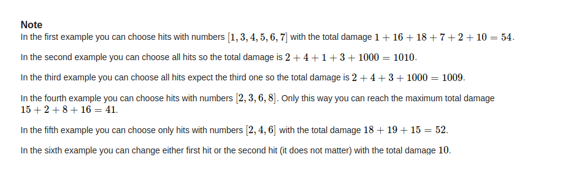

## Codeforces - 1107B. Digital root & 1107C. Brutality(规律 & 贪心)

* [Codeforces - 1107B. Digital root](#codeforces---1107b-digital-root)
* [Codeforces - 1107C. Brutality](#codeforces---1107c-brutality)
***
### <font color =red id = "1">Codeforces - 1107B. Digital root
#### [题目链接](https://codeforces.com/problemset/problem/1107/B)

> https://codeforces.com/problemset/problem/1107/B

#### 题目

一个数`x`的<font color = red>数根</font>的定义`S(x)`是如题目中给出的样子(<font color = blue>就是一个数不断的将各个位上的数相加得到一个新的数</font>(直到这个数为个位数))，现在给你两个数`k、x`，<font color = red>要你求出第`k`个数根是`x`的非负整数。

#### 解析
想半天没有思路，其实是一道找规律的水题。。

先将前面的结果打表，求出每个数对应的数根，即可以发现规律:

* 是一个以`9`为周期的循环，每个周期的结果都是`1 ~ 9`；
* 于是很容易得到结果`(k- 1) * 9 + x`；


结果代码以及打表代码: 
```java
import java.io.*;
import java.util.*;

public class Main {

    static long getSum(long p){ 
        if(p == 0)
            return 0;
        return getSum(p/10) + p%10;
    }

    static long getRoot(long p){ 
        if(p < 10)
            return p;
        return getRoot( getSum(p) );
    }

    static void test(){ 
        // Bymeter 
        for(int i = 0; i < 100; i++)
            System.out.println( i + " " + getRoot(i) );
    }

    public static void main(String[] args){
        Scanner cin = new Scanner(new BufferedInputStream(System.in));
        PrintStream out = System.out;
        //test();
        int n = cin.nextInt();
        for(int i = 0; i < n; i++){ 
            long k = cin.nextLong();
            int x = cin.nextInt();
            out.println( (k-1) * 9 + x);
        }
    }
}
```

### <font color =red id = "2">Codeforces - 1107C. Brutality
#### [题目链接](https://codeforces.com/problemset/problem/1107/C)

> https://codeforces.com/problemset/problem/1107/C

#### 题目

给你`n、k`，然后`n`个数(`arr[i])`以及长度为`n`的字符串(`str[i]`)，每次你可以拿走某个位置`i`上的字符，得到的价值是`arr[i]`，但是你<font color = red>在一段连续的相同的字符序列中，不能拿超过`k`个字符串</font>(注意，不是连续的`k`个)。问你可以拿到的最大价值。




#### 解析

一开始没有读懂题目，即: <font color = red>在一段连续的相同的字符序列中，不能拿超过`k`个字符串</font>，还以为是总共不能超过`k`个字符串，于是用`map + 堆`写了，那时还纳闷第一个样例不对，后来才看懂题目的意思。。。

* 遍历字符串，每次去找相同连续相同的字符序列；
* 然后对这一段字符序列对应的值排序，取最大的`k`个即可(不够的话就取所有的)；

  


一开始错误的代码: 

```java
import java.io.*;
import java.util.*;

public class Main {

    public static void main(String[] args) {

        Scanner cin = new Scanner(new BufferedInputStream(System.in));
        PrintStream out = System.out;
        int n = cin.nextInt();
        int k = cin.nextInt();
        int[] arr = new int[n];
        for (int i = 0; i < n; i++)
            arr[i] = cin.nextInt();
        String str = cin.next();

        HashMap<Character, PriorityQueue<Integer>> counts = new HashMap<>();
        for (int i = 0; i < n; i++) {
            char c = str.charAt(i);
            PriorityQueue<Integer> tmpQ = counts.getOrDefault(c, new PriorityQueue<>());
            if (tmpQ.size() >= k) {
                if (arr[i] > tmpQ.peek()) {
                    tmpQ.poll();
                    tmpQ.add(arr[i]);
                }
            } else {
                tmpQ.add(arr[i]);
            }
            counts.put(c, tmpQ);
        }
        int res = 0;
        for(PriorityQueue<Integer>q : counts.values()){
            while(!q.isEmpty())
                res += q.poll();
        }
        System.out.println(res);
    }
}
```
最后修改的正取的代码:

```java
import java.io.*;
import java.util.*;

public class Main {

    public static void main(String[] args) {
        Scanner cin = new Scanner(new BufferedInputStream(System.in));
        PrintStream out = System.out;
        int n = cin.nextInt();
        int k = cin.nextInt();
        int[] arr = new int[n];
        for (int i = 0; i < n; i++)
            arr[i] = cin.nextInt();
        String str = cin.next();
        long res = 0;
        for (int i = 0; i < n; ) {
            char c = str.charAt(i);
            int j = i;
            List<Integer> tmp = new ArrayList<>();
            while (j < n && str.charAt(j) == c) {
                tmp.add(arr[j]);
                j++;
            }
            Collections.sort(tmp, Collections.reverseOrder());
            for (int p = 0; p < Math.min(tmp.size(), k); p++) res += tmp.get(p);
            i = j;
        }
        System.out.println(res);
    }
}
```

