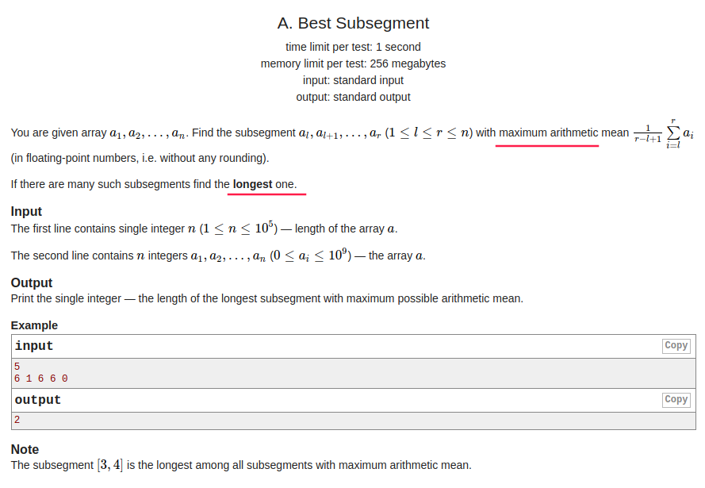

## Codeforces - 1117A. Best Subsegment(最大平均字段)

#### [题目链接](https://codeforces.com/problemset/problem/1117/A)

>https://codeforces.com/problemset/problem/1117/A

#### 题目

给你`n`，以及`n`个数，要你求最大的平均段(即下面的数学表达式)，如果平均数相同，求最长的`R - L + 1`。



### 解析

关键的地方在于:

* 我们要维护数组的一个最大值`max`；
* 平均值最大肯定就是这个最大值。
* 然后在最大值的基础上去找可不可以有更长的长度`res`。

代码:

```java
import java.io.*;
import java.util.*;

public class Main {

    public static void main(String[] args) {
        Scanner in = new Scanner(new BufferedInputStream(System.in));
        PrintStream out = System.out;
        int n = in.nextInt();
        int num, len = 0, res = 0, max = Integer.MIN_VALUE;
        for(int i = 0; i < n; i++){ 
            num = in.nextInt();
            if(num > max){ 
                max = num;
                res = 1; // find a new 
                len = 1;
            }else if(num == max)
                len++;
            else
                len = 0;
            res = Math.max(res, len);
        }
        out.println(res);
    }
}

```

