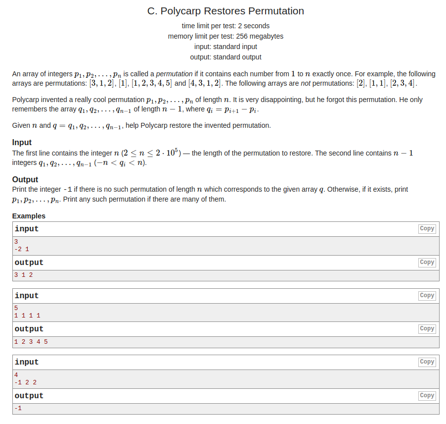
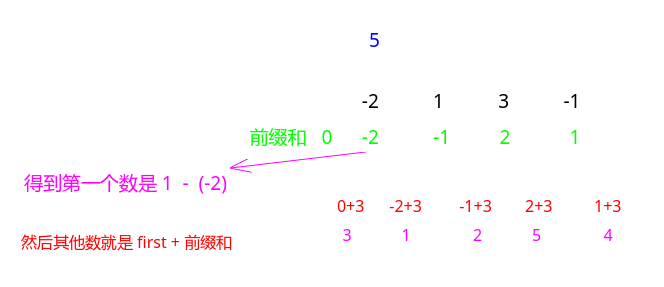

## Codeforces - 1141C. Polycarp Restores Permutation

#### [题目链接](https://codeforces.com/problemset/problem/1141/C)

> https://codeforces.com/problemset/problem/1141/C

#### 题目

`permutation`是`n`个数中，恰好`1~n`都出现一次。

现在给你`n`和`n-1`个数，这`n-1`个数代表的是`permutation`中相邻两个数的差值。

问你能不能通过这`n-1`个数构造出原来的`permutation`。



### 解析

要构造出一个差的前缀和。

然后记录最小的那个前缀和，这样我们就可以得到排列的第一个数是`1 - min`。

然后其他数就是第一个数+对应的前缀和即可。

**前缀和数组就是每个数和第一个数的差值**。



代码:

```java
import java.io.*;
import java.util.*;

public class Main {

    static void solve(InputStream is, PrintWriter out) {
//        Scanner in = new Scanner(new BufferedInputStream(is)); // hasNext method use
        FR in = new FR(is);
        int n = in.nextInt();
        int[] a = new int[n];
        int min = 0;
        for(int i = 1; i < n; i++) {
            a[i] = in.nextInt() + a[i-1]; // 每个数和第一个数的差值
            min = Math.min(min, a[i]);
        }
        int first = 1 - min;
        boolean ok = true;
        boolean[] vis = new boolean[n + 1];
        for(int i = 0; i < n; i++){
            a[i] += first;
            if(a[i] < 1 || a[i] > n || vis[a[i]]){
                ok = false;
                break;
            }
            vis[a[i]] = true;
        }
        if(!ok){
            out.println(-1);
        }else {
            for(int num : a) out.print(num + " ");
        }
    }

    public static void main(String[] args) {
        OutputStream os = System.out;
        InputStream is = System.in;
        PrintWriter out = new PrintWriter(os);
        solve(is, out);
        out.close(); // must close
    }

    static class FR {
        BufferedReader br;
        StringTokenizer tk;

        FR(InputStream stream) {
            br = new BufferedReader(new InputStreamReader(stream), 32768);
            tk = null;
        }

        String next() {
            while (tk == null || !tk.hasMoreElements()) {
                try {
                    tk = new StringTokenizer(br.readLine());
                } catch (IOException e) {
                    e.printStackTrace();
                }
            }
            return tk.nextToken();
        }
        int nextInt() {
            return Integer.parseInt(next());
        }
    }
}

```

