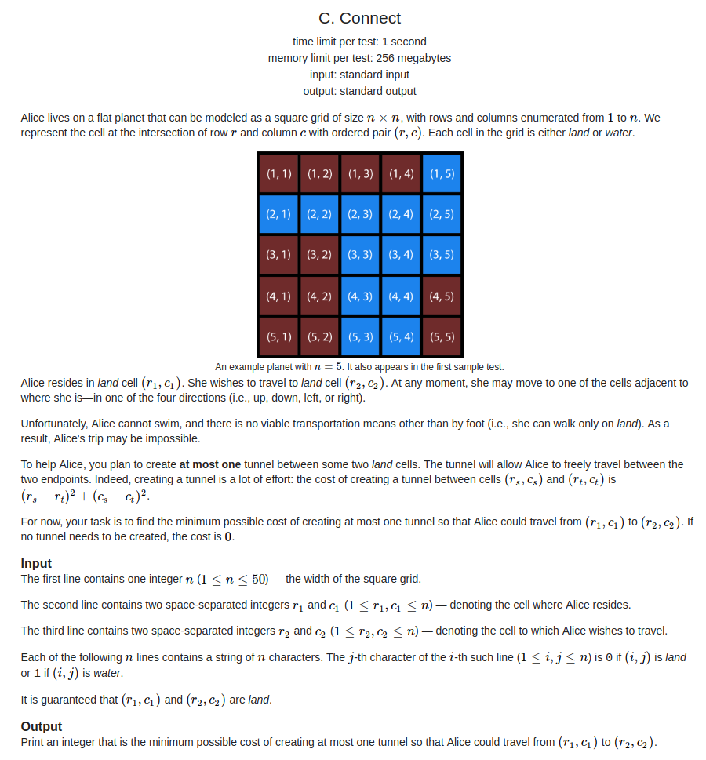
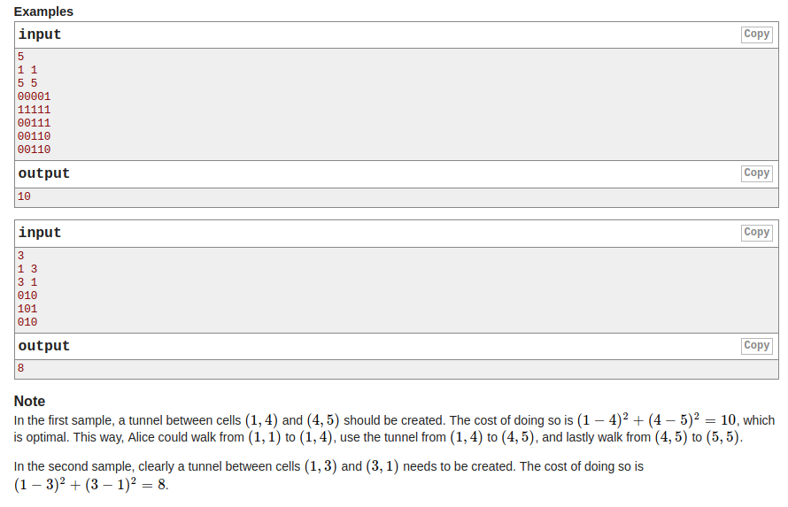

## Codeforces - 1130C. Connect(BFS或DFS)

#### [题目链接](https://codeforces.com/problemset/problem/1130/C)

> https://codeforces.com/problemset/problem/1130/C

#### 题目

给出`n*n`的矩阵、起点以及终点`(r1, c2)和(r2, c2)`，每个格子有0或者1，0代表陆地，1代表水。

现在有个人想从起点走到终点，但他不能沾水。**现在你可以修最多一条管道，连接两块陆地，费用为相应两点间距离的平方**。问最终最小的费用为多少。





### 解析

思路: 找到起点`(r1, c1)`可以直接到达的点的集合。

找到终点(`r2, c2`)直接可以到达的点的集合。

然后找这两个点的两个集合中两两距离平方最小的就可以了。

找的过程可以用`dfs`，也可以用`bfs`。

`dfs`版本:

```java
import java.io.*;
import java.util.*;

public class Main {

    static int n;
    static char[][] a;
    static boolean[][][] vis;

    static void solve(InputStream is, PrintWriter out) {
        Scanner in = new Scanner(new BufferedInputStream(is)); // hasNext method use

        n = in.nextInt();
        a = new char[n][n];
        vis = new boolean[2][n][n];
        int r1 = in.nextInt() - 1;
        int c1 = in.nextInt() - 1;
        int r2 = in.nextInt() - 1;
        int c2 = in.nextInt() - 1;
        for (int i = 0; i < n; i++)
            a[i] = in.next().toCharArray();
        dfs(0, r1, c1); // 起点可以到达的点
        dfs(1, r2, c2); // 终点可以到达的点
        int res = Integer.MAX_VALUE;
        for (int i = 0; i < n; i++) {
            for (int j = 0; j < n; j++) {
                if (vis[0][i][j]) {
                    for (int p = 0; p < n; p++) {
                        for (int q = 0; q < n; q++) {
                            if (vis[1][p][q]) {
                                res = Math.min(res, (p - i) * (p - i) + (q - j) * (q - j));
                            }
                        }
                    }
                }
            }
        }
        out.println(res);
    }

    static final int[][] dir = {{-1, 0}, {0, 1}, {1, 0}, {0, -1}};

    static void dfs(int flag, int r, int c) {
        if (vis[flag][r][c]) return;
        vis[flag][r][c] = true;
        for (int i = 0; i < 4; i++) {
            int nr = r + dir[i][0];
            int nc = c + dir[i][1];
            if (nr >= 0 && nr < n && nc >= 0 && nc < n &&
                    a[nr][nc] == '0' && !vis[flag][nr][nc]) dfs(flag, nr, nc);
        }
    }

    public static void main(String[] args) {
        OutputStream os = System.out;
        InputStream is = System.in;
        PrintWriter out = new PrintWriter(os);
        solve(is, out);
        out.close(); //must close
    }

}

```

bfs的写法:

```java
import java.io.*;
import java.util.*;

public class Main {

    static int n;
    static char[][] a;
    static int[][] vis;

    static class Node{
        int x, y;

        public Node(int x, int y) {
            this.x = x;
            this.y = y;
        }
    }

    static void solve(InputStream is, PrintWriter out) {
        Scanner in = new Scanner(new BufferedInputStream(is)); // hasNext method use
        n = in.nextInt();
        a = new char[n][n];
        vis = new int[n][n];
        int r1 = in.nextInt() - 1;
        int c1 = in.nextInt() - 1;
        int r2 = in.nextInt() - 1;
        int c2 = in.nextInt() - 1;
        for (int i = 0; i < n; i++)
            a[i] = in.next().toCharArray();
        bfs(r1, c1, 1);
        if(vis[r2][c2] == 1){
            out.println(0);
            return;
        }
        bfs(r2, c2, -1);
        int res = Integer.MAX_VALUE;
        for(int i = 0; i < n; i++){
            for(int j = 0; j < n; j++){
                if(vis[i][j] == 1){
                    for(int p = 0; p < n; p++){
                        for(int q = 0; q < n; q++){
                            if(vis[p][q] == -1){
                                res = Math.min(res, (p-i)*(p-i) + (q-j)*(q-j));
                            }
                        }
                    }
                }
            }
        }
        out.println(res);
    }

    static final int[][] dir = {{-1, 0}, {0, 1}, {1, 0}, {0, -1}};

    static void bfs(int r, int c, int flag){
        Queue<Node> queue = new LinkedList<>();
        queue.add(new Node(r, c));
        vis[r][c] = flag; // 注意bfs一开始要vis = true;
        while(!queue.isEmpty()){
            Node cur = queue.poll();
            for(int i = 0; i < 4; i++){
                int nr = cur.x + dir[i][0];
                int nc = cur.y + dir[i][1];
                if(nr >= 0 && nr < n && nc >= 0 && nc < n && a[nr][nc] == '0' && vis[nr][nc] == 0){
                    queue.add(new Node(nr, nc));
                    vis[nr][nc] = flag;
                }
            }
        }
    }
    public static void main(String[] args) {
        OutputStream os = System.out;
        InputStream is = System.in;
        PrintWriter out = new PrintWriter(os);
        solve(is, out);
        out.close(); //must close
    }
}

```

