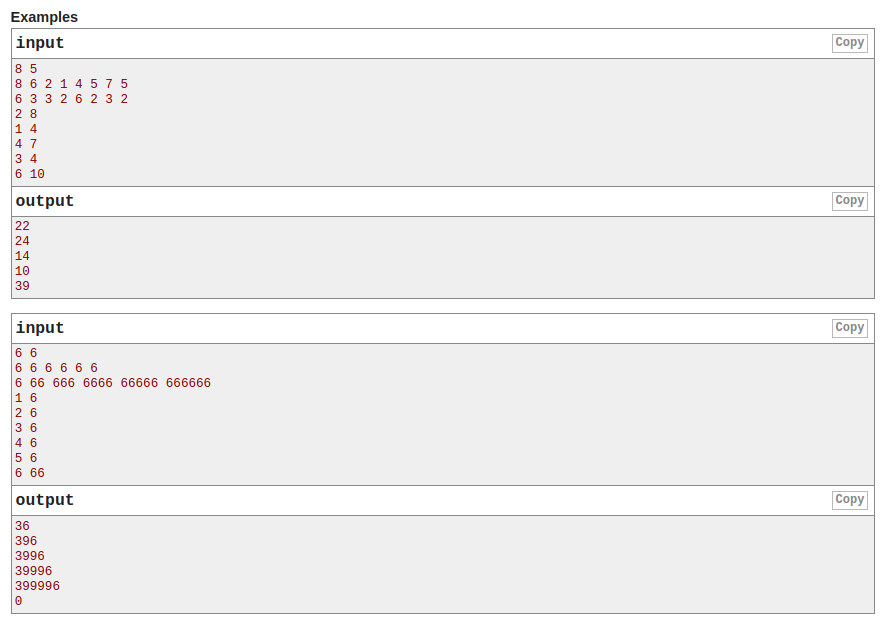
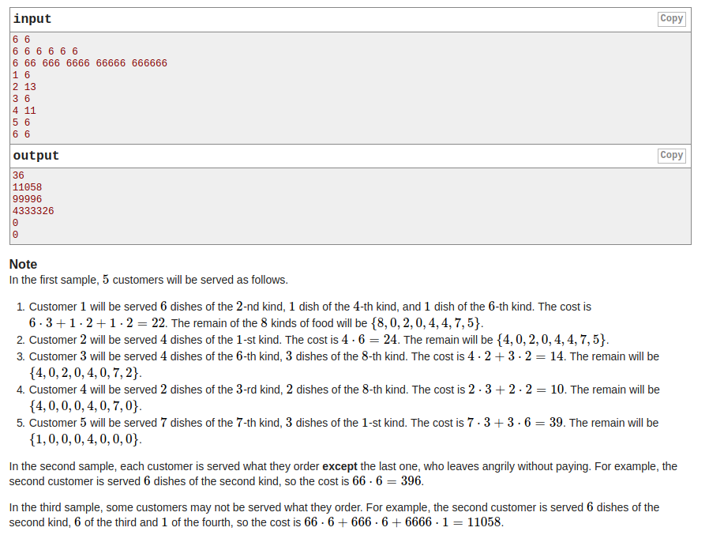

## Codeforces - 1106B. Lunar New Year and Food Ordering (模拟)

#### [题目链接](https://codeforces.com/problemset/problem/1106/B)

> https://codeforces.com/problemset/problem/1106/B

#### 题目
一个饭店，有`n`种食物，每种食物一开始的数量存在`rc`数组中，每种食物每一份的花费存在`sc`数组中，然后给你`m`个顾客，每一个顾客点餐，给你两个数`t、d`，代表的意思是点`d`份`t`食物，点的规则如下:

* 如果`t`食物还够`d`份，就点`d`份`t`食物，并将`t`食物的剩余数量更新；
* 如果`t`食物不够`d`份，就先点完`t`食物，然后从<font color = red>剩下的所有食物中选择最便宜(相同价格的索引小的在前)</font>的继续点，直到点到`d`份；
* 如果某一个顾客点的时候，所有的食物都点完了(不能满足`d`份)，就返回`0`，否则，返回顾客点的<font color = red>总价格。





#### 解析
模拟就行。主要是要<font color = red>利用一个`ids`数组存储排序之后原先的索引对应的排序之后的索引。</font>

看样例给的第一个例子:

```c
8 5
8 6 2 1 4 5 7 5
6 3 3 2 6 2 3 2
```
用一个结构体`Node`记录数组的原先下标`id`，以及剩余的数量`r`，以及对应的花费`c`，按照`c`升序排序，得到新数组如下:
|	i |原先的`i`|  `r`| `c`|
|-|-|-|-|
|0|3| 1 |2|
|1|5| 5| 2|
|2|7 |5 |2|
|3|1 |6 |3|
|4|2| 2| 3|
|5|6| 7 |3|
|6|0 |8 |6|
|7|4| 4 |6|

然后遍历新数组：

* 为了能方便直接按照`id`取到对应的食物，但是数组又已经排序，所以我们遍历排序的`nodes`数组，将`<id, nodes[i]>`存入一个`HashMap`；
* 然后用一个`ids[]`数组，存储原先`id`对应在新排序的`nodes`数组中的新位置，这样方便我们更新`nodes`数组；
* 然后就模拟那个过程即可，不过要注意细节，比如相乘溢出、特殊情况判断等；


```java
import java.io.*;
import java.util.*;

public class Main {

    static class Node {
        int id;
        int r;
        int c;

        Node(int id, int r, int c) {
            this.id = id;
            this.r = r;
            this.c = c;
        }
    }

    public static void main(String[] args) {
        Scanner cin = new Scanner(new BufferedInputStream(System.in));
        PrintStream out = System.out;
        int n = cin.nextInt();
        int m = cin.nextInt();
        int[] rs = new int[n];
        int[] cs = new int[n];
        for (int i = 0; i < n; i++)
            rs[i] = cin.nextInt();
        Node[] nodes = new Node[n];
        for (int i = 0; i < n; i++) {
            cs[i] = cin.nextInt();
            nodes[i] = new Node(i, rs[i], cs[i]);
        }
        Arrays.sort(nodes, (o1, o2) -> {
            if (o1.c == o2.c) {
                return o1.id - o2.id;
            }
            return o1.c - o2.c;
        });
        HashMap<Integer, Node> mp = new HashMap<>();
        int[] ids = new int[n];
        for (int i = 0; i < nodes.length; i++) {
            mp.put(nodes[i].id, nodes[i]);
            ids[nodes[i].id] = i;
        }
        int p = 0;
        for (int i = 0; i < m; i++) {
            int t = cin.nextInt() - 1;
            int d = cin.nextInt();
            long sum = 0;
            Node pNode = mp.get(t);
            if (pNode.r >= d) {
                nodes[ids[t]].r -= d;
                sum += (long)pNode.c * d;
            } else {
                if (pNode.r > 0) {
                    d -= nodes[ids[t]].r;
                    sum += (long)pNode.r * pNode.c; // 要转换成long，不然会溢出
                    nodes[ids[t]].r = 0;
                }
                while (d > 0 && p < n) {
                    if (nodes[p].r <= 0) {
                        p++;
                        continue;
                    }
                    int temp = d;
                    d -= nodes[p].r;
                    if (nodes[p].r >= temp) {
                        sum += temp * (long)nodes[p].c;
                        nodes[p].r -= temp;
                        break;
                    } else { // nodes[p].r < temp
                        sum += (long)nodes[p].r * nodes[p].c;
                        nodes[p].r = 0;
                        p++;
                    }
                }
                if(d > 0) // 注意细节，不能搞完就是 0 
                    sum = 0;
//                p = 0; // 加了这个就超时, 不需要从头开始, 前面的都已经置为了0
            }
            out.println(sum);
        }
    }
}

```

