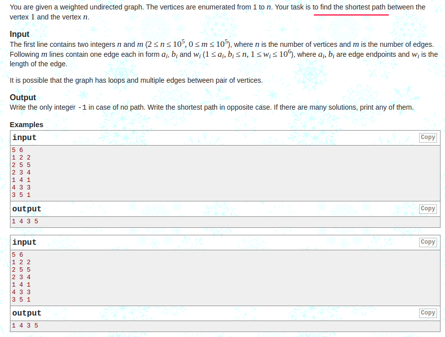
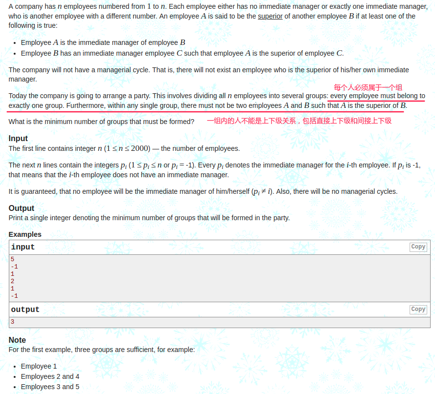
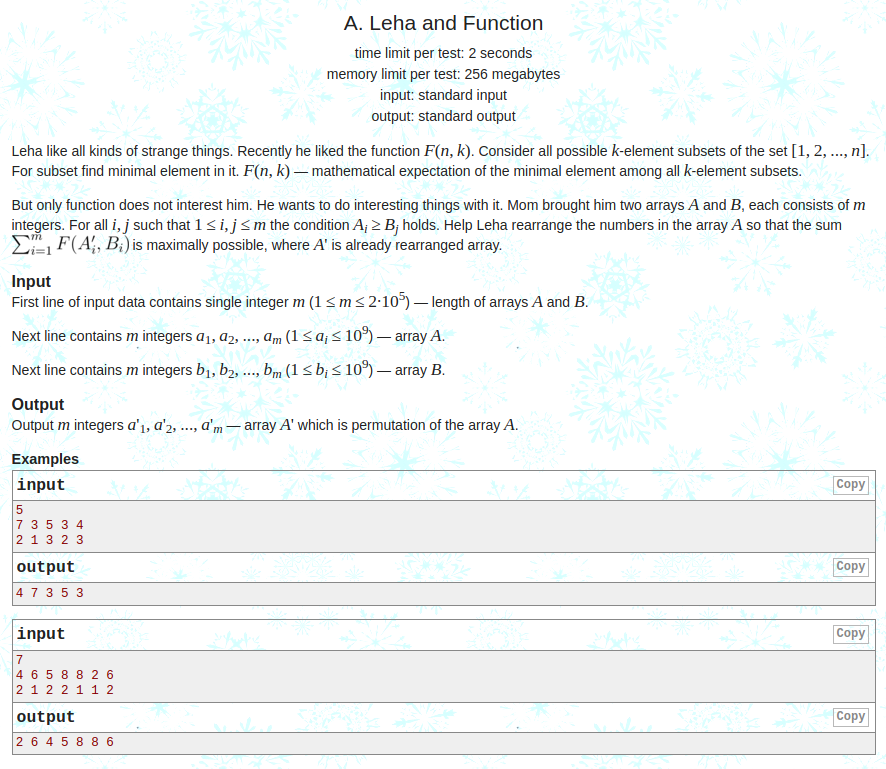

## Codeforces - 20C & 115A & 840A  & 782C
* [Codeforces - 20C - Dijkstra?](#codeforces---20c---dijkstra?)
* [Codeforces - 115A - Party](#codeforces---115a---party)
* [Codeforces - 840A - Leha and Function](#codeforces---840a---leha-and-function)
* [Codeforces - 782C - Andryusha and Colored Balloons](#codeforces-782c---andryusha-and-colored-balloons)

***
### <font color =red id = "1">Codeforces - 20C - Dijkstra?
#### [题目链接](https://codeforces.com/problemset/problem/20/C)

> https://codeforces.com/problemset/problem/20/C

#### 题目大意
给你一个有权图，求从顶点`1`到顶点`n`的最短路径。

#### 解析
**[Dijkstra模板](https://blog.csdn.net/zxzxzx0119/article/details/81561440)。**

用一个`pre`数组保存是由哪个节点更新过来的就可以得到最短路径。
```java
import java.io.BufferedInputStream;
import java.util.*;

public class Main {

    static class Graph{

        public int n;
        public int m;
        public boolean[] vis;
        public ArrayList<Edge>g[];

        public Graph(int n) {
            this.n = n;
            vis = new boolean[n];
            g = new ArrayList[n];
            for(int i = 0; i < n; i++){
                vis[i] = false;
                g[i] = new ArrayList<>();
            }
        }
    }

    static class Edge implements Comparable<Edge>{
        public int to;
        public int w;

        public Edge(int to, int w) {
            this.to = to;
            this.w = w;
        }

        @Override
        public int compareTo(Edge o) {
            return w - o.w;
        }
    }

    static int[] dijkstra(Graph G, int s, int[] pre){
        PriorityQueue<Edge>pq = new PriorityQueue<>();
        int[] dis = new int[G.n];
        for(int i = 0; i < G.n; i++)
            dis[i] = Integer.MAX_VALUE; //初始标记（不是-1(因为是求最小的)）
        pq.add(new Edge(s, 0));
        while(!pq.isEmpty()){
            Edge curEdge = pq.poll();
            int to = curEdge.to;
            if(G.vis[to])
                continue;
            G.vis[to] = true;
            for(int i = 0; i < G.g[to].size(); i++){
                int nxtNode = G.g[to].get(i).to;
                int nxtW = G.g[to].get(i).w;
                if(!G.vis[nxtNode] && dis[nxtNode] > dis[to] + nxtW){
                    dis[nxtNode] = dis[to] + nxtW;
                    pre[nxtNode] = to;  // only add this code
                    pq.add(new Edge(nxtNode, dis[nxtNode]));
                }
            }
        }
        return dis;
    }

    public static void main(String[] args){
        Scanner cin = new Scanner(new BufferedInputStream(System.in));
        int n = cin.nextInt();
        int m = cin.nextInt();
        Graph G = new Graph(n);
        for(int i = 0; i < m; i++){
            int from = cin.nextInt();
            int to = cin.nextInt();
            int w = cin.nextInt();
            G.g[from-1].add(new Edge(to-1, w));
            G.g[to-1].add(new Edge(from-1, w));
        }
        int[] pre = new int[n];
        Arrays.fill(pre, -1);
        int[] dis = dijkstra(G, 0, pre);
        if(dis[n-1] == Integer.MAX_VALUE){
            System.out.println("-1");
            return;
        }
        Stack<Integer>stack = new Stack<>();
        int p = n-1;
        while(p != -1){
            stack.push(p);
            p = pre[p];
        }
        System.out.print(stack.pop()+1);
        while(!stack.isEmpty())
            System.out.print(" " + (stack.pop()+1));
        System.out.println();
    }
}
```

***

### <font color =red id = "2">Codeforces - 115A - Party
#### [题目链接](https://codeforces.com/problemset/problem/115/A)

> https://codeforces.com/problemset/problem/115/A

#### 题目大意
给你`n`，代表有`n`个与员工，然后给你每个员工的<font color = red>直接上司</font>是谁(所有人从`1~n`编号)，要你将这`n`个人分成<font color = red>最少</font>的组，要求: ①每个员工必须属于某一个组；②一组内的任何两个人直接不能是上下级关系(包括直接上下级和间接上下级)；

#### 解析

题目样例: 


思路很简单:
* 我们只需要求所有员工到他祖先的路径长度中<font color= red>最长</font>的那条的长度。因为没一层都可以属于一个组，即使有多个连通分量。
* 可以使用和并查集类似的结构，保存每个节点的父亲节点。然后迭代查询即可。


```java
import java.io.BufferedInputStream;
import java.util.Scanner;

public class Main {

    static class UnionSet{
        public int[] parent;
        public UnionSet(int n) {
            parent = new int[n+1];
        }

        public int findRoot(int v){
            int len = 0; 
            while(parent[v] != v){
                v = parent[v];
                len++;
            }
            return len;
        }
    }

    public static void main(String[] args){

        Scanner cin = new Scanner(new BufferedInputStream(System.in));
        int n = cin.nextInt();
        UnionSet uset = new UnionSet(n);
        for(int i = 1; i <= n; i++){
            int num = cin.nextInt();
            if(num == -1)
                uset.parent[i] = i;
            else
                uset.parent[i] = num;
        }
        int res = -1;
        for(int i = 1; i <= n; i++)
            res = Math.max(res, uset.findRoot(i)); //最大的那个
        System.out.println(res+1);
    }
}

```

***
### <font color =red id = "3">Codeforces - 840A - Leha and Function
#### [题目链接](https://codeforces.com/problemset/problem/840/A)

> https://codeforces.com/problemset/problem/840/A

#### 题目大意
给你一个函数`F(n， k)`，意思是从` 1 ~ n `里选出 `k` 个数，每次的贡献是选出的 `k `个数中最小的那个数。输入`n`，数组`a、b`要你将`a`数组重新排列，使得`F(ai, bi)`的和最大。

#### 解析
贪心，`a`数组更大的要去匹配	`b`数组更小的，这样才会更大。

将`a`数组升序排列，`b`数组降序排列并记录之前的索引，最后遍历将`a`数组中元素放到正确的位置。
```java
import java.io.BufferedInputStream;
import java.util.Arrays;
import java.util.Scanner;

public class Main {

    static class Pair{
        public int num;
        public int id;

        public Pair(int num, int id) {
            this.num = num;
            this.id = id;
        }
    }

    public static void main(String[] args){
        Scanner cin = new Scanner(new BufferedInputStream(System.in));
        int n = cin.nextInt();
        int[] arr = new int[n];
        for(int i = 0; i < n; i++)
            arr[i] = cin.nextInt();
        Arrays.sort(arr); //  升序排列
        Pair[] pairs = new Pair[n];
        for(int i = 0; i < n; i++) {
            int num = cin.nextInt();
            pairs[i] = new Pair(num, i);
        }
        Arrays.sort(pairs, (o1, o2) -> o2.num - o1.num); // 按照值降序排列
        int[] res = new int[n];
        for(int i = 0; i < n; i++)
            res[pairs[i].id] = arr[i];
        for(int i = 0; i < n; i++)
            System.out.print(res[i] + " ");
        System.out.println();
    }
}

```

***
### <font color =red id = "4">Codeforces - 782C - Andryusha and Colored Balloons
#### [题目链接](https://codeforces.com/problemset/problem/782/C)
#### 题目大意
就是给你一颗生成树(`n`个顶点，`n-1`条边)，然后输入`n-1`条边，要你用`1 ~ n`之间<font color = red>尽可能少</font>的颜色，来将`n`个顶点染色，有一个条件: 相邻距离为`2`的点都是不同的颜色。

输出总共需要多少种颜色，并且输出每个顶点的颜色。


#### 解析

写了挺久(菜)，还是没有维护好`count`这个变量，最后还是看了下些解答。


`count`变量要在当前节点`cur`的所有孩子的循环遍历中`count++`，因为遍历一个之后，就找到了一种，所以遍历一次就`++`，所以一开始`dfs`将`count = 0 `，至于最大值，只需要计算某个节点的最大值即可。
```java
import java.io.BufferedInputStream;
import java.util.*;

public class Main {

    static ArrayList<Integer>G[];
    static int[] colors;
    static int res; // the number of colors

    static void dfs(int cur, int pre){
        int count = 0;
        for(int i = 0; i < G[cur].size(); i++){
            int to = G[cur].get(i);
            if(pre == to || colors[to] != -1) // 访问过或者已经计算过
                continue;
            count++; //  it must
            while(count == colors[cur] || count == colors[pre])
                count++;
            colors[to] = count;
            dfs(to, cur);
        }
        res = Math.max(res, count);
    }

    public static void main(String[] args){
        Scanner cin = new Scanner(new BufferedInputStream(System.in));
        int n = cin.nextInt();
        G = new ArrayList[n+1];
        for(int i = 1; i <= n; i++)
            G[i] = new ArrayList<>();
        colors = new int[n+1];
        Arrays.fill(colors, -1);
        for(int i = 0; i < n-1; i++){
            int from = cin.nextInt();
            int to = cin.nextInt();
            G[from].add(to);
            G[to].add(from);
        }
        colors[1] = 1;
        res = 0;
        dfs(1, 0);
        System.out.println(res);
        for(int i = 1; i < n; i++)
            System.out.print(colors[i] + " ");
        System.out.println(colors[n]);
    }
}

```
***

