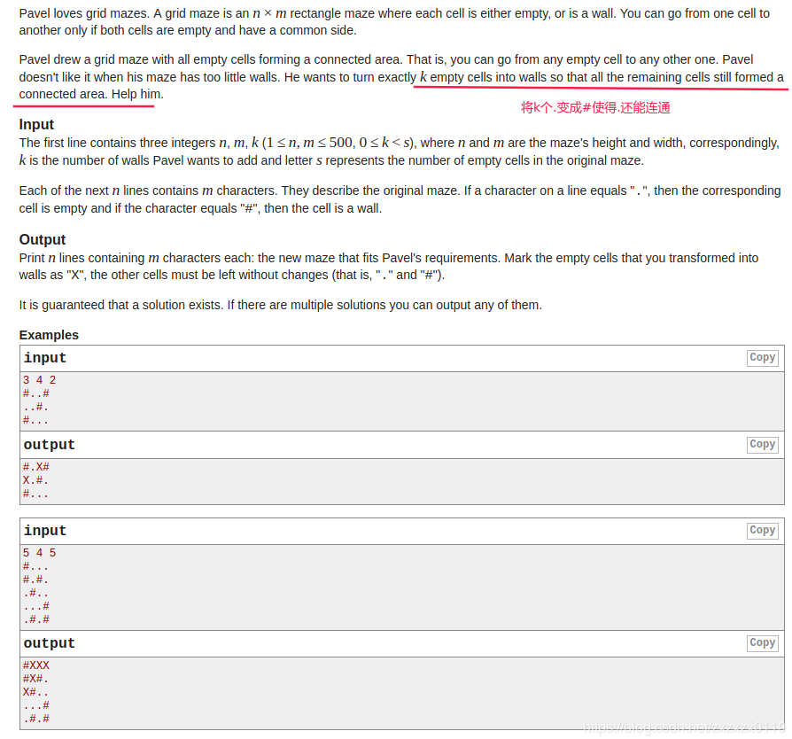
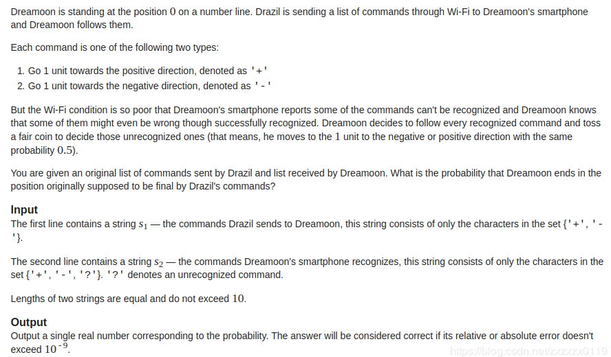
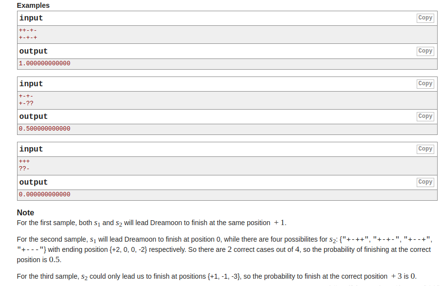

## Codeforces - 377A & 476B & 550A & 550C

* [Codeforces - 377A - Maze](#codeforces---377a---maze)
* [Codeforces - 476B - Dreamoon and WiFi](#codeforces---476b---dreamoon-and-wifi)
* [Codeforces - 550A - Two Substrings](#codeforces---550a---two-substrings)
* [Codeforces - 550C - Divisibility by Eight](#codeforces---550c---divisibility-by-eight)

***
### <font color =red id = "1">Codeforces - 377A - Maze
#### [题目链接](https://codeforces.com/contest/377/problem/A)

> https://codeforces.com/contest/377/problem/A

#### 题目大意
就是在一个`maze`中，有`empty cell`(`.`)和`wall`(`#`)，现在要你将`k`个`.`变成`X`，使得其他`.`还能连通。

#### 解析

反过来思考，设`.`的数目为`emptyNum`，直接搜索到任意一条`emptyNum - k`的`.`的连通路径即可，其余的`k`个点就是答案。
```java
import java.io.*;
import java.util.Scanner;

public class Main {

    static final int[] dx = {-1, 0, 1, 0};
    static final int[] dy = {0, 1, 0, -1};

    static int n;
    static int m;
    static int k;
    static char[][] G;
    static int emptyNum;
    static int count;
    static boolean isFind;

    static boolean check(int i, int j) {
        return i >= 0 && i < n && j >= 0 && j < m;
    }

    static void dfs(int i, int j) {
        if (count == emptyNum - k) { //already find
            isFind = true;
            return;
        }
        count++;
        G[i][j] = '*';
        for (int k = 0; k < 4; k++) {
            int ni = i + dx[k];
            int nj = j + dy[k];
            if (check(ni, nj) && G[ni][nj] == '.')
                dfs(ni, nj);
        }
    }

    public static void main(String[] args) {

        Scanner cin = new Scanner(new BufferedInputStream(System.in));
        PrintStream out = System.out;
        n = cin.nextInt();
        m = cin.nextInt();
        k = cin.nextInt();
        G = new char[n][m];

        for (int i = 0; i < n; i++) {
            String str = cin.next();
            for (int j = 0; j < m; j++) {
                if (str.charAt(j) == '.')
                    emptyNum++;
                G[i][j] = str.charAt(j);
            }
        }

        for (int i = 0; i < n; i++) {
            for (int j = 0; j < m; j++) {
                if (G[i][j] == '.') {
                    dfs(i, j);
                    if (isFind)
                        break;
                }
            }
        }
        for (int i = 0; i < n; i++) {
            for (int j = 0; j < m; j++) {
                if (G[i][j] == '.')
                    G[i][j] = 'X';
            }
        }
        for (int i = 0; i < n; i++) {
            for (int j = 0; j < m; j++) {
                if (G[i][j] == '*')
                    G[i][j] = '.';
            }
        }
        for (int i = 0; i < n; i++) {
            for (int j = 0; j < m; j++) {
                out.print(G[i][j]);
            }
            out.println();
        }
        out.println();
    }
}
```

***
### <font color =red id = "2">Codeforces - 476B - Dreamoon and WiFi
#### [题目链接](https://codeforces.com/problemset/problem/476/B)

> https://codeforces.com/problemset/problem/476/B

#### 题目大意
给你两个字符串`a`、`b`，`a`是发送方的字符串，`b`是接收方的字符串，`a`发送的字符串是确定的，但是`b`接收到的字符串有可能不确定，如果确定是`+`，则距离`+1`，如果确定是`-`，则距离`-1`，否则如果是`?`，就不确定，`+1`和`-1`的概率各为`0.5`，要你判断在`a`确定的情况下，`b`最终的距离和`a`相等的概率。



#### 解析

枚举`b`出现的所有情况，看有多少种情况会和`a`的最终结果相同，因为数据范围小，所以可以枚举(暴搜即可)。
```java
import java.io.*;
import java.util.*;

public class Main {

    static class Clazz{
        ArrayList<Double>res;
        double sum;
        double goal;
        String b;

        Clazz(String b){
            this.b = b;
            sum = 0;
            res = new ArrayList<>();
            goal = 0;
        }

        double computer(){
            dfs(0);
            double numerator = 0;         //分子
            int denominator = res.size(); //分母
            for(int i = 0; i < res.size(); i++){
                if(res.get(i) == goal)
                    numerator += 1;
            }
            return numerator/denominator;
        }

        void dfs(int index) {
            if(index == b.length()){
                res.add(sum);
                return;
            }
            char cur = b.charAt(index);
            if(cur == '+'){
                sum += 1;
                dfs(index+1);
                sum -= 1;
            }else if(cur == '-'){
                sum -= 1;
                dfs(index+1);
                sum += 1;
            }else {
                // 枚举两种情况
                sum += 1;
                dfs(index+1);
                sum -= 1;

                sum -= 1;
                dfs(index+1);
                sum += 1;
            }
        }
    }

    public static void main(String[] args){
        Scanner cin = new Scanner(new BufferedInputStream(System.in));
        PrintStream out = System.out;
        String a = cin.next();
        String b = cin.next();

        Clazz clazz = new Clazz(b);
        for(int i = 0; i < a.length(); i++)
            clazz.goal += a.charAt(i) == '+' ? 1 : (-1);

        out.println(clazz.computer());
    }
}
```

***
### <font color =red id = "3">Codeforces - 550A - Two Substrings
#### [题目链接](https://codeforces.com/problemset/problem/550/A)

> https://codeforces.com/problemset/problem/550/A

#### 题目大意
给你一个字符串`s`，要你判断是否有`AB`和`BA`同时出现在字符串中，但是不能连续，例如不能`ABA`这种。

#### 解析
其实就是个简单的模拟题，但是还是错了好几次，还是菜。。。

给几个特殊样例: 
```c
ABABAB       YES
ABAXXXAB     YES
ABA          NO
ABAB         NO
ABABA        YES
```
处理就是当出现`ABA`或者`BAB`的时候，统计`AB`和`BA`都出现了，但是统计完不判断，而是跳过这三个字符。
```java
import java.io.BufferedInputStream;
import java.util.Scanner;

public class Main {

    public static void main(String[] args) {

        Scanner cin = new Scanner(new BufferedInputStream(System.in));
        String str = cin.next();

        boolean isAB = false, isBA = false;
        for (int i = 0; i < str.length() - 1; i++) {
            if (str.charAt(i) == 'B' && str.charAt(i + 1) == 'A') {
                if (isAB) {
                    System.out.println("YES");
                    return;
                } else {
                    if(i < str.length()-2 && str.charAt(i+2) == 'B') { //BAB
                        isAB = true;
                        i += 2;// 跳过
                    }
                    isBA = true;
                }
            }
            if (str.charAt(i) == 'A' && str.charAt(i + 1) == 'B') {
                if (isBA ) {
                    System.out.println("YES");
                    return;
                } else {
                    if(i < str.length()-2 && str.charAt(i+2) == 'A') { // ABA
                        isBA = true;
                        i += 2; // 跳过
                    }
                    isAB = true;
                }
            }
        }
        System.out.println("NO");
    }
}

```

***
### <font color =red id = "4">Codeforces - 550C - Divisibility by Eight
#### [题目链接](https://codeforces.com/problemset/problem/550/C)
> https://codeforces.com/problemset/problem/550/C

#### 题目链接

给你一个长度不超过`100`的数字，要你移去一些数字(也可以不移去)，判断剩下的数字能不能被`8`整除，如果可以输出剩下的数字组成的数。如果不存在解，输出`NO`。

#### 解析

这题没有想到，有一个关键点: 一个数要成为`8`的倍数，则后面三位数字成为`8`的倍数即可，所以只需要枚举`0~1000`的数即可，也就是在给出的数字中，三种循环枚举即可。

* 特判`0`、`8`；
* 判断`10~99`之间的数；
* 判断`100 ~ 999`之间的数；
```java
import java.io.BufferedInputStream;
import java.util.Scanner;

public class Main {

    static int getThreeDigit(char a, char b, char c){
        return (a - '0')*100 + (b - '0')*10 + c-'0';
    }
    static int getTwoDigit(char b, char c){
        return  (b - '0')*10 + c-'0';
    }
    
    public static void main(String[] args) {
        Scanner cin = new Scanner(new BufferedInputStream(System.in));
        String str = cin.next();
        int len = str.length();
        char[] chs = str.toCharArray();
        for (int i = 0; i < len; i++) {
            if (chs[i] == '0' || chs[i] == '8') {
                System.out.println("YES");
                System.out.println(chs[i]);
                return;
            }
        }
        // O(1000000)
        for(int i = 0; i < len; i++){
            for(int j = i+1; j < len; j++){
                int ij = getTwoDigit(chs[i], chs[j]);
                if(ij%8 == 0){
                    System.out.println("YES");
                    System.out.println(ij);
                    return;
                }
                for(int k = j+1; k < len; k++){
                    int ik = getTwoDigit(chs[i], chs[k]);
                    if(ik%8 == 0){
                        System.out.println("YES");
                        System.out.println(ik);
                        return;
                    }
                    int jk = getTwoDigit(chs[j], chs[k]);
                    if(jk%8 == 0){
                        System.out.println("YES");
                        System.out.println(jk);
                        return;
                    }
                    int digit = getThreeDigit(chs[i], chs[j], chs[k]);
                    if(digit%8 == 0){
                        System.out.println("YES");
                        System.out.println(digit);
                        return;
                    }
                }
            }
        }
        System.out.println("NO");
    }
}
```

