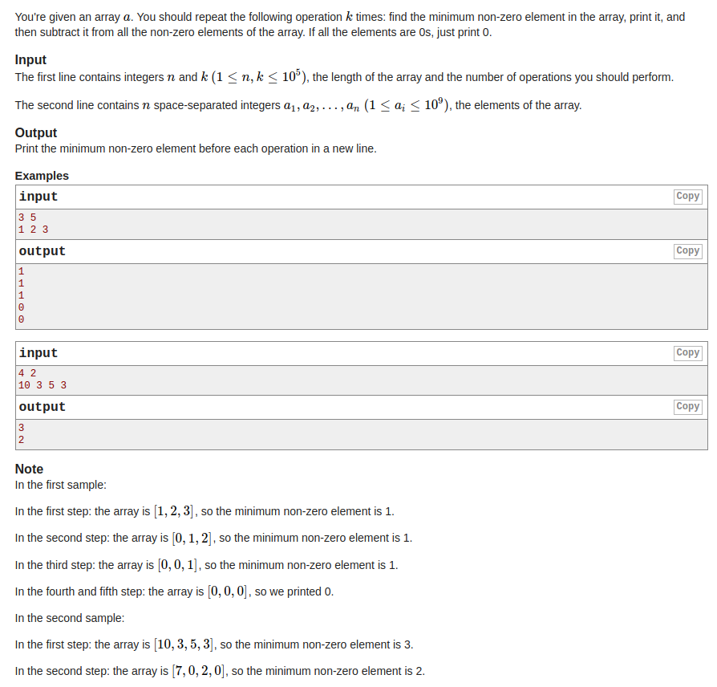

## Codeforces-1088B -  Ehab and subtraction

#### [题目链接](http://codeforces.com/problemset/problem/1088/B)

> http://codeforces.com/problemset/problem/1088/B

#### 题目大意
给你`n`、`k`，以及`n`个数，要你从这`n`个数中选取`k`次，<font color = blue>每次选最小的，并且选完之后所有的数要减去这个选出来的数。</font>如果里面的数都是`0`了，就输出`0`。

#### 解析
先排序，然后模拟这个过程:

* 每次找的时候要找第一个不是`0`的数，如果找到末尾，就输出`0`；
* 设置一个`tmp`变量记录当前数要减去的值，这个`tmp`的值是递增的；
* `tmp`递增之后，每次向后减去和`tmp`相同的所有的值，最后一个`>tmp`的值也减去`tmp`(这个值就是下一次输出的值)；

代码: 
```cpp
#include <bits/stdc++.h>
const int MAX = 100000 + 1;

int main(int argc, char const **argv)
{ 
    std::ios::sync_with_stdio(false);
    std::cin.tie(0);
    int n, k, arr[MAX]; 
    std::cin >> n >> k;
    for(int i = 0; i < n; i++) 
        std::cin >> arr[i];    
    std::sort(arr, arr+n);
    int tmp = 0;
    int pos = 0;
    for(int i = 0; i < k; i++){ 
        while(arr[pos] == 0 && pos < n)
            pos++;
        if(pos == n){ 
            std::cout << 0 << std::endl;
            continue;
        }
        std::cout<< arr[pos] << std::endl;
        tmp += arr[pos];
        pos++;
        while(arr[pos] == tmp) // next equal elements should subtract tmp
            arr[pos++] -= tmp;
        arr[pos] -= tmp; // the last greater than tmp also subtract tmp
    }
    return 0;
}
```
或者稍微改进一下: 
```cpp
#include <bits/stdc++.h>

const int MAX = 100000 + 1;

int main(int argc, char const **argv)
{ 
    std::ios::sync_with_stdio(false);
    std::cin.tie(0);
    int n, k, arr[MAX]; 
    std::cin >> n >> k;
    for(int i = 0; i < n; i++) 
        std::cin >> arr[i];    
    std::sort(arr, arr+n);
    int tmp = 0, pos = 0;
    for(int i = 0; i < k; i++){ 
        while(arr[pos] == tmp && pos < n)
            pos++;
        if(pos == n)
            std::cout << 0 << std::endl;
        else 
            std::cout << arr[pos]-tmp << std::endl;
        tmp = arr[pos];
    }
    return 0;
}
```