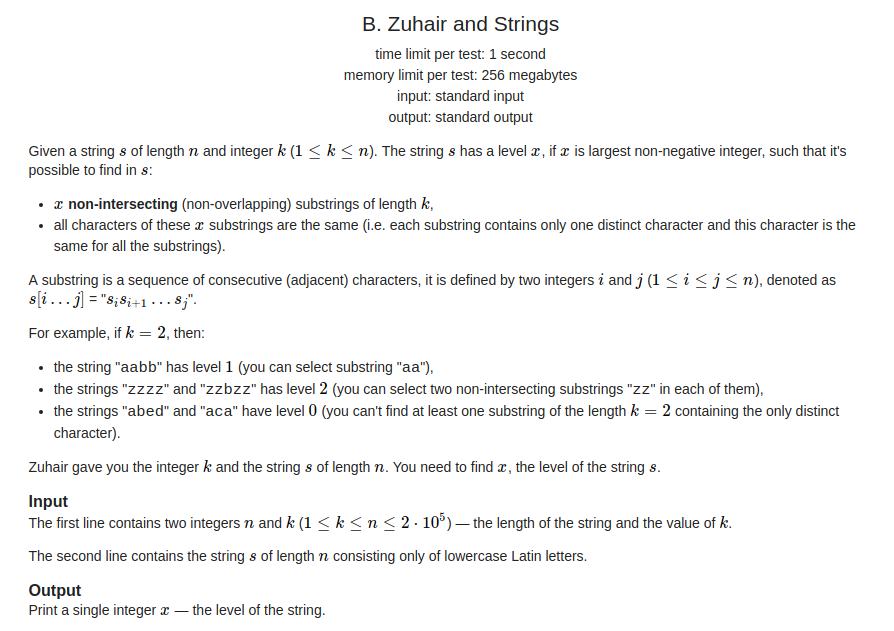

## Codeforces - 1105B. Zuhair and Strings(字符串模拟)
#### [题目链接](https://codeforces.com/contest/1105/problem/B)
#### 题目

给你一个字符串有`n `个字符，给你一个`k`。要你求字符串的等级。

字符串的等级定义为:

* 等级定义为字符串中最大的连续片段的次数；
* 而连续片段就是当有`k`个连续相同的字符的时候，这个字符的连续片段数就`+1`；





#### 解析

思路:

* 遍历字符串，每次看当前字符和前一个字符是否相同，如果相同就累加一个`cnt`遍历，表示当前的相同的数目；
* 如果不同，记得重新置`cnt = 1`；
* 然后判断当前`cnt == k`，如果已经达到`k`，就累加这个字符的等级；
* 最终结果就是在所有的字符的等级中取一个最大的即可；


代码:


```java
import java.io.*;
import java.util.*;

public class Main {

    public static void main(String[] args){
        Scanner in = new Scanner(new BufferedInputStream(System.in));
        PrintStream out = System.out;
        int n = in.nextInt();
        int k = in.nextInt();
        char[] chs = in.next().toCharArray();
        int[] counts = new int[53];
        if(k == 1)
            counts[chs[0] - 'a']++;
        int cnt = 1;
        for(int i = 1 ; i < n; i++){ 
            if(k == 1){ 
                counts[chs[i] - 'a']++;
                continue;
            }
            if(chs[i] == chs[i-1]){ 
                cnt++;
                if(k == cnt){ 
                    counts[chs[i] - 'a']++;
                    chs[i] = '#';  // to be a special character
                    cnt = 1;
                }
            }else // remember this when not consecutive
                cnt = 1;
        }
        long res = 0;
        for(int count : counts) 
            res = Math.max(res, count);
        out.println(res);
    }   
}
```

