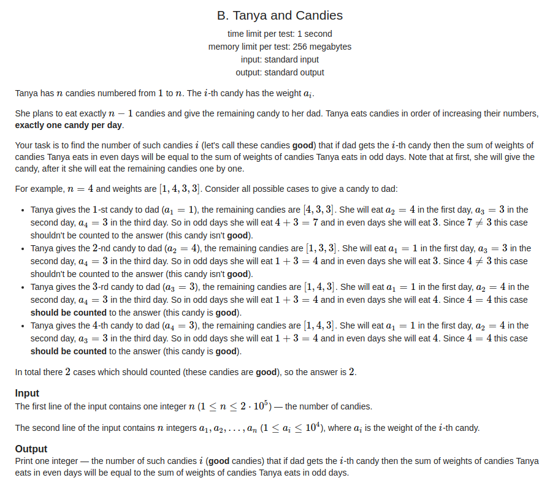
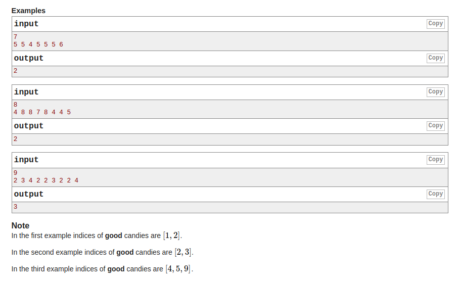
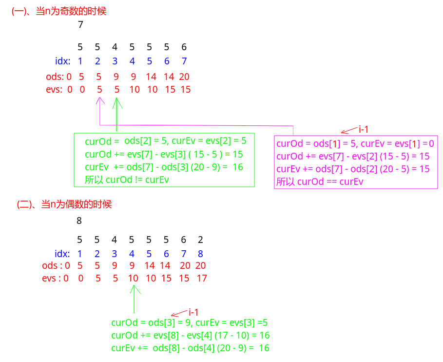

## Codeforces - 1118B. Tanya and Candies(前缀和分奇偶)

#### [题目链接]()

> https://codeforces.com/problemset/problem/1118/B

#### 题目

给你`n`和`n`个数，要你从`n`个数中拿走一个`arr[i]`，然后剩下的`n-1`个数，如果奇数位置上的数的和 等于 偶数位置上的和，那就是一个好的方案，问你这样的`arr[i]`有多少个。






### 解析

这题也比较有意思。

首先看到数据规模肯定需要`O(N)`左右的时间复杂度。

所以我们需要先用类似`sums`数组维护一个前缀和。

但是这个前缀和需要分为奇数和偶数来维护，这里奇数的为`ods`数组，偶数的为`evs`数组。

然后关键的地方:

* 当我们删除`arr[i]`之后，怎么求的这个数组的奇数位置上的和　和　偶数位置上的和呢?
* 先看奇数的：删除`arr[i]`之后，`arr[i]`左边的奇数和为`ods[i-1]`即可。而`arr[i]`右边的呢? 可以通过`evs[n] - evs[i]`得到，因为删除`arr[i]`之后，**后面的奇数部分原先应该恰好是偶数部分**；
* 同理。偶数的：删除`arr[i]`之后，`arr[i]`左边的偶数和为`evs[i-1]`即可。而`arr[i]`右边的呢? 可以通过`ods[n] - ods[i]`得到，因为删除`arr[i]`之后，**后面的偶数部分原先应该恰好是奇数部分**；

举几个例子:



代码:

```java
import java.io.*;
import java.util.*;

public class Main {

    public static void main(String[] args) {
        Scanner in = new Scanner(new BufferedInputStream(System.in));
        PrintStream out = System.out;
        int n = in.nextInt();
        int[] arr = new int[n + 1];
        int[] ods = new int[n + 1]; // 其实可以只开 n/2 + 2即可，但是那样下标会很麻烦，所以直接开n+1了
        int[] evs = new int[n + 1];
        for (int i = 1; i <= n; i++) {
            arr[i] = in.nextInt();
            if (i % 2 == 1) {
                ods[i] = ods[i - 1] + arr[i];
                evs[i] = evs[i - 1];
            } else {
                evs[i] = evs[i - 1] + arr[i];
                ods[i] = ods[i - 1];
            }
        }

//        out.println("ods : " + Arrays.toString(ods));
//        out.println("evs : " + Arrays.toString(evs));

        int cnt = 0;
        for (int i = 1; i <= n; i++) {
            int curOd = ods[i - 1], curEv = evs[i - 1];
            curOd += evs[n] - evs[i]; // 删掉arr[i]之后，后面的变成求偶数的
            curEv += ods[n] - ods[i]; // 同理，变成求奇数的
            if (curOd == curEv) cnt++;
        }
        out.println(cnt);
    }
}

```

