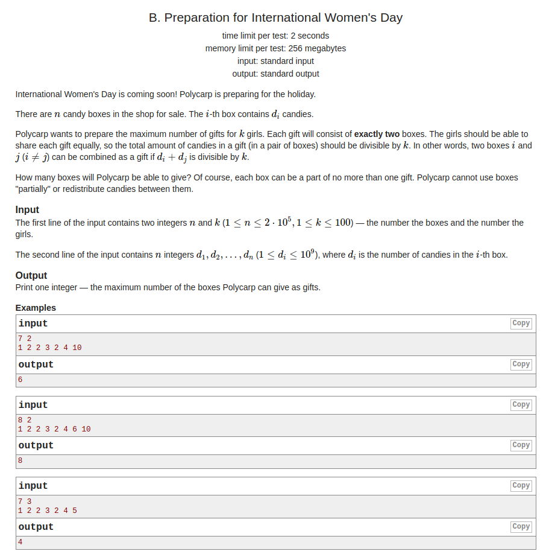

## Codeforces - 1133B. Preparation for International Women's Day(求pair之和整除k的数)

#### [题目链接](https://codeforces.com/contest/1133/problem/B)

https://codeforces.com/contest/1133/problem/B

#### 题目

给你`n、k`，要你从`n`个数中挑出最多的对数，每一对`a[i] + a[j]`要求能整除`k`，问你多少个这样的数(多少对，然后乘2)



#### 解析

很巧妙的解法，先对输入的数取摸，然后计算`min(a[i], a[k-i])`累加个数即可。

```java
import java.io.*;
import java.util.*;

public class Main {

    static PrintStream out = System.out;

    // write code
    static void solve(InputStream stream) {
        Scanner in = new Scanner(new BufferedInputStream(stream));
        int n = in.nextInt();
        int k = in.nextInt();
        int[] c = new int[k+1];
        for(int i = 0; i < n; i++){
            int x = in.nextInt();
            c[x % k]++;
        }
        int res = c[0] / 2; // (0 + m) / 2
        for(int i = 1; i < (k%2 == 1 ? k/2+1 : k/2); i++) //注意分奇数偶数
            res += Math.min(c[i], c[k-i]);
        if( k % 2 == 0) res += c[k/2]/2;
        res *= 2;
        out.println(res);
    }

    public static void main(String[] args) {
        solve(System.in);
    }
}
```

