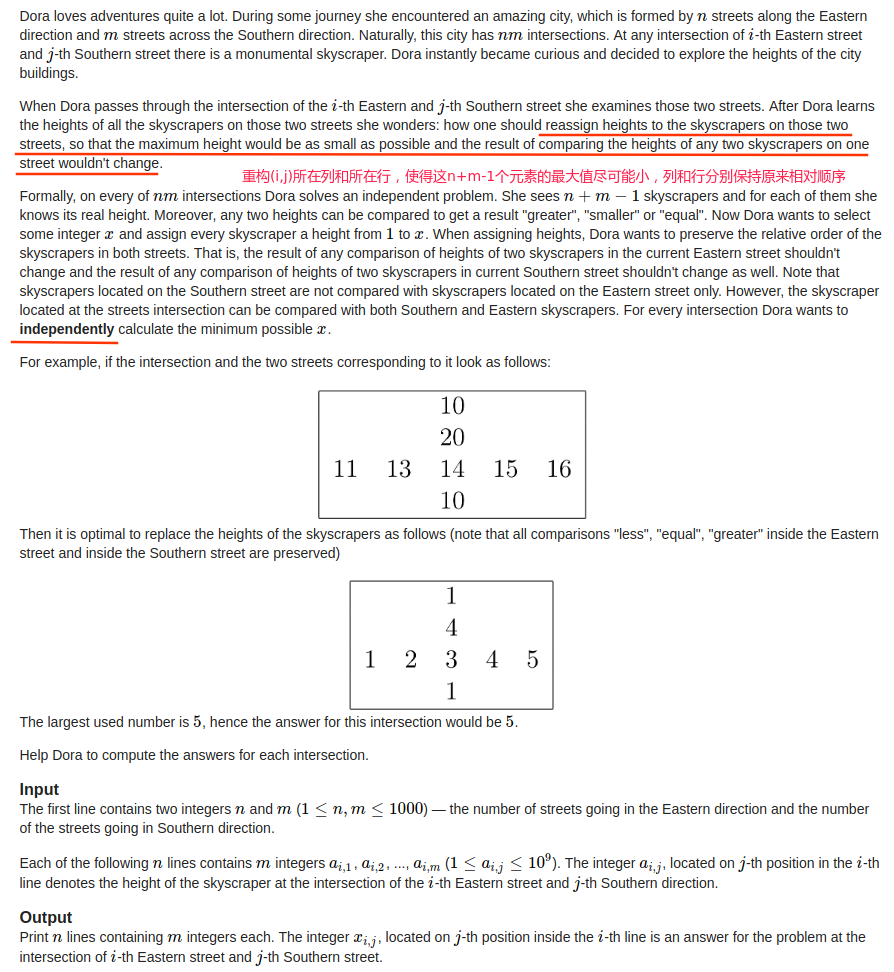
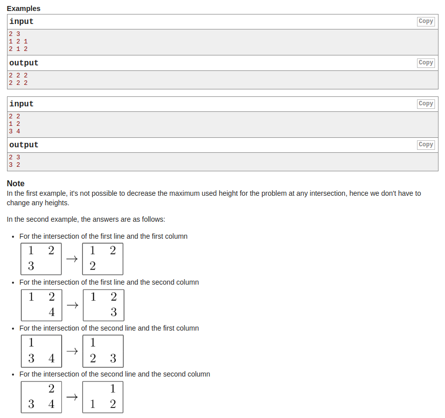

## Codeforces - 1137A. Skyscrapers(排序|二分)

#### [题目链接](https://codeforces.com/problemset/problem/1137/A)

> https://codeforces.com/problemset/problem/1137/A

#### 题目

有一个 `n×m `的矩阵 `a`。

对于每个` (i,j)（1≤i≤n, 1≤i≤n)`，你把第` i`行和第 `j`列单独抽出(`(i, j)`所在行和列)，有 `n+m−1` 个数被抽出。

你可以对这些数**重新标号**为正整数，但是要满足第` i`行所有数的大小关系(相对大小)不变，第` j`列所有数的大小关系不变（两个限制相互独立）。

满足这个限制下，希望最大的标号尽量小，对每个` (i,j) `求出这个最小的最大标号。





### 解析

这题感觉和[NowCoder-发奖金](../../Other/nowcoder/2016校招真题/Nowcoder - 发奖金.md)有点类似。

因为行大小关系不变，列大小关系不变，我们考虑分别考虑每行每列，并统计每个数在行内和列内的排名。

若 `(i,j)` 在行内排名为第 `x` 小，列内排名为第 `y`小，它最优情况下就被标号为` max(x,y)`，然后行内、列内比它大的数依次往大排。

也是用`r1`和`r2`两个分别统计，然后取最大的那个。

```java
import java.io.*;
import java.util.*;

public class Main {

    static Random rnd = new Random();

    static void solve(InputStream is, PrintWriter out) {
//        Scanner in = new Scanner(new BufferedInputStream(is)); // hasNext method use
        FR in = new FR(is);
        /**-------------write code-----------------**/
        int n = in.nextInt();
        int m = in.nextInt();
        int[][] a = new int[n][m];
        for (int i = 0; i < n; i++) for (int j = 0; j < m; j++) a[i][j] = in.nextInt();
        int[][] r1 = new int[n][m], r2 = new int[n][m];
        int[] t1 = new int[n];
        for (int j = 0; j < m; j++) {
            for (int i = 0; i < n; i++)
                t1[i] = a[i][j];
            int cnt = sortUnique(t1);
            for (int i = 0; i < n; i++) {
                int pos = Arrays.binarySearch(t1, 0, cnt, a[i][j]);
                r1[i][j] = pos;
                r2[i][j] = cnt - 1 - pos;
            }
        }
        int[] t2 = new int[m];
        for (int i = 0; i < n; i++) {
            for (int j = 0; j < m; j++)
                t2[j] = a[i][j];
            int cnt = sortUnique(t2);
            for (int j = 0; j < m; j++) {
                int pos = Arrays.binarySearch(t2, 0, cnt, a[i][j]);
                r1[i][j] = Math.max(r1[i][j], pos);
                r2[i][j] = Math.max(r2[i][j], cnt - 1 - pos);
                out.print((r1[i][j] + r2[i][j] + 1) + " ");
            }
            out.println();
        }
    }

    static int sortUnique(int[] arr) {
        for (int i = 0; i < arr.length; i++) {
            int j = rnd.nextInt(i + 1);
            int t = arr[i];
            arr[i] = arr[j];
            arr[j] = t;
        }
        Arrays.sort(arr); // quick sort
        int cnt = 0;
        for (int i = 0; i < arr.length; i++) {
            if (i == 0 || arr[i] != arr[i - 1])
                arr[cnt++] = arr[i];
        }
        return cnt;
    }

    public static void main(String[] args) {
        OutputStream os = System.out;
        InputStream is = System.in;
        PrintWriter out = new PrintWriter(os);
        solve(is, out);
        out.close(); //must close
    }

    // FastReader
    static class FR {
        BufferedReader br;
        StringTokenizer tk;

        FR(InputStream stream) {
            br = new BufferedReader(new InputStreamReader(stream), 32768);
            tk = null;
        }

        String next() {
            while (tk == null || !tk.hasMoreElements()) {
                try {
                    tk = new StringTokenizer(br.readLine());
                } catch (IOException e) {
                    e.printStackTrace();
                }
            }
            return tk.nextToken();
        }

        int nextInt() {
            return Integer.parseInt(next());
        }
    }
}

```

