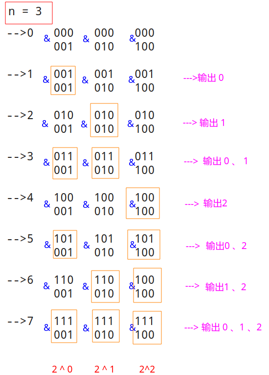
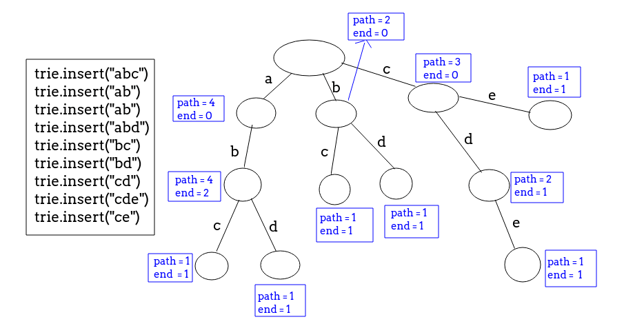
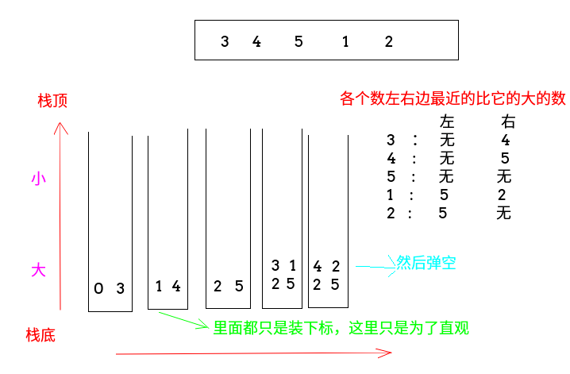
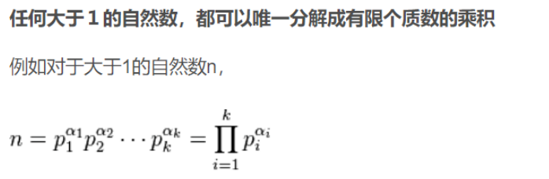

# 面试常见手撕模板题以及笔试模板总结(附带少数ACM入门算法)

现在大部分大厂的笔试面试越来越重视算法。特别是笔试题里面，大部分题型和ACM几乎一样。

所以我在这里总结了一些(30个)常见面试和ACM**入门级别**的算法模板（其实也不只是ACM要求，大部分模板都可以在`LeetCode`中找到对应的题型），有一部分也是面试时候面试官经常要你手撕的经典算法。例如排序、二叉树非递归遍历、二分、大数等。


**可能这些算法有些对初学者有点难度，但是不要慌～...～，我在每个算法代码的上方都给了一个链接，每个算法几乎都有很详细的解释(大部分带图，有些是我写的，有些是我看到的很好的文章)，不懂的可以点链接进行学习，另外有些模板配了原题，可以验证算法正确性。祝大家在笔试面试手撕算法顺利。。^_^**。

当然这些只是我们刷题的基础和模板，**更多的还是需要我们多多刷题**，锻炼逻辑思维和感觉～...～。


语言用的Java，但是大部分代码和C++基本上没啥很大区别～...～。

**如果觉得总结的还不错的话，给个`star`哦*╯3╰ .**

>  仓库会不断更新和完善新的笔试面试中出现的模板^_^。
>
>  如果star比较多的话，我会在近日内出C++版本哦^_^。

## 目录

* [一、排序](#一排序)
* [二、二分](#二二分)
* [三、二叉树非递归遍历](#三二叉树非递归遍历)
* [四、01背包](#四01背包)
* [五、最长递增子序列](#五最长递增子序列)
* [六、最长公共子序列](#六最长公共子序列)
* [七、最长公共子串](#七最长公共子串)
* [八、大数加法](#八大数加法)
* [九、大数乘法](#九大数乘法)
* [十、大数阶乘](#十大数阶乘)
* [十一、全排列](#十一全排列)
* [十二、子集](#十二子集)
* [十三、N皇后](#十三n皇后)
* [十四、并查集](#十四并查集)
* [十五、树状数组](#十五树状数组)
* [十六、线段树](#十六线段树)
* [十七、字典树](#十七字典树)
* [十八、单调栈](#十八单调栈)
* [十九、单调队列](#十九单调队列)
* [二十、KMP](#二十kmp)
* [二十一、Manacher算法](#二十一manacher算法)
* [二十二、拓扑排序](#二十二拓扑排序)
* [二十三、最小生成树](#二十三最小生成树)
* [二十四、最短路](#二十四最短路)
* [二十五、欧拉回路](#二十五欧拉回路)
* [二十六、GCD和LCM](#二十六gcd和lcm)
* [二十七、素数筛法](#二十七素数筛法)
* [二十八、唯一分解定理](#二十八唯一分解定理)
* [二十九、乘法快速幂](#二十九乘法快速幂)
* [三十、矩阵快速幂](#三十矩阵快速幂)

## Java快速输入

先给一个干货，可能有些题用Java会超时（很少），下面是[Petr](https://en.wikipedia.org/wiki/Petr_Mitrichev)刷题时的模板，一般用了这个就不会出现C++能过Java不能过的情况了。

```java
import java.io.*;
import java.util.*;

public class Main {

    static class FR {
        BufferedReader br;
        StringTokenizer tk;

        FR(InputStream stream) {
            br = new BufferedReader(new InputStreamReader(stream), 32768);
            tk = null;
        }

        String next() {
            while (tk == null || !tk.hasMoreElements()) {
                try {
                    tk = new StringTokenizer(br.readLine());
                } catch (IOException e) {
                    e.printStackTrace();
                }
            }
            return tk.nextToken();
        }

        int nextInt() {
            return Integer.parseInt(next());
        }
    }

    static void solve(InputStream stream, PrintWriter out) {
        FR in = new FR(stream);

        //  start code.....

    }

    public static void main(String[] args) {
        OutputStream os = System.out;
        InputStream is = System.in;
        PrintWriter out = new PrintWriter(os);
        solve(is, out);
        out.close(); // 不关闭就没有输出
    }
}
```


## 一、排序

先给出一个swap函数，代表交换数组两个位置的值，很多排序用到这个函数:

```java
static void swap(int[] arr, int a, int b){
    int t = arr[a];
    arr[a] = arr[b];
    arr[b] = t;
}
```

面试主要考察**比较排序**(`O(N^2)、O(NlogN)`)排序(非比较排序可以看下面的详细总结)。给出两篇博客:

* [各种排序算法总结](https://github.com/ZXZxin/ZXBlog/blob/master/%E6%95%B0%E6%8D%AE%E7%BB%93%E6%9E%84%E7%AE%97%E6%B3%95/Algorithm/Sort/%E5%90%84%E7%A7%8D%E6%8E%92%E5%BA%8F%E7%AE%97%E6%B3%95%E6%80%BB%E7%BB%93(%E5%85%A8%E9%9D%A2).md)；
* [动图搞定排序算法](https://mp.weixin.qq.com/s/vn3KiV-ez79FmbZ36SX9lg)；

### 1、冒泡

```java
static void bubbleSort(int[] arr){
    for(int end = arr.length - 1; end > 0; end--){
        boolean isSort = true;
        for(int i = 0; i < end; i++){
            if(arr[i] > arr[i+1]) {
                swap(arr, i, i + 1);
                isSort = false;
            }
        }
        if(isSort) break;
    }
}
```

### 2、选择

```java
static void selectSort(int[] arr){
    for(int i = 0; i < arr.length; i++){
        int minIdx = i;
        for(int j = i + 1; j < arr.length; j++) minIdx = arr[j] < arr[minIdx] ? j : minIdx;
        swap(arr, minIdx, i);
    }
}
```

### 3、插入

```java
// 几个边界: i=1开始(不是必须)、j >= 0, arr[j+1] = key注意一下
static void insertSort(int[] arr) {
    for (int i = 1; i < arr.length; i++) {
        int key = arr[i], j;
        for (j = i - 1; j >= 0 && arr[j] > key; j--) arr[j + 1] = arr[j];
        arr[j + 1] = key;
    }
}
```

第二种写法:

```java
// 边界 j > 0
static void insertSort2(int[] arr) {
    for (int i = 1; i < arr.length; i++) {
        for (int j = i; j > 0 && arr[j - 1] > arr[j]; j--) swap(arr, j, j - 1);
    }
}
```

二分插入排序:

```java
// 注意 R = i-1，注意找第一个>=key的，注意arr[i]先用key保存
static void binaryInsertSort(int[] arr) {
    for (int i = 1; i < arr.length; i++) {
        int L = 0, R = i - 1;
        // 找第一个大于的 二分边界搞不清的看下面的二分链接
        int key = arr[i];
        while (L <= R) {
            int m = L + (R - L) / 2;
            if (arr[m] > arr[i]) {
                R = m - 1;
            } else {
                L = m + 1;
            }
        }
        for (int j = i - 1; j >= L; j--) arr[j + 1] = arr[j];
        arr[L] = key;
    }
}
```

### 4、希尔排序

采取的是**增量序列每次减半**的策略。

```java
static void shellSort(int[] arr) {
    for (int g = arr.length; g > 0; g /= 2) { // 增量序列 gap
        for (int end = g; end < arr.length; end++) { // 每一个组的结束元素, 从数组第gap个元素开始
            // 每组没做插入排序
            int key = arr[end], i;
            for (i = end - g; i >= 0 && key < arr[i]; i -= g) arr[i + g] = arr[i];
            arr[i + g] = key;
        }
    }
}
```

### 5、快排

给出的是三路快排，其他的看我给的博客。

```java
static void quickSort(int[] arr){
    if(arr == null || arr.length == 0) return;
    quickRec(arr, 0, arr.length - 1);
}

static void quickRec(int[] arr, int L, int R) {
    if (L >= R) return;
    swap(arr, L, L + (int) (Math.random() * (R - L + 1)));
    int[] p = partition(arr, L, R);
    quickRec(arr, L, p[0] - 1);
    quickRec(arr, p[1] + 1, R);
}

// 用arr[L]作为划分点
static int[] partition(int[] arr, int L, int R) {
    int key = arr[L];
    int less = L, more = R + 1;
    int cur = L + 1;
    while (cur < more) {
        if (arr[cur] < key) {
            swap(arr, ++less, cur++);
        } else if (arr[cur] > key) {
            swap(arr, --more, cur);
        } else {
            cur++;
        }
    }
    swap(arr, L, less);
    // 返回相等的两个下标，　less位置是我最后交换过来的花粉值，more位置是>的，所以返回more-1
    return new int[]{less, more - 1};
}
```

### 6、归并排序

```java
static void mergeSort(int[] arr){
    if(arr == null || arr.length == 0) return;
    mergeRec(arr, 0, arr.length - 1);
}

//注意是mergeSort(arr, L, m); 不是mergeSort(arr, L, m-1)
static void mergeRec(int[] arr, int L, int R) {
    if (L >= R) return;
    int m = L + (R - L) / 2;
    mergeRec(arr, L, m);
    mergeRec(arr, m + 1, R);
    merge(arr, L, m, R);
}

static void merge(int[] arr, int L, int mid, int R) {
    int[] h = new int[R - L + 1];
    int p1 = L, p2 = mid + 1;
    int k = 0;
    while (p1 <= mid && p2 <= R)
        h[k++] = arr[p1] <= arr[p2] ? arr[p1++] : arr[p2++];  // 注意保证稳定性
    while (p1 <= mid) h[k++] = arr[p1++];
    while (p2 <= R) h[k++] = arr[p2++];
    for (int i = 0; i < k; i++) arr[L + i] = h[i];
}
```

非递归归并排序: 

```java
static void mergeSortBU(int[] arr) {
    for (int sz = 1; sz <= arr.length; sz += sz) { // 区间的个数，1..2..4..8
        for (int i = 0; sz + i < arr.length; i += sz + sz) {  // 对[i...i+sz-1]和[i+sz...i+2*sz-1]内归并
            merge(arr, i, i + sz - 1, Math.min(arr.length - 1, i + 2 * sz - 1)); // min防止越界
        }
    }
}
```

### 7、堆排

```java
// if(arr == null || arr.length <= 1) return; 是必须的
static void heapSort(int[] arr) {
    if (arr == null || arr.length <= 1) return;
    for (int i = 0; i < arr.length; i++) siftUp(arr, i);//上浮方式建堆
    int size = arr.length - 1;
    swap(arr, 0, size);
    while (size > 0) {
        siftDown(arr, 0, size);
        swap(arr, 0, --size);
    }
}

// 上浮
static void siftUp(int[] arr, int i) {
    while (arr[i] > arr[(i - 1) / 2]) {
        swap(arr, i, (i - 1) / 2);
        i = (i - 1) / 2;
    }
}

// 下沉
static void siftDown(int[] arr, int i, int heapSize) {
    int L = 2 * i + 1;
    while (L < heapSize) {
        int maxIndex = L + 1 < heapSize && arr[L + 1] > arr[L] ? L + 1 : L;
        maxIndex = arr[i] > arr[maxIndex] ? i : maxIndex;
        if (maxIndex == i) break;
        swap(arr, i, maxIndex);
        i = maxIndex;
        L = 2 * i + 1;
    }
}
```

第二种方式，使用heapfiy的优化，只需要使用`siftDown`过程即可。

```java
// 注意这里是size+1,因为这个不是交换了最后一个，所以要考虑arr[size]，下面不要考虑arr[size]
//   if (arr == null || arr.length <= 1) return; 是必须的
static void heapSort2(int[] arr) {
    if (arr == null || arr.length <= 1) return;
    int size = arr.length - 1;
    for (int i = (size - 1) / 2; i >= 0; i--)
        siftDown(arr, i, size + 1);
    swap(arr, 0, size);
    while (size > 0) {
        siftDown(arr, 0, size);
        swap(arr, 0, --size);
    }
}
```

其中`siftDown`过程也可以使用递归的写法: 

```java
static void siftDown(int[] arr, int i, int heapSize) { //从A[i] 开始往下调整
    int L = 2 * i + 1;
    int R = 2 * i + 2;
    int maxIdx = i;
    if (L < heapSize && arr[L] > arr[maxIdx]) maxIdx = L;
    if (R < heapSize && arr[R] > arr[maxIdx]) maxIdx = R;
    if (maxIdx != i) {
        swap(arr, i, maxIdx);
        siftDown(arr, maxIdx, heapSize);
    }
}
```

## 二、二分

给出我的[另一篇文章](https://github.com/ZXZxin/ZXBlog/blob/master/%E6%95%B0%E6%8D%AE%E7%BB%93%E6%9E%84%E7%AE%97%E6%B3%95/Algorithm/BinarySearch/%E4%BA%8C%E5%88%86%E6%9F%A5%E6%89%BE%E7%9A%84%E6%80%BB%E7%BB%93(6%E7%A7%8D%E5%8F%98%E5%BD%A2).md)，有关于二分的详细讲解。

二分最主要的就是边界问题: 

* 第一个`=key`的，不存在返回`-1`；
* 第一个`>=key`的；
* 第一个`>key`的；
* 最后一个`=key`的；
* 最后一个`<=key`的；
* 最后一个`<key`的；

最基本的二分查找: 

```java
static int b(int[] arr, int key){
    int L = 0, R = arr.length - 1;
    while(L <= R){
        int mid = L + (R - L) / 2;
        if(arr[mid] == key) return mid;
        if(arr[mid] > key)
            R = mid - 1;
        else
            L = mid + 1;
    }
    return -1;
}
```

**口诀: 左边的先R(`if`后的)，右边的先L**。

查找第一个`=key`的，不存在返回`-1`:

```java
// 左边的三个， 注意是L < arr.length
static int firstEqual(int[] arr, int key){
    int L = 0, R = arr.length - 1;
    while(L <= R){
        int mid = L + (R - L) / 2;
        if(arr[mid] >= key)
            R = mid - 1;
        else
            L = mid + 1;
    }
    if(L < arr.length && arr[L] == key) return L;
    return -1;
}
```

第一个`>=key`的: 

```java
static int firstLargeEqual(int[] arr, int key){
    int L = 0, R = arr.length - 1;
    while(L <= R){
        int mid = L + (R - L) / 2;
        if(arr[mid] >= key)
            R = mid - 1;
        else
            L = mid + 1;
    }
    return L;
}
```

第一个`>key`的: 

```java
static int firstLarge(int[] arr, int key){
    int L = 0, R = arr.length - 1;
    while(L <= R){
        int mid = L + (R - L) / 2;
        if(arr[mid] > key) // 因为是第一个> 的，所以>
            R = mid - 1;
        else
            L = mid + 1;
    }
    return L;
}
```

最后一个`=key`的:

```java
// 右边的三个 注意是 R>=0
static int lastEqual(int[] arr, int key){
    int L = 0, R = arr.length - 1;
    while(L <= R){
        int mid = L + (R - L) / 2;
        if(arr[mid] <= key)
            L = mid + 1;
        else
            R = mid - 1;
    }
    if(R >= 0 && arr[R] == key)
        return R;
    return -1;
}
```

最后一个`<=key`的:

```java
static int lastEqualSmall(int[] arr, int key){
    int L = 0, R = arr.length - 1;
    while(L <= R){
        int mid = L + (R - L) / 2;
        if(arr[mid] <= key)
            L = mid + 1;
        else
            R = mid - 1;
    }
    return R;
}
```

最后一个`<key`的:

```java
static int lastSmall(int[] arr, int key){
    int L = 0, R = arr.length - 1;
    while(L <= R){
        int mid = L + (R - L) / 2;
        if(arr[mid] < key)
            L = mid + 1;
        else
            R = mid - 1;
    }
    return R;
}
```

## 三、二叉树非递归遍历

我的[另一篇博客](https://github.com/ZXZxin/ZXBlog/blob/master/%E6%95%B0%E6%8D%AE%E7%BB%93%E6%9E%84%E7%AE%97%E6%B3%95/Tree/%E4%BA%8C%E5%8F%89%E6%A0%91%E7%9A%84%E5%90%84%E7%A7%8D%E6%93%8D%E4%BD%9C(%E9%80%92%E5%BD%92%E5%92%8C%E9%9D%9E%E9%80%92%E5%BD%92%E9%81%8D%E5%8E%86,%E6%A0%91%E6%B7%B1%E5%BA%A6,%E7%BB%93%E7%82%B9%E4%B8%AA%E6%95%B0%E7%AD%89%E7%AD%89).md)有详细讲解建树，遍历，以及相关基础二叉树问题。

这里给出一种非递归前序遍历、非递归中序、以及两种非递归后序遍历。

```java
public class M3_BinaryTree {

    static PrintStream out = System.out; //打印

    static class Node{
        int val;
        Node left;
        Node right;

        public Node(int val) {
            this.val = val;
        }
    }

    static Node buildTree(int[] arr, int i){
        if(i >= arr.length || arr[i] == -1) return null;
        Node root = new Node(arr[i]);
        root.left = buildTree(arr, i * 2 + 1);
        root.right = buildTree(arr, i * 2 + 2);
        return root;
    }

    static Node buildTree(Scanner in){
        Node root = null;
        int val = in.nextInt();
        if(val != -1){
            root = new Node(val);
            root.left = buildTree(in);
            root.right = buildTree(in);
        }
        return root;
    }

    //前序
    static void preOrder(Node root){
        if(root == null) return;
        Stack<Node> stack = new Stack<>();
        Node p = root;
//        stack.push(root); // wrong
        while(p != null || !stack.isEmpty()){
            while(p != null){
                out.print(p.val + " ");
                stack.push(p); // 注意先推入
                p = p.left;
            }
            p = stack.pop();
            p = p.right;
        }
        out.println();
    }

    //中序
    static void inOrder(Node root){
        if(root == null) return;
        Stack<Node> stack = new Stack<>();
        Node p = root;
        while(p != null || !stack.isEmpty()){
            while(p != null){
                stack.push(p);
                p = p.left;
            }
            p = stack.pop();
            out.print(p.val + " ");
            p = p.right;
        }
        out.println();
    }


    //后序第一种: 双栈: 可以实现 中-> 右-> 左, 然后再用一个栈逆转即可
    static void postOrder(Node root){
        if(root == null) return;
        Node p = root;
        Stack<Node> s1 = new Stack<>();
        Stack<Node> s2 = new Stack<>();
        s1.push(root);
        while(!s1.isEmpty()){
            Node cur = s1.pop();
            s2.push(cur);
            if(cur.left != null ) s1.push(cur.left);
            if(cur.right != null ) s1.push(cur.right);
        }
        while(!s2.isEmpty()) out.print(s2.pop().val + " ");
        out.println();
    }


    // 后序第二种pre
    static void postOrder2(Node root){
        Stack<Node> s = new Stack<>();
        s.push(root);
        Node pre = null;
        while(!s.isEmpty()){
            Node cur = s.peek();
            if((cur.left == null && cur.right == null) ||
                    (pre != null && (pre == cur.left || pre == cur.right))){
                out.print(cur.val + " ");
                s.pop();
                pre = cur;
            }else {
                if(cur.right != null) s.push(cur.right);
                if(cur.left != null) s.push(cur.left);
            }
        }
        out.println();
    }

    public static void main(String[] args){
        //int[] arr = {1,2,3,4,5,6,7,8,-1,9,-1,10,-1,11,-1, -1,-1,-1,-1,-1,-1,-1,-1}; // 和下面一样
        int[] arr = {1, 2, 3, 4, 5, 6, 7, 8, -1, 9, -1, 10, -1, 11, -1};
        Node root = buildTree(arr, 0);

        preOrder(root);
        inOrder(root);
        postOrder(root);
        postOrder2(root);

//      Scanner in = new Scanner(new BufferedInputStream(System.in));
//      树结构和上面相同,输入: 1 2 4 8 -1 -1 -1 5 9 -1 -1 -1 3 6 10 -1 -1 -1 7 11 -1 -1 -1
//      Node root2 = buildTree(in);
    }
}
```

## 四、01背包

这个在笔试题中可能会出现，有时候只是出题场景不同。

同样也给出我的[另一篇博客](https://github.com/ZXZxin/ZXBlog/blob/master/%E5%88%B7%E9%A2%98/Other/Hdu/DP/Hdu%20-%202602.%20Bone%20Collector(01%E8%83%8C%E5%8C%85%E9%97%AE%E9%A2%98).md)的总结。

```java
import java.io.*;
import java.util.*;

/**
 * 01背包
 * 题目: http://acm.hdu.edu.cn/showproblem.php?pid=2602
 */
public class M4_Knapsack {

    static int n, C;
    static int[] w, v;
    static int[][] dp;

    //记忆化
    static int rec(int p, int curW) {
        if (p == n)
            return 0;
        if (dp[p][curW] != -1) return dp[p][curW];
        if (curW + w[p] > C)
            return dp[p][curW] = rec(p + 1, curW);
        else
            return dp[p][curW] = Math.max(rec(p + 1, curW + w[p]) + v[p],
                    rec(p + 1, curW));
    }

    // 普通
    static int dp(){
        int[][] dp = new int[n+1][C+1];
        for(int i = n - 1; i >= 0; i--){
            for(int j = 0; j <= C; j++){
                dp[i][j] = j + w[i] > C ? dp[i+1][j] :
                        Math.max(dp[i+1][j], dp[i+1][j+w[i]]+v[i]);
            }
        }
        return dp[0][0];
    }

    // 二维滚动
    static int dp2(){
        int[][] dp = new int[2][C+1];
        for(int i = n - 1; i >= 0; i--){
            for(int j = 0; j <= C; j++){
                dp[i&1][j] = j + w[i] > C ? dp[(i+1)&1][j] :
                        Math.max(dp[(i+1)&1][j], dp[(i+1)&1][j+w[i]]+v[i]);
            }
        }
        return dp[0][0];
    }

    // 一维dp
    static int dp3(){
        int[] dp = new int[C + 1];
        for (int i = n - 1; i >= 0; i--) {
            for (int j = 0; j <= C; j++) { // 注意顺序一定要这样
                dp[j] = j + w[i] > C ? dp[j] : Math.max(dp[j], dp[j + w[i]] + v[i]);
            }
        }
        return dp[0];
    }

    public static void main(String[] args) {
        Scanner in = new Scanner(new BufferedInputStream(System.in));
        PrintWriter out = new PrintWriter(System.out);
        int T = in.nextInt();
        for (int t = 0; t < T; t++) {
            n = in.nextInt();
            C = in.nextInt();
            w = new int[n];
            v = new int[n];
            for (int i = 0; i < n; i++) v[i] = in.nextInt();
            for (int i = 0; i < n; i++) w[i] = in.nextInt();
            dp = new int[n][C + 1];
            for (int i = 0; i < n; i++) Arrays.fill(dp[i], -1);
//            out.println(rec(0, 0));
//            out.println(dp());
//            out.println(dp2());
            out.println(dp3());
            out.flush();
        }
        out.close();
    }
}
```

## 五、最长递增子序列

这个也是笔试中可能出现变种的题目的。

[详细讲解博客](https://github.com/ZXZxin/ZXBlog/blob/master/%E5%88%B7%E9%A2%98/LeetCode/DP/LeetCode%20-%20354.%20Russian%20Doll%20Envelopes%E5%8F%8A%E6%9C%80%E9%95%BF%E4%B8%8A%E5%8D%87%E5%AD%90%E5%BA%8F%E5%88%97%E9%97%AE%E9%A2%98%E6%80%BB%E7%BB%93.md)。

```java
import java.io.PrintWriter;
import java.util.Arrays;

/**
 * 最长公共子序列
 * 题目: https://leetcode-cn.com/problems/longest-increasing-subsequence/
 */
public class M5_LIS {

    // O(N^2)
    public int lengthOfLIS(int[] nums){
        if(nums == null || nums.length == 0) return 0;
        int[] dp = new int[nums.length];
        int res = 1;
        for(int i = 0; i < nums.length; i++){
            dp[i] = 1;
            for(int j = 0; j < i; j++){
                if(nums[j] < nums[i])
                    dp[i] = Math.max(dp[i], dp[j] + 1);
            }
            res = Math.max(res, dp[i]);
        }
        return res;
    }

    // O(N^2)
    static int[] getDp(int[] nums){
        if(nums == null || nums.length == 0) return new int[]{};
        int[] dp = new int[nums.length];
        for(int i = 0; i < nums.length; i++){
            dp[i] = 1;
            for(int j = 0; j < i; j++){
                if(nums[j] < nums[i])
                    dp[i] = Math.max(dp[i], dp[j] + 1);
            }
        }
        return dp;
    }

    static int[] getLIS(int[] arr, int[] dp){
        int maxLen = 0, end = 0;
        for(int i = 0; i < dp.length; i++) if(dp[i] > maxLen){
            maxLen = dp[i];
            end = i;
        }
        int[] lis = new int[maxLen];
        lis[--maxLen] = arr[end];
        for(int i = end - 1; i >= 0; i--){
            if(dp[i] == dp[end] - 1 && arr[i] < arr[end]){
                lis[--maxLen] = arr[i];
                end = i;
            }
        }
        return lis;
    }

    // O(N * logN)
    public int lengthOfLIS2(int[] nums) {
        if (nums == null || nums.length == 0)
            return 0;
        int[] dp = new int[nums.length];
        int[] ends = new int[nums.length + 1];
        dp[0] = 1;
        ends[1] = nums[0];
        int right = 1;  // [1~right]为有效区　ends数组是有序的(升序), right是右边界
        int L, mid, R;
        for (int i = 1; i < nums.length; i++) {
            L = 1;
            R = right;
            // 找到第一个>=arr[i]的，返回结果是 L
            while (L <= R) {
                mid = L + (R - L) / 2;
                if (ends[mid] >= nums[i])
                    R = mid - 1;
                else
                    L = mid + 1;
            }
            // 说明以arr[i]以arr[i]结尾的最长递增子序列=ends区有效长度+1
            if (L > right) { //没有找到arr[i]是最长的 (因为下标从1开始，所以判断是>right),
                dp[i] = right + 1;
                ends[right + 1] = nums[i]; // 扩大ends数组
                right += 1;  //扩大有效区
            } else {  // 找到了arr[l] > arr[i], 更新end[l] = arr[i] ,表示l长度的最长子序列结尾可以更新为arr[i]
                dp[i] = right; // dp[i]还是没有加长
                ends[L] = nums[i];
            }
        }
        return right;
    }


    public static void main(String[] args){
        PrintWriter out = new PrintWriter(System.out);
        int[] arr = {10,9,2,5,3,7,101,18};
        out.println(Arrays.toString(getLIS(arr, getDp(arr))));

        out.close();
    }
}
```

## 六、最长公共子序列

也是笔试中可能出现的经典DP题目。

[详细讲解博客](https://github.com/ZXZxin/ZXBlog/blob/master/%E6%95%B0%E6%8D%AE%E7%BB%93%E6%9E%84%E7%AE%97%E6%B3%95/DP/51Nod%20-%201006.%20%E6%9C%80%E9%95%BF%E5%85%AC%E5%85%B1%E5%AD%90%E5%BA%8F%E5%88%97LCS%20%E5%92%8C%20%E6%9C%80%E9%95%BF%E5%85%AC%E4%BC%97%E5%AD%90%E4%B8%B2.md)

```java
import java.io.BufferedInputStream;
import java.util.Scanner;

/**
 * 最长公共子串
 * 题目: http://www.51nod.com/Challenge/Problem.html#!#problemId=1006
 */
public class M6_LCS {

    /**
     * dp[i][j]代表的是 str[0..i]与str[0...j]的最长公共子序列
     */
    static int[][] getDp(char[] s1, char[] s2) {
        int n1 = s1.length, n2 = s2.length;
        int[][] dp = new int[n1][n2];
        dp[0][0] = s1[0] == s2[0] ? 1 : 0;
        for (int i = 1; i < n1; i++)  // 一旦dp[i][0]被设置成1,则dp[i~N-1][0]都为1
            dp[i][0] = Math.max(dp[i - 1][0], s1[i] == s2[0] ? 1 : 0);
        for (int j = 1; j < n2; j++)
            dp[0][j] = Math.max(dp[0][j - 1], s2[j] == s1[0] ? 1 : 0);

        for (int i = 1; i < n1; i++) {
            for (int j = 1; j < n2; j++) {
                dp[i][j] = Math.max(dp[i - 1][j], dp[i][j - 1]);
                if (s1[i] == s2[j]) {
                    dp[i][j] = Math.max(dp[i][j], dp[i - 1][j - 1] + 1);
                }
            }
        }
        return dp;
    }

    static String getLCS(char[] s1, char[] s2, int[][] dp) {
        if(s1 == null || s1.length == 0 || s2 == null || s2.length == 0)
            return "";
        int i = s1.length - 1;
        int j = s2.length - 1;
        char[] res = new char[dp[i][j]]; //生成答案的数组
        int index = dp[i][j] - 1;
        while (index >= 0) {
            if (i > 0 && dp[i][j] == dp[i - 1][j]) {
                i--;
            } else if (j > 0 && dp[i][j] == dp[i][j - 1]) {
                j--;
            } else { // dp[i][j] = dp[i-1][j-1]+1
                res[index--] = s1[i];
                i--;
                j--;
            }
        }
        return String.valueOf(res);
    }

    public static void main(String[] args) {
        Scanner in = new Scanner(new BufferedInputStream(System.in));
        char[] s1 = in.next().toCharArray();
        char[] s2 = in.next().toCharArray();

        int[][] dp = getDp(s1, s2);
//        System.out.println(dp[s1.length-1][s2.length-1]); //length of lcs
        System.out.println(getLCS(s1, s2, dp));
    }
}
```

## 七、最长公共子串

同理，也是可能出现的。

[详细讲解博客](https://github.com/ZXZxin/ZXBlog/blob/master/%E6%95%B0%E6%8D%AE%E7%BB%93%E6%9E%84%E7%AE%97%E6%B3%95/DP/51Nod%20-%201006.%20%E6%9C%80%E9%95%BF%E5%85%AC%E5%85%B1%E5%AD%90%E5%BA%8F%E5%88%97LCS%20%E5%92%8C%20%E6%9C%80%E9%95%BF%E5%85%AC%E4%BC%97%E5%AD%90%E4%B8%B2.md)。

```java
/**
 * 最长公共子串问题
 * 题目: https://www.nowcoder.com/questionTerminal/02e7cc263f8a49e8b1e1dc9c116f7602?toCommentId=1532408
 */
public class M7_LSS {

    public int findLongest(String A, int n, String B, int m) {
        char[] s1 = A.toCharArray();
        char[] s2 = B.toCharArray();
        int[][] dp = new int[s1.length][s2.length];
        for (int i = 0; i < s1.length; i++) //注意和最长公共子序列有点不同
            dp[i][0] = s1[i] == s2[0] ? 1 : 0;
        for (int j = 0; j < s2.length; j++)
            dp[0][j] = s1[0] == s2[j] ? 1 : 0;
        int res = 0;
        for (int i = 1; i < s1.length; i++) {
            for (int j = 1; j < s2.length; j++) {
                if (s1[i] == s2[j]) {
                    dp[i][j] = dp[i - 1][j - 1] + 1;
                    res = Math.max(res, dp[i][j]);
                }
            }
        }
        return res;  //dp数组中的最大值，就是最大公共字串的长度
    }

    static int[][] getDp(char[] s1, char[] s2) {
        int[][] dp = new int[s1.length][s2.length];
        for (int i = 0; i < s1.length; i++) //注意和最长公共子序列有点不同
            dp[i][0] = s1[i] == s2[0] ? 1 : 0;
        for (int j = 0; j < s2.length; j++)
            dp[0][j] = s1[0] == s2[j] ? 1 : 0;
        int res = 0;
        for (int i = 1; i < s1.length; i++) {
            for (int j = 1; j < s2.length; j++) {
                if (s1[i] == s2[j]) {
                    dp[i][j] = dp[i - 1][j - 1] + 1;
                    res = Math.max(res, dp[i][j]);
                }
            }
        }
        System.out.println(res);  //4
        return dp;  //dp数组中的最大值，就是最大公共字串的长度
    }

    /**
     * 根据dp表得到答案
     */
    static String getLongestSubstring(String s1, String s2, int[][] dp) {
        if (s1 == null || s2 == null || s1.length() == 0 || s2.length() == 0)
            return "";
        int max = 0, end = 0;
        for (int i = 0; i < dp.length; i++) {
            for (int j = 0; j < dp[0].length; j++) {
                if (dp[i][j] > max) {
                    max = dp[i][j];
                    end = i;
                }
            }
        }
        return s1.substring(end - max + 1, end + 1);
    }

    // 空间优化
    public int findLongest(String A, String B) {
        char[] s1 = A.toCharArray();
        char[] s2 = B.toCharArray();
        int row = 0, col = s2.length - 1; //从右上角开始
        int max = 0, end = 0;     //记录最大长度和结束位置
        while (row < s1.length) {
            int i = row, j = col;
            int ul = 0;
            while (i < s1.length && j < s2.length) {
                if (s1[i] == s2[j])
                    ul++;
                else
                    ul = 0;
                if (ul > max) {
                    max = ul;
                    end = i;
                }
                i++;
                j++;
            }
            if (col > 0) // 还没到最左边 -->　往左移动
                col--;
            else
                row++;  //到了最左  --> 往下移动
        }
        return max;
        //return sa.substring(end-max+1, end+1); // [end-max+1, end] 返回公共子串
    }
}
```

## 八、大数加法

这个在拼多多的笔试中就出现过。。。

可以看[这篇博客](https://www.cnblogs.com/wuqianling/p/5387099.html)吧，比较简单，就没有自己写了。

```java
public class M8_BigAdd {

    //大数加法
    static String add(String str1, String str2){
        char[] s1 = str1.toCharArray();
        char[] s2 = str2.toCharArray();
        int n1 = s1.length, n2 = s2.length;
        int maxL = Math.max(n1, n2);
        int[] a = new int[maxL + 1];//注意a,b的数组大小都必须是maxL+1
        int[] b = new int[maxL + 1];
        for(int i = 0; i < n1; i++) a[i] = s1[n1 - i - 1] - '0';
        for(int i = 0; i < n2; i++) b[i] = s2[n2 - i - 1] - '0';
        for(int i = 0; i < maxL; i++){
            if(a[i] + b[i] >= 10){
                int tmp = a[i] + b[i];//注意一定要先抽取出来
                a[i] = tmp%10;
                a[i+1] += tmp/10;
            }else
                a[i] += b[i];
        }
        StringBuilder sb = new StringBuilder();
        if(a[maxL] != 0) sb.append((char)(a[maxL] + '0'));
        for(int i = maxL-1; i >= 0; i--) sb.append((char)(a[i] + '0'));
        return sb.toString();
    }
}
```

## 九、大数乘法

也不难。

```java
public class M9_BigMul {

    // 大数乘法
    static String mul(String str1, String str2){
        char[] s1 = str1.toCharArray();
        char[] s2 = str2.toCharArray();
        int n1 = s1.length, n2 = s2.length;
        int[] a = new int[n1];
        int[] b = new int[n2];
        int[] c = new int[n1 + n2];
        for(int i = 0; i < n1; i++) a[i] = s1[n1 - i - 1] - '0';
        for(int i = 0; i < n2; i++) b[i] = s2[n2 - i - 1] - '0';
        for(int i = 0; i < n1; i++){
            for(int j = 0; j < n2; j++){
                c[i+j] += a[i] * b[j];
            }
        }
        for(int i = 0; i < n1 + n2 - 1; i++){
            if(c[i] >= 10){
                c[i+1] += c[i]/10;
                c[i] %= 10;
            }
        }
        int i;
        for(i = n1 + n2 - 1; i >= 0; i--) if(c[i] != 0) break;
        StringBuilder sb = new StringBuilder();
        for(; i >= 0; i--) sb.append( (char)(c[i] + '0'));
        return sb.toString();
    }
}

```

## 十、大数阶乘

这个稍微特殊一点。我这里简单讲一下，举个例子结合代码就懂了。

比如算`50`的阶乘:

* 我们要先从1开始乘：`1*2=2`，将2存到`a[0]`中；
* 接下来是用`a[0]*3`；`2*3=6`，将`6`储存在`a[0]`中；
* 接下来是用`a[0]*4`；`6*4=24`，是两位数，那么`24%10==4`存到`a[0]`中，`24/10==2`存到`a[1]`中；
* 接下来是用`a[0]*5`；`a[1]*5+num`(如果前一位相乘结果位数是两位数，那么`num`就等于十位上的那个数字；如果是一位数，`num==0`)；`24*5=120`，是三位数，那么`120%10==0`存到`a[0]`中，`120/10%10==2`存到`a[1]`中，`120/100==1`存到`a[2]`中；
* 接下来是用`a[0]*6`、`a[1]*6+num`、`a[2]*6+num`、`120*6=720`，那么`720%10==0`存到`a[0]`中，`720/10%10==2`存到`a[1]`中，`720/100==7`存到`a[2]`中。。。

代码：


```java
/**
 * 题目链接:
 * http://nyoj.top/problem/28
 */
public class M10_BigPow {

    //大数计算阶乘位数，可以自己在网上找一下博客
    //lg(N!)=[lg(N*(N-1)*(N-2)*......*3*2*1)]+1 = [lgN+lg(N-1)+lg(N-2)+......+lg3+lg2+lg1]+1;
    static int factorialDigit(int n) {
        double sum = 0;
        for (int i = 1; i <= n; i++)
            sum += Math.log10(i);
        return (int) sum + 1;
    }

    static String bigFactorial(int n) {
        int[] res = new int[100001];
        int digit = 1;
        res[0] = 1;
        for (int i = 2; i <= n; i++) {
            int carry = 0;
            for (int j = 0; j < digit; j++) {
                int temp = res[j] * i + carry; //每一位的运算结果
                res[j] = temp % 10;   //将最低位保留在原位置
                carry = temp / 10;   //计算进位, 等下这个进位会累加到j+1
            }
            while (carry != 0) {
                res[digit] = carry % 10;
                carry /= 10;
                digit++;
            }
        }
        StringBuilder sb = new StringBuilder();
        for (int i = digit - 1; i >= 0; i--) sb.append( (char)(res[i] + '0'));
        return sb.toString();
    }

    public static void main(String[] args){
        System.out.println(bigFactorial(5));
    }
}

```

## 十一、全排列

总共有四种，前两种是刘汝佳的书中的，后面是经典的和`dfs`的。给出三个博客(后两个我自己的):

* [枚举生成全排列](https://www.cnblogs.com/Kohinur/p/8523856.html)。
* [非去重全排列](https://github.com/ZXZxin/ZXBlog/blob/master/%E5%88%B7%E9%A2%98/LeetCode/Search/LeetCode%20-%2046.%20Permutations(%E4%B8%89%E7%A7%8D%E6%96%B9%E6%B3%95).md)。
* [去重全排列](https://github.com/ZXZxin/ZXBlog/blob/master/%E5%88%B7%E9%A2%98/LeetCode/Search/LeetCode%20-%2047.%20Permutations%20II(%E4%B8%8D%E9%87%8D%E5%A4%8D%E5%85%A8%E6%8E%92%E5%88%97)(%E5%9B%9B%E7%A7%8D%E6%96%B9%E5%BC%8F%E5%AE%9E%E7%8E%B0).md)。

```java
public class M11_Permutation {

    static PrintStream out = System.out;

    // 1 ~ n 的排列
    static void permutation(int[] tmp, int cur, int n) {
        if (cur == n) {  // 边界
            for (int i = 0; i < n; i++)
                out.print(tmp[i] + " ");
            out.println();
        } else for (int i = 1; i <= n; i++) {  //尝试在arr[cur]中填充各种整数 (1~n)
            boolean flag = true;
            for (int j = 0; j < cur; j++)
                if (i == tmp[j]) {  // 如果i已经在arr[0]~arr[cur-1]中出现过，则不能选
                    flag = false;
                    break;
                }
            if (flag) {
                tmp[cur] = i;  //把i填充到当前位置
                permutation(tmp, cur + 1, n);
            }
        }
    }

    // 数组的去重全排列
    // tmp存放排列，arr是原数组
    static void permutation(int[] tmp, int[] arr, int cur, int n) {
        if (cur == n) {
            for (int i = 0; i < n; i++)
                out.print(tmp[i] + " ");
            out.println();
        } else for (int i = 0; i < n; i++) if (i == 0 || arr[i] != arr[i - 1]) {
                int c1 = 0, c2 = 0;
                for (int j = 0; j < n; j++)
                    if (arr[j] == arr[i]) // 重复元素的个数
                        c1++;
                for (int j = 0; j < cur; j++)
                    if (tmp[j] == arr[i]) // 前面已经排列的重复元素的个数
                        c2++;
                if (c2 < c1) {
                    tmp[cur] = arr[i];
                    permutation(tmp, arr, cur + 1, n);
                }
            }
    }

    //非去重　经典全排列
    static void permutation_2(int[] arr, int cur, int n){
        if(cur == n){
            for(int i = 0; i < n; i++) out.print(arr[i] + " ");
            out.println();
            return;
        }
        for(int i = cur; i < n; i++){
            swap(arr, i, cur);
            permutation_2(arr, cur + 1, n);
            swap(arr, i, cur);
        }
    }

    static void swap(int[] arr, int a, int b){
        int t = arr[a];
        arr[a] = arr[b];
        arr[b] = t;
    }

    // 用一个used数组来求得全排列
    static void dfs(int[] arr, ArrayList<Integer> list, boolean[] used){
        if(list.size() == arr.length){
            for(int num :  list) out.print(num + " ");
            out.println();
            return;
        }
        for(int i = 0; i < arr.length; i++){
            //  if (used[i] || (i > 0 && !used[i - 1] && arr[i] == arr[i - 1])) continue; // 去重的写法，去重要先排序 Arrays.sort(arr);
            if(used[i]) continue;
            used[i] = true;
            list.add(arr[i]);

            dfs(arr, list, used);

            list.remove(list.size() - 1);
            used[i] = false;
        }
    }

    public static void main(String[] args) {
        int n = 5;
        permutation(new int[n], 0, n);

        out.println("--------------");

        int[] arr = {1, 1, 1};
        // 需要先排序 , 上面的排列只会输出 1,1,1因为我们去重了
        Arrays.sort(arr);
        permutation(new int[arr.length], arr, 0, arr.length);

        out.println("--------------");
        permutation_2(new int[]{1, 1}, 0, 2); // 输出两个{1, 1}

        out.println("---------------");

        dfs(new int[]{1, 3, 2}, new ArrayList<>(), new boolean[3]);
    }
}
```

输出:

```java
1 2 3 
1 3 2 
2 1 3 
2 3 1 
3 1 2 
3 2 1 
--------------
1 1 1 
--------------
1 1 
1 1 
---------------
1 3 2 
1 2 3 
3 1 2 
3 2 1 
2 1 3 
2 3 1 
```

## 十二、子集

这个模板在`LeetCode`上面也是有原题的。例如[LeetCode - 78. Subsets](https://leetcode-cn.com/problems/subsets/)。

关于第三种方法(二进制枚举)，这里做简单解释: 

 `n = 3`；则要枚举`0 - 7` 对应的是有`7`个子集，每个子集去找有哪些元素`print_subset`中的 `1<< i `，也就是对应的那个位置是有元素的，例如`1`的二进制是`0001`也就是代表`0`位置有元素，`0010`是`2`，代表第一个位置是`1`，`0100`代表第`2`个位置上有元素，相应的`1000 = 8`对应第`3`个位置上有元素。 总结来说也就是对应`1<< i`对应` i`上是`1`(从`0`开始)，其余位置是`0`。看图容易理解：

<div align="center"></div><br>

代码:

```java
import java.io.PrintStream;

public class M12_Subset {

    static PrintStream out = System.out;

    //打印0~n-1的所有子集
    //按照递增顺序就行构造子集 防止子集的重复
    static void print_subset(int[] arr, int cur, int n){
        for(int i = 0; i < cur; i++)
            out.print(arr[i] + " ");
        out.println();
        int s = cur != 0 ? arr[cur-1] + 1 : 0;  //确定当前元素的最小可能值
        for(int i = s; i < n; i++){
            arr[cur] = i;
            print_subset(arr, cur+1, n);
        }
    }

    // 1~n 的所有子集：位向量法
    static void print_subset(int cur, boolean[] bits, int n) {
        if (cur == n+1) {
            for (int i = 1; i < cur; i++)
                if (bits[i])
                    out.print(i + " ");
            out.println();
            return;
        }
        bits[cur] = true;
        print_subset(cur + 1, bits, n);
        bits[cur] = false;
        print_subset(cur + 1, bits, n);
    }

    // 0 ~ n-1的所有子集：二进制法枚举0 ~ n-1的所有子集
    static void print_subset(int n){
        for(int mask = 0; mask < (1 << n); mask++){
            for(int i = 0; i < n; i++)
                if( ((mask >> i) & 1) == 1)  //和下面一样
//                if( ((1 << i) & mask) != 0)
                    out.print(i + " ");
            out.println();
        }
    }

    public static void main(String[] args){
        int n = 3;
        // 0~n-1的子集
        print_subset(new int[n], 0, n);
        out.println("---------------");

        // 1 ~ n 的子集
        print_subset(1, new boolean[n+1], n);
        out.println("---------------");

        // 1~n的子集
        print_subset(n);
    }
}

```

输出: 

```java
0 
0 1 
0 1 2 
0 2 
1 
1 2 
2 
---------------
1 2 3 
1 2 
1 3 
1 
2 3 
2 
3 

---------------

0 
1 
0 1 
2 
0 2 
1 2 
0 1 2
```

给出`LeetCode-78`的代码：

```java
import java.util.*;

class Solution {

    private boolean[] bit;
    private List<List<Integer>> res;

    public List<List<Integer>> subsets(int[] nums) {
        res = new ArrayList<>();
        bit = new boolean[nums.length];
        dfs(0, nums);
        return res;
    }

    //用一个bit数组记录
    private void dfs(int cur, int[] arr) {
        if (cur == arr.length) {
            List<Integer> tmp = new ArrayList<>();
            for (int i = 0; i < cur; i++) if (bit[i]) tmp.add(arr[i]);
            res.add(new ArrayList<>(tmp));
            return;
        }
        bit[cur] = true;
        dfs(cur + 1, arr);
        bit[cur] = false;
        dfs(cur + 1, arr);
    }

    public static void main(String[] args){
        System.out.println(new Solution().subsets(new int[]{1, 2, 3}));
    }
}
```

第二种使用二进制枚举:

```java
class Solution {
    public List<List<Integer>> subsets(int[] nums) {
        List<List<Integer>> res = new ArrayList<>();
        for(int mask = 0; mask < (1 << nums.length); mask++){
            List<Integer> tmp = new ArrayList<>();
            for(int i = 0; i < nums.length; i++) if( ( (mask >> i) & 1) == 1) tmp.add(nums[i]);
            res.add(tmp);
        }
        return res;
    }
}
```

## 十三、N皇后

N皇后问题也是经典的回溯问题。[详细解释博客](https://github.com/ZXZxin/ZXBlog/blob/master/%E5%88%B7%E9%A2%98/LeetCode/Search/LeetCode%20-%2051.%20N-Queens(N%E7%9A%87%E5%90%8E%E9%97%AE%E9%A2%98).md)。

```java
public class M13_NQueue {

    static PrintStream out = System.out;

    static int count;

    // 第一种解法
    static void dfs(int r, int n, int[] cols) {  // 当前是r行
        if (r == n) {
            count++;
            for (int i = 0; i < n; i++) {
                for (int j = 0; j < n; j++) {
                    if (cols[i] == j)
                        out.print("0 ");
                    else
                        out.print(". ");
                }
                out.println();
            }
            out.println("-------------------");
            return;
        }
        for (int c = 0; c < n; c++) { // 考察的是每一列
            cols[r] = c;            // 尝试将 r行的皇后放在第c列
            boolean ok = true;
            for (int i = 0; i < r; i++) { //检查是否和已经放置的冲突
                //检查列,"副对角线","主对角线"
                if (cols[r] == cols[i] || r - i == cols[r] - cols[i] || r - i == cols[i] - cols[r]) {
                    ok = false;
                    break;
                }
            }
            if (ok) dfs(r + 1, n, cols);
        }
    }

    // 第二种解法: 使用cs三个数组记录，这里只是统计数目，没有保留解
    static void dfs(int r, boolean[] cs, boolean[] d1, boolean[] d2, int n) {  // 当前是r行
        if (r == n) {
            count++;
            return;
        }
        for (int c = 0; c < n; c++) { //考察的是每一列
            int id1 = r + c;   //主对角线
            int id2 = r - c + n - 1; // 副对角线
            if (cs[c] || d1[id1] || d2[id2]) continue;
            cs[c] = d1[id1] = d2[id2] = true;

            dfs(r + 1, cs, d1, d2, n);

            cs[c] = d1[id1] = d2[id2] = false;
        }
    }


    // 第二种解法的升级: 上一个版本的升级，使用cols数组 保留解
    static void dfs(int r, boolean[][] vis, int[] cols, int n) {  //逐行放置皇后
        if (r == n) {
            count++;
            for (int i = 0; i < n; i++) {
                for (int j = 0; j < n; j++) {
                    if (cols[i] == j)
                        out.print("0 ");
                    else
                        out.print(". ");
                }
                out.println();
            }
            out.println("--------------");
            return;
        }
        for (int c = 0; c < n; c++) {   //尝试在 cur行的 各 列 放置皇后
            if (vis[0][c] || vis[1][r + c] || vis[2][r - c + n - 1]) continue;//判断当前尝试的皇后的列、主对角线
            vis[0][c] = vis[1][r + c] = vis[2][r - c + n - 1] = true;
            cols[r] = c;     //r行的列是 c
            dfs(r + 1, vis, cols, n);
            vis[0][c] = vis[1][r + c] = vis[2][r - c + n - 1] = false;//切记！一定要改回来
        }
    }

    public static void main(String[] args) {

        int n = 8; // 8皇后

        count = 0;
        dfs(0, n, new int[n]); // 8皇后
        out.println(count);
        out.println("=====================");

        count = 0;
        dfs(0, new boolean[n], new boolean[2 * n - 1], new boolean[2 * n - 1], n);
        out.println(count);
        out.println("=====================");

        count = 0;
        dfs(0, new boolean[3][2*n-1], new int[n], n);
        out.println(count);
    }
}
```

## 十四、并查集

并查集简单又好用，具体看[这篇博客](https://github.com/ZXZxin/ZXBlog/blob/master/%E6%95%B0%E6%8D%AE%E7%BB%93%E6%9E%84%E7%AE%97%E6%B3%95/Data%20Structure/UnionFind/POJ%20-%201611.%20The%20Suspects%E4%BB%A5%E5%8F%8A%E5%B9%B6%E6%9F%A5%E9%9B%86%E6%80%BB%E7%BB%93.md)。

```java
import java.io.*;
import java.util.Scanner;

/**
 * 基于rank的并查集
 * 题目链接：http://poj.org/problem?id=1611
 * 题目大意 : 病毒传染，可以通过一些社团接触给出一些社团(0号人物是被感染的)问有多少人(0~n-1个人)被感染
 */

public class M14_UnionFind_1 {

    static int[] f;
    static int[] rank;

    static int findRoot(int p) {
        while (p != f[p]) {
            f[p] = f[f[p]];
            p = f[p];
        }
        return p;
    }

    static void union(int a, int b) {
        int aR = findRoot(a);
        int bR = findRoot(b);
        if (aR == bR) return;
        if (rank[aR] < rank[bR]) {
            f[aR] = f[bR];
        } else if (rank[aR] > rank[bR]) {
            f[bR] = f[aR];
        } else {
            f[aR] = f[bR];
            rank[bR]++;
        }
    }

    public static void main(String[] args) {
        Scanner in = new Scanner(new BufferedInputStream(System.in));
        PrintStream out = System.out;
        while (in.hasNext()) {
            int n = in.nextInt();
            int m = in.nextInt();
            if(n == 0 && m == 0) break;
            f = new int[n];
            rank = new int[n];
            for(int i = 0; i < n; i++) {
                f[i] = i;
                rank[i] = 1;
            }
            for(int i = 0; i < m; i++){
                int c = in.nextInt();
                int root = in.nextInt();
                for(int j = 0; j < c - 1; j++) {
                    int num = in.nextInt();
                    union(root, num);
                }
            }
            int res = 1; // 0已经感染
            for(int i = 1; i < n; i++)
                if(findRoot(0) == findRoot(i)) res++;
            out.println(res);
        }
    }
}
```

第二种基于size的

```java
import java.io.*;
import java.util.Scanner;

/**
 * 基于size的并查集
 * 题目链接：http://poj.org/problem?id=1611
 * 题目大意 : 病毒传染，可以通过一些社团接触给出一些社团(0号人物是被感染的)问有多少人(0~n-1个人)被感染
 */

public class M14_UnionFind_2 {

    static int[] f;
    static int[] sz; // size

    static int findRoot(int p) {
        while (p != f[p]) {
            f[p] = f[f[p]];
            p = f[p];
        }
        return p;
    }

     // 将元素个数少的集合合并到元素个数多的集合上
    static void union(int a, int b) {
        int aR = findRoot(a);
        int bR = findRoot(b);
        if (aR == bR) return;
        if (sz[aR] < sz[bR]) {
            f[aR] = f[bR];
            sz[bR] += sz[aR]; // 更新集合元素个数
        }else{
            f[bR] = f[aR];
            sz[aR] += sz[bR];
        }
    }

    public static void main(String[] args) {
        Scanner in = new Scanner(new BufferedInputStream(System.in));
        PrintStream out = System.out;
        while (in.hasNext()) {
            int n = in.nextInt();
            int m = in.nextInt();
            if(n == 0 && m == 0) break;
            f = new int[n];
            sz = new int[n];
            for(int i = 0; i < n; i++) {
                f[i] = i;
                sz[i] = 1;
            }
            for(int i = 0; i < m; i++){
                int c = in.nextInt();
                int root = in.nextInt();
                for(int j = 0; j < c - 1; j++) {
                    int num = in.nextInt();
                    union(root, num);
                }
            }
            int res = 1; // 0已经感染
            for(int i = 1; i < n; i++) if(findRoot(0) == findRoot(i)) res++;
            out.println(res);
        }
    }
}
```

## 十五、树状数组

树状数组，最好的解释就是看[这个网站](https://visualgo.net/en/fenwicktree?slide=1)的动图。

```java
public class M15_FenWick {

    // 原题: https://leetcode.com/problems/range-sum-query-mutable/
    class NumArray {

        private int[] sums;// 树状数组中求和的数组
        private int[] data;//真实存放数据的数组
        private int n;

        private int lowbit(int x) {return x & (-x);}

        private int query(int i){
            int s = 0;
            while(i > 0){//树状数组中索引是1~n
                s += sums[i];
                i -= lowbit(i);
            }
            return s;
        }

        // fenWick update
        private void renewal(int i, int delta){// delta是增量，不是新值
            while(i <= n){//树状数组中索引是1~n
                sums[i] += delta;
                i += lowbit(i);
            }
        }

        public NumArray(int[] nums) {
            n = nums.length;
            sums = new int[n+1];
            data = new int[n];
            for(int i = 0; i < n; i++) {
                data[i] = nums[i];
                renewal(i+1, nums[i]);
            }
        }

        public void update(int i, int val) {
            renewal(i+1, val - data[i]);
            data[i] = val;
        }

        public int sumRange(int i, int j) {
            return query(j+1) - query(i);
        }
    }

    public static void main(String[] args){
        
    }
}
```

## 十六、线段树

线段树出现的少，可以选择性的学习。具体可看[这篇博客](https://github.com/ZXZxin/ZXBlog/blob/master/%E6%95%B0%E6%8D%AE%E7%BB%93%E6%9E%84%E7%AE%97%E6%B3%95/Data%20Structure/SegmentTree/%E7%BA%BF%E6%AE%B5%E6%A0%91%E6%80%BB%E7%BB%93%E4%BB%A5%E5%8F%8ALeetCode%20-%20307.%20Range%20Sum%20Query%20-%20Mutable.md)。

```java
public class M16_SegmentTree_1 {

    // 原题(和树状数组出自同一个): https://leetcode.com/problems/range-sum-query-mutable/
    class NumArray {

        class SegTree {

            int[] tree;
            int[] data;

            public SegTree(int[] arr) {
                data = new int[arr.length];
                for (int i = 0; i < arr.length; i++) data[i] = arr[i];
                tree = new int[4 * arr.length];   //最多需要4 * n
                buildTree(0, 0, arr.length - 1);
            }

            public void buildTree(int treeIndex, int start, int end) {
                if (start == end) {
                    tree[treeIndex] = data[start];
                    return;
                }
                int treeLid = treeIndex * 2 + 1;
                int treeRid = treeIndex * 2 + 2;
                int m = start + (end - start) / 2;
                buildTree(treeLid, start, m);
                buildTree(treeRid, m + 1, end);
                tree[treeIndex] = tree[treeLid] + tree[treeRid]; //区间求和
            }

            public int query(int qL, int qR) {
                if (qL < 0 || qL >= data.length || qR < 0 || qR >= data.length || qL > qR) return -1;
                return query(0, 0, data.length - 1, qL, qR);
            }

            private int query(int treeIndex, int start, int end, int qL, int qR) {
                if (start == qL && end == qR) {
                    return tree[treeIndex];
                }
                int mid = start + (end - start) / 2;
                int treeLid = treeIndex * 2 + 1;
                int treeRid = treeIndex * 2 + 2;

                if (qR <= mid) { //和右区间没关系 ,直接去左边查找 [0,4]  qR <= 2 [0,2]之间查找
                    return query(treeLid, start, mid, qL, qR);
                } else if (qL > mid) {//和左区间没有关系，直接去右边查找 [0,4] qL > 2  --> [3,4]
                    return query(treeRid, mid + 1, end, qL, qR);
                } else {         //在两边都有，查询的结果  合并
                    return query(treeLid, start, mid, qL, mid) + //注意是查询 [qL,m]
                            query(treeRid, mid + 1, end, mid + 1, qR);   //查询[m+1,qR]
                }
            }

            public void update(int index, int val) {
                data[index] = val; //首先修改data
                update(0, 0, data.length - 1, index, val);
            }

            private void update(int treeIndex, int start, int end, int index, int val) {
                if (start == end) {
                    tree[treeIndex] = val; // 最后更新
                    return;
                }
                int m = start + (end - start) / 2;
                int treeLid = 2 * treeIndex + 1;
                int treeRid = 2 * treeIndex + 2;
                if (index <= m) { //左边
                    update(treeLid, start, m, index, val);
                } else {
                    update(treeRid, m + 1, end, index, val);
                }
                tree[treeIndex] = tree[treeLid] + tree[treeRid]; //更新完左右子树之后，自己受到影响，重新更新和
            }
        }

        private SegTree segTree;

        public NumArray(int[] nums) {
            if (nums == null || nums.length == 0) return;
            segTree = new SegTree(nums);
        }

        public void update(int i, int val) {
            segTree.update(i, val);
        }

        public int sumRange(int i, int j) {
            return segTree.query(i, j);
        }
    }
}

```

第二种写法，基于树的引用:

```java
public class M16_SegmentTree_2 {

    // 线段树第二种写法
    // 题目: https://leetcode.com/problems/range-sum-query-mutable/

    class SegNode{
        int start; // 表示的区间的左端点
        int end;   // 表示区间的右端点 , 当start == end的时候就只有一个元素
        int sum;
        SegNode left;
        SegNode right;

        public SegNode(int start, int end, int sum, SegNode left, SegNode right) {
            this.start = start;
            this.end = end;
            this.sum = sum;
            this.left = left;
            this.right = right;
        }
    }

    class NumArray {

        SegNode root;
        int[] arr;

        private SegNode buildTree(int s, int e){
            if(s == e)
                return new SegNode(s, e, arr[s], null, null);
            int mid = s + (e - s) / 2;
            SegNode L = buildTree(s, mid);
            SegNode R = buildTree(mid+1, e);
            return new SegNode(s, e, L.sum + R.sum, L, R);
        }

        private void update(SegNode node, int i, int val){
            if(node.start == node.end && node.start == i){
                node.sum = val;
                return;
            }
            int mid = node.start + (node.end - node.start) / 2;
            if(i <= mid)
                update(node.left, i, val);
            else
                update(node.right, i, val);
            node.sum = node.left.sum + node.right.sum; // 记得下面的更新完之后，更新当前的和
        }

        private int query(SegNode node, int i, int j){
            if(node.start == i && node.end == j)
                return node.sum;
            int mid = node.start + (node.end - node.start) / 2;
            if(j <= mid){  // 区间完全在左边
                return query(node.left, i, j);
            }else if(i > mid) { // 区间完全在右边
                return query(node.right, i, j);
            }else {
                return query(node.left, i, mid) + query(node.right, mid+1, j);
            }
        }

        public NumArray(int[] nums) {
            arr = new int[nums.length];
            for(int i = 0; i < nums.length; i++) arr[i] = nums[i];
            if(nums.length != 0)
                root = buildTree(0, nums.length-1);
        }

        public void update(int i, int val) {
            arr[i] = val;
            update(root, i, val);
        }

        public int sumRange(int i, int j) {
            return query(root, i, j);
        }
    }
}
```

## 十七、字典树

具体看[这篇博客](https://github.com/ZXZxin/ZXBlog/blob/master/%E6%95%B0%E6%8D%AE%E7%BB%93%E6%9E%84%E7%AE%97%E6%B3%95/Data%20Structure/Trie/LeetCode%20-%20208.%20Implement%20Trie%20(Prefix%20Tree)%E4%BB%A5%E5%8F%8A%E5%AE%9E%E7%8E%B0%E5%AD%97%E5%85%B8%E6%A0%91(%E5%89%8D%E7%BC%80%E6%A0%91).md)。

下面测试的例子: 

树中有`"abc","ab","ab","abd","bc","bd","cd","cde","ce"`总共9个字符串。如下的结构:



代码: 

```java
public class M17_Trie {

    // Trie
    static class Trie {

        private class Node {
            int path;
            int end;
            Node[] next;//使用整数表示字符　c - 'a'

            public Node() {
                path = 0;
                end = 0;
                next = new Node[26];
            }
        }

        private Node root;

        public Trie() {
            root = new Node();
        }

        //插入一个字符串
        public void insert(String word) {
            if (word == null)
                return;
            Node cur = root;
            int index = 0;
            for (int i = 0; i < word.length(); i++) {
                index = word.charAt(i) - 'a';
                if (cur.next[index] == null) { //没有就新建
                    cur.next[index] = new Node();
                }
                cur = cur.next[index];
                cur.path++; //经过这里
            }
            cur.end++;
        }

        //统计某个字符串的数量
        public int count(String word) {
            if (word == null)
                return 0;
            Node cur = root;
            int index = 0;
            for (int i = 0; i < word.length(); i++) {
                index = word.charAt(i) - 'a';
                if (cur.next[index] == null)
                    return 0;
                cur = cur.next[index];
            }
            return cur.end;
        }

        public boolean search(String word) {
            return count(word) > 0;
        }

        // 求前缀是prefix的数量
        public int prefixNum(String prefix) {
            if (prefix == null)
                return 0;
            Node cur = root;
            int index = 0;
            for (int i = 0; i < prefix.length(); i++) {
                index = prefix.charAt(i) - 'a';
                if (cur.next[index] == null)
                    return 0;
                cur = cur.next[index];
            }
            return cur.path; //返回这个经过的　　也就是以这个为前驱的
        }

        public boolean startsWith(String prefix) {
            return prefixNum(prefix) > 0;
        }

        // 在trie中删除word
        public void remove(String word) {
            if (word == null)
                return;
            if (!search(word)) //不包含这个字符串
                return;
            Node cur = root;
            int index = 0;
            for (int i = 0; i < word.length(); i++) {
                index = word.charAt(i) - 'a';
                if (--cur.next[index].path == 0) {
                    cur.next[index] = null; //释放掉下面的这棵树
                    return;
                }
                cur = cur.next[index];
            }
            cur.end--; //最后这个字符串也要--
        }
    }

    public static void main(String[] args) {

        // 简单测试

        Trie trie = new Trie();

        trie.insert("abc");
        trie.insert("ab");
        trie.insert("ab");
        trie.insert("abd");
        trie.insert("bc");
        trie.insert("bd");
        trie.insert("cd");
        trie.insert("cde");
        trie.insert("ce");

        System.out.println(trie.count("ab"));
        trie.remove("ab");
        System.out.println(trie.count("ab"));

        System.out.println(trie.count("abd"));
        trie.remove("ab");
        System.out.println(trie.count("ab"));
        System.out.println(trie.count("abd"));

        trie.remove("abd");
        System.out.println(trie.count("abd"));
    }
}
```

## 十八、单调栈

解决的是: **快速寻找一个数组中每一个元素　左右两边离它`arr[i]`最近的比它大/小的数**。

具体看[这篇博客](https://github.com/ZXZxin/ZXBlog/blob/master/%E6%95%B0%E6%8D%AE%E7%BB%93%E6%9E%84%E7%AE%97%E6%B3%95/Data%20Structure/MonotoneStack/%E5%8D%95%E8%B0%83%E6%A0%88%E4%BB%8B%E7%BB%8D%E4%BB%A5%E5%8F%8A%E6%9E%84%E9%80%A0%E6%95%B0%E7%BB%84%E7%9A%84MaxTree%E9%97%AE%E9%A2%98.md)。

测试中的例子: 



代码：

```java
import java.io.PrintStream;
import java.util.Stack;

/**
 * 单调栈: 寻找一个数组中每一个元素　左右两边离它arr[i]最近的比它大的数
 * 栈底到栈顶: 由大到小 (也可以自定义从小到大)
 */
public class M18_MonotoneStack {

    static PrintStream out = System.out;

    public static void main(String[] args) {

        int[] arr = {3, 4, 5, 1, 2};
        int n = arr.length;

        /**--------------找左边的第一个比arr[i]大的-------------------*/
        int[] LL = new int[n]; //LL[i]存的是左边第一个比arr[i]大的数的下标
        Stack<Integer> stack = new Stack<>();
        for(int i = 0; i < n; i++){
            while(!stack.isEmpty() && arr[i] > arr[stack.peek()]){
                int top = stack.pop();
                if(stack.isEmpty()){
                    LL[top] = -1; //左边没有比arr[i]大的数
                }else {
                    LL[top] = stack.peek();
                }
            }
            stack.push(i); //注意是下标入栈
        }

        // 如果栈不空 //处理剩下的
        while(!stack.isEmpty()){
            int top = stack.pop();
            if(stack.isEmpty()) LL[top] = -1;
            else LL[top] = stack.peek();
        }

        for(int i = 0; i < n; i++) out.print(LL[i] + " "); // -1 -1 -1 2 2
        out.println();

        /**--------------找右边的第一个比arr[i]大的-------------------*/

        int[] RR = new int[n];//RR[i]存的是右边边第一个比arr[i]大的数的下标
        stack = new Stack<>();

        // 反过来即可
        for(int i = n-1; i >= 0; i--){
            while(!stack.isEmpty() && arr[i] > arr[stack.peek()]){
                int top = stack.pop();
                if(stack.isEmpty()){
                    RR[top] = -1; //左边没有比arr[i]大的数
                }else {
                    RR[top] = stack.peek();
                }
            }
            stack.push(i); //注意是下标入栈
        }

        // 如果栈不空, 处理剩下的
        while(!stack.isEmpty()){
            int top = stack.pop();
            if(stack.isEmpty()) RR[top] = -1;
            else RR[top] = stack.peek();
        }

        for(int i = 0; i < n; i++) out.print(RR[i] + " "); // 输出 1 2 -1 4 -1
        out.println();
    }
}
```

## 十九、单调队列

解决的问题: **用来求出在数组的某个区间范围内求出最大值**。

最经典的就是滑动窗口问题。[详细解释博客](https://github.com/ZXZxin/ZXBlog/blob/master/%E5%88%B7%E9%A2%98/Other/LintCode/TwoPointer/LintCode%20-%20362.%20Sliding%20Window%20Maximum%E6%BB%91%E5%8A%A8%E7%AA%97%E5%8F%A3%E7%9A%84%E6%9C%80%E5%A4%A7%E5%80%BC.md)。

```java
import java.io.PrintStream;
import java.util.*;

/**
 * 单调队列: 用来求出在数组的某个区间范围内求出最大值
 * 最经典的问题: 滑动窗口的最大值:
 * 题目链接: https://www.lintcode.com/problem/sliding-window-maximum/description
 */
public class M19_MonotoneQueue {

    static PrintStream out = System.out;

    //单调双向队列(窗口内最大值), 某一时刻窗口内的最大值是对头 arr[queue.peekFirst()]
    public ArrayList<Integer> maxSlidingWindow(int[] nums, int k) {
        if (nums == null || k < 1 || nums.length < k)
            return null;
        ArrayList<Integer> res = new ArrayList<>();
        LinkedList<Integer> queue = new LinkedList<>();//保存的是下标
        for (int i = 0; i < nums.length; i++) {
            while (!queue.isEmpty() && nums[queue.peekLast()] <= nums[i]) //要队尾满足条件
                queue.pollLast();
            queue.addLast(i); // 注意添加的是下标
            if (i - k == queue.peekFirst())
                queue.pollFirst();//向左弹出过期的数据
            if (i >= k - 1) // 达到了k个数，这个窗口内的最大值是队列的头部
                res.add(nums[queue.peekFirst()]);
        }
        return res;
    }

    public static void main(String[] args) {

        int[] arr = {1, 2, 7, 7, 8};
        out.println(new M19_MonotoneQueue().maxSlidingWindow(arr, 3)); // 7, 7, 8
    }
}

```

## 二十、KMP

给出两个博客:

* [极客学院-KMP算法](http://wiki.jikexueyuan.com/project/kmp-algorithm/define.html)。
* [Hdu - 1711. KMP总结](https://github.com/ZXZxin/ZXBlog/blob/master/%E6%95%B0%E6%8D%AE%E7%BB%93%E6%9E%84%E7%AE%97%E6%B3%95/String/KMP/Hdu%20-%201711.%20Number%20Sequence%E4%BB%A5%E5%8F%8AKMP%E7%AE%97%E6%B3%95%E6%80%BB%E7%BB%93.md)。

```java
import java.util.*;
import java.io.*;

/**
 * KMP: 模式串匹配问题
 * 题目: http://acm.hdu.edu.cn/showproblem.php?pid=1711
 */
public class M20_KMP {

    static int kmp(int[] s, int[] p) {
        if (s == null || p == null || s.length < p.length || p.length == 0)
            return -1;
        int[] next = getNext(p);
        int i1 = 0, i2 = 0;
        while (i1 < s.length && i2 < p.length) {
            if (s[i1] == p[i2]) {
                i1++;
                i2++;
            } else {
                if (next[i2] == -1) {
                    i1++;
                } else {
                    i2 = next[i2];
                }
            }
        }
        return i2 == p.length ? i1 - i2 : -1; // 返回i2在i1匹配到的第一个位置
    }

    /**
     * next数组含义:
     * next[i]的含义是在str[i]之前的字符串也就是: str[0...i)中，
     * 必须以str[i-1]结尾的后缀子串(不能包含str[0]) 和
     * 必须以str[0]开头的前缀子串(不能包含str[i-1])的最大匹配长度
     */
    static int[] getNext(int[] arr) {
        if (arr.length == 1) return new int[]{-1};
        int[] next = new int[arr.length + 1];
        next[0] = -1;
        next[1] = 0;
        int cn = 0;
        for (int i = 2; i <= arr.length; ) {
            if (arr[i - 1] == arr[cn]) {
                next[i++] = ++cn;
            } else {
                if (cn > 0) {
                    cn = next[cn];
                } else {
                    next[i++] = 0;
                }
            }
        }
        return next;
    }

    public static void main(String[] args) {
//        System.out.println(Arrays.toString(getNext(new int[]{1, 2, 3, 1, 2})));
        Scanner cin = new Scanner(new BufferedInputStream(System.in));
        int k = cin.nextInt();
        while (k-- > 0) {
            int n = cin.nextInt();
            int m = cin.nextInt();
            int[] s = new int[n];
            int[] p = new int[m]; //切记不能随便new int[n+1]因为后面用length代替了n
            for (int i = 0; i < n; i++) s[i] = cin.nextInt();
            for (int i = 0; i < m; i++) p[i] = cin.nextInt();
            int res = kmp(s, p);
            System.out.println(res == -1 ? -1 : res + 1);
        }
    }
}
```

## 二十一、Manacher算法

解决的是求最长回文子串的问题。

具体看[这篇博客](https://github.com/ZXZxin/ZXBlog/blob/master/%E5%88%B7%E9%A2%98/LeetCode/String/Manacher/LeetCode%20-%205.%20Longest%20Palindromic%20Substring(%E4%B8%89%E7%A7%8D%E8%A7%A3%E6%B3%95%E5%8F%8AManacher%E7%AE%97%E6%B3%95%E8%AF%A6%E8%A7%A3).md)。

```java
import java.util.*;
import java.io.*;

/**
 * 马拉车算法: 解决O(N)求最长回文串问题
 * 题目：http://acm.hdu.edu.cn/showproblem.php?pid=3068
 *
 * 备注: 如果要求出最长回文，就记录一下取得最长回文的时候最长半径的位置即可
 */
public class M21_Manacher {

    /**
     * 获取指定格式的字符串(中间和两边都带有#) 这样可以处理偶回文
     * 例如 : 如果是abc -->#a#b#c#
     * 如果是abcd -->#a#b#c#d#
     */
    static char[] manacherString(String str) {
        char[] res = new char[str.length() * 2 + 1];
        int index = 0;
        for (int i = 0; i < res.length; i++)
            res[i] = ((i & 1) == 0) ? '#' : str.charAt(index++);
        return res;
    }

    static int manacher(String s) {
        if (s == null || s.length() == 0) return 0;
        char[] chs = manacherString(s);
        int[] r = new int[chs.length]; //记录每个位置的最长回文半径,注意是chs的长度
        int R = -1, C = -1;  //分别代表目前的最长回文右边界，和它的中心
        int max = Integer.MIN_VALUE;   //记录结果
        for (int i = 0; i < chs.length; i++) {
            r[i] = R > i ? Math.min(r[2 * C - i], R - i) : 1; //这句代码包含三种情况 第一种大情况,和二种中的(1)(2)情况
            while (i + r[i] < chs.length && i - r[i] >= 0) { //不越界 //注意这包括了四种情况，都要扩一下，为了节省代码
                if (chs[i + r[i]] == chs[i - r[i]]) { // 往前面扩一下
                    r[i]++;
                } else { //扩不动了
                    break;
                }
            }
            if (i + r[i] > R) { //更新最右边界和它的中心
                R = i + r[i];
                C = i;
            }
            max = Math.max(max, r[i]); //取最大的r[i] (r[i]记录的是每个位置的最长回文半径)
        }
        return max - 1; //求出来的是加了'#'的
    }

    public static void main(String[] args) {
        Scanner in = new Scanner(new BufferedInputStream(System.in));
        while (in.hasNext()) {
            String s = in.next();
            System.out.println(manacher(s));
        }
    }
}
```

## 二十二、拓扑排序

具体可以看[这篇博客](https://github.com/ZXZxin/ZXBlog/blob/master/%E6%95%B0%E6%8D%AE%E7%BB%93%E6%9E%84%E7%AE%97%E6%B3%95/Graph/%E6%8B%93%E6%89%91%E6%8E%92%E5%BA%8F/Uva%20-%2010305.%20Ordering%20Tasks%20_%20LeetCode%20-%20207.%20Course%20Schedule%20(%E6%8B%93%E6%89%91%E6%8E%92%E5%BA%8F).md)。

```java
import java.io.*;
import java.util.*;

/**
 * BFS拓扑排序
 * 题目: https://uva.onlinejudge.org/index.php?option=com_onlinejudge&Itemid=8&page=show_problem&problem=1246
 */
public class M22_TopologySort_1 {

    static ArrayList<Integer> G[];
    static int[] in;
    static int n, m;
    static PrintStream out;

    static void topologySort() {
        Queue<Integer> queue = new LinkedList<>();
        for (int i = 1; i <= n; i++) if (in[i] == 0) queue.add(i);
        boolean flag = true; // for output
        while (!queue.isEmpty()) {
            int cur = queue.poll();
            if (flag) {
                out.print(cur);
                flag = false;
            } else
                out.print(" " + cur);
            for (int i = 0; i < G[cur].size(); i++) {
                int to = G[cur].get(i);
                if (--in[to] == 0)
                    queue.add(to);
            }
        }
        out.println();
    }

    public static void main(String[] args) {
        Scanner sc = new Scanner(new BufferedInputStream(System.in));
        out = System.out;
        while (sc.hasNext()) {
            n = sc.nextInt();
            m = sc.nextInt();
            if (n == 0 && m == 0)
                break;
            in = new int[n + 1];
            G = new ArrayList[n + 1];
            for (int i = 0; i <= n; i++)
                G[i] = new ArrayList<>();
            for (int i = 0; i < m; i++) {
                int from = sc.nextInt();
                int to = sc.nextInt();
                G[from].add(to);
                in[to]++;
            }
            topologySort();
        }
    }
}
```

第二种利用dfs记录三个状态:

```java
import java.io.*;
import java.util.*;

/**
 * DFS拓扑排序
 * 题目: https://uva.onlinejudge.org/index.php?option=com_onlinejudge&Itemid=8&page=show_problem&problem=1246
 */
public class M22_TopologySort_2 {

    static ArrayList<Integer> G[];
    static int[] vis;
    static int n, m;
    static int[] res;
    static int p;

    static boolean dfs(int cur) {
        vis[cur] = 2; // now is visiting
        for (int to : G[cur]) {
            if (vis[to] == 2 || (vis[to] == 0 && !dfs(to))) // exist directed cycle
                return false;
        }
        vis[cur] = 1; // now is visited
        res[p--] = cur;
        return true;
    }

    public static void main(String[] args) {
        Scanner sc = new Scanner(new BufferedInputStream(System.in));
        PrintWriter out = new PrintWriter(System.out);
        while (sc.hasNext()) {
            n = sc.nextInt();
            m = sc.nextInt();
            if (n == 0 && m == 0)
                break;
            G = new ArrayList[n + 1];
            vis = new int[n + 1];
            for (int i = 0; i <= n; i++)
                G[i] = new ArrayList<>();
            for (int i = 0; i < m; i++) {
                int from = sc.nextInt();
                int to = sc.nextInt();
                G[from].add(to);
            }
            p = n - 1;  // back to front
            res = new int[n + 1];
            boolean ok = true;
            for (int i = 1; i <= n; i++) {
                if (vis[i] == 0)
                    dfs(i);
            }
            for (int i = 0; i < n - 1; i++)
                out.print(res[i] + " ");
            out.println(res[n - 1]);
            out.flush();
        }
        out.close();
    }
}
```

## 二十三、最小生成树

两种算法，`Kruskal`和`Prim`。具体看[这篇博客](https://github.com/ZXZxin/ZXBlog/blob/master/%E6%95%B0%E6%8D%AE%E7%BB%93%E6%9E%84%E7%AE%97%E6%B3%95/Graph/%E6%9C%80%E5%B0%8F%E7%94%9F%E6%88%90%E6%A0%91/Hdu%20-%201863.%20%E7%95%85%E9%80%9A%E5%B7%A5%E7%A8%8B(%E6%9C%80%E5%B0%8F%E7%94%9F%E6%88%90%E6%A0%91%E6%A8%A1%E6%9D%BF%E9%A2%98)(Kruskal%E7%AE%97%E6%B3%95%E5%92%8CPrim%E7%AE%97%E6%B3%95%E5%AE%9E%E7%8E%B0).md)。

```java
import java.util.*;
import java.io.*;

/**
 * 最小生成树 Kruskal
 * 题目: http://acm.hdu.edu.cn/showproblem.php?pid=1863
 */
public class M23_MST_Kruskal {

    static int n;
    static int m;
    static ArrayList<Edge> edges;

    static class Edge implements Comparable<Edge> {
        public int from;
        public int to;
        public int w;

        public Edge(int from, int to, int w) {
            this.from = from;
            this.to = to;
            this.w = w;
        }

        @Override
        public int compareTo(Edge o) {
            return w - o.w;
        }
    }

    static class UF {

        int[] parent;
        int[] rank;

        public UF(int n) {
            parent = new int[n + 1];
            rank = new int[n + 1];
            for (int i = 0; i <= n; i++) {
                parent[i] = i;
                rank[i] = 0;
            }
        }

        public boolean isSameSet(int x, int y) {
            return find(x) == find(y);
        }

        public int find(int v) {
            while (parent[v] != v) {
                parent[v] = parent[parent[v]];  // 路径压缩优化
                v = parent[v];
            }
            return v;
        }

        public void union(int a, int b) {
            int aR = find(a);
            int bR = find(b);
            if (aR == bR)
                return;
            if (rank[aR] < rank[bR]) { // a更矮,所以挂到b更好
                parent[aR] = bR;
            } else if (rank[aR] > rank[bR]) {
                parent[bR] = aR;
            } else {
                parent[aR] = bR;
                rank[bR]++;
            }
        }
    }

    static int kruskal() {
        Collections.sort(edges);  // 对边集排序
        UF uf = new UF(n);
        int res = 0;
        int count = 0;
        for (int i = 0; i < edges.size(); i++) {
            int from = edges.get(i).from;
            int to = edges.get(i).to;
            int w = edges.get(i).w;
            if (!uf.isSameSet(from, to)) { //两个顶点不属于同一个集合
                res += w;
                count++;
                if (count == n - 1)
                    break;
                uf.union(from, to);
            }

        }
        return count == n - 1 ? res : -1;
    }

    public static void main(String[] args) {
        Scanner in = new Scanner(new BufferedInputStream(System.in));
        while (in.hasNext()) {
            m = in.nextInt(); // 先输入道路条数
            n = in.nextInt();
            if (m == 0)
                break;
            edges = new ArrayList<>();
            for (int i = 0; i < m; i++) {
                int from = in.nextInt();
                int to = in.nextInt();
                int w = in.nextInt();
                edges.add(new Edge(from, to, w));
                edges.add(new Edge(to, from, w));
            }
            int res = kruskal();
            System.out.println(res == -1 ? "?" : res);
        }
    }
}
```

`Prim`算法

```java
import java.util.*;
import java.io.*;

/**
 * 最小生成树 Prim
 * 题目：http://acm.hdu.edu.cn/showproblem.php?pid=1863
 */
public class M23_MST_Prim {

    static int n, m;
    static boolean[] vis;
    static ArrayList<Edge>[] G;

    static class Edge implements Comparable<Edge> {
        public int to;
        public int w;

        public Edge(int to, int w) {
            this.to = to;
            this.w = w;
        }

        @Override
        public int compareTo(Edge o) {
            return w - o.w;
        }
    }

    private static int prim(int start) {
        PriorityQueue<Edge> pq = new PriorityQueue<>();
        for (int i = 0; i < G[start].size(); i++)
            pq.add(G[start].get(i));
        int count = 0;
        int res = 0;
        vis[start] = true; // 起始节点已经在集合中
        while (!pq.isEmpty()) {
            Edge curEdge = pq.poll();
            int to = curEdge.to;
            if (!vis[to]) {
                vis[to] = true;
                count++;
                res += curEdge.w;
                if (count == n - 1)
                    break;
                for (int i = 0; i < G[to].size(); i++) {
                    int nxtNode = G[to].get(i).to;
                    if (!vis[nxtNode]) // to -> nxtNode 没有加入过
                        pq.add(G[to].get(i)); // 将to-> nxtNode的边加入优先队列
                }
            }
        }
        if (count != n - 1)
            return -1;
        return res;
    }

    public static void main(String[] args) {
        Scanner in = new Scanner(new BufferedInputStream(System.in));
        while (in.hasNext()) {
            m = in.nextInt(); // 先输入道路条数
            n = in.nextInt();
            if (m == 0)
                break;
            G = new ArrayList[n + 1];  // 1~n
            vis = new boolean[n + 1];
            for (int i = 0; i <= n; i++)
                G[i] = new ArrayList<>();
            for (int i = 0; i < m; i++) {
                int from = in.nextInt();
                int to = in.nextInt();
                int w = in.nextInt();
                G[from].add(new Edge(to, w));
                G[to].add(new Edge(from, w));
            }
            int res = prim(1);
            System.out.println(res == -1 ? "?" : res);
        }
    }
}

```

## 二十四、最短路

这里只给出最经典的`Dijstra`。其他很少考。

详解请看[这篇博客](https://github.com/ZXZxin/ZXBlog/blob/master/%E6%95%B0%E6%8D%AE%E7%BB%93%E6%9E%84%E7%AE%97%E6%B3%95/Graph/%E6%9C%80%E7%9F%AD%E8%B7%AF/Hdu%20-%201874.%20%E7%95%85%E9%80%9A%E5%B7%A5%E7%A8%8B%E7%BB%AD(%E6%9C%80%E7%9F%AD%E8%B7%AFdijkstra%E6%A8%A1%E6%9D%BF).md)。

```java
import java.util.*;
import java.io.*;

/**
 * 最短路
 * 例题: http://acm.hdu.edu.cn/showproblem.php?pid=1874
 */
public class M24_Dijkstra {

    static int n;
    static int m;
    static boolean[] vis;
    static ArrayList<Edge> G[];

    static class Edge implements Comparable<Edge> {
        public int to;
        public int w;

        public Edge(int to, int w) {
            this.to = to;
            this.w = w;
        }

        @Override
        public int compareTo(Edge o) {
            return w - o.w;
        }
    }

    static int[] dijkstra(int start) {
        PriorityQueue<Edge> pq = new PriorityQueue<>();
        int[] dis = new int[n];
        for (int i = 0; i < n; i++) dis[i] = Integer.MAX_VALUE; //初始标记（不是-1(因为是求最小的)）
        dis[start] = 0;
//        G.vis[start] = true;  //第一个访问 start, 不能将start标记为true
        pq.add(new Edge(start, 0)); //将第一条边加入 pq, 自环边
        while (!pq.isEmpty()) {
            Edge curEdge = pq.poll();
            int to = curEdge.to;
            if (vis[to])
                continue;
            vis[to] = true;
            for (int i = 0; i < G[to].size(); i++) { //更新相邻的边
                int nxtNode = G[to].get(i).to;
                int nxtW = G[to].get(i).w;
                if (!vis[nxtNode] && dis[nxtNode] > dis[to] + nxtW) {
                    dis[nxtNode] = dis[to] + nxtW;
                    pq.add(new Edge(nxtNode, dis[nxtNode])); //将这个新的dis[nxtNode]加入优先队列，没准它是下一个(很小)
                }
            }
        }
        return dis;
    }

    public static void main(String[] args) {
        Scanner in = new Scanner(new BufferedInputStream(System.in));
        while (in.hasNext()) {
            n = in.nextInt();
            m = in.nextInt();
            G = new ArrayList[n]; // 0~n-1
            vis = new boolean[n];
            for (int i = 0; i < n; i++) {
                G[i] = new ArrayList<>();
                vis[i] = false;
            }
            for (int i = 0; i < m; i++) {
                int from = in.nextInt();
                int to = in.nextInt();
                int w = in.nextInt();
                G[from].add(new Edge(to, w));
                G[to].add(new Edge(from, w));
            }
            int s = in.nextInt();
            int e = in.nextInt();
            int[] dis = dijkstra(s);
            System.out.println(dis[e] == Integer.MAX_VALUE ? -1 : dis[e]);
        }
    }
}
```

## 二十五、欧拉回路

欧拉回路：

* 1)、图G是连通的，不能有孤立点存在。
* 2) 对于无向图来说度数为奇数的点个数为0，对于有向图来说每个点的入度必须等于出度。

 欧拉路径：

* 1)、图G是连通的，无孤立点存在。

* 2) 、分情况:

  * 对于无向图来说:度数为奇数的的点可以有2个或者0个，并且这两个奇点其中一个为起点另外一个为终点。

  * 对于有向图来说:可以存在两个点，其入度不等于出度，其中一个入度比出度大1，为路径的起点；

    另外一个出度比入度大1，为路径的终点。 

判断连通可以用`DFS`或者并查集。
```java
import java.io.*;
import java.util.*;

/**
 * 欧拉回路和路径 (1) 用dfs判连通
 * 题目链接: http://acm.hdu.edu.cn/showproblem.php?pid=1878
 */
public class M25_EulerCircuit_1 {

    static ArrayList<Integer> G[];
    static int n, m;
    static boolean[] vis;

    static void dfs(int cur){
        if(vis[cur]) return;
        vis[cur] = true;
        for(int to : G[cur]){
            if(!vis[to])
                dfs(to);
        }
    }

    public static void main(String[] args){
        Scanner sc = new Scanner(new BufferedInputStream(System.in));
        PrintWriter out = new PrintWriter(System.out);
        while(sc.hasNext()){
            n = sc.nextInt();
            if(n == 0) break;
            m = sc.nextInt();
            int[] in = new int[n+1];
            vis = new boolean[n+1];
            G = new ArrayList[n+1];
            for(int i = 0; i <= n; i++) G[i] = new ArrayList<>();
            for(int i = 0; i < m; i++){
                int from = sc.nextInt();
                int to = sc.nextInt();
                G[from].add(to);
                G[to].add(from);
                in[from]++;
                in[to]++;
            }
            dfs(1);
            boolean ok = true;
            for(int i = 1; i <= n; i++) if(in[i] % 2 != 0 || !vis[i]){
                ok = false;
                break;
            }
            out.println(ok ? "1" : "0");
            out.flush();
        }
        out.close();
    }
}
```

使用并查集判断连通:

```java
import java.io.*;
import java.util.*;

public class M25_EulerCircuit_2 {

    static int n, m;
    static int[] parent, rank;

    static int findRoot(int p){
        while(p != parent[p]){
            parent[p] = parent[parent[p]];
            p = parent[p];
        }
        return p;
    }

    static void union(int a, int b){
        int aR = findRoot(a);
        int bR = findRoot(b);
        if(aR == bR) return;
        if(rank[aR] < rank[bR]){
            parent[aR] = bR;
        }else if(rank[aR] > rank[bR]){
            parent[bR] = aR;
        }else {
            parent[aR] = bR;
            rank[bR]++;
        }
    }

    public static void main(String[] args){
        Scanner sc = new Scanner(new BufferedInputStream(System.in));
        PrintWriter out = new PrintWriter(System.out);
        while(sc.hasNext()){
            n = sc.nextInt();
            if(n == 0) break;
            m = sc.nextInt();
            int[] in = new int[n+1];
            parent = new int[n+1];
            rank = new int[n+1];
            for(int i = 0; i <= n; i++) {
                parent[i] = i;
                rank[i] = 1;
            }
            for(int i = 0; i < m; i++){
                int from = sc.nextInt();
                int to = sc.nextInt();
                union(from, to);
                in[from]++;
                in[to]++;
            }
            int oneRoot = findRoot(1);
            boolean ok = in[1] % 2 == 0;
            for(int i = 2; i <= n; i++) if(in[i] % 2 != 0 || findRoot(i) != oneRoot){
                ok = false;
                break;
            }
            out.println(ok ? "1" : "0");
            out.flush();
        }
        out.close();
    }
}

```

## 二十六、GCD和LCM

求最大公约数和最小公倍数，很经典了，网上搜一下很简单。

```java
import java.io.BufferedInputStream;
import java.util.Scanner;

/**
 * 最大公约数和最小公倍数问题
 * 题目链接:  http://acm.hdu.edu.cn/showproblem.php?pid=1019
 */
public class M26_GCD_LCM {

    // 非递归gcd
    static int gcdIter(int a, int b){
        int r;
        while(b != 0){
            r = a % b;
            a = b;
            b = r;
        }
        return a;
    }

    static int gcd(int a, int b) {
        return b == 0 ? a : gcd(b, a % b);
    }

    static int lcm(int a, int b) {
        return a / gcd(a, b) * b;
    }

    static int ngcd(int arr[], int n) {
        if (n == 1) return arr[0];
        return gcd(arr[n - 1], ngcd(arr, n - 1));
    }

    static int nlcm(int arr[], int n) {
        if (n == 1) return arr[0];
        return lcm(arr[n - 1], nlcm(arr, n - 1));
    }

    public static void main(String[] args){

        Scanner in = new Scanner(new BufferedInputStream(System.in));
        int T = in.nextInt();
        for(int t = 0; t < T; t++){
            int n = in.nextInt();
            int[] a = new int[n];
            for(int i = 0; i < n; i++) a[i] = in.nextInt();
            System.out.println(nlcm(a, n));
        }
    }
}
```

## 二十七、素数筛法

主要是埃式筛法。详解看[这篇博客](https://github.com/ZXZxin/ZXBlog/blob/master/%E6%95%B0%E6%8D%AE%E7%BB%93%E6%9E%84%E7%AE%97%E6%B3%95/Math/Hdu%20-%201431%E7%B4%A0%E6%95%B0%E5%9B%9E%E6%96%87%E4%BB%A5%E5%8F%8A%E7%B4%A0%E6%95%B0%E7%9B%B8%E5%85%B3%E6%80%BB%E7%BB%93.md)。

```java
import java.util.*;
import java.io.*;

public class M27_PrimeSieve {

    // 经典筛法，超时
    static ArrayList<Integer> primary(boolean[] is_prime, int MAX) {
        ArrayList<Integer> prime = new ArrayList<>();
        is_prime[0] = is_prime[1] = false; // 01 不是素数
        boolean flag;
        for (int i = 2; i <= MAX; i++) { //范围是1000 我筛选 0~2000内的素数
            flag = true;
            for (int j = 2; j * j <= i; j++) {// 根号i的时间复杂度
                if (i % j == 0) {
                    is_prime[i] = false;
                    flag = false;
                    break;
                }
            }
            if (flag) {
                prime.add(i);
                is_prime[i] = true;
            }
        }
        return prime;
    }


    //经典的埃式筛法
    static ArrayList<Integer> sieve(boolean[] is_prime, int MAX) {

        ArrayList<Integer> prime = new ArrayList<>();
        Arrays.fill(is_prime, true);

        is_prime[0] = is_prime[0] = false;

        for (int i = 2; i <= MAX; i++) {
            if (is_prime[i]) {
                prime.add(i);
                for (int j = 2 * i; j <= MAX; j += i)
                    is_prime[j] = false;
            }
        }

        return prime;
    }

    //优化筛法
    static ArrayList<Integer> sieve2(boolean[] is_prime, int MAX) {
        ArrayList<Integer> prime = new ArrayList<>();
        Arrays.fill(is_prime, true);
        is_prime[0] = is_prime[0] = false;
        for (int i = 2; i <= MAX; i++) {
            if (is_prime[i])
                prime.add(i);
            for (int j = 0; j < prime.size() && prime.get(j) <= MAX / i; j++) {
                is_prime[prime.get(j) * i] = false; //筛掉  (小于等于i的素数 * i)  构成的合数
                if (i % prime.get(j) == 0) //如果 i是 < i的素数的倍数 就不用筛了
                    break;
            }
        }

        return prime;
    }


    static boolean isPalindrome(int num) {
        int oldNum = num;
        int newNum = 0;
        //反过来计算
        while (num > 0) {
            newNum = newNum * 10 + num % 10;
            num /= 10;
        }
        return newNum == oldNum;
    }

    static final int maxn = 9989899; //题目中最大的回文素数

    public static void main(String[] args) {

        Scanner in = new Scanner(new BufferedInputStream(System.in));
        boolean[] is_prime = new boolean[maxn + 1];

        // 三种筛法对比
//        primary(is_prime,maxn); //超时
//        sieve(is_prime,maxn); // ok
        sieve2(is_prime, maxn); // ok  fast

        ArrayList<Integer> res = new ArrayList<>();
        for (int i = 0; i <= maxn; i++) {
            if (is_prime[i] && isPalindrome(i))
                res.add(i);
        }
        while (in.hasNext()) {
            int a = in.nextInt();
            int b = in.nextInt();
            int num = 0;
            for (int i = 0; i < res.size(); i++) {
                num = res.get(i);
                if(num >= a && num <= b) System.out.println(num);
            }
            System.out.println();
        }
    }
}
```

## 二十八、唯一分解定理

解决的问题: **任何一个大于1的自然数 N，如果N不为质数，那么N可以唯一分解成有限个质数的乘积**。



代码: 

```java
import java.util.*;
import java.io.*;

/**
 * 唯一分解定理
 * 题目链接: https://acm.sdut.edu.cn/onlinejudge2/index.php/Home/Index/problemdetail/pid/1634.html
 */
public class M28_UniqueDecomposition {

    static ArrayList<Integer> sieve(int MAX) {
        ArrayList<Integer> prime = new ArrayList<>();
        boolean[] is_prime = new boolean[MAX + 1];

        Arrays.fill(is_prime, true);
        is_prime[0] = is_prime[1] = false;

        for (int i = 2; i <= MAX; i++) {
            if (is_prime[i]) {
                prime.add(i);

                for (int j = 2 * i; j <= MAX; j += i) {
                    is_prime[j] = false;
                }
            }
        }
        return prime;
    }

    public static void main(String[] args) {
        Scanner in = new Scanner(new BufferedInputStream(System.in));
        PrintWriter out = new PrintWriter(System.out);
        int T = in.nextInt();
        for (int t = 0; t < T; t++) {
            int n = in.nextInt();
            ArrayList<Integer> prime = sieve(n);
            ArrayList<Integer> res = new ArrayList<>();
            //筛选
            for (int i = 0; i < prime.size(); i++) {
                int p = prime.get(i);
                while (n % p == 0) {
                    res.add(p);
                    n /= p;
                }
            }
            out.print(res.get(0));
            for(int i = 1; i < res.size(); i++) out.print("*" + res.get(i));
            out.println();
            out.flush();
        }
        out.close();
    }
}
```

这里再附上一个约数枚举和整数分解的代码:

```java
import java.util.*;

/**
 * 约数枚举, 整数分解
 */
public class M28_ApproximateNumberEnum {

    //约数枚举
    static ArrayList<Integer> divisor(int n) {
        ArrayList<Integer> res = new ArrayList<>();
        for (int i = 1; i * i <= n; i++) {
            if (n % i == 0)
                res.add(i);
            if (i != n / i)
                res.add(n / i);
        }
        return res;
    }

    //整数分解
    static HashMap<Integer, Integer> prime_factor(int n) {
        HashMap<Integer, Integer> map = new HashMap<>();

        for (int i = 2; i * i <= n; i++) {
            while (n % i == 0) {
                if (map.containsKey(i)) {
                    map.put(i, map.get(i) + 1);
                } else {
                    map.put(i, 1);
                }
                n /= i;
            }
        }
        if (n != 1) map.put(n, 1);
        return map;
    }

    public static void main(String[] args) {
        System.out.println(divisor(12));

        System.out.println("----测试分解素因子(唯一分解定理)-----");

        HashMap<Integer, Integer> map = prime_factor(12);
        for (Integer num : map.keySet())
            System.out.println(num + " " + map.get(num));
    }
}
```

## 二十九、乘法快速幂

具体看这篇博客，LeetCode上也出现过，也是要掌握的。

[详解博客](https://github.com/ZXZxin/ZXBlog/blob/master/%E6%95%B0%E6%8D%AE%E7%BB%93%E6%9E%84%E7%AE%97%E6%B3%95/Math/%E4%B9%98%E6%B3%95%E5%BF%AB%E9%80%9F%E5%B9%82%E7%9B%B8%E5%85%B3%E6%80%BB%E7%BB%93%20%20%26%20LeetCode%20-%2050.%20Pow(x%2C%20n).md)。

```java
import java.util.*;
import java.io.*;

/**
 * 乘法和乘方快速幂
 * 题目链接:  http://xyoj.xynu.edu.cn/problem.php?id=1872&csrf=mmofuzhUWGip3c6WlmhiFY6bLxeVHZta
 */
public class M29_QuickPow {
    //递归 计算 (a^n) % mod
    static long pow_mod(long a, long n, long mod) {
        if (n == 0)      // a^0 = 1
            return 1;
        // 先求一半的 --> 你先给我求出 a ^ (n/2) 的结果给我
        long halfRes = pow_mod(a, n >> 1, mod); // n >> 1 --> n/2

        long res = halfRes * halfRes % mod;

        if ((n & 1) != 0)       // odd num
            res = res * a % mod;
        return res;
    }

    //非递归 计算 (a^n) % mod
    static long pow_mod2(long a, long n, long mod) {
        long res = 1;
        while (n > 0) {
            if ((n & 1) != 0) // 二进制最低位 是 1 --> (n&1) != 0  -->  乘上 x ^ (2^i)   (i从0开始)
                res = res * a % mod;
            a = a * a % mod;  // a = a^2
            n >>= 1;          // n -> n/2      往右边移一位
        }
        return res;
    }

    // 计算 (a * b) % mod
    static long mul_mod(long a, long b, long mod) {
        long res = 0;
        while (b > 0) {
            if ((b & 1) != 0)  // 二进制最低位是1 --> 加上 a的 2^i 倍, 快速幂是乘上a的2^i ）
                res = (res + a) % mod;
            a = (a << 1) % mod;    // a = a * 2    a随着b中二进制位数而扩大 每次 扩大两倍。
            b >>= 1;               // b -> b/2     右移  去掉最后一位 因为当前最后一位我们用完了，
        }
        return res;
    }

    //非递归 计算 (a^n) % mod   配合 mul
    static long pow_mod3(long a, long n, long mod) {
        long res = 1;
        while (n > 0) {
            if ((n & 1) != 0) // 二进制最低位 是 1 --> (n&1) != 0  -->  乘上 x ^ (2^i)   (i从0开始)
                res = mul_mod(res, a, mod) % mod;
            a = mul_mod(a, a, mod) % mod;  // a = a^2
            n >>= 1;          // n -> n/2      往右边移一位
        }
        return res;
    }

    public static void main(String[] args) {
        Scanner in = new Scanner(new BufferedInputStream(System.in));
        int T = in.nextInt();
        while (T-- > 0) {
            int a = in.nextInt();
            int n = in.nextInt();
            int mod = in.nextInt();
//            System.out.println(pow_mod(a,n,mod));
//            System.out.println(pow_mod2(a,n,mod));
            System.out.println(pow_mod3(a, n, mod));
        }
    }
}
```

## 三十、矩阵快速幂

也是很好用的模板，详解看[这篇博客](https://github.com/ZXZxin/ZXBlog/blob/master/%E6%95%B0%E6%8D%AE%E7%BB%93%E6%9E%84%E7%AE%97%E6%B3%95/Math/%E7%9F%A9%E9%98%B5%E7%9B%B8%E5%85%B3%E6%93%8D%E4%BD%9C%E5%92%8C%E7%9F%A9%E9%98%B5%E5%BF%AB%E9%80%9F%E5%B9%82.md)。

```java
import java.util.*;
import java.io.*;

/**
 * 题目:http://poj.org/problem?id=3070
 * 经典的斐波那契数列问题 f[n] = f[n-1] + f[n-2]
 */
public class M30_MatrixQuickPow {

    static class Matrix {
        public int row;
        public int col;
        public int[][] m;

        public Matrix(int row, int col) {
            this.row = row;
            this.col = col;
            m = new int[row][col];
        }
    }

    static final int MOD = 10000;

    static Matrix mul(Matrix a, Matrix b) {
        Matrix c = new Matrix(a.row, b.col); //注意这里

        for (int i = 0; i < a.row; i++) {
            for (int j = 0; j < b.col; j++) {
                for (int k = 0; k < a.col; k++)
                    c.m[i][j] = (c.m[i][j] + a.m[i][k] * b.m[k][j]) % MOD;
            }
        }
        return c;
    }

    static Matrix pow(Matrix a, int k) {
        Matrix res = new Matrix(a.row, a.col); // 方阵
        for (int i = 0; i < a.row; i++)
            res.m[i][i] = 1;
        while (k > 0) {
            if ((k & 1) != 0)
                res = mul(res, a);
            a = mul(a, a);
            k >>= 1;
        }
        return res;
    }

    public static void main(String[] args) {
        Scanner in = new Scanner(new BufferedInputStream(System.in));

        while (in.hasNext()) {
            int n = in.nextInt();
            if (n == -1) break;
            if (n == 0) {
                System.out.println(0);
                continue;
            }

            Matrix matrix = new Matrix(2, 2);
            matrix.m[0][0] = matrix.m[0][1] = matrix.m[1][0] = 1;
            matrix.m[1][1] = 0;

            Matrix res = pow(matrix, n - 1);

            System.out.println(res.m[0][0] % MOD);
        }
    }
}
```

