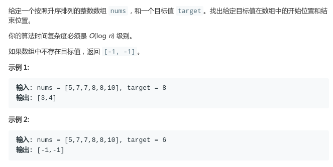
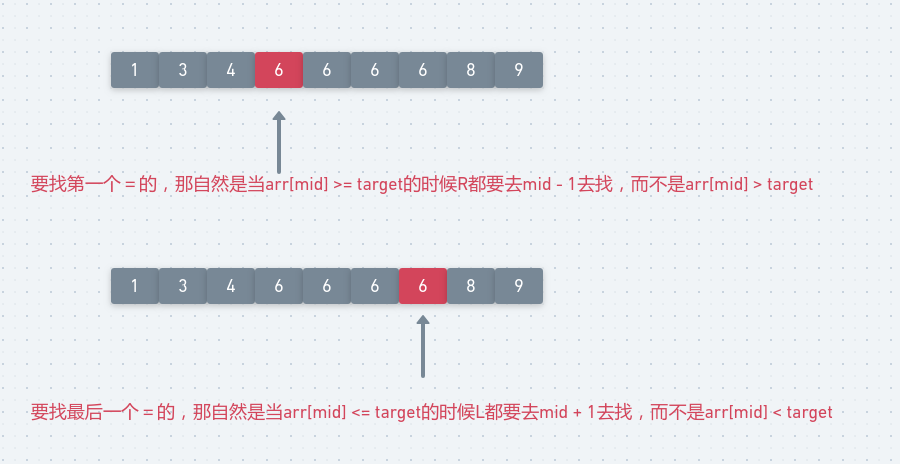

# LeetCode - 34. Find First and Last Position of Element in Sorted Array

#### [题目链接](https://leetcode.com/problems/find-first-and-last-position-of-element-in-sorted-array/)

> https://leetcode.com/problems/find-first-and-last-position-of-element-in-sorted-array/

#### 题目



## 解析

这个题目包含了二分的两种情况，我的[**另一篇文章**](https://github.com/ZXZxin/ZXBlog/blob/master/%E6%95%B0%E6%8D%AE%E7%BB%93%E6%9E%84%E7%AE%97%E6%B3%95/Algorithm/BinarySearch/%E4%BA%8C%E5%88%86%E6%9F%A5%E6%89%BE%E7%9A%84%E6%80%BB%E7%BB%93(6%E7%A7%8D%E5%8F%98%E5%BD%A2).md)对二分的六种情况做了很详细的总结，具体看那篇文章，二分很简单，主要是边界问题要注意。

<div align="center"></div><br>

代码:

```java
class Solution {
    public int[] searchRange(int[] nums, int target) {
        int first = firstEqual(nums, target);
        if(first == -1) return new int[]{-1, -1};
        return new int[]{first, lastEqual(nums, target)};
    }
    
    private int firstEqual(int[] arr, int key){
        int L = 0, R = arr.length - 1;
        while(L <= R){
            int mid = L + (R - L) / 2;
            if(arr[mid] >= key)
                R = mid - 1;
            else
                L = mid + 1;
        }
        if(L < arr.length && arr[L] == key) return L;
        return -1;
    }

    private int lastEqual(int[] arr, int key){
        int L = 0, R = arr.length - 1;
        while(L <= R){
            int mid = L + (R - L) / 2;
            if(arr[mid] <= key)
                L = mid + 1;
            else
                R = mid - 1;
        }
        if(R >= 0 && arr[R] == key)
            return R;
        return -1;
    }
}
```

