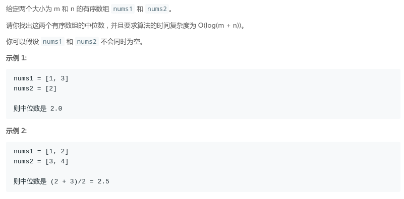
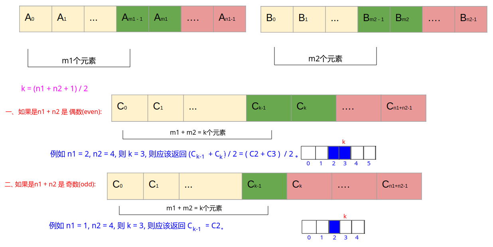
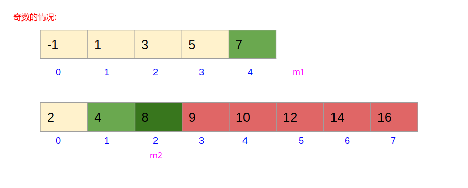

# LeetCode - 4. Median of Two Sorted Arrays(二分)
#### [题目链接](https://leetcode.com/problems/median-of-two-sorted-arrays/)

> https://leetcode.com/problems/median-of-two-sorted-arrays/

#### 题目

## 解析
假设两个数组的中间位置为`k`，其中` k=(n1 + n2 + 1)/2`，只要找到中间位置这个值，也就找到了中位数，所以我们可以把问题转换成查找两个数组中第 `k` 大的数。

* 如果是总数是偶数，那么如下图，我们的中位数肯定是<font color = red>**(C<sub>k-1</sub> + C<sub>K</sub>) / 2</font>**；而<font color = red>**C<sub>k-1</sub> = max(A<sub>m<sub>1</sub> - 1</sub>，B<sub>m<sub>2</sub> - 1</sub>)**</font>，<font color = red>**C<sub>k</sub> = min(A<sub>m<sub>1</sub> </sub>，B<sub>m<sub>2</sub></sub>)**</font>；
* 如果总数是奇数，那么中位数就是<font color = red>**C<sub>k-1</sub>**</font>，而<font color = red>**C<sub>k-1</sub> = max(A<sub>m<sub>1</sub> - 1</sub>，B<sub>m<sub>2</sub> - 1</sub>)**</font>；

看下面的例子: 


<font color = blue> 求解的过程就是:

* 对`nums1`数组进行二分查找那样的`m1`，然后得到对应的`m2`，比较`nums1[m1]`和`nums2[m2-1]`的大小（不能比较`nums2[m2]`，可能会越界）；
* 二分边界是`L > R`，二分完毕就可以找到`m1`的位置，然后对应`m2 = k - m1`；然后确定<font color = red>**C<sub>k-1</sub>**</font>和<font color = red>**C<sub>k</sub>**</font>；


下面分别看奇数和偶数的两个例子: 

**偶数的例子:**


* 一开始`L = 0、R = 5`，`k = (6+8+1)/2 = 7`；
* 二分开始，`m1 = (0+5)/2 = 2`，`m2 = 7 - 2 = 5`，因为`nums1[2] = 3 < num2[5-1] = 10`，所以`L = m1 + 1 = 3、R = 5`；
* 因为`L = 3 < R = 5`，所以继续二分，`m1 = (3 + 5)/2 = 4`，`m2 = 7 - 4 = 3`，因为`nums1[4] = 7 > nums2[3 - 1] = 6`，所以`R = m1 - 1 = 3、L = 3`；
* 因为`L = 3 == R = 3`，继续二分，`m1 = (3 + 3)/2 = 3`，`m2 = 7 - 3 = 4`，因为`nums1[3] = 5 < nums2[4 - 1] = 8`，所以`L = m1 + 1 = 4、R = 3`；
* 此时`L > R`，退出二分，此时`m1 = L = 4`，`m2 = (7 - m1) = (7 - 4) = 3`；
* 然后此时<font color = red>**C<sub>k-1</sub> = max(nums1[m<sub>1</sub> - 1]，nums2[m<sub>2</sub> - 1])**；<font color = red>**C<sub>k</sub> = max(nums1[m<sub>1</sub>]，nums2[m<sub>2</sub>])**；最后结果就是<font color = red>**(C<sub>k-1</sub> + C<sub>K</sub>) / 2</font>**；


**奇数的例子:**


过程: 

* 一开始`L = 0、R = 4`，`k = (5+8+1)/2 = 7`；
* 二分开始，`m1 = (0+4)/2 = 2`，`m2 = 7 - 2 = 5`，因为`nums1[2] = 3 < num2[5-1] = 10`，所以`L = m1 + 1 = 3、R = 4`；
* 因为`L = 3 < R = 4`，所以继续二分，`m1 = (3 + 4)/2 = 3`，`m2 = 7 - 3 = 4`，因为`nums1[3] = 5 < nums2[4 - 1] = 6`，所以`L = m1 + 1 = 4、R = 4`；
* 因为`L = 4 == R = 4`，继续二分，`m1 = (4 + 4)/2 = 4`，`m2 = 7 - 4 = 3`，因为`nums1[4] = 7 < nums2[3 - 1] = 8`，所以`L = m1 + 1 = 5、R = 4`；
* 此时`L > R`，退出二分，此时`m1 = L = 5`，`m2 = (7 - m1) = (7 - 5) = 2`；
* 因为是奇数，所以直接返回<font color = red>**C<sub>k-1</sub> = max(nums1[m<sub>1</sub> - 1]，nums2[m<sub>2</sub> - 1])即可**；

 

时间复杂度`O(log(min(m,n)))`。


```java
import java.io.*;
import java.util.*;

class Solution {

    public double findMedianSortedArrays(int[] nums1, int[] nums2) {
        int n1 = nums1.length;
        int n2 = nums2.length;
        if(n1 > n2)
            return findMedianSortedArrays(nums2, nums1);
        int L = 0, R = n1 - 1, m1, m2;
        int k = (n1 + n2 + 1) / 2; // if even --> right median, else odd --> median
        // m1 = k - m2, 注意边界和越界问题
        while(L <= R){ 
            m1 = L + (R - L) / 2;
            m2 = k - m1;
            if(nums1[m1] < nums2[m2 - 1]) // 不能和nums[m2]比较，因为m2可能 == n2(越界)
                L = m1 + 1;
            else 
                R = m1 - 1;
        } 
        m1 = L; 
        m2 = k - m1;
        int c1 = Math.max(m1 <= 0 ? Integer.MIN_VALUE : nums1[m1-1]
                        , m2 <= 0 ? Integer.MIN_VALUE : nums2[m2-1]);
        if( (n1 + n2)%2 == 1)
            return c1;
        int c2 = Math.min(m1 >= n1 ? Integer.MAX_VALUE : nums1[m1]
                        , m2 >= n2 ? Integer.MAX_VALUE : nums2[m2]);
        return (c1 + c2)/2.0;
    }

    public static void main(String[] args){
        Scanner cin = new Scanner(new BufferedInputStream(System.in));
        PrintStream out = System.out;
        //int[] nums1 = {-1, 1, 3, 5, 7, 9}; // 6 numbers
        //int[] nums1 = {-1, 1, 3, 5, 7}; // 5 numbers
        //int[] nums2 = {2, 4, 6, 8, 10, 12, 14, 16}; // 8 numbers --> even
        //int[] nums1 = {1, 3};
        //int[] nums2 = {2};
        int[] nums1 = { 1, 2 };
        int[] nums2 = { 3, 4 };
        out.println(new Solution().
            findMedianSortedArrays(nums1, nums2)
        );
    }
}
```


二分查找改成在`[L, R)`区间查找也是可以的，最终`m1`的位置还是在`L`，可以自己写个例子就知道了。


```java
class Solution {

    public double findMedianSortedArrays(int[] nums1, int[] nums2) {
        int n1 = nums1.length;
        int n2 = nums2.length;
        if(n1 > n2)
            return findMedianSortedArrays(nums2, nums1);
        int L = 0, R = n1, m1, m2;
        int k = (n1 + n2 + 1) / 2; 
        while(L < R){ 
            m1 = L + (R - L) / 2;
            m2 = k - m1;
            if(nums1[m1] < nums2[m2 - 1])
                L = m1 + 1;
            else 
                R = m1;
        } 
        m1 = L; 
        m2 = k - m1;
        int c1 = Math.max(m1 <= 0 ? Integer.MIN_VALUE : nums1[m1-1]
                        , m2 <= 0 ? Integer.MIN_VALUE : nums2[m2-1]);
        if( (n1 + n2)%2 == 1)
            return c1;
        int c2 = Math.min(m1 >= n1 ? Integer.MAX_VALUE : nums1[m1]
                        , m2 >= n2 ? Integer.MAX_VALUE : nums2[m2]);
        return (c1 + c2)/2.0;
    }
}
```
