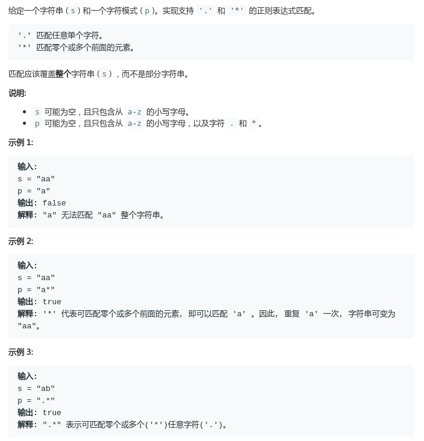
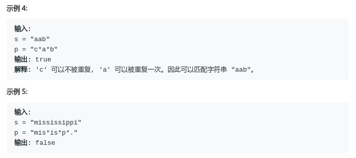
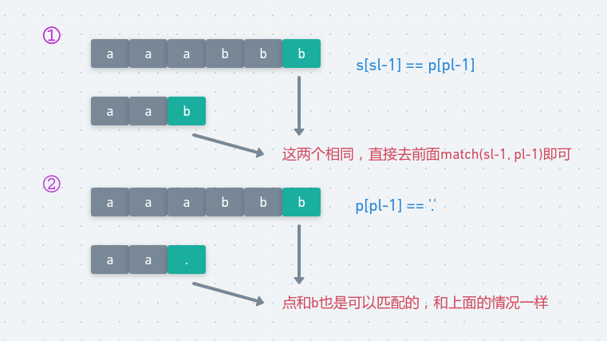
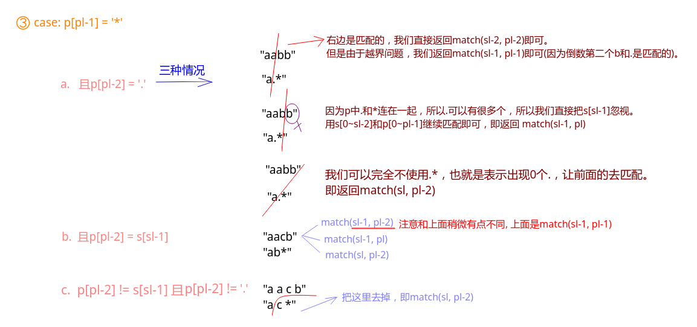

# LeetCode - 10. Regular Expression Matching 

#### [题目链接](https://leetcode.com/problems/regular-expression-matching/)

> https://leetcode.com/problems/regular-expression-matching/

#### 题目





## 解析

这题用动态规划来做。

我们先看递归的思路。然后通过记忆化来优化。

我们的递归`match(char[]s, char[] p, int ls, int lp)`函数代表的是求`s`中长度为`ls`的字符串和`p`中长度为`lp`的字符串是否可以匹配。我们要求的答案就是长度都为各自字符串的长度是否匹配。

先看两种情况，当前长度为`ls、lp`，那么对应当前字符为`s[ls - 1]`和`p[pl-1]`，如果此时`s[ls - 1] == p[pl - 1]`，那么我们直接去匹配`match(sl-1, pl-1)`即可。

如果当前`p[pl-1] == '.'`，也是可以和`s[sl-1]`匹配的，所以情况和上面一样。

<div align="center"></div><br>

然后看第三种情况，也就是`p[pl - 1] == '*'`，此时又可以分为三种情况:



最后还要注意边界，当`s == "" && p == ""`的时候返回`true`，当`p=="" & s!= ""`的时候返回`false`。

当`s == "" && p != ""`的时候就要注意，如果`p[i-1] == '*'`则`dp[0][i] = dp[0][i-2]`，因为可以用`*`可以消去前一个字符。

虽然第三种情况，可以合起来考虑，代码会更简洁一些，但是这里个人认为还是写的清楚一点较好。

代码: 

```java
class Solution {

    private int[][] dp;

    // s只有字符， p可以有.和*, .匹配单个任意字符，'*'匹配多个任意字符
    public boolean isMatch(String s, String p) {
        dp = new int[s.length() + 1][p.length() + 1];
        return match(s.toCharArray(), p.toCharArray(), s.length(), p.length());
    }

    // ls代表当前s的长度， lp代表当前p的长度
    public boolean match(char[] s, char[] p, int ls, int lp) {
        if (ls == 0 && lp == 0) return true;
        if (dp[ls][lp] != 0) return dp[ls][lp] == 1;
        if (lp == 0) return false;
        boolean res = false;
        if (ls == 0) // s为空
            res = lp >= 2 && p[lp - 1] == '*' && match(s, p, ls, lp - 2);
        else {
            if (p[lp - 1] == '.' || s[ls - 1] == p[lp - 1])
                return match(s, p, ls - 1, lp - 1);
            else if (p[lp - 1] == '*') {
                if (p[lp - 2] == '.') { // 可以匹配多个
                    res = match(s, p, ls - 1, lp - 1)
                            || match(s, p, ls - 1, lp)
                            || match(s, p, ls, lp - 2);
                } else if (s[ls - 1] == p[lp - 2]) {
                    res = match(s, p, ls - 1, lp - 2) //这里和上面不同，不是ls-1, lp-1,
                            || match(s, p, ls - 1, lp)
                            || match(s, p, ls, lp - 2);
                } else { // 只能丢掉 p[pl-1]和p[pl-2]
                    res = match(s, p, ls, lp - 2);
                }
            }
        }
        dp[ls][lp] = res ? 1 : -1;
        return res;
    }
}
```

可以将上面的递归版本改成递推版本: 原理是一样的。

```java
class Solution {
    public boolean isMatch(String s, String p) {
        return match(s.toCharArray(), p.toCharArray());
    }

    private boolean match(char[] s, char[] p){
        int ls = s.length;
        int lp = p.length;
        boolean[][] dp  = new boolean[ls + 1][lp + 1];
        dp[0][0] = true;
        for(int i = 1; i <= lp; i++) if(p[i-1] == '*')
            dp[0][i] = dp[0][i-2];
        for(int i = 1; i <= ls; i++){
            for(int j = 1; j <= lp; j++){
                if(s[i-1] == p[j-1] || p[j-1] == '.'){
                    dp[i][j] = dp[i-1][j-1];
                }else if(p[j-1] == '*') {
                    if(p[j-2] == '.'){
                        dp[i][j] = dp[i-1][j-1] || dp[i-1][j] || dp[i][j-2];
                    }else if(s[i-1] == p[j-2]){
                        dp[i][j] = dp[i-1][j-2] || dp[i-1][j] || dp[i][j-2];
                    }else {
                        dp[i][j] = dp[i][j-2];
                    }
                }
            }
        }
        return dp[ls][lp];
    }
}
```

