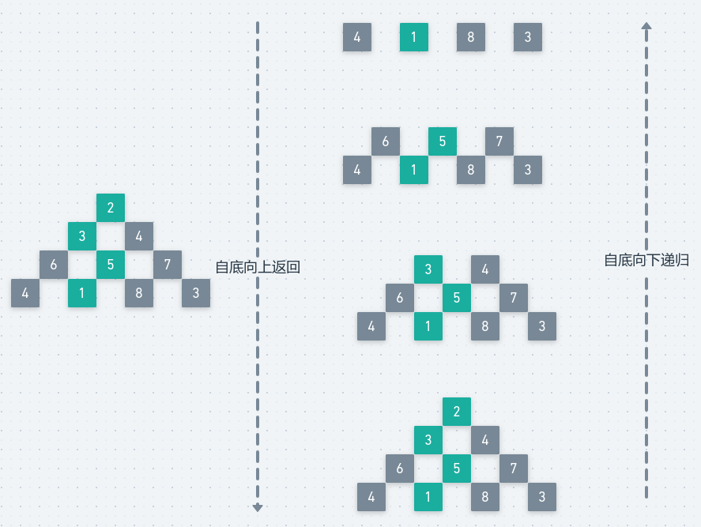

# LeetCode - 120. Traingle & Hdu - 2084. 数塔问题(简单dp)
* 递归
* 二维dp
* 一维dp
*  Hdu2084数塔问题


#### [题目链接](https://leetcode.com/problems/triangle/)

> https://leetcode.com/problems/triangle/

#### 题目


## 递归
递归的思路是从上到下：

* 递归函数有两个主要的参数，记录行和列，表示当前行的位置是`matrix[r][c]`，要向下去求最小路径；
* 如果行 `r == n`，说明不需要向下求，则直接返回`matrix[r][c]`；
* 否则先给我递归求出从`matrix[r+1][c]`求出的最大路径，和从`matrix[r+1][c+1]`的最大路径，我取最大的，和自己相加即可；
* 然后用二维数组`map`记忆化即可；

图: 



代码:

```java
class Solution {

    private int[][] dp;

    public int minimumTotal(List<List<Integer>> triangle) {

        if (triangle == null || triangle.size() == 0 || triangle.get(0).size() == 0)
            return 0;
        int n = triangle.size();
        int m = triangle.get(triangle.size() - 1).size();
        dp = new int[n][m];
        return rec(triangle, 0, 0, n - 1);
    }

    // 递归
    private int rec(List<List<Integer>> triangle, int r, int c, int level) {
        if (r == level)
            return triangle.get(r).get(c);
        if (dp[r][c] != 0)
            return dp[r][c];
        int ele = triangle.get(r).get(c);
        dp[r][c] = Math.min(
                ele + rec(triangle, r + 1, c, level),
                ele + rec(triangle, r + 1, c + 1, level)
        );
        return dp[r][c];
    }
}
```
***
## 二维dp
`dp`就是记忆化的反方向，从下到上求解: 

* 初始化最后一行的就是本来的值，代表的就是从这一行往下不需要求了；
* 然后就是往上递推即可；

图:

<div align="center"></div><br>
代码:

```java
class Solution {
    public int minimumTotal(List<List<Integer>> triangle) {
        if (triangle == null || triangle.size() == 0 || triangle.get(0).size() == 0)
            return 0;

        int n = triangle.size();
        int m = triangle.get(triangle.size() - 1).size();

        int[][] dp = new int[n][m]; 
 
        for (int j = 0; j < m; j++)
            dp[n - 1][j] = triangle.get(n - 1).get(j);

        for (int i = n - 2; i >= 0; i--) {
            for (int j = 0; j <= i; j++) {// 或 for(int j = i;j >= 0; j--){
                dp[i][j] = triangle.get(i).get(j) + Math.min(dp[i + 1][j], dp[i + 1][j + 1]);
            }
        }
        return dp[0][0];
    }
}
```
## 一维dp
滚动优化也需要注意滚动的方向：

* 因为`dp[i][j]`依赖 `dp[i+1][j]` 和`dp[i+1][j+1]`，所以不能先更新`dp[i+1][j+1]`；
* 所以滚动的方向是从`j = i `到`j = 0`；

代码:
```java
class Solution {
    public int minimumTotal(List<List<Integer>> triangle) {
        if (triangle == null || triangle.size() == 0 || triangle.get(0).size() == 0)
            return 0;

        int n = triangle.size();
        int m = triangle.get(triangle.size() - 1).size();

        int[] dp = new int[m]; 

        for (int j = 0; j < m; j++)
            dp[j] = triangle.get(n - 1).get(j);

        for (int i = n - 2; i >= 0; i--) {
            for (int j = 0; j <= i; j++) { //不能写出 j = i ; j >= 0 ; j--
                dp[j] = triangle.get(i).get(j) + Math.min(dp[j], dp[j + 1]);
            }
        }
        return dp[0];
    }
}
```

***
## Hdu2084数塔问题
#### [题目链接](http://acm.hdu.edu.cn/showproblem.php?pid=2084)

> http://acm.hdu.edu.cn/showproblem.php?pid=2084

就是从求最小路径和变成求最大路径和，做法是一样的。

```java
import java.io.BufferedInputStream;
import java.util.Scanner;

public class Main {

    // 方法一: 记忆化递归
    static int maxPath(int[][] matrix, int n) {
        if (matrix == null || matrix.length == 0 || matrix[0].length == 0)
            return 0;
        int[][] map = new int[n][n]; //注意这里 
        return rec(matrix, 0, 0, n - 1, map);
    }
 
    static int rec(int[][] matrix, int r, int c, int n, int[][] map) {
        if (r == n)
            return matrix[r][c];

        if (map[r][c] != 0)
            return map[r][c];

        map[r][c] = matrix[r][c] + Math.max(rec(matrix, r + 1, c, n, map),
                rec(matrix, r + 1, c + 1, n, map)
        );

        return map[r][c];
    }


    // 二维dp
    static int maxPath2(int[][] matrix, int n) {
        if (matrix == null || matrix.length == 0 || matrix[0].length == 0)
            return 0;
        int[][] dp = new int[n][n]; 

        for (int j = 0; j < n; j++)
            dp[n - 1][j] = matrix[n - 1][j];

        for (int i = n - 2; i >= 0; i--) {
            for (int j = 0; j <= i; j++) {
                dp[i][j] = matrix[i][j] + Math.max(dp[i + 1][j], dp[i + 1][j + 1]);
            }
        }
        return dp[0][0];
    }

    //一维dp
    static int maxPath3(int[][] matrix, int n) {
        if (matrix == null || matrix.length == 0 || matrix[0].length == 0)
            return 0;
        int[] dp = new int[n];

        for (int j = 0; j < n; j++)
            dp[j] = matrix[n - 1][j];

        for (int i = n - 2; i >= 0; i--) {
            for (int j = 0; j <= i; j++) {// 不能写出for(int j = i ; j >= 0; j--)
                dp[j] = matrix[i][j] + Math.max(dp[j], dp[j + 1]);
            }
        }
        return dp[0];
    }

    public static void main(String[] args) {
        Scanner cin = new Scanner(new BufferedInputStream(System.in));
        int C = cin.nextInt();
        while (C-- > 0) {
            int n = cin.nextInt();
            int[][] matrix = new int[n][n];
            for (int i = 0; i < n; i++) {
                for (int j = 0; j <= i; j++) {
                    int x = cin.nextInt();
                    matrix[i][j] = x;
                }
            }
//            System.out.println(maxPath(matrix,  n));
//            System.out.println(maxPath2(matrix, n));
            System.out.println(maxPath3(matrix, n));
        }
    }
}

```

