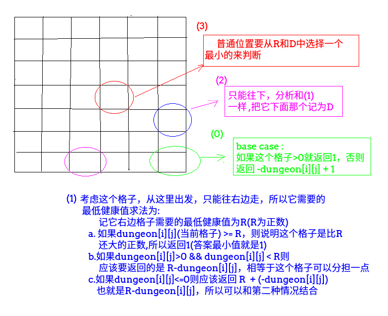

## LeetCode - 174. Dungeon Game(地下城游戏)(dp)

 - 记忆化
 - 二维dp
 - 一维dp

#### [题目链接](https://leetcode.com/problems/dungeon-game/description/)

> https://leetcode.com/problems/dungeon-game/description/

#### 题目

<font color = red>先写出递归，然后改`dp`或者记忆化，类似的题目有[LeetCode - 62](https://blog.csdn.net/zxzxzx0119/article/details/81807910)和[LeetCode - 64](https://blog.csdn.net/zxzxzx0119/article/details/81227300)</font>
***
### 解析
### 记忆化

总共分为四中情况:

 - 第一种就是最左下角;
 - 第二种就是最后一行；
 - 第三种就是最后一列；
 - 第四种就是普通位置，依赖的位置是右边的和下面的；

具体解释看下图: 




```java
class Solution {

    private int[][] dp;
    private int n, m;

    public int calculateMinimumHP(int[][] dungeon) {
        if (dungeon.length <= 0 || dungeon[0].length <= 0)
            return 0;
        n = dungeon.length;
        m = dungeon[0].length;
        dp = new int[n][m];
        return rec(dungeon, 0, 0);  
    }

    public int rec(int[][] matrix, int i, int j) {
        if (i == n - 1 && j == m - 1) 
            return matrix[i][j] > 0 ? 1 : -matrix[i][j] + 1;
        if (dp[i][j] != 0) 
            return dp[i][j];
        if (i == n - 1) {
            int R = rec(matrix, i, j + 1);
            dp[i][j] = matrix[i][j] >= R ? 1 : R - matrix[i][j];
        }
        else if (j == m - 1) {
            int D = rec(matrix, i + 1, j);
            dp[i][j] = matrix[i][j] >= D ? 1 : D - matrix[i][j];
        }else {
            int min = Math.min(rec(matrix, i, j + 1), rec(matrix, i + 1, j));
            dp[i][j] = matrix[i][j] >= min ? 1 : min - matrix[i][j];
        }
        return dp[i][j];
    }
}

```
***
### 二维dp
改成`dp`。
```java
class Solution {
    public int calculateMinimumHP(int[][] dungeon) {
        if (dungeon.length <= 0 || dungeon[0].length <= 0)
            return 0;
        int n = dungeon.length, m = dungeon[0].length;
        int[][] dp = new int[n][m];
        dp[n - 1][m - 1] = dungeon[n - 1][m - 1] > 0 ? 1 : -dungeon[n - 1][m - 1] + 1;
        for (int j = m - 2; j >= 0; j--)
            dp[n - 1][j] = dungeon[n - 1][j] >= dp[n - 1][j + 1] ? 1 : dp[n - 1][j + 1] - dungeon[n - 1][j];
        for (int i = n - 2; i >= 0; i--)
            dp[i][m - 1] = dungeon[i][m - 1] >= dp[i + 1][m - 1] ? 1 : dp[i + 1][m - 1] - dungeon[i][m - 1];
        for (int i = n - 2; i >= 0; i--) {
            for (int j = m - 2; j >= 0; j--) {
                dp[i][j] = (dungeon[i][j] >= Math.min(dp[i][j + 1], dp[i + 1][j])) ? 1 : Math.min(dp[i][j + 1], dp[i + 1][j]) - dungeon[i][j];
            }
        }
        return dp[0][0];
    }
}

```
***
### 一维dp
因为位置依赖当前`dp[j]`还是`dp[i+1][j]`，所以只需要一个滚动数组。
```java
class Solution {
    public int calculateMinimumHP(int[][] dungeon) {
        if (dungeon.length <= 0 || dungeon[0].length <= 0)
            return 0;
        int n = dungeon.length, m = dungeon[0].length;
        int[] dp = new int[dungeon[0].length];
        dp[m - 1] = dungeon[n - 1][m - 1] > 0 ? 1 : -dungeon[n - 1][m - 1] + 1;
        for (int j = m - 2; j >= 0; j--) dp[j] = dungeon[n - 1][j] >= dp[j + 1] ? 1 : dp[j + 1] - dungeon[n - 1][j];
        for (int i = n - 2; i >= 0; i--) {
            dp[m - 1] = dungeon[i][m - 1] >= dp[m - 1] ? 1 : dp[m - 1] - dungeon[i][m - 1];
            for (int j = m - 2; j >= 0; j--) {
                dp[j] = (dungeon[i][j] >= Math.min(dp[j + 1], dp[j])) ? 1 : Math.min(dp[j + 1], dp[j]) - dungeon[i][j];
            }
        }
        return dp[0];
    }
}

```

