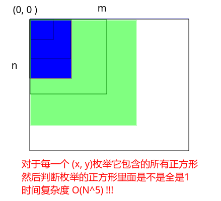
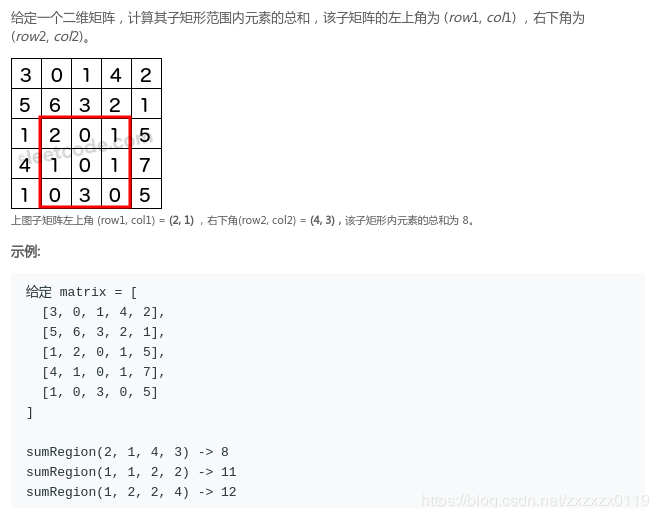

## LeetCode - 221. Maximal Square(求最大的全是1的正方形)

* 暴力 (`O(N^5)`)
* 改进动态规划(`O(N^３)`)
* [LeetCode - 304. Range Sum Query 2D - Immutable](leetcode---304-range-sum-query-2d---immutable)
* 优化动态规划(`O(N^2)`) 

***
#### [题目链接](https://leetcode.com/problems/maximal-square/)

> https://leetcode.com/problems/maximal-square/

#### 题目


### 暴力 (`O(N^5)`)

暴力`O(N) * O(M) * O(min(N ， M)) * O(N) * O(M) `，也就是`O(N^5)`，但是也能通过......

* 枚举`0 ~ n`和`0 ~ m`，然后枚举这个范围内的所有正方形。这里时间复杂度为`  O(N) * O(M) * O(min(N, M))`；
* 然后枚举的每一个正方形还需要判断这个正方形内是不是全都是`1`，时间复杂度`O(N * M )`；



代码:

```java
class Solution {
    public int maximalSquare(char[][] matrix) {
        if(matrix == null || matrix.length == 0 || matrix[0].length == 0)
            return 0;
        int n = matrix.length;
        int m = matrix[0].length;
        int res = 0;
        for(int x = 0; x < n; x++){      // 枚举左上角的 x
            for(int y = 0; y < m; y++){  // 枚举左上角的 y
                for(int size = Math.min(n-x, m-y); size >= 1; size--){ // 枚举 [1, min(n-x, m-y)]这么多的方阵(size表示方阵大小)
                    if(check(matrix, x, y, size)){  //检查这个方阵是否全为1
                        res = Math.max(res, size*size);
                        break;  //因为size是从大->小，所以可以break
                    }
                }
            }
        }
        return res;
    }
    
    private boolean check(char[][] matrix, int x, int y, int size){
        for(int i = x; i < x+size; i++){
            for(int j = y; j < y+size; j++){
                if(matrix[i][j] - '0' == 0)
                    return false;
            }
        }
        return true;
    }
}
```

***

### 改进动态规划(`O(N^３)`)

上面的`check()`函数在判断大正方形的时候其实包含了很多的子问题。

可以通过改进上面方式中的 `check()`过程来优化复杂度: 

* 将 `check()`提前预处理好，这个过程需要用到动态规划；
* 这个动态规划用到一个二维`sums`数组，`sum[x][y] (或者sums[i][j])` 代表的是 `(0, 0) ~ (x, y)`这个矩阵的和；


看下图对于`sum( 0~x,  0~y )`的求法: 

其中两个蓝色部分有一个重叠的绿色部分，所以要多减去一个。


如果求出了上面的`sums`数组，我们就可以在`O(1)`时间内检查这个枚举的正方形是不是全都是`1`了，我们只需要求枚举的正方形的和是不是等于`size * size`就可以判断。


**怎么由当前已经求得的`sums`数组得到当前枚举的正方形的和呢**? 

可以由`sum`数组得到当前以`(x, y)`为左上角顶点的正方形的和，大体框架如下: 


不过这里要注意代码的处理:

我们`sums`数组起始从`1, 1`开始会比较方便处理，所以实际上下面的代码中`sums[x, y]`表示的是`[0 ~ i-1, 0 ~ j-1]`内的和。不然判断边界就会比较麻烦，所以检查的时候第三层循环`size = Math.min(n-x+1, m-y+1) `开始也需要注意。 
```java
class Solution {
    public int maximalSquare(char[][] matrix) {
        if(matrix == null || matrix.length == 0 || matrix[0].length == 0)
            return 0;
        int n = matrix.length;
        int m = matrix[0].length;
        //预处理出 (0, 0) ~ (x,y) 矩阵的里面的数的和
        int[][] sums = new int[n+1][m+1];
        for(int x = 1; x <= n; x++){ // 从[0,0]到[x,y]递推
            for(int y = 1; y <= m; y++){
                sums[x][y] = sums[x][y-1] + sums[x-1][y] - sums[x-1][y-1] + matrix[x-1][y-1]-'0';
            }
        }
        int res = 0;
        for(int x = 1; x <= n; x++){      // 枚举左上角的 x
            for(int y = 1; y <= m; y++){  // 枚举左上角的 y
                for(int size = Math.min(n-x+1, m-y+1); size >= 1; size--){ // 枚举 [1, min(n-x, m-y)]这么多的方阵(size表示方阵大小)
                    int sum = sums[x+size-1][y+size-1] - sums[x+size-1][y-1] - sums[x-1][y+size-1] + sums[x-1][y-1];
                    if(sum == size*size){
                        res = Math.max(res, size*size);
                        break;
                    }
                }
            }
        }
        return res;
    }
}
```

#### LeetCode - 304. Range Sum Query 2D - Immutable

这里[**LeetCode - 304. Range Sum Query 2D - Immutable**](https://leetcode.com/problems/range-sum-query-2d-immutable/) 就完全是这种方法解决:



代码：

```java
class NumMatrix {

    private int[][] sums;
    
    public NumMatrix(int[][] matrix) {
        if(matrix == null || matrix.length == 0 || matrix[0].length == 0)
            return;
        int n = matrix.length, m = matrix[0].length;
        sums = new int[n+1][m+1];
         // sum[i, j]表示 矩形[0 ~ i-1, 0 ~ j-1]的数的和
        for(int i = 0; i < n; i++){
            for(int j = 0; j < m; j++){
                sums[i+1][j+1] = sums[i+1][j] + sums[i][j+1] - sums[i][j] + matrix[i][j];
            }
        }
    }
    
    // [row1, col1] -> [row2, col2]
    public int sumRegion(int row1, int col1, int row2, int col2) {
        return sums[row2+1][col2+1] - sums[row2+1][col1] - sums[row1][col2+1] + sums[row1][col1];
    }
}
```
其实`sums[i, j]`也可以表示是`[0 ~ i, 0 ~j]`矩阵的和，但是这样下面的函数处理会不方便，所以我们用`sums[i, j]`表示的是
`[0 ~ i-1, 0 ~ j-1]`内的和。


下面是`sums[i][j]`表示`[0 ~ i, 0 ~j]`矩阵的和的代码: 
```java
public NumMatrix(int[][] matrix) {
    if(matrix == null || matrix.length == 0 || matrix[0].length == 0)
        return;
    int n = matrix.length, m = matrix[0].length;
    sums = new int[n+1][m+1]; // sum[i, j]表示 矩形[0~i, 0~j]的数的和

    sums[0][0] = matrix[0][0];
    for(int i = 1; i < n; i++)
        sums[i][0] = sums[i-1][0] + matrix[i][0];
    for(int j = 1; j < m; j++)
        sums[0][j] = sums[0][j-1] + matrix[0][j];
    for(int i = 1; i < n; i++){
        for(int j = 1; j < m; j++){
            sums[i][j] = sums[i-1][j] + sums[i][j-1] - sums[i-1][j-1] + matrix[i][j];
        }
    }
}
```

### 优化动态规划(`O(N^2)`) 

这个方法是本题的最优解。

其中`dp[i][j]`表示的是从`(0, 0) `到当前 `(x, y)`能构成的最大的正方形的`size`(边的大小)。

则: 

* 如果当前`matrix[i][j] == 0`，则`dp[i][j] = 0`；
* 其他一般的情况，看下图，可以得到`dp[i][j] = min(dp[i][j-1], dp[i-1][j], dp[i-1][j-1]) + 1`；

图:


代码:

```java
class Solution {
    public int maximalSquare(char[][] matrix) {
        if(matrix == null || matrix.length == 0 || matrix[0].length == 0)
            return 0;
        int n = matrix.length;
        int m = matrix[0].length;
        
        int[][] dp = new int[n][m];
        
        int res = 0;
        for(int i = 0; i < n; i++){
            dp[i][0] = matrix[i][0] - '0';
            res = Math.max(res, dp[i][0]);
        }
        for(int j = 0; j < m; j++){
            dp[0][j] = matrix[0][j] - '0';
            res = Math.max(res, dp[0][j]);
        }
        for(int i = 1; i < n; i++){
            for(int j = 1; j < m; j++){
                if(matrix[i][j] - '0' == 0)
                    continue;
                dp[i][j] = 1 + Math.min(dp[i][j-1], Math.min(dp[i-1][j], dp[i-1][j-1]));
                res = Math.max(res, dp[i][j]);
            }
        }
        return res * res;
    }
}
```

