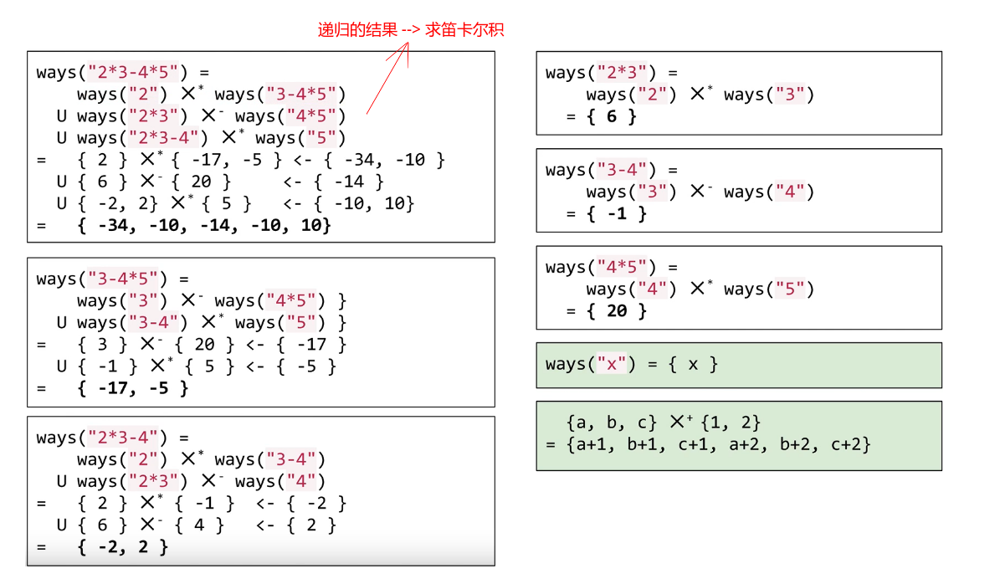

## LeetCode - 241. Different Ways to Add Parentheses(分治、dp)
***
#### [题目链接](https://leetcode.com/problems/different-ways-to-add-parentheses/)

> https://leetcode.com/problems/different-ways-to-add-parentheses/

#### 题目

#### 解题思路

这个题目也有点分治的意思，但是主体还是记忆化递归，用记忆化递归写起来非常方便，思路也很清晰: 

* 递归函数，遍历当前字符串，只要有符号是`+`、`-`、`*`的就将整个字符串分开成两半；
* 然后左边一半的字符串`lstr`去递归求出那个解的集合，右边的`rstr`也求出解的集合；
* 最后关键的是当前的字符串的解是左和右的<font color= blue>**笛卡尔积**</font>；
* 然后记得记忆化；



代码: 
Java版本: 
```java
class Solution {
    private HashMap<String, List<Integer>> map;

    public List<Integer> diffWaysToCompute(String input) {
        map = new HashMap<>();
        return helper(input);
    }

    private List<Integer> helper(String input) {
        if (map.containsKey(input))
            return map.get(input);
        List<Integer> res = new ArrayList<>();

        for (int i = 0; i < input.length(); i++) {

            char op = input.charAt(i);

            if (op == '*' || op == '+' || op == '-') {
                List<Integer> L = helper(input.substring(0, i));//求出左边
                List<Integer> R = helper(input.substring(i + 1));//求出右边

                for (Integer l : L) {// 左右两边笛卡尔积
                    for (Integer r : R) {
                        res.add(computer(l, r, op));
                    }
                }
            }
        }
        if (res.isEmpty()) {// 没有操作符 直接加入数字
            res.add(Integer.valueOf(input));
        }
        map.put(input, res);//记忆化
        return res;
    }

    private int computer(int a, int b, char op) {
        return op == '+' ? a + b : (op == '-' ? a - b : a * b);
    }
}
```
C++版本: 

```cpp
class Solution {
public:
    vector<int> diffWaysToCompute(string input) {
        return helper(input);
    }
private:
    const vector<int>& helper(const string& input){ //使用const+引用，即可防止随意修改，又不必建立拷贝
        if(mp.count(input))
            return mp[input];

        vector<int>res;
        for(int i = 0; i < input.length(); i++){ 
            char op = input[i];
            if(op == '+' || op == '-' || op == '*') {
                const string lstr = input.substr(0,i);
                const string rstr = input.substr(i+1);

                const vector<int>& L = helper(lstr);
                const vector<int>& R = helper(rstr);

                //笛卡尔积
                for(int l : L){ 
                    for(int r : R){ 
                        res.push_back(computer(l, r, op));
                    }
                }
            }
        }
        if(res.empty())
            res.push_back(stoi(input));
        return mp[input] = res;
    }
    int computer(int a, int b, char op){ 
        return op == '+' ? a + b : (op == '-' ? a - b : a * b);
    }
    unordered_map<string,vector<int>>mp; //使用无序map(类似HashMap,而不是TreeMap)
};
```

Python版本: 

```python
class Solution:
    def diffWaysToCompute(self, input):
        if input.isdigit():  # 不同于Java版本，这里边界条件放在这里，之前那个是res.isEmpty()就加入数字
            return [int(input)]  # 转换成数字 -> 列表并返回
        res = []
        for i in range(len(input)):
            if input[i] in "+-*":
                L = self.diffWaysToCompute(input[:i])
                R = self.diffWaysToCompute(input[i+1:])

                for l in L:
                    for r in R:
                        res.append(self.computer(l, r, input[i]))

        return res

    def computer(self, a, b, op):
        if op == '+':
            return a + b
        elif op == '-':
            return a - b
        else:
            return a * b
```

