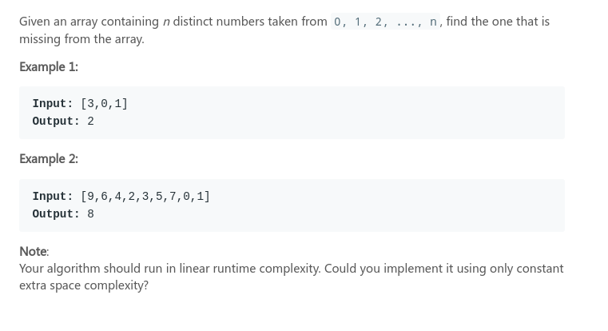
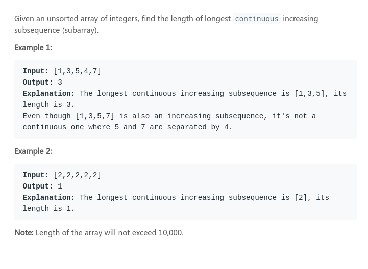

## LeetCode - 268. Missing Number &  674. Longest Continuous Increasing Subsequence

* [LeetCode - 268. Missing Number](#1)
* [LeetCode - 674. Longest Continuous Increasing Subsequence](#2)

***
### <font color = red id = "1">LeetCode - 268. Missing Number
#### [题目链接](https://leetcode.com/problems/missing-number/)

> https://leetcode.com/problems/missing-number/

#### 题目

#### 解析
题目要求在`O(n)`时间和`O(1)`空间内完成。
也是一个很有意思的题目，简单的想法: 
* 用一个变量`sumAll`记录包含没有丢失的那个数的所有的和(也可以用等差数列求和公式求出)；
* 然后求出数组的和`sum`，结果就是`sumAll - sum`；


更好的解法，利用亦或的性质: 

利用第四条性质，循环亦或`xor = xor ^ (i+1) ^ nums[i]`其中没有出现的数就会剩下来。
```java
class Solution {
    public int missingNumber(int[] nums) {
        int sumAll = 0, sum = 0;
        for(int i = 0; i < nums.length; i++){
            sumAll += (i+1);
            sum += nums[i];
        }
        return sumAll-sum;
    }
}
```
用等差数列求和公式求出`sumAll`：
```java
class Solution {
    
    public int missingNumber(int[] nums) {
        int sumAll = (0+nums.length)*(nums.length+1)/2; //等差数列
        int sum = 0;
        for(int i = 0; i < nums.length; i++)
            sum += nums[i];
        return sumAll-sum;
    }
    
}
```
更加巧妙的方式，利用异或运算: 

```java
class Solution {

    public int missingNumber(int[] nums) {
        int xor = 0;
        for(int i = 0; i < nums.length; i++)
            xor = xor ^ (i+1) ^ nums[i];
        return xor;
    }
}
```

***
### <font color = red id = "2">LeetCode - 674. Longest Continuous Increasing Subsequence
#### [题目链接](https://leetcode.com/problems/longest-continuous-increasing-subsequence/)

> https://leetcode.com/problems/longest-continuous-increasing-subsequence/

#### 题目
求最长连续递增<font color =red>子串</font>(不是子序列)。


#### 解析
比[最长递增子序列](https://blog.csdn.net/zxzxzx0119/article/details/81224734)更简单，同样提供三种解法。

一维`dp`
```java
class Solution {
    
    public int findLengthOfLCIS(int[] nums) {
        if(nums == null || nums.length == 0)
            return 0;
        int res = 1;
        int[] dp = new int[nums.length];
        dp[0] = 1;
        for(int i = 1; i < nums.length; i++){
            if(nums[i] > nums[i-1])
                dp[i] = dp[i-1] + 1;
            else 
                dp[i] = 1;
            res = Math.max(res, dp[i]); 
        }
        return res;
    }

}
```
记忆化递归: 
```java
class Solution {   
    
    public int res;
    public int findLengthOfLCIS(int[] nums) {
        if(nums == null || nums.length == 0)
            return 0;
        int[] dp = new int[nums.length];
        Arrays.fill(dp, -1);
        res = 1;
        process(nums, nums.length-1, dp);
        return res;
    }
    public int process(int[] nums, int i, int[] dp){
        if(i == 0)
            return 1;
        if(dp[i] != -1)
            return dp[i];
        if(nums[i] > nums[i-1]){
            dp[i] = process(nums, i-1, dp) + 1;
        }else {
            dp[i] = 1;
            process(nums, i-1, dp); // still should 
        }
        res = Math.max(res, dp[i]);
        return dp[i];
    }
}
```
滚动优化
```java
class Solution {   

    public int findLengthOfLCIS(int[] nums) {
        if(nums == null || nums.length == 0)
            return 0;
        int res = 1, cur = 1;
        for(int i = 1; i < nums.length; i++){
            if(nums[i] > nums[i-1])
                cur += 1;
            else 
                cur = 1;
            res = Math.max(res, cur); 
        }
        return res;
    }
}
```

***
