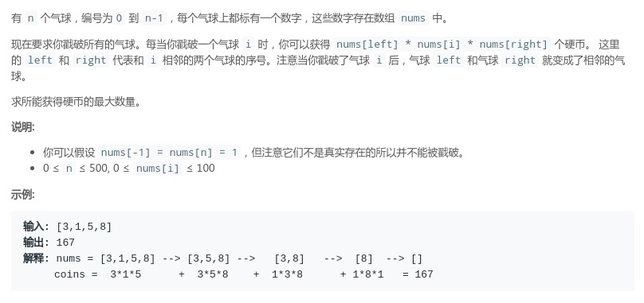

## LeetCode - 312. Burst Balloons(DP)

* 递归写法
* 二维dp

***
#### [题目链接](https://leetcode.com/problems/burst-balloons/description/)

> https://leetcode.com/problems/burst-balloons/description/

#### 题目

#### 递归


这题递归本来用`ArrayList`写了一个，也是枚举删除的位置，递归后插入还原，但是那样不好记忆化，于是看了讨论区。。。答案有点分治的意思。。

思路: <font color = red>(注意这里`process`函数(递归函数)求的是在`[L,R]`闭区间可以取的最大值)

* 如果`L > R`，则区间无数，这是递归边界，返回`0`；
* 否则，在`[L, R]`区间内，枚举"删除"每一个数，然后<font color = red>这个数的两边(`[L, i-1]` 和`[i+1，R]`)都需要先递归的求出他们的最大值；
* 然后，最重要的一点: <font color = red>因为两边是先递归的，所以其实这些数已经被删除了，所以我们枚举`[L,R]`的时候(用一个变量`i`枚举)，不能在求的时候写出` arr[i] * arr[i-1] * arr[i+1]`，而是`arr[i] * arr[L-1] * arr[R+1]`；
* 然后我们要注意边界 ，也就是`i = 0` 和`i == arr.length - 1`的情况特殊处理一下；


```java
class Solution {

    private int[][] dp;

    public int maxCoins(int[] nums) {
        if (nums == null || nums.length == 0)
            return 0;
        dp = new int[nums.length][nums.length];
        return rec(nums, 0, nums.length - 1);
    }

    private int rec(int[] arr, int L, int R) {
        if (L > R) //中间没有数了
            return 0;
//        if(L == R) //注意这里不是习惯性的这样写，因为递归函数只是一个区间而已，并不是真的只剩下一个数了
//            return arr[L];
        if (dp[L][R] != 0)
            return dp[L][R];
        int res = 0;
        for (int i = L; i <= R; i++) {
            int sum = 0;
            int center = arr[i];
            if (L != 0)
                center *= arr[L - 1];
            if (R != arr.length - 1)
                center *= arr[R + 1];
            sum += center;
            sum += rec(arr, L, i - 1);
            sum += rec(arr, i + 1, R);
            res = Math.max(res, sum);
        }
        dp[L][R] = res;
        return res;
    }
}
```

另一种写法，使用开区间的写法，有一些不同: 

* 先在数组的两边都加上`1`，这样就不需要处理边界，因为`center`是相乘，不影响结果；
* 边界就变成了`L + 1 == R`，因为是开区间`(L,R)`这种情况就是区间内没有数了，也就是边界；
* 其他的类似；

```java
class Solution {

    private int[][] dp;

    public int maxCoins(int[] nums) {
        if (nums == null || nums.length == 0)
            return 0;
        int[] newNums = new int[nums.length + 2];

        int n = 1;
        for (int num : nums)
            newNums[n++] = num;
        newNums[0] = newNums[n] = 1;

        dp = new int[nums.length + 2][nums.length + 2];   // num.length + 2
        return process(newNums, 0, newNums.length - 1); //注意都是newNum   实际求的是  [1,newNums.length-2]
    }

    private int process(int[] arr, int L, int R) {
        if (L + 1 == R) //中间没有数了  因为求的是开区间的
            return 0;
        if (dp[L][R] != 0)
            return dp[L][R];
        int res = 0;
        for (int i = L + 1; i <= R - 1; i++) {
            int sum = 0;
            int center = arr[i];
            center *= arr[L];
            center *= arr[R];
            sum += center;
            sum += process(arr, L, i);
            sum += process(arr, i, R);
            res = Math.max(res, sum);
        }
        dp[L][R] = res;
        return res;
    }
}
```
***
### 二维dp

仿照第一种写法写出来的动态规划: 
这里有一个很重要的地方: 
* <font color=  red>就是更新的顺序，这就是为什么这个题目不好写出一维的动态规划的原因。某个位置`dp[i][j] `依赖的地方很不是一排的(左边和下面)；
* 图中，棕色的方块是`0`，因为`L > R`；
* 然后其他的就和递归差不多了；


```java
class Solution {

    public int maxCoins(int[] nums) {
        if (nums == null || nums.length == 0)
            return 0;
        int[][] dp = new int[nums.length][nums.length];

        for (int L = nums.length - 1; L >= 0; L--) {//注意这里的顺序
            for (int R = L; R < nums.length; R++) {

                int res = 0;
                for (int i = L; i <= R; i++) {
                    int sum = 0;
                    int center = nums[i];
                    if (L != 0)
                        center *= nums[L - 1];
                    if (R != nums.length - 1)
                        center *= nums[R + 1];
                    sum += center;

                    if (L <= i - 1)
                        sum += dp[L][i - 1];
                    if (i + 1 <= R)
                        sum += dp[i + 1][R];

                    res = Math.max(res, sum);
                }
                dp[L][R] = res;

            }
        }
        return dp[0][nums.length - 1];
    }
}
```
同样第二种方法的`dp`写法，<font color = red>这种写法要自己拷贝一份数组，但是好处是，不要去判断一些繁琐的边界，因为我们的`newNum[0] = newNum[newNum.length -1] = 1`，这样不要判断越界: 同样也要注意`L`和`R`更新的顺序:  </font>

```java
class Solution {

    public int maxCoins(int[] nums) {
        if (nums == null || nums.length == 0)
            return 0;
        int[] newNums = new int[nums.length + 2];

        int n = 1;
        for (int num : nums)
            newNums[n++] = num;
        newNums[0] = newNums[n] = 1;

        int[][] dp = new int[nums.length + 2][nums.length + 2];

        for (int L = newNums.length - 1; L >= 0; L--) { //同样不能写成for(int L = 0; L < newNums.length; L++)
            for (int R = L; R < newNums.length; R++) {

                int res = 0;
                // (L,R) 开区间
                for (int i = L + 1; i <= R - 1; i++) {
                    int sum = 0;
                    int center = newNums[i];
                    center *= newNums[L];
                    center *= newNums[R];

                    sum += center;
                    sum += dp[L][i];
                    sum += dp[i][R];
                    res = Math.max(res, sum);
                }

                dp[L][R] = res;
            }
        }
        return dp[0][newNums.length - 1];
    }
}
```

