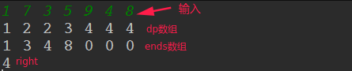

## LeetCode - 354. Russian Doll Envelopes及最长上升子序列问题总结

 - 最长上升子序列普通dp法
 - 最长上升子序列解的打印
 - 最长上升子序列NlogN法
 - LeetCode - 354. Russian Doll Envelopes

***
[**LeetCode300 测试最长上升子序列**](https://leetcode.com/problems/longest-increasing-subsequence/)

### 最长上升子序列普通dp法
> 生成长度为`N`的数组`dp`，`dp[i]`表示的是<font color = red>在以`arr[i]`这个数结尾的情况下，`arr[0...i]`中的最长递增子序列长度</font>。
> 
 - 对第一个数`arr[0]`来说，`dp[0] = 1`，最长递增子序列就是自己。
 - 当计算到`dp[i]`的时候，最长递增子序列要以`arr[i]`结尾，所以我们在`arr[0....i-1]`中所有比`arr[i]`小的数可以作为最长递增子序列的倒数第二个数，这些数中，哪个的最长递增子序列更大，就选择哪个。即<font color = red>dp[i] = max(dp[j] + 1) ，0 <= j < i，arr[j] < arr[i]</font>；
	
```java
 /**
 * dp[i]表示以arr[0]结尾的情况下,arr[0...i]中的最大递增子序列
 */
  class Solution {
    public int lengthOfLIS(int[] nums) {
        if(nums == null || nums.length == 0)
            return 0;
        int[] dp = new int[nums.length];
        int res = 1;
        for(int i = 0; i < nums.length; i++){
            dp[i] = 1;
            for(int j = 0; j < i; j++){
                if(nums[j] < nums[i])
                    dp[i] = Math.max(dp[i], dp[j]+1);
                res = Math.max(res,dp[i]);
            }
        }
        return res;
    }   
}
```
也可以和普通动态规划一样写成递归(记忆化的): 

```java
class Solution { 
    public int res;
    public int lengthOfLIS(int[] nums) {
        if(nums == null || nums.length == 0)
            return 0;
        int[] dp = new int[nums.length];
        Arrays.fill(dp, -1);
        res = 1;
        recur(nums, nums.length-1, dp);
        return res;
    }
    
    public int recur(int[] nums, int i, int[] dp){
        if(i == 0)
            return 1;
        if(dp[i] != -1)
            return dp[i];
        int max = 1;
        for(int k = 0; k < i; k++){            
            int kCur = recur(nums, k, dp); // remember to recursive
            if(nums[i] > nums[k])
                max = Math.max(kCur+1, max);
        }
        res = Math.max(res, max);
        return dp[i] = max;
    }
}
```

另一种递归的写法就是，直接在主程序中求每个位置结尾的最长递增子序列，然后记录一个最大值即可，这样递归函数就只有当`nums[i] > nums[k]`的时候才递归，而不是所有的时候都需要递归了。

```java
class Solution {
   
    public int lengthOfLIS(int[] nums) {
        if(nums == null || nums.length == 0)
            return 0;
        int[] dp = new int[nums.length];
        Arrays.fill(dp, -1);
        recur(nums, nums.length-1, dp);
        int res = 1;
        for(int i = 0; i < nums.length; i++) // 求每个位置结尾的最长递增子序列，然后记录一个最大值即可
            res = Math.max(res, recur(nums, i, dp));
        return res;
    }
    
    public int recur(int[] nums, int i, int[] dp){
        if(i == 0)
            return 1;
        if(dp[i] != -1)
            return dp[i];
        int max = 1;
        for(int k = 0; k < i; k++){            
            if(nums[i] > nums[k])
                max = Math.max(recur(nums, k, dp) + 1, max);
        }
        return dp[i] = max;
    }
}
```

***
### 最长上升子序列解的打印

>根据上面的方法可以求得`dp`数组，我们根据`dp`数组就可以得到最长上升子序列的解。
>
 - 从`dp`数组中的最大值`dp[maxi]`表示的是以`arr[maxi]`结尾的，而且是最长的上升子序列；
 - 我们从`maxi`往前面找，如果前面的某个`dp[i]`，<font color = red>**满足arr[i] < arr[maxi] 且dp[maxi] = dp[i] + 1**</font>，就说明这个是我们找最长递增子序列时候取的值，可以作为最长递增子序列的倒数第二个数。
 - 然后依次往前找，可以得到解。

```java
    public static int[] getLis(int[] arr,int[] dp){
        int len = 0;
        int index = 0;
        for(int i = 0; i < dp.length; i++){
            if(dp[i] > len){
                len = dp[i];
                index = i;
            }
        }
        int[] lis = new int[len];
        lis[--len] = arr[index];
        for(int i = index - 1; i >= 0; i--){
            if(dp[i] == dp[index] - 1 && arr[i] < arr[index]){
                lis[--len] = arr[i];
                index = i;
            }
        }
        return lis;
    }
```
***
### 最长上升子序列NlogN法
 这个方法是使用一个额外的数组`ends[]`，`dp[i]`记录的还是以`arr[i]`结尾的最长递增子序列，`ends[i]`记录的是<font color = red>在所有长度为`i`的递增序列中，最小的结尾数是`ends[i]`</font>。初始时整形变量`right = 1`，`ends[1...right]`为有效区，`ends[right+1...arr.length]`为无效区，然后使用<font color = red>二分</font>的方式在`ends`数组中查找。


 * `dp[0]  = 1`，`ends[1] = arr[0]`表示的是，在所有长度为`1`的递增序列中，最小结尾是`arr[0]`，此时只有一个数；
 * <font color = red> `right`变量记录`ends`数组的有效范围，最后返回的就是`right`(`end`的有效范围)；
 * 遍历到某个数`arr[i]`的时候，在`ends[]`数组中二分查找<font color = red>最左边的>arr[i]的数</font>(二分查找看[这篇博客](https://blog.csdn.net/zxzxzx0119/article/details/82670761#t4))
		* 如果有某个位置`l`，即`arr[l] > arr[i]`，说明`l`长度的最小结尾可以更新为`arr[i]`，且`dp[i] = right`(目前的最长长度)；
		* 否则，如果没有找到(此时`l = right+1`)，则说明有效区长度要扩大`1`，且`end[right+1] = arr[i]`，表示长度为`right + 1`的最小结尾暂时是`arr[i]`，此时`dp[i] = right + 1`；
 - 一直遍历整个数组，最后的最长长度就是有效区的长度(`right`); 

```java
/**
* dp[i]记录的还是以arr[i]结尾的最长递增子序列
* ends数组中 ends[i]表示的是在所有长度为i的最长递增子序列中最小结尾是什么
*/
class Solution { 
    public int lengthOfLIS(int[] nums){
        if(nums == null || nums.length == 0)
            return 0;
        int[] dp = new int[nums.length];
        int[] ends = new int[nums.length+1];
        dp[0] = 1;
        ends[1] = nums[0];
        int right = 1;  // [1~right]为有效区　ends数组是有序的(升序), right是右边界
        int l = 0,m = 0,r = 0;
        for(int i = 1; i < nums.length; i++){
            l = 1;
            r = right;
            while(l <= r){
                m = l + (r-l)/2;
                if(nums[i] > ends[m]){
                    l = m+1;
                }else {
                    r = m-1;
                }
            }
            if(l == right+1){ //没有找到　arr[i]是最长的, 说明以arr[i]以arr[i]结尾的最长递增子序列=ends区有效长度+1
                dp[i] = right+1;
                ends[right+1] = nums[i]; // 扩大ends数组
                right += 1;  //扩大有效区
            }else {  // 找到了arr[l] > arr[i], 更新end[l] = arr[i] ,表示l长度的最长子序列结尾可以更新为arr[i]
                dp[i] = right; // dp[i]还是没有加长
                ends[l] = nums[i];
            }
        }
        return right;
    } 
}
```
一个测试用例: 




***
### LeetCode - 354. Russian Doll Envelopes
#### [题目链接](https://leetcode.com/problems/russian-doll-envelopes/description/)

> https://leetcode.com/problems/russian-doll-envelopes/description/

 #### 题目


### 解析
 求解过程：先按`a`从小到大进行排序，当`a`相同时，按`b`从大到小排序。然后求解`b`的最长递增子序列。
> 为什么b要按从大到小排列呢？按照最长递增子序列的`O(N*logN)`方法，当前数arr[i]大于ends数组中所有的数(末尾的最大)，我们会将arr[i]添加在ends数组中；否则在ends数组中二分查找第一个大于当前数的数且替换它。所以我们的做法<font color = red>会保证在a相等的情况下，b可以有一个最小值，这样可以摞相对多的数。以达更长的序列，同时也避免了a相同b不相同时摞在一起的情况</font>。

```java
class Solution {
    
    private class Node{
        public int a;
        public int b;

        public Node(int a, int b) {
            this.a = a;
            this.b = b;
        }
    }

    public class NodeComparator implements Comparator<Node>{

        @Override
        public int compare(Node o1, Node o2) {
            if(o1.a == o2.a){
                return o2.b - o1.b;
            }else {
                return o1.a - o2.a;
            }
        }
    }

    
    
    public int maxEnvelopes(int[][] envelopes) {
        if(envelopes == null || envelopes.length == 0 || envelopes[0].length == 0)
            return 0;
        Node[] nodes = new Node[envelopes.length];
        for(int i = 0; i < envelopes.length; i++){
            nodes[i] = new Node(envelopes[i][0],envelopes[i][1]);
        }
        Arrays.sort(nodes,0,nodes.length,new NodeComparator());
        int[] ends = new int[envelopes.length+1];
        ends[1] = nodes[0].b;
        int right = 1;
        int l = 0, m = 0, r = 0;
        int res = 1;
        for(int i = 1; i < nodes.length; i++){
            l = 1;
            r = right;
            while(l <= r){
                m = l + (r-l)/2;
                if(nodes[i].b > ends[m]){
                    l = m + 1;
                }else {
                    r = m - 1;
                }
            }
            if(l == right+1){
                ends[right+1] = nodes[i].b;
                right += 1;
            }else {
                ends[l] = nodes[i].b;
            }
        }
        return right;
    }
}
```
