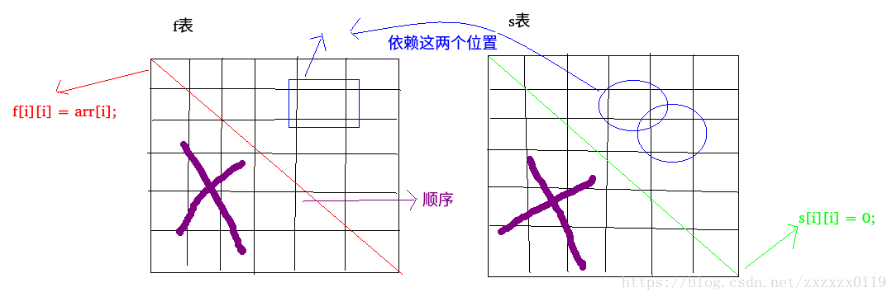

## LeetCode - 486. Predict the Winner(排成一条线的纸牌博弈问题)
 - 递归解法
 - 动态规划解法

***
#### [题目链接](https://leetcode.com/problems/predict-the-winner/description/)

> https://leetcode.com/problems/predict-the-winner/description/

#### 题目


***
### 递归解法

 - 定义递归函数`f[i,j]`，表示的是如果`arr[i...j]`这个排列上的纸牌被绝顶聪明的人先拿，最终可以获得什么分数。
 - 定义递归函数`s[i,j]`，表示的是如果`arr[i...j]`这个排列上的纸牌被绝顶聪明的人后拿，最终可以获得什么分数。

首先对于`f[i,j] `: 

 * 如果`i == j`，即`arr[i...j]`上只有一张纸牌，当然会被先拿纸牌的人拿走，所以可以返回`arr[i]`;
 *  如果`i != j`，此时先拿的人有两种选择。如果拿走`arr[i]`，那么会剩下`arr[i+1,j]`，这个时候，对于当前的玩家来说，他就成了后拿的人，所以他之后能获得的分数为`s(i+1,j)`；  如果他拿走的是`arr[j]`，那么会剩下`arr[i...j-1]`，对于当前的玩家来说，它成了后拿的人，之后能获得的分数为`s(i,j-1)`，因为当前的玩家会做出最好的选择，所以是<font color  = red>`max(arr[i]+s[i+1,j], arr[j]+s[i,j-1]);`</font>

然后来考虑`s[i,j]` :

 *  如果`i == j`，即`arr[i...j]`上只有一张纸牌，作为后拿的人必然什么也得不到，所以返回`0`；
 *  如果`i != j`，根据`s`函数的定义，当前的玩家的对手会先拿纸牌，如果对手拿走了`arr[i...j]`中的`arr[i]`，剩下`arr[i+1,j]`，然后轮到当前玩家拿。如果对手拿走了`arr[i...j]`中的`arr[j]`，剩下`arr[i,j-1]`，然后轮到当前玩家拿。因为对手会拿走最好的，所以当前玩家只能拿最差的，所以是<font color  = red>`min(f[i+1,j],f[i,j-1])`；</font>

所以可以写出如下的代码

```java
class Solution {

    public boolean PredictTheWinner(int[] arr) {
        if (arr == null || arr.length == 0)
            return true;
        return f(arr, 0, arr.length - 1) >= s(arr, 0, arr.length - 1);
    }

    public int f(int[] arr, int i, int j) { //先拿的
        if (i == j)
            return arr[i];
        return Math.max(arr[i] + s(arr, i + 1, j), arr[j] + s(arr, i, j - 1)); //拿了其中一个之后，当前玩家成了后拿的那个人
    }

    public int s(int[] arr, int i, int j) { //后拿的
        if (i == j) //后拿的这个　已经不能拿了
            return 0;
        return Math.min(f(arr, i + 1, j), f(arr, i, j - 1));
    }
}
```
***
### 动态规划解法

上面的方法的时间复杂度达到`O(2^n)`次方，我们可以根据上面的方法来改出动态规划。

 - 先生成两张二维`dp`表，`f`表和`s`表，我们发现，根据上面的方法，`f`表中的主对角线上的值就是`arr[i]`的值(即`f[i][i] = arr[i]`)；
 - 同理`s`表中的主对角线上的值为`0`；
 - 然后我们可以得到`f`表中的某个位置`f[i,j]`依赖的是`s`表中的位置`s[i+1,j]`和`s[i,j-1] `(即下面的位置和左边的位置)；
 - `s`表中同理依赖`f`表中`f[i+1][j]`和`f[i,j-1]`的位置；

具体过程看下图:




最后我们要求的就是`f[0][len]` 和 `s[0][len] `这两个值，如果`f[0][len]`更大的话，第一个玩家就能赢；

可以写出如下代码

```java
class Solution {

    public boolean PredictTheWinner(int[] nums) {
        if (nums == null || nums.length == 0 || nums.length == 1)
            return true;
        int len = nums.length - 1;
        int[][] f = new int[len + 1][len + 1];
        int[][] s = new int[len + 1][len + 1];
        for (int i = 0; i <= len; i++) {//对角线上填充(就是递归中的边界条件)
            f[i][i] = nums[i];
//            s[i][i] = 0;  // 数组自动初始化
        }
        for (int i = len - 1; i >= 0; i--) {
            for (int j = i + 1; j <= len; j++) {
                f[i][j] = Math.max(nums[i] + s[i + 1][j], nums[j] + s[i][j - 1]); //注意这里是arr[j]+是s[i][j-1]
                s[i][j] = Math.min(f[i + 1][j], f[i][j - 1]);
            }
        }
        return f[0][len] >= s[0][len];
    }
}
```


