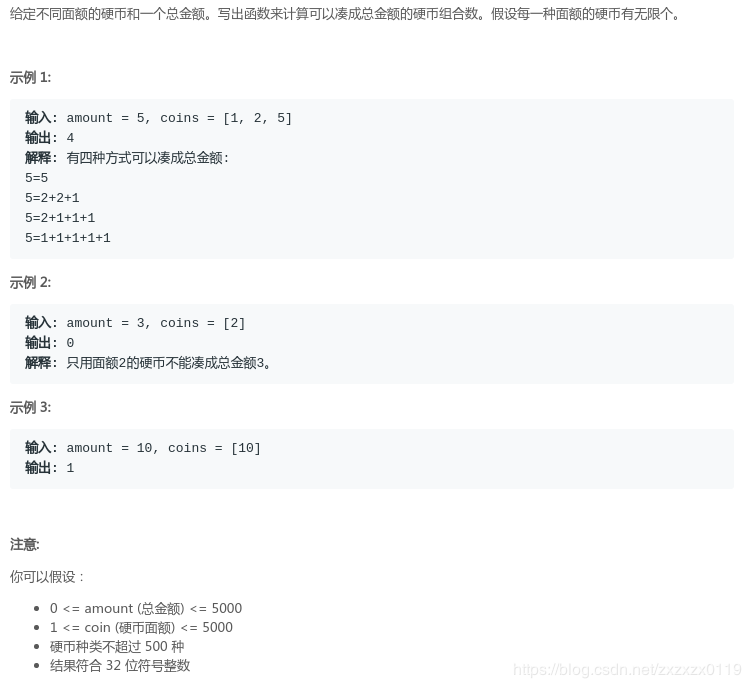
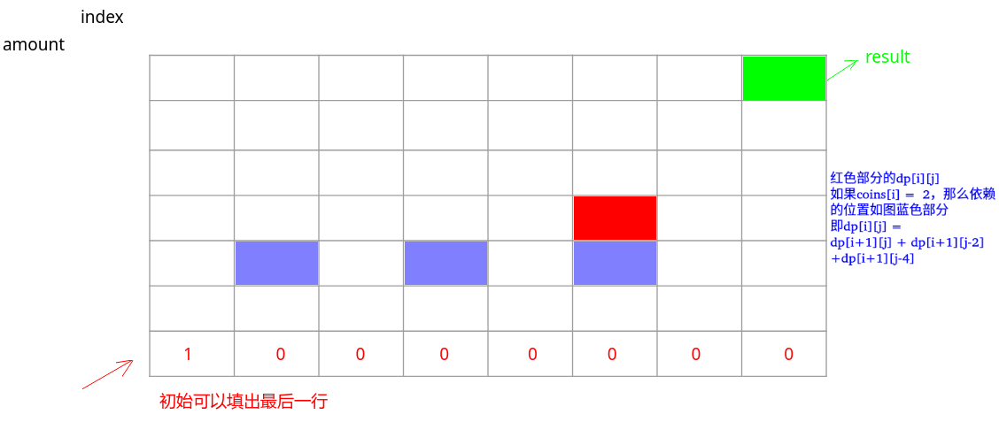

# LeetCode - 518. Coin Change 2(零钱兑换 II)(换钱的方法数问题)
 - 暴力递归解法
 - 记忆化搜索解法
 - 二维dp解法
 - 二维dp优化
 - 滚动数组优化空间O(n)
***
#### [题目链接](https://leetcode.com/problems/coin-change-2/description/)

> https://leetcode.com/problems/coin-change-2/description/

#### 题意


### 暴力递归解法
 暴力递归的解法，比如上面的例子: 

 - 用`0`张`1`元的货币，让`[2,5]`组成剩下的`5`元，最终方法数为`sum1`;
 - 用`1`张`1`元的货币，让`[2,5]`组成剩下的`4`元，最终方法数为`sum2`;
 - 用`2`张`1`元的货币，让`[2,5]`组成剩下的`3`元，最终方法数为`sum3`;
 - 用`3`张`1`元的货币，让`[2,5]`组成剩下的`2`元，最终方法数为`sum4`;
 - 用`4`张`1`元的货币，让`[2,5]`组成剩下的`1`元，最终方法数为`sum5`;
 - 用`5`张`1`元的货币，让`[2,5]`组成剩下的`0`元，最终方法数为`sum6`;

那么我们要求的结果就是`sum1 + sum2 + sum3 + sum4 + sum5 + sum6 `; 

根据上面的分析过程可以写出一个递归函数`process(coins,index,amount)`表示的是用`coins[index,N-1]`这

些硬币来组成`amount`，返回的总的方法数，所以代码如下(超时):

```java
class Solution {
    public int change(int amount, int[] coins) {
        if (amount == 0)
            return 1;
        if (coins == null || coins.length == 0 || amount < 0)
            return 0;
        return process(coins, 0, amount);
    }

    public int process(int[] coins, int index, int amount) {
        int res = 0;
        if (index == coins.length) //到了最后一个说明找到了一种方法
            return res = amount == 0 ? 1 : 0;
        for (int i = 0; i * coins[index] <= amount; i++)
            res += process(coins, index + 1, amount - coins[index] * i);
        return res;
    }
}
```
***
### 记忆化搜索解法

上面的递归过程计算了许多的重复子问题，我们可以在递归的过程中，记录子问题的解，当再次用到的时候，如果

之前已经计算过，可以取出来用。减少递归过程

```java
class Solution {
    public int change(int amount, int[] coins) {
        if (amount == 0)
            return 1;
        if (coins == null || coins.length == 0 || amount < 0)
            return 0;
        int[][] map = new int[coins.length + 1][amount + 1];
        return process(coins, 0, amount, map);
    }

    public int process(int[] coins, int index, int amount, int[][] map) {
        int res = 0; //方法数
        if (index == coins.length)
            res = amount == 0 ? 1 : 0;
        else {
            int mapValue = 0;
            for (int i = 0; i * coins[index] <= amount; i++) {
                mapValue = map[index + 1][amount - i * coins[index]];
                if (mapValue != 0) {
                    res += mapValue == -1 ? 0 : mapValue;
                } else {
                    res += process(coins, index + 1, amount - i * coins[index], map);
                }
            }
        }
        map[index][amount] = res == 0 ? -1 : res;
        return res;
    }
}
```
**注意这里`map`的几个特殊值: `0`表示没有计算过。`-1`表示计算过但是返回值是`0`；其他值就是计算过且不为`0`**;

或者不用上面的特殊值，初始化`map`为`-1`，程序就会变得简单一点:

```java
class Solution {
    public int change(int amount, int[] coins) {
        if (amount == 0)
            return 1;
        if (coins == null || coins.length == 0 || amount < 0)
            return 0;
        int[][] map = new int[coins.length + 1][amount + 1];
        
        for(int i = 0; i < map.length; i++)
            Arrays.fill(map[i], -1);
        
        return process(coins, 0, amount, map);
    }

    public int process(int[] coins, int index, int amount, int[][] map) {
        int res = 0; //方法数
        if (index == coins.length)
            res = amount == 0 ? 1 : 0;
        else {
            int mapValue = 0;
            for (int i = 0; i * coins[index] <= amount; i++) {
                mapValue = map[index + 1][amount - i * coins[index]];
                if (mapValue != -1) 
                    res += mapValue;
                else 
                    res += process(coins, index + 1, amount - i * coins[index], map);
            }
        }
        return map[index][amount] = res;
    }
}
```
再简写: 

```java
class Solution {
    public int change(int amount, int[] coins) {
        if (amount == 0)
            return 1;
        if (coins == null || coins.length == 0 || amount < 0)
            return 0;
        int[][] map = new int[coins.length + 1][amount + 1];
        
        for(int i = 0; i < map.length; i++)
            Arrays.fill(map[i], -1);
        
        return process(coins, 0, amount, map);
    }

    public int process(int[] coins, int index, int amount, int[][] map) {
        if (index == coins.length)
            return amount == 0 ? 1 : 0;
        if(map[index][amount] != -1)
            return map[index][amount];
        int res = 0;
        for (int i = 0; i * coins[index] <= amount; i++)
            res += process(coins, index + 1, amount - i * coins[index], map);
        return map[index][amount] = res;
    }
}
```

***
### 二维dp解法

这个方法也是通过递归的方法改过来的，递归中的边界条件就是一开始要填的位置，如下图。



 - 我们先填好最后一行的`dp`表(根据递归函数)
 - 然后看一个普通的位置依赖的是左边的一些位置(逐渐减，不越界)
 - 然后我们就通过递推的方向推出整张`dp`表，右上角是答案；

```java
class Solution {
    public int change(int amount, int[] coins) {
        if (amount == 0)
            return 1;
        if (coins == null || coins.length == 0 || amount < 0)
            return 0;
        int len = coins.length;
        int[][] dp = new int[len + 1][amount + 1];
        for (int j = 0; j <= amount; j++) dp[len][j] = 0;
        dp[len][0] = 1;
        int sum = 0;
        for (int i = len - 1; i >= 0; i--) {
            for (int j = 0; j <= amount; j++) {
                sum = 0;
                for (int k = 0; j - coins[i] * k >= 0; k++) sum += dp[i + 1][j - coins[i] * k];
                dp[i][j] = sum;
            }
        }
        return dp[0][amount];
    }
}
```
***
### 二维dp优化
在计算左边的一些依赖的值的时候，我们迭代的求和，其实没有必要，因为`dp[i][j-coins[j]]`已经将前面的和求了一遍，我们可以直接拿过来用就可以了；于是里面的第三层循环就可以不写；
```java
class Solution {
    public int change(int amount, int[] coins) {
        if (amount == 0)
            return 1;
        if (coins == null || coins.length == 0 || amount < 0)
            return 0;
        int len = coins.length;
        int[][] dp = new int[len + 1][amount + 1];
        for (int j = 0; j <= amount; j++) dp[len][j] = 0;
        dp[len][0] = 1;
        for (int i = len - 1; i >= 0; i--) {
            for (int j = 0; j <= amount; j++) {
                dp[i][j] = j - coins[i] >= 0 ? dp[i][j - coins[i]] + dp[i + 1][j] : dp[i + 1][j];
            }
        }
        return dp[0][amount];
    }
}
```
***
### 滚动数组优化空间O(n)
由于递推的方向是从下到上，从右到左，所以我们可以通过滚动数组进行优化，`dp[i-coins[j]]`的值还是之前

的`dp[i][i-coins[j]]`，因为此时的dp[i]还没有更新，所以`dp[i]`也是`dp[i+1][j]`，所以只需要一个一维数组即可；

```java
class Solution {
    public int change(int amount, int[] coins) {
        if (amount == 0)
            return 1;
        if (coins == null || coins.length == 0 || amount < 0)
            return 0;
        int[] dp = new int[amount + 1];
        dp[0] = 1;
        for (int i = coins.length - 1; i >= 0; i--) {
            for (int j = 0; j <= amount; j++) {
                dp[j] = j - coins[i] >= 0 ? dp[j - coins[i]] + dp[j] : dp[j];
            }
        }
        return dp[amount];
    }
}

```

