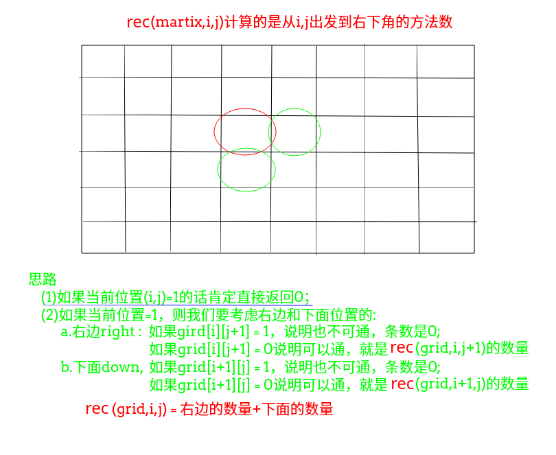

## LeetCode - 63. Unique Paths II(有障碍物的不同路径)

 - 记忆化
 - 二维dp
 - 一维dp

#### [题目链接](https://leetcode.com/problems/unique-paths-ii/description/)

> https://leetcode.com/problems/unique-paths-ii/description/

#### 题目


***
### 记忆化
**[LeetCode - 62](https://blog.csdn.net/zxzxzx0119/article/details/81807910)和这题也很像。**

递归思路如下。




```java
class Solution {

    private int[][] dp;
    private int n;
    private int m;

    public int uniquePathsWithObstacles(int[][] obstacleGrid) {
        n = obstacleGrid.length;
        m = obstacleGrid[0].length;
        dp = new int[n][m];
        for (int i = 0; i < dp.length; i++)
            Arrays.fill(dp[i], -1);
        return rec(obstacleGrid, 0, 0);
    }

    public int rec(int[][] grid, int i, int j) {
        if (i == n - 1 && j == m - 1) 
            return grid[i][j] == 0 ? 1 : 0;
        if (dp[i][j] != -1)
            return dp[i][j];
        if (i == n - 1) 
            dp[i][j] = grid[i][j] == 1 ? 0 : (grid[i][j + 1] == 0 ? rec(grid, i, j + 1) : 0);
        else if (j == m - 1) {
            dp[i][j] = grid[i][j] == 1 ? 0 : (grid[i + 1][j] == 0 ? rec(grid, i + 1, j) : 0);
        }else {
            int right = grid[i][j + 1] == 0 ? rec(grid, i, j + 1) : 0;
            int down = grid[i + 1][j] == 0 ? rec(grid, i + 1, j) : 0;
            dp[i][j] = (grid[i][j] == 1) ? 0 : (right + down);
        }
        return dp[i][j];
    }
}
```
简单优化: 

 - <font color = red>由于右边和下面的不管是`0`还是真的`>0`的值，都是一个值，不影响；
 - <font color = red>或者说每一个`(i,j)`没有必要重复判断`(i,j+1)`或者`(i+1,j)`位置的值，所以只需要判断自己`(i,j)`；</font>

```java
class Solution {

    private int[][] dp;
    private int n;
    private int m;

    public int uniquePathsWithObstacles(int[][] obstacleGrid) {
        n = obstacleGrid.length;
        m = obstacleGrid[0].length;
        dp = new int[n][m];
        for (int i = 0; i < dp.length; i++)
            Arrays.fill(dp[i], -1);
        return rec(obstacleGrid, 0, 0);
    }

    public int rec(int[][] grid, int i, int j) {
        if (i == n - 1 && j == m - 1)
            return grid[i][j] == 0 ? 1 : 0;
        if (dp[i][j] != -1)
            return dp[i][j];
        if (i == n - 1)
            dp[i][j] = grid[i][j] == 1 ? 0 : rec(grid, i, j + 1);
        else if (j == m - 1)
            dp[i][j] = grid[i][j] == 1 ? 0 : rec(grid, i + 1, j);
        else
            dp[i][j] = (grid[i][j] == 1) ? 0 : (rec(grid, i, j + 1) + rec(grid, i + 1, j));
        return dp[i][j];
    }
} 
```

***
### 二维dp
第一种未优化的二维`dp`，完全根据记忆化的逆向改造: 
```java
class Solution {

    public int uniquePathsWithObstacles(int[][] obstacleGrid) {
        int n = obstacleGrid.length;
        int m = obstacleGrid[0].length;
        int[][] dp = new int[n][m];
        dp[n - 1][m - 1] = obstacleGrid[n - 1][m - 1] == 1 ? 0 : 1;
        for (int i = n - 2; i >= 0; i--)
            dp[i][m - 1] = obstacleGrid[i][m - 1] == 1 ? 0 : (obstacleGrid[i + 1][m - 1] == 1 ? 0 : dp[i + 1][m - 1]);
        for (int j = m - 2; j >= 0; j--)
            dp[n - 1][j] = obstacleGrid[n - 1][j] == 1 ? 0 : (obstacleGrid[n - 1][j + 1] == 1 ? 0 : dp[n - 1][j + 1]);
        int right, down;
        for (int i = n - 2; i >= 0; i--) {
            for (int j = m - 2; j >= 0; j--) {
                right = obstacleGrid[i][j + 1] == 1 ? 0 : dp[i][j + 1];
                down = obstacleGrid[i + 1][j] == 1 ? 0 : dp[i + 1][j];
                dp[i][j] = obstacleGrid[i][j] == 1 ? 0 : (right + down);
            }
        }
        return dp[0][0];
    }
}
```
优化版本: 
```java
class Solution {

    public int uniquePathsWithObstacles(int[][] obstacleGrid) {
        int n = obstacleGrid.length;
        int m = obstacleGrid[0].length;
        int[][] dp = new int[n][m];
        dp[n - 1][m - 1] = obstacleGrid[n - 1][m - 1] == 1 ? 0 : 1;
        for (int i = n - 2; i >= 0; i--) dp[i][m - 1] = obstacleGrid[i][m - 1] == 1 ? 0 : dp[i + 1][m - 1];
        for (int j = m - 2; j >= 0; j--) dp[n - 1][j] = obstacleGrid[n - 1][j] == 1 ? 0 : dp[n - 1][j + 1];
        for (int i = n - 2; i >= 0; i--) {
            for (int j = m - 2; j >= 0; j--) {
                dp[i][j] = obstacleGrid[i][j] == 1 ? 0 : (dp[i][j + 1] + dp[i + 1][j]);
            }
        }
        return dp[0][0];
    }
}
```

***
### 一维dp
滚动优化。
```java
class Solution {

    public int uniquePathsWithObstacles(int[][] obstacleGrid) {
        int n = obstacleGrid.length;
        int m = obstacleGrid[0].length;
        int[] dp = new int[m];
        dp[m - 1] = obstacleGrid[n - 1][m - 1] == 1 ? 0 : 1;
        for (int j = m - 2; j >= 0; j--)
            dp[j] = obstacleGrid[n - 1][j] == 1 ? 0 : (obstacleGrid[n - 1][j + 1] == 1 ? 0 : dp[j + 1]);
        int right, down;
        for (int i = n - 2; i >= 0; i--) {
            dp[m - 1] = obstacleGrid[i][m - 1] == 1 ? 0 : (obstacleGrid[i + 1][m - 1] == 1 ? 0 : dp[m - 1]);
            for (int j = m - 2; j >= 0; j--) {
                right = obstacleGrid[i][j + 1] == 1 ? 0 : dp[j + 1];
                down = obstacleGrid[i + 1][j] == 1 ? 0 : dp[j];
                dp[j] = obstacleGrid[i][j] == 1 ? 0 : (right + down);
            }
        }
        return dp[0];
    }
}
```

```java
class Solution {

    public int uniquePathsWithObstacles(int[][] obstacleGrid) {
        int n = obstacleGrid.length;
        int m = obstacleGrid[0].length;
        int[] dp = new int[m];
        dp[m - 1] = obstacleGrid[n - 1][m - 1] == 1 ? 0 : 1;
        for (int j = m - 2; j >= 0; j--) dp[j] = obstacleGrid[n - 1][j] == 1 ? 0 : dp[j + 1];
        for (int i = n - 2; i >= 0; i--) {
            dp[m - 1] = obstacleGrid[i][m - 1] == 1 ? 0 : dp[m - 1];
            for (int j = m - 2; j >= 0; j--) {
                dp[j] = obstacleGrid[i][j] == 1 ? 0 : (dp[j + 1] + dp[j]);
            }
        }
        return dp[0];
    }
}
```

***
