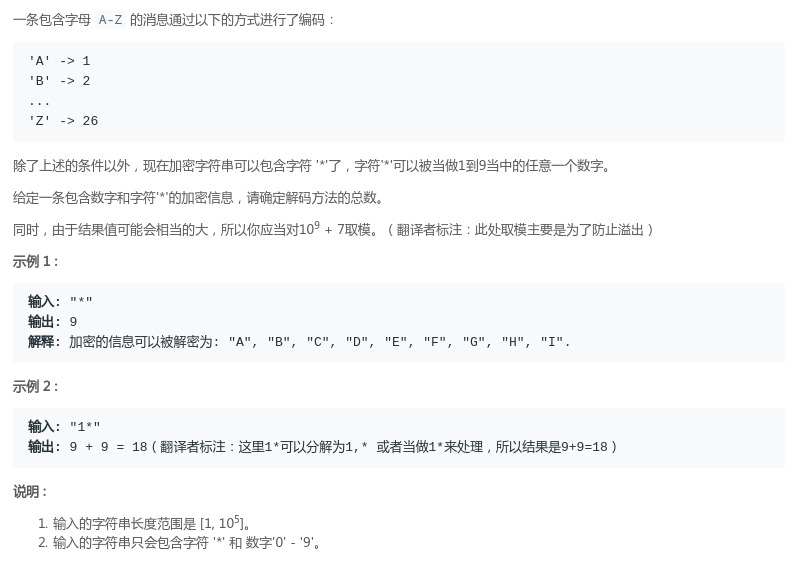
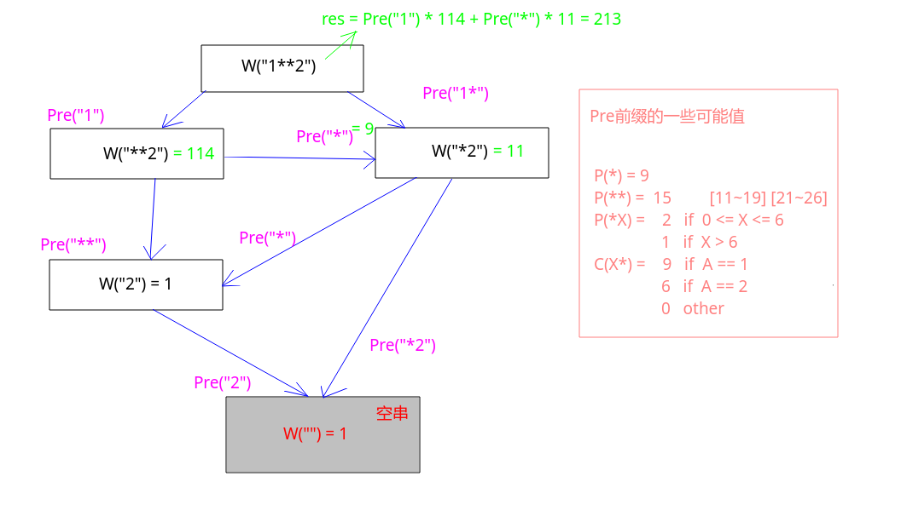

# LeetCode - 639. Decode Ways II

#### [题目链接](https://leetcode.com/problems/decode-ways-ii/)

> https://leetcode.com/problems/decode-ways-ii/

#### 题目

#### 解析

大体思路和[LeetCode - 91. Decode Ways]()相同:

* 不同点： 上面的情况当一个字符的时候直接返回`1`，但是这里需要考虑当只有一个字符的时候： ① `c == 0`返回`0`；②`c == {0~9}`返回`1`；③`c == *`返回`9`；
* 两个字符的时候更多的情况，我写在了下图的右边，可以自己推一下，不难；
* 然后就是注意结果的返回，上一题相当于是`1 * r1 + 1 * r2`，这一题就是上面的一些不同的结果导致，如果前缀不是`1`，就要和系数相乘，即`res = p1 * r1 + p2 * r2`，其中`r1`还是隔离`str[i]`之后的返回结果，`r2`是隔离`str[i]str[i+1]`之后的返回结果，不过要带上系数即可；



由于这一题数据规模比较大，所以递归会产生`StackOverflowError`，即递归深度太大，所以最好使用递推代码: 

```java
class Solution {

    final int mod = 1000000000 + 7;

    public int numDecodings(String s) {
        int n = s.length();
        char[] chs = s.toCharArray();
        long[] dp = new long[n+1];
        dp[n] = 1; // 空串
        dp[n-1] = ways1(chs[n-1]);
        for(int i = n - 2; i >= 0; i--){
            if(chs[i] == '0')
                dp[i] = 0;
            else {
                dp[i] = ways1(chs[i]) * dp[i+1] + ways2(chs[i], chs[i+1]) * dp[i+2];    
                dp[i] %= mod;
            }
        }
        return (int)dp[0];
    }

    // only one character
    private int ways1(char c){
        if(c == '0')
            return 0;
        if(c == '*')
            return 9;
        return 1;
    }

    // two characters
    private int ways2(char c1, char c2){
        if(c1 == '*' && c2 == '*')
            return 15;
        if(c1 == '*') // c1 == '*' && c2 != '*'
            return (c2 >= '0' && c2 <= '6') ? 2 : 1; // *0 ~ *6 --> 2
        if(c2 == '*') // c1 != '*' && c2 == '*'
            return c1 == '1' ? 9 : (c1 == '2' ? 6 : 0);
        int se = 10 * (c1 - '0') + (c2 - '0');
        return (se >= 10 && se <= 26) ? 1 : 0; // contains 01, 02...
    }
}
```

下面是递归的代码(`StackOverflowError`)

```java
class Solution {

    final int mod = 1000000000 + 7;

    private long[] dp;

    public int numDecodings(String s) {
        if(s == null || s.length() == 0)
            return 0;
        dp = new long[s.length()];
        Arrays.fill(dp, -1);
        return (int)recur(s.toCharArray(), 0);
    }

    private long recur(char[] chs, int pos){
        if(pos == chs.length) //空串
            return 1;
        if(chs[pos] == '0')
            return 0;
        if(pos == chs.length-1)
            return ways1(chs[pos]);
        if(dp[pos] != -1)
            return dp[pos];
        long res = ways1(chs[pos]) * recur(chs, pos+1) % mod;
        if(pos < chs.length-1)
            res += (ways2(chs[pos], chs[pos+1]) * recur(chs, pos+2)%mod) % mod;
        return dp[pos] = res%mod;
    }

    // only one character
    private int ways1(char c){
        if(c == '0')
            return 0;
        if(c == '*')
            return 9;
        return 1;
    }

    // two characters
    private int ways2(char c1, char c2){
        if(c1 == '*' && c2 == '*')
            return 15;
        if(c1 == '*') // c1 == '*' && c2 != '*'
            return (c2 >= '0' && c2 <= '6') ? 2 : 1; // *0 ~ *6 --> 2
        if(c2 == '*') // c1 != '*' && c2 == '*'
            return c1 == '1' ? 9 : (c1 == '2' ? 6 : 0);
        int se = 10 * (c1 - '0') + (c2 - '0');
        return (se >= 10 && se <= 26) ? 1 : 0; // contains 01, 02...
    }
}
```
