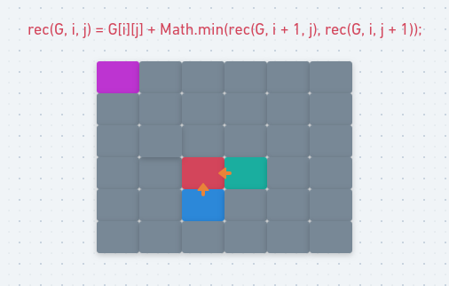
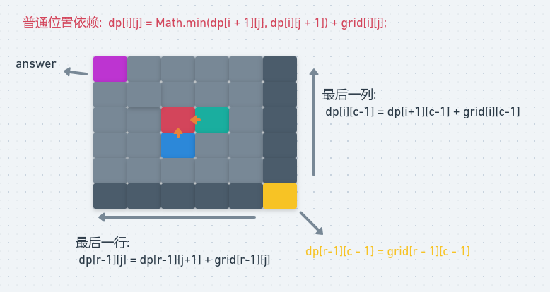
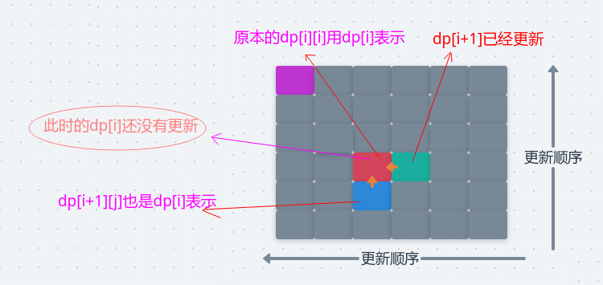

# LeetCode - 64. Minimum Path Sum(最小路径和)
 - 记忆化搜索
 - 二维空间dp表
 - 滚动数组优化空间O(min{N,M})
 - 打印解
***
#### [题目链接](https://leetcode.com/problems/minimum-path-sum/description/)

> https://leetcode.com/problems/minimum-path-sum/description/

#### 题目


## 1、记忆化搜索

递归思路: 

- 假如我们就在最右下角的格子(也可以想象成网格只有一个格子)，那么最短路径和就是格子中的值；
 - 然后假如我们在最后一行的格子中，假如是`grid[grid.length][j]`，那么从这个点出发到最右下角的最小路径和就是本身加上它左边的格子到最右下角的最小路径和。
 - 最后一列和最后一行是同理的。
 - 一个普通的位置，它到最右下角的最小路径和是多少呢，**是它左边一个位置和它下面一个位置的最小路径和中最小的那个加上它自己格子的值**。

上面的过程有很多重复计算的子问题，使用一个二维数组记录一下，那么我们下次再需要这个子问题的解的时候不需要递归，直接拿出来用即可。

图: 

<div align="center"></div><br>

代码:

```java
class Solution {

    private int[][] dp;
    private int n, m;

    public int minPathSum(int[][] grid) {
        n = grid.length;
        m = grid[0].length;
        dp = new int[n][m];
        for (int i = 0; i < n; i++) Arrays.fill(dp[i], -1);
        return rec(grid, 0, 0);
    }

    public int rec(int[][] G, int i, int j) {
        if (i == n - 1 && j == m - 1) return G[i][j];
        if (dp[i][j] != -1) return dp[i][j];
        if (i == n - 1)
            return dp[i][j] = G[i][j] + rec(G, i, j + 1);
        else if (j == m - 1)
            return dp[i][j] = G[i][j] + rec(G, i + 1, j);
        else
            return dp[i][j] = G[i][j] + Math.min(rec(G, i + 1, j), rec(G, i, j + 1));
    }
}
```

## 2、二维dp表
 动态规划的过程**可以看做是递归的逆过程，既然递归是从上往下求解，每个大的问题都要先去求解子问题，所以，动态规划是先求解小的子问题，依次往上，所以大问题需要的子问题已经提前求好了**。

对于这个题目 : 

 - 先生成一张二维`dp`表，然后按照递归相反的方向求解；
 - 先把`dp`表的最右下角，最后一行，和最后一列的位置填好；
 - 然后一个普通的位置依赖它下面的位置和左边的位置，所以我们依次从下到上，做右往左，填整张`dp`表，最后`dp[0][0]`就是答案。

图: 
<div align="center"></div><br>

代码：　

```java
class Solution {

    public int minPathSum(int[][] grid) {
        if (grid == null || grid.length == 0 || grid[0] == null || grid[0].length == 0)
            return 0;
        int r = grid.length - 1;
        int c = grid[0].length - 1;
        int[][] dp = new int[r + 1][c + 1];
        dp[r][c] = grid[r][c];
        for (int i = r - 1; i >= 0; i--) dp[i][c] = dp[i + 1][c] + grid[i][c]; //填充最后一列的
        for (int j = c - 1; j >= 0; j--) dp[r][j] = dp[r][j + 1] + grid[r][j]; //填充最后一行的
        for (int i = r - 1; i >= 0; i--) { //填充其他的
            for (int j = c - 1; j >= 0; j--) {
                dp[i][j] = Math.min(dp[i + 1][j], dp[i][j + 1]) + grid[i][j];
            }
        }
        return dp[0][0];
    }
}
```
***
## 3、滚动数组优化空间`O(min{N,M})`

 在我们计算整张`dp`表的时候，某个位置依赖的位置只是它右边的位置和下面的位置，所以如果只是要得到最小路径和的话，没有必要生成整张`dp`表，只需要一个一位数组即可。

 为什么可以这样呢，看下图，**因为某个位置`dp[i][j] `依赖` dp[i+1][j] `和`dp[i][j+1]`，如果只使用一维数组的话，其实此时`dp[i]`代表的就是`dp[i+1][j]`，而`dp[i+1]`代表的是`dp[i][j+1]`，此时它已经被更新，但是`dp[i]`没有被更新，所以可以直接比较`dp[i]`和`dp[i+1]`的大小赋给dp[i]即可**。

<div align="center"></div><br>

代码: 

```java
class Solution {

    public int minPathSum(int[][] grid) {
        int n = grid.length;
        int m = grid[0].length;
        int big = Math.max(n - 1, m - 1);
        int small = Math.min(n - 1, m - 1);
        boolean rowMore = n - 1 == big;
        int[] dp = new int[small + 1];
        dp[small] = grid[n - 1][m - 1];
        for (int i = small - 1; i >= 0; i--)
            dp[i] = dp[i + 1] + (rowMore ? grid[big][i] : grid[i][big]);
        for (int i = big - 1; i >= 0; i--) {
            dp[small] = dp[small] + (rowMore ? grid[i][small] : grid[small][i]);
            for (int j = small - 1; j >= 0; j--) {
                dp[j] = Math.min(dp[j], dp[j + 1]) + (rowMore ? grid[i][j] : grid[j][i]);
            }
        }
        return dp[0];
    }
}
```
上面的代码处理了如果行数少于列数时，更新的方向就是一列一列的更新。这样就可以达到空间复杂度控制在`O(min{N,M})`内。
***
## 4、打印解
注意要打印解的话，不能使用空间优化，必须保存原来的二维`dp`数组，这样才能回溯回去。
```java
public void printAnswer(int[][] grid,int[][] dp){
    int i = 0,j = 0;
    System.out.println("[0,0]");
    while(i < grid.length && j < grid[0].length){
        if(i == grid.length - 1 && j == grid[0].length - 1){
            break;
        }
        if(i == grid.length - 1) {
            System.out.println("[" + i + "," + (++j) + "]");
        }else if( j == grid[0].length - 1){
            System.out.println("[" + (++i) + "," + j + "]");
        } else if(dp[i+1][j] < dp[i][j+1]){
            System.out.println("[" + (++i) + "," + j + "]");
        }else {
            System.out.println("[" + i + "," + (++j) + "]");
        }
    }
}
```

  
