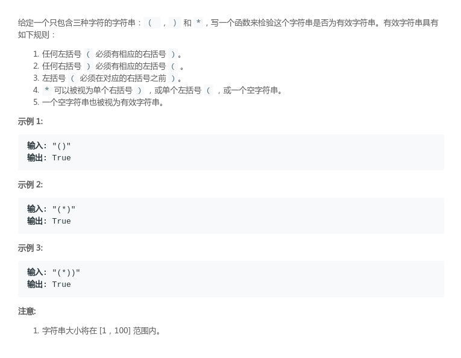
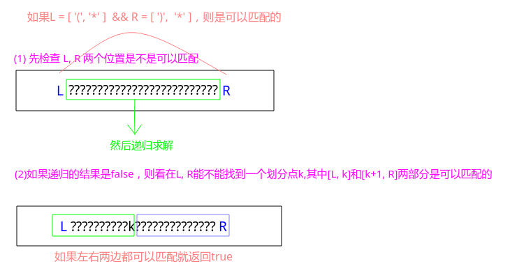

## LeetCode - 678. Valid Parenthesis String (DP | 思维)

* DP
* 思维

***

#### [题目链接](https://leetcode.com/problems/valid-parenthesis-string/)

> https://leetcode.com/problems/valid-parenthesis-string/

#### 题目


#### 解析
这个题目有很多种解法。是一道练思维的好题。
#### DP

记忆化的思路: 

* 递归函数`recur`求`[L, R]`范围内的字符串是否可以构成解，答案是`recur(0, n-1)`；
* 递归终止条件是`L == R`，如果此时`chs[L] == '*'`，则按照题目要求是返回`true`的，或者`L > R`也返回`true`；
* 否则，我们检查`L, R`两个位置是否满足`chs[L]`在集合`['(', '*']`且`chs[R]`在集合`[')', '*']`中，则如果`[L+1, R-1]`(递归)如果能匹配，就返回`true`；
* 第二种情况，在`[L, R]`之间找到一个位置`k`，如果划分之后，`[L, k]`和`[k+1, R]`都能匹配，就返回`true`；
* 上述条件都不满足就返回`false`；




记忆化代码: 
```java
class Solution {

    static int[][] dp;

    private boolean recur(char[] chs, int L, int R){
        if(L > R) // empty
            return true;
        if(L == R)
            return chs[L] == '*' ? true : false;
        if(dp[L][R] != 0)
            return dp[L][R] == 1 ? true : false;
        boolean res = false;
        if(check(chs, L, R))
            if(recur(chs, L+1, R-1))
                res = true;
        if(!res){ 
            for(int i = L; i <= R-1; i++){ // i <= R-1 not i <= R 
                if(recur(chs, L, i) && recur(chs, i+1, R)){ 
                    res = true;
                    break;
                }
            }
        }
        dp[L][R] = res == true ? 1 : -1;
        return res;
    }

    private boolean check(char[] chs, int L, int R){
        return (chs[L] == '(' && chs[R] == '*')
            || (chs[L] == '(' && chs[R] == ')')
            || (chs[L] == '*' && chs[R] == ')');
    }

    public boolean checkValidString(String s) {
        dp = new int[s.length()][s.length()];
        return recur(s.toCharArray(), 0, s.length()-1);
    }    
}

```
递推代码: 
```java
class Solution {

    public boolean checkValidString(String s) {
        if(s == null || s.length() == 0)
            return true;
        boolean[][] dp = new boolean[s.length()][s.length()];
        int n = s.length();
        char[] chs = s.toCharArray();
        for (int i = 0; i < n; i++){ 
            for (int j = 0; j < n; j++){
                if(i == j)
                    dp[i][j] = chs[i] == '*' ? true : false;
                else if(i > j)
                    dp[i][j] = true;
                else 
                    dp[i][j] = false;
            }
        }
        for (int i = n - 2; i >= 0; i--) {
            for (int j = i + 1; j < n; j++) {
                if (check(chs, i, j) && dp[i+1][j-1])
                    dp[i][j] = true;
                else {
                    for (int k = i; k < j; k++)
                        if (dp[i][k] && dp[k+1][j]) {
                            dp[i][j] = true;
                            break;
                        }
                }
            }
        }
        return dp[0][n - 1];
    }

    private boolean check(char[] chs, int L, int R) {
        return (chs[L] == '(' && chs[R] == '*')
            || (chs[L] == '(' && chs[R] == ')')
            || (chs[L] == '*' && chs[R] == ')');
    }
}
```
#### 思维

和计数有关。

一开始也是按照下面的思路:

* 用一个`ln`变量记录`(`的数量，`star`记录`*`的数量；
* 如果遇到`)`，就看前面的`(`数量，相当于每次遇到`)`，先抵消掉前面的`(`，如果前面没有`(`，就抵消`star`；
* 如果遇到`(`，就累加`ln`，遇到`*`，就累加`star`；

但是仅仅是上面的思路还不能得到正确结果，还需要反过来(从`s.length() - 1   ~   0`) ，遇到`(`就像上面一样看之前的`)`的数量(抵消)。

这样两次之后没有问题，就返回`true`。

```java
class Solution {

    public boolean checkValidString(String s) {
        if(s == null || s.length() == 0)
            return true;
        int ln = 0, star = 0;
        for(int i = 0; i < s.length(); i++){ 
            char c = s.charAt(i);
            if(')' == c){ 
                if(ln > 0)
                    ln--;
                else if(star > 0)
                    star--;
                else 
                    return false;
            }else if('(' == c) 
                ln++;
            else 
                star++;
        }
        star = 0;
        int rn = 0;
        for(int i = s.length() - 1; i >= 0; i--){ 
            char c = s.charAt(i);
            if('(' == c){ 
                if(rn > 0)
                    rn--;
                else if(star > 0)
                    star--;
                else 
                    return false;
            }else if(')' == c)
                rn++;
            else 
                star++;
        }
        return true;
    }
}
```
其他思路: 

在统计`*`的时候，维护`(`多出来的需要用`*`来匹配的`star`的数量。
```java
class Solution {

    public boolean checkValidString(String s) {
        if(s == null || s.length() == 0)
            return true;
        int ln = 0, rn = 0, star = 0;
        int rightStar = 0;
        for(int i = 0; i < s.length(); i++){ 
            char c = s.charAt(i);
            if('(' == c){ 
                ln++;
            }else if(')' == c){ 
                rn++;
            }else {
                rightStar++;
                star++; // all star
            }
            if(rn > ln + star)
                return false;
            if(ln - rn < rightStar)
                rightStar = ln - rn;
            //rightStar = Math.min(rightStar, ln - rn);
        }
        if(ln - rn > rightStar)
            return false;
        return true;
    }
}
```
更多思路
```java
class Solution {

    public boolean checkValidString(String s) {
        if(s == null || s.length() == 0)
            return true;
        int maxop = 0, minop = 0;
        for(int i = 0; i < s.length(); i++){ 
            char c = s.charAt(i);
            if(c == '(')
                minop++;
            else 
                minop--;
            if(c != ')')  // c == '(' || c == '*'
                maxop++;
            else 
                maxop--;
            if(maxop < 0)
                return false;
            if(minop < 0)
                minop = 0;
        }
        return minop == 0;         
    }
}
```

