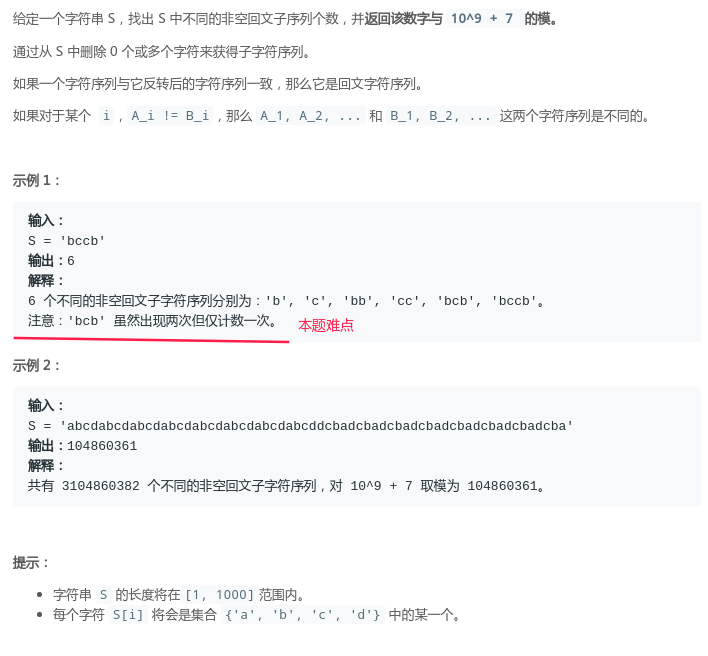
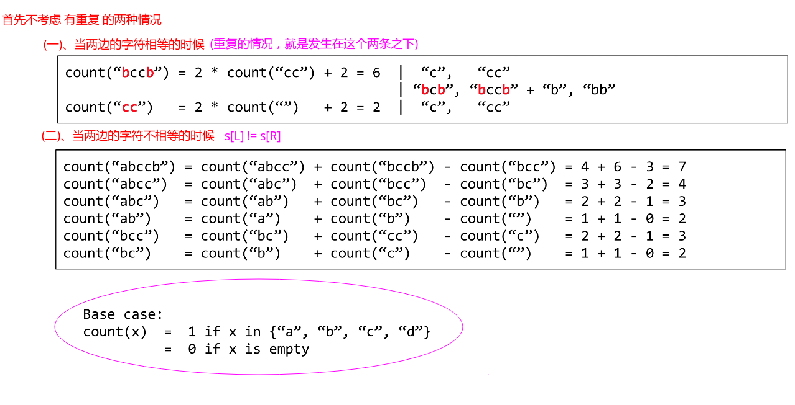
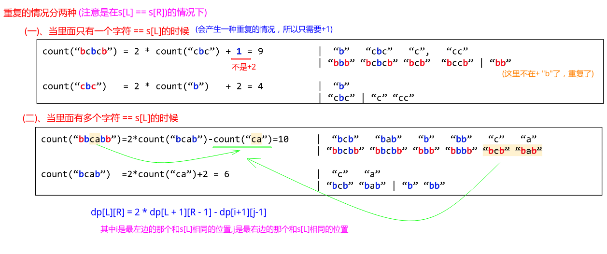
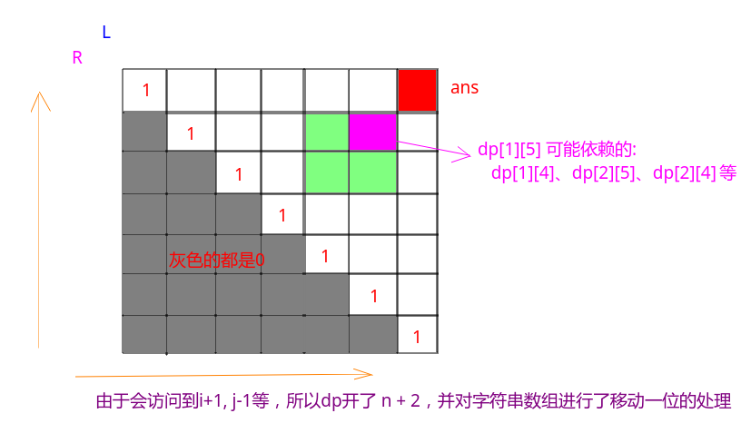

## LeetCode - 730. Count Different Palindromic Subsequences(统计不同回文子字符串的数量)

#### [题目链接](https://leetcode.com/problems/count-different-palindromic-subsequences/)

> https://leetcode-cn.com/problems/count-different-palindromic-subsequences/

#### 题目



#### 解析

首先不考虑重复的情况:

我们的递归函数设计的是求`[L, R]`区间的种类数。

当`s[L] == s[R]`的时候:

* 就是`2 * count(L+1, R-1) + 2`；因为下一层返回的结果，我们可以在两边分别都加上`s[L]`和`s[R]`于是就是两倍了；
* 此外，还要加上我们自己本身两个字符`s[L]、s[R]`，这是两种情况；
* 所以就是`count[L, R] = 2 * count[L+1, R-1] + 2`；

当`s[L] != s[R]`的时候:

* 我们的种类数就是`count(L, R) = count[L, R-1] + count(L+1, R) - count(L+1, R-1)`；



再来看重复的情况，注意只有在`s[L] == s[R]`的时候才考虑重复的情况:

* 当里面只有一个字符和`s[L]`相等的时候，就是`count(L, R) = count(L+1, R-1) + 1`，即`+2`改成了`+1`，因为有一种情况重复了；
* 此外就是有多个和`s[L]`相同的字符，我们找到最左边的和最右边的相同的字符，我们的结果就是`2 * count(L + 1, R - 1) - count(i + 1, j - 1) `，也就是减去中间会产生重复的部分；



记忆化递归:

```java
public class Solution {

    private char[] s;
    private int dp[][];
    private final int mod = 1000000000 + 7;

    public int rec(int L, int R) {
        if (L > R)
            return 0;
        if (L == R)
            return 1;
        if (dp[L][R] != 0) return dp[L][R];
        long res = 0;
        if (s[L] == s[R]) {
            int i = L + 1, j = R - 1;
            while (i <= j && s[i] != s[L]) i++; //找到最左边的和s[L]相同的
            while (j >= i && s[j] != s[R]) j--; //找到最右边的和s[R]相同的
            if (i == j)     // 只有一个和s[L](s[R])相同的
                res = 2 * rec(L + 1, R - 1) + 1;
            else if (i > j) // 没有 和s[L](s[R])相同的
                res = 2 * rec(L + 1, R - 1) + 2;
            else           // 有多个和s[L](s[R])相同的，取最左的和最右的
                res = 2 * rec(L + 1, R - 1) - rec(i + 1, j - 1);
        } else
            res = rec(L, R - 1)+ rec(L + 1, R) - rec(L + 1, R - 1);
//        return dp[L][R] = (int) ( res % mod ); //错误
        return dp[L][R] = (int) ( (res+mod) % mod);
    }

    public int countPalindromicSubsequences(String S) {
        if (S == null || S.length() == 0)
            return 0;
        s = S.toCharArray();
        dp = new int[S.length()][S.length()];
        return rec(0, S.length() - 1) % mod;
    }
}
```
改成dp：




递推的形式:

```java
public class Solution {

    private final int mod = 1000000000 + 7;

    public int countPalindromicSubsequences(String S) {
        if (S == null || S.length() == 0)
            return 0;
        int n = S.length();
        char[] s = new char[n + 1];
        for (int i = 0; i < n; i++) s[i + 1] = S.charAt(i); //为了下面考虑方便
        int[][] dp = new int[n + 2][n + 2]; //要考虑下标，所以多开了2的长度

        for (int i = 1; i <= n; i++) dp[i][i] = 1;

        for (int i = n; i >= 1; i--) {//注意从下到上
            for (int j = i + 1; j <= n; j++) {//从左到右
                if (s[i] == s[j]) {
                    int l = i + 1, r = j - 1;
                    while (l <= r && s[l] != s[i]) l++;
                    while (r >= l && s[r] != s[j]) r--;
                    if (l == r)
                        dp[i][j] = 2 * dp[i + 1][j - 1] + 1;
                    else if (l > r)
                        dp[i][j] = 2 * dp[i + 1][j - 1] + 2;
                    else
                        dp[i][j] = 2 * dp[i + 1][j - 1] - dp[l + 1][r - 1];
                } else
                    dp[i][j] = dp[i + 1][j] + dp[i][j - 1] - dp[i + 1][j - 1];
                dp[i][j] = dp[i][j] < 0 ? dp[i][j] + mod : dp[i][j] % mod; // 注意dp[i][j] < 0(溢出)的情况
            }
        }
        return (dp[1][n] + mod) % mod;
    }
}
```

