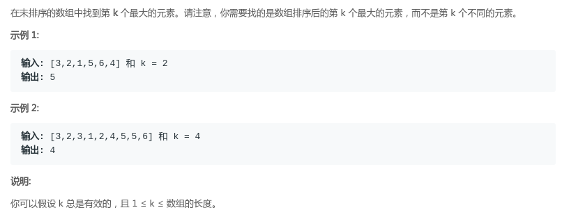

## LeetCode - 215. Kth Largest Element in an Array(6种写法(包括BFPRT算法))

 - 最小堆(非递归调整)
 - 最小堆(递归调整)
 - 最大堆
 - Hash思想
 - 分治解法(利用快排的partition过程)
 - BFPRT算法

***
#### [题目链接](https://leetcode.com/problems/kth-largest-element-in-an-array/description/)

> https://leetcode.com/problems/kth-largest-element-in-an-array/description/

#### 题意




 在未排序的数组中找到第` k `个最大的元素。<font color = red>注意这个和找第`K`小的数，以及求出最小(大)的`k`个数是一样的，包括剑指`Offer`里面的[找第K小的数。](https://blog.csdn.net/zxzxzx0119/article/details/79807343#t4)</font>

### 最小堆(非递归调整)
**最小堆的方法就是先用`K`个数建成一个堆，然后后面的数和堆顶(最小的数)比较，如果大于堆顶，就替换这个堆顶，然后调整堆，最后，堆顶就是答案。这个方法可以达到`O(N*logK)`的时间复杂度**
```java
class Solution {
    public int findKthLargest(int[] nums, int k) {
        if (nums == null || nums.length == 0) return Integer.MAX_VALUE;
        int[] KHeap = new int[k]; //建成一个有K个数的堆
        for (int i = 0; i < k; i++) {
            heapInsert(KHeap, nums[i], i);
        }
        //后面的数如果
        for (int i = k; i < nums.length; i++) {
            if (nums[i] > KHeap[0]) {
                KHeap[0] = nums[i];
                siftDown(KHeap, 0, k); //调整从0到k
            }
        }
        return KHeap[0];
    }

    //插入数一直往上面调整的过程
    private void heapInsert(int[] KHeap, int num, int i) {
        KHeap[i] = num;
        while (KHeap[i] < KHeap[(i - 1) / 2]) {
            swap(KHeap, i, (i - 1) / 2);
            i = (i - 1) / 2;
        }
    }

    //这个函数就是一个数变大了，往下沉的函数,改变的数为index  目前的自己指定的堆的大小为heapSize
    private void siftDown(int[] kHeap, int i, int heapSize) {
        int L = 2 * i + 1;
        while (L < heapSize) {
            int maxIndex = L + 1 < heapSize && kHeap[L + 1] < kHeap[L] ? L + 1 : L;
            maxIndex = kHeap[i] < kHeap[maxIndex] ? i : maxIndex;
            if (maxIndex == i) break; //自己就是最大的不用往下面沉
            swap(kHeap, i, maxIndex);
            i = maxIndex;
            L = 2 * i + 1;
        }
    }

    private void swap(int[] arr, int a, int b) {
        int temp = arr[a];
        arr[a] = arr[b];
        arr[b] = temp;
    }
}  
```

***
### 最小堆(递归调整)
这里只是把上面调整堆的过程改成递归写一下。

```java
class Solution {
    public int findKthLargest(int[] nums, int k) {
        if (nums == null || nums.length == 0) return Integer.MAX_VALUE;
        int[] KHeap = new int[k]; //建成一个有K个数的堆
        for (int i = 0; i < k; i++) {
            heapInsert(KHeap, nums[i], i);
        }
        //后面的数如果
        for (int i = k; i < nums.length; i++) {
            if (nums[i] > KHeap[0]) {
                KHeap[0] = nums[i];
                siftDown(KHeap, 0, k); //调整从0到k
            }
        }
        return KHeap[0];
    }

    private void heapInsert(int[] KHeap, int num, int i) {
        KHeap[i] = num;
        while (KHeap[i] < KHeap[(i - 1) / 2]) {
            swap(KHeap, i, (i - 1) / 2);
            i = (i - 1) / 2;
        }
    }

    public void siftDown(int[] data, int i, int size) { //从A[i] 开始往下调整
        int L = 2 * i + 1;   //左孩子的下标
        int R = 2 * i + 2;   //右孩子的下标
        int maxi = i;
        if (L < size && data[L] < data[maxi]) maxi = L;
        if (R < size && data[R] < data[maxi]) maxi = R;
        if (maxi != i) {
            swap(data, i, maxi);  //把当前结点和它的最大(直接)子节点进行交换
            siftDown(data, maxi, size);  //继续调整它的孩子
        }
    }

    private void swap(int[] arr, int a, int b) {
        int temp = arr[a];
        arr[a] = arr[b];
        arr[b] = temp;
    }
}
```
***
### 最大堆
最大堆的做法和最小堆有点不同，一开始将**整个数组**中的元素构成一个最大堆，这时堆顶元素是最大的，连续将堆顶元素弹出`k-1`次(**每次弹出后都要调整**)后堆顶元素就是第k大的数了。
```java
class Solution {
    public int findKthLargest(int[] nums, int k) {
        if (nums == null || nums.length == 0) return Integer.MAX_VALUE;
        int[] KHeap = new int[nums.length]; //建成一个有K个数的堆
        for (int i = 0; i < nums.length; i++) {
            heapInsert(KHeap, nums[i], i);
        }
        int size = nums.length;
        for (int i = 0; i < k - 1; i++) { //弹出k个
            swap(KHeap, 0, size - 1);
            size--;
            siftDown(KHeap, 0, size);
        }
        return KHeap[0];
    }


    //插入数一直往上面调整的过程
    private void heapInsert(int[] KHeap, int num, int i) {
        KHeap[i] = num;
        while (KHeap[i] > KHeap[(i - 1) / 2]) {
            swap(KHeap, i, (i - 1) / 2);
            i = (i - 1) / 2;
        }
    }

    //这个函数就是一个数变大了，往下沉的函数,改变的数为index  目前的自己指定的堆的大小为heapSize
    private void siftDown(int[] kHeap, int i, int heapSize) {
        int L = 2 * i + 1;
        while (L < heapSize) {
            int maxIndex = L + 1 < heapSize && kHeap[L + 1] > kHeap[L] ? L + 1 : L;
            maxIndex = kHeap[i] > kHeap[maxIndex] ? i : maxIndex;
            if (maxIndex == i) break; //自己就是最大的不用往下面沉
            swap(kHeap, i, maxIndex);
            i = maxIndex;
            L = 2 * i + 1;
        }
    }

    private void swap(int[] arr, int a, int b) {
        int temp = arr[a];
        arr[a] = arr[b];
        arr[b] = temp;
    }
}
```
***
### Hash思想
这个是提交的时候，点击了最快的那个解答看了一下，觉得有点厉害。
```java
class Solution {
    /** Hash思想 */
    public int findKthLargest(int[] nums, int k) {
        if (nums == null || nums.length == 0) return Integer.MAX_VALUE;
        int max = nums[0], min = nums[0];
        for (int i = 0; i < nums.length; i++) {
            if (nums[i] > max) max = nums[i];
            if (nums[i] < min) min = nums[i];
        }
        int[] arr = new int[max - min + 1];
        for (int n : nums) arr[max - n]++;
        int sum = 0;
        for (int i = 0; i < arr.length; i++) {
            sum += arr[i];
            if (sum >= k) {
                return max - i;
            }
        }
        return 0;
    }
}
```
***
### 分治解法(利用快排的partition过程)
这个方法就是利用快排的`partition`将数组分成左边部分大于某个数，中间部分等于某个数，右边部分小于某个数(<font color = red>如果是求第`k`小的就是左边小于某个数，中间等于某个数，右边大于某个数</font>),然后我们每次划分之后，递归的从左边或者从右边去找第`K`大的数，直到找到在等于部分的。
```java
class Solution {
    /** 分治 */
    public int findKthLargest(int[] nums, int k) {
        if (nums == null || nums.length == 0) return Integer.MAX_VALUE;
        return process(nums, 0, nums.length - 1, k - 1); //一定要注意这里是k-1
    }

    public int process(int[] arr, int L, int R, int k) {
        if (L == R) return arr[L];
        int[] p = partition(arr, L, R, arr[L + (int) (Math.random() * (R - L + 1))]); //随机选一个数划分
        if (k >= p[0] && k <= p[1])
            return arr[k];
        else if (k < p[0])
            return process(arr, L, p[0] - 1, k);
        else 
            return process(arr, p[1] + 1, R, k);
    }

    //划分函数 左边的都比num大，右边的都比num小  用一个数组来记录和num相等的下标的下限和上限
    public int[] partition(int[] arr, int L, int R, int num) {
        int less = L - 1; //小于部分的最后一个数
        int more = R + 1;
        int cur = L;
        while (cur < more) {
            if (arr[cur] > num) {
                swap(arr, ++less, cur++); //把这个比num大的数放到大于区域的下一个，并且把小于区域扩大一个单位
            } else if (arr[cur] < num) {
                swap(arr, --more, cur); //把这个比num小的数放到小于去余的下一个，并且把小于区域扩大一个单位
                //同时，因为从小于区域拿过来的数是未知的，所以不能cur++ 还要再次判断一下arr[cur]
            } else {
                cur++;
            }
        }
        return new int[]{less + 1, more - 1};  //返回的是等于区域的两个下标
    }

    private void swap(int[] arr, int a, int b) {
        int temp = arr[a];
        arr[a] = arr[b];
        arr[b] = temp;
    }
}
```
***
### BFPRT算法
这个方法其实是在上面的分治方法上面的改进，唯一的不同就是<font color = red>寻找那个划分的数的不同</font>，上面的数是随机生成的数，而`BFPRT`算法能找到那样一个数，使得划分的时候左右两边相对均匀，看下面的具体的求解过程: 


看下面的一个例子：


```java
class Solution {

    public int findKthLargest(int[] arr, int K) {
        int[] copyArr = copyArray(arr); //不改变原来的数组
        return select(copyArr, 0, copyArr.length - 1, K - 1);
    }

    public int[] copyArray(int[] arr) {
        int[] res = new int[arr.length];
        for (int i = 0; i != res.length; i++) {
            res[i] = arr[i];
        }
        return res;
    }

    public int select(int[] arr, int L, int R, int k) {
        if (L == R) {
            return arr[L];
        }
        int pivot = medianOfMedians(arr, L, R); //获得这个划分的标准
        int[] p = partition(arr, L, R, pivot);
        if (k >= p[0] && k <= p[1])
            return arr[k];
        else if (k < p[0])
            return select(arr, L, p[0] - 1, k);
        else
            return select(arr, p[1] + 1, R, k);
    }

    //划分函数 左边的都比num大，右边的都比num小  用一个数组来记录和num相等的下标的下限和上限
    public int[] partition(int[] arr, int L, int R, int num) {
        int less = L - 1; //小于部分的最后一个数
        int more = R + 1;
        int cur = L;
        while (cur < more) {
            if (arr[cur] > num)
                swap(arr, ++less, cur++); //把这个比num大的数放到大于区域的下一个，并且把小于区域扩大一个单位
            else if (arr[cur] < num)
                swap(arr, --more, cur); //把这个比num小的数放到小于去余的下一个，并且把小于区域扩大一个单位
                //同时，因为从小于区域拿过来的数是未知的，所以不能cur++ 还要再次判断一下arr[cur]
            else
                cur++;
            
        }
        return new int[]{less + 1, more - 1};  //返回的是等于区域的两个下标
    }

    //划分成5组，取出每一组中的中位数，组成一个中位数组
    public int medianOfMedians(int[] arr, int L, int R) {
        int num = R - L + 1;
        int offset = num % 5 == 0 ? 0 : 1;
        int[] mArr = new int[num / 5 + offset];
        for (int i = 0; i < mArr.length; i++) {
            int beginI = L + i * 5;
            int endI = beginI + 4;
            mArr[i] = getMedian(arr, beginI, Math.min(R, endI));
        }
        return select(mArr, 0, mArr.length - 1, mArr.length / 2);
    }


    //得到中位数
    public int getMedian(int[] arr, int L, int R) {
        insertionSort(arr, L, R);
        int sum = L + R;
        int mid = (sum / 2) + (sum % 2);
        return arr[mid];
    }

    //插入排序
    public void insertionSort(int[] arr, int L, int R) {
        for (int i = L + 1; i <= R; i++) {
            for (int j = i; j > L && arr[j] < arr[j - 1]; j--)
                swap(arr, j, j - 1);
        }
    }

    private void swap(int[] arr, int a, int b) {
        int temp = arr[a];
        arr[a] = arr[b];
        arr[b] = temp;
    }
}
```

**只要得到了第`K`(小/大)的数，要得到最小(大)的`K`个数，就很简单了，再遍历一遍就可以了，如下面的函数，得到最小的`K`个数:** 

```java
    public int[] getMinKNums(int[] arr, int k) {
        if (k < 1 || k > arr.length) {
            return arr;
        }
        int minKth = findKthLargest(arr, k);
        int[] res = new int[k];
        int index = 0;
        for (int i = 0; i < arr.length; i++) {
            if (arr[i] < minKth) {
                res[index++] = arr[i];
            }
        }
        for (; index < res.length; index++) {
            res[index] = minKth;
        }
        return res;
    }
```
