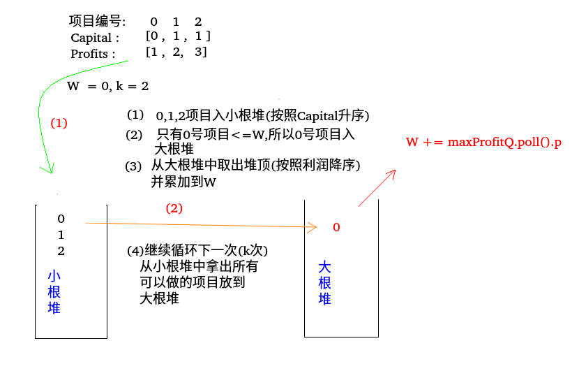

## LeetCode - 502. IPO(贪心 + 堆)
#### [题目链接](https://leetcode.com/problems/ipo/description/)

> https://leetcode.com/problems/ipo/description/

#### 题目 


***
#### 解析  
 这个题目要用到贪心的思想，首先准备两个堆，一个按照**花费成本升序的小根堆**，另一个按照**纯利润降序的大根堆**。

 - 首先我们将所有的项目加入到**小根堆**中，则这个堆中的项目是按照花费成本升序的。
 - 然后，我们从**小根堆**中拿出所有能做的项目(目前的`W`(目前有的钱))放到按照利润降序的**大根堆**中。
 - 然后我们从大根堆中取出堆顶元素，也就是说我们这一次做这个项目。
 - 循环`K`次，做`K`个项目。
 - 注意，当大根堆中没有元素，但是循环没有结束的时候，就可以返回了，因为现有的钱已经做不起任何的项目。

看题目中例子的过程:




代码如下 : 

```java
class Solution {

    //花费和利润的结构体
    private class Node {
        public int p;
        public int c;

        public Node(int p, int c) {
            this.p = p;
            this.c = c;
        }
    }

    public int findMaximizedCapital(int k, int W, int[] Profits, int[] Capital) {
        Node[] node = new Node[Profits.length];
        for (int i = 0; i < Profits.length; i++) {
            node[i] = new Node(Profits[i], Capital[i]);
        }
        // minHeap by c
        PriorityQueue<Node> minCostQ = new PriorityQueue<>((o1, o2) -> o1.c - o2.c);
        // maxHeap by p
        PriorityQueue<Node> maxProfitQ = new PriorityQueue<>((o1, o2) -> -(o1.p - o2.p));
        for (int i = 0; i < node.length; i++)
            minCostQ.add(node[i]);
        //最多做k个项目
        for (int i = 0; i < k; i++) {
            while (!minCostQ.isEmpty() && minCostQ.peek().c <= W)
                maxProfitQ.add(minCostQ.poll());
            if (maxProfitQ.isEmpty()) return W; //不能做了　做不起了
            W += maxProfitQ.poll().p;
        }
        return W;
    }
}
```
