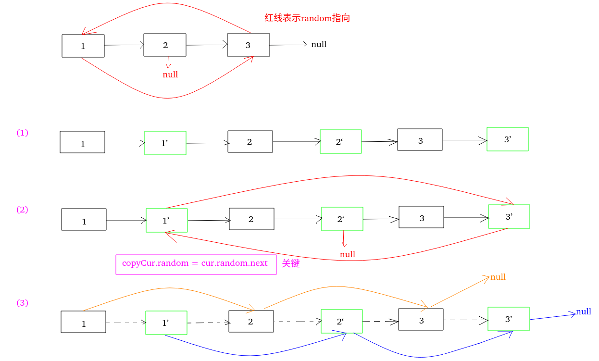

## LeetCode - 138. Copy List with Random Pointer(含有随机指针的链表的拷贝)
 - 方法一 : 使用HashMap保存
 - 方法二 : 方法一的另一种写法
 - 方法三 : O(1)的空间复杂度
***
#### [题目链接](https://leetcode.com/problems/copy-list-with-random-pointer/description/)

> https://leetcode.com/problems/copy-list-with-random-pointer/description/

#### 题意
给定一个链表，每个节点包含一个额外增加的随机指针，该指针可以指向链表中的任何节点或空节点。

要求返回这个链表的深度拷贝。 


给出的链表的结构: 
```java
 class RandomListNode {
      int label;
      RandomListNode next, random;
      RandomListNode(int x) { this.label = x; }
  };
```

这个题目在[**剑指Offer**](https://blog.csdn.net/zxzxzx0119/article/details/79807343)中也出现过。
***
### 方法一 : 使用HashMap保存
* 从左到右遍历链表，对每个结点都复制生成相应的副本结点，然后将对应的关系(之前的结点和新的副本结点)放入哈希表中；
* 然后从左到右设置每一个副本结点的`next`和`random`指针，即找到原先`cur`的`next`和`random`的拷贝(从`Map`中获取)；
* 最后返回副本结点的头结点(`map.get(head)`)即可；

看一个例子: 


```java
class Solution {

    //普通的使用一个HashMap的额外空间为O(n)的方法
    public RandomListNode copyRandomList(RandomListNode head) {
        if (head == null)
            return null;
        HashMap<RandomListNode, RandomListNode> map = new HashMap<>();

        RandomListNode cur = head;
        while (cur != null) {
            map.put(cur, new RandomListNode(cur.label));
            cur = cur.next;
        }
        cur = head;
        while (cur != null) {
            map.get(cur).next = map.get(cur.next);
            map.get(cur).random = map.get(cur.random);
            cur = cur.next;
        }
        return map.get(head);
    }
}
```

***
### 方法二 : 方法一的另一种写法

 * 方法一的写法是第一次存储每个结点的时候没有直接找到拷贝结点的`next`域结点；
 * 这个方法是在拷贝原结点的时候，顺便拷贝了结点的`next`域，拷贝完`next`域之后，最后就只要拷贝`random`域了；
 * 注意这里使用`cur`指向原链表的`head`，使用`copyCur`指向复制链表的`head`，然后这两个指针同时完成的是两个工作: 先设置好副本拷贝结点的`next`域，然后将对应的原来链表的结点和拷贝的结点`put`进`map`，然后`cur`和`copyCur`都同时向后继续移动一个位置；

```java

class Solution {
    //使用Map的另一种写法，速度一般
    public RandomListNode copyRandomList(RandomListNode head) {
        if (head == null)
            return null;
        HashMap<RandomListNode, RandomListNode> map = new HashMap<>();
        RandomListNode copyHead = new RandomListNode(head.label);
        map.put(head, copyHead);

        RandomListNode cur = head, copyCur = copyHead;

        while (cur != null) {
            if (cur.next != null)
                copyCur.next = new RandomListNode(cur.next.label);
            map.put(cur.next, copyCur.next);
            cur = cur.next;
            copyCur = copyCur.next;
        }

        cur = head;
        while (cur != null) {
            map.get(cur).random = map.get(cur.random);
            cur = cur.next;
        }
        return copyHead;
    }
}
```
由于链表的天然的递归结构，也可以使用递归的写法: 

```java
class Solution {
    //上一种方法的递归的写法
    public RandomListNode copyRandomList(RandomListNode head) {
        if (head == null)
            return null;
        HashMap<RandomListNode, RandomListNode> map = new HashMap<>();
        RandomListNode copyHead = rec(head, map);

        RandomListNode cur = head;
        while (cur != null) {
            map.get(cur).random = map.get(cur.random);
            cur = cur.next; 
        }
        return copyHead;
    }

    // 宏观来看: 就是返回拷贝以node为头结点的链表的拷贝 以及next的拷贝
    private RandomListNode rec(RandomListNode node, HashMap<RandomListNode, RandomListNode> map) {
        if (node == null) 
            return null;
        RandomListNode copyNode = new RandomListNode(node.label);
        map.put(node, copyNode);
        copyNode.next = rec(node.next, map);
        return copyNode;
    }
}
```


 ### 方法三 : O(1)的空间复杂度
这个方法是最好的解决办法，分为三个步骤: 
* 第一个步骤，先从左到右遍历一遍链表，对每个结点`cur`都复制生成相应的副本结点`copy`，然后把副本结点`copy`放在`cur`和下一个要遍历结点的中间；
* 再从左到右遍历一遍链表，在遍历时设置每一个结点的副本结点的`random`指针；
* 设置完`random`指针之后，将链表拆成两个链表，返回第二个链表的头部；




```java
class Solution {
    //O(1)的空间复杂度
    public RandomListNode copyRandomList(RandomListNode head) {

        if (head == null)
            return null;

        RandomListNode cur = head, next = null;

        //先拷贝一份原来的链表
        while (cur != null) {
            next = cur.next;  //先存着之前的next
            cur.next = new RandomListNode(cur.label);
            cur.next.next = next;
            cur = next;
        }

        //复制结点的random指针
        cur = head;
        RandomListNode copyCur = null;
        while (cur != null) {
            next = cur.next.next; //保存原来链表中的下一个
            copyCur = cur.next; //复制链表的cur
            copyCur.random = cur.random != null ? cur.random.next : null;
            cur = next;
        }

        //拆开两个链表
        RandomListNode copyHead = head.next;
        cur = head;
        while (cur != null) {
            next = cur.next.next;
            copyCur = cur.next;
            cur.next = next;
            copyCur.next = next != null ? next.next : null;
            cur = next;
        }
        return copyHead;
    }
}
```

