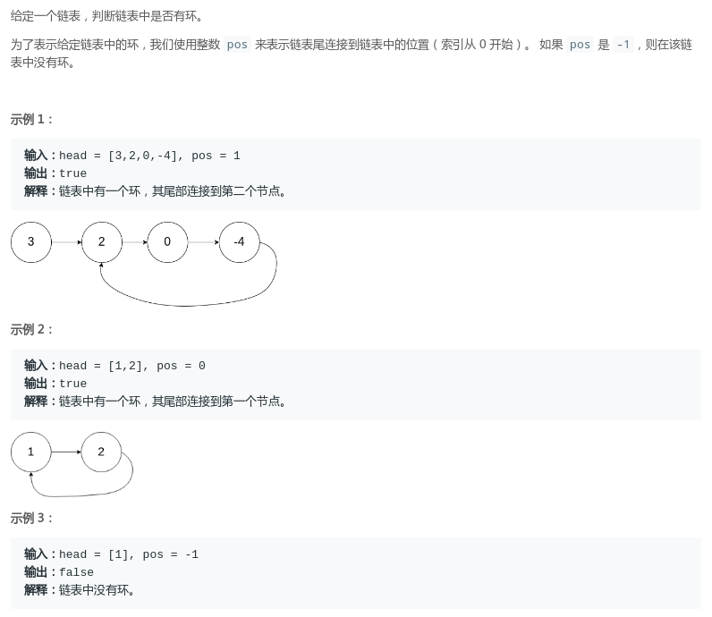
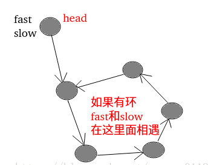

## LeetCode - 141. Linked List Cycle  & 160. Intersection Of Two Linked Lists(链表成环问题)
* [LeetCode - 141. Linked List Cycle-判断是否有环](#leetcode---141-linked-list-cycle-判断是否有环)
* [LeetCode - 142. Linked List Cycle II-找到第一个入环节点](#leetcode---142-linked-list-cycle-ii-找到第一个入环节点)
* [LeetCode - 160. Intersection Of Two Linked Lists-找到两个链表的第一个相交的节点-两个链表都无环](#leetcode---160-intersection-of-two-linked-lists-找到两个链表的第一个相交的节点-两个链表都无环)
* [扩展问题-两个链表可以有环的情况下找到两个链表的第一个相交的节点](#扩展问题-两个链表可以有环的情况下找到两个链表的第一个相交的节点)

***
### LeetCode - 141. Linked List Cycle-判断是否有环
#### [题目链接](https://leetcode.com/problems/linked-list-cycle/)

> https://leetcode.com/problems/linked-list-cycle/

#### 题目

#### 解析
第一种做法:  使用`HashSet`记录已经走过的节点，如果再次碰到，则有环: 

```java
public class Solution {
    public boolean hasCycle(ListNode head) {
        if (head == null)
            return false;
        HashSet<ListNode> set = new HashSet<>();
        ListNode cur = head;
        while (cur != null) {
            if (set.contains(cur))
                return true;
            set.add(cur);
            cur = cur.next;
        }
        return false;
    }
}
```
题目要求不能使用额外的空间，所以第二种解法: 

* 使用两个指针，一个快指针`fast`一次走两步，慢指针一次走一步；
* 如果快指针`fast`某个时刻走到空了，说明没有环， <font color = red>**因为如果有环，快指针一定不会走到空(慢指针也不会(因为是单链表))**；
* 所以如果`fast`没有走到空，那快指针`fast`和慢指针`slow`就会在环里面打圈，因为`fast`更快，所以一定会追上`slow`，当`fast == slow`的时候就返回`true`就可以了；


```java
public class Solution {
    public boolean hasCycle(ListNode head) {
        if (head == null)
            return false;
        ListNode slow = head;
        ListNode fast = head;
        while (fast.next != null && fast.next.next != null) {
            fast = fast.next.next;
            slow = slow.next;
            if (fast == slow)
                return true;
        }
        return false;
    }
}
```
***
### LeetCode - 142. Linked List Cycle II-找到第一个入环节点
#### [题目链接](https://leetcode.com/problems/linked-list-cycle-ii/)

> https://leetcode.com/problems/linked-list-cycle-ii/

#### 题目

#### 解析
同样可以使用`HashSet`，但是也不符合题目使用`O(1)`空间的要求。
`O(1)`空间的解法还是使用快慢指针，唯一的不同就是

* <font color = red>他们相遇之后，让`fast`回到`head`(头结点)，然后两个指针每次都只走一步，他们一定会相遇，而且相遇的节点就是第一个入环节点</font>；

<font color = blue>按照上面的思路写出代码很简单，关键是怎么证明就是那样走? 

看下图的解释，需要证明的是 边`a == 边c`，即最后可以`fast`和`slow`一起一步一步的走。。。


```java
public class Solution {
    public ListNode detectCycle(ListNode head) {
        if (head == null)
            return null;
        ListNode fast = head;
        ListNode slow = head;

        while (fast.next != null && fast.next.next != null) {
            fast = fast.next.next;
            slow = slow.next;
            if (fast == slow) {//当fast和slow相交的时，让fast回到起点，fast和slow都只走一步，然后fast和slow第一次相遇的地方就是交点
                fast = head;
                while (fast != slow) {
                    fast = fast.next;
                    slow = slow.next;
                }
                return fast;
            }
        }
        return null;
    }
}
```
***
### LeetCode - 160. Intersection Of Two Linked Lists-找到两个链表的第一个相交的节点-两个链表都无环
#### [题目链接](https://leetcode.com/problems/intersection-of-two-linked-lists/)

> https://leetcode.com/problems/intersection-of-two-linked-lists/

#### 题目


#### 解析

一个比较好的解法是: 

* 先统计两个链表的长度l`enA`和`lenB`(都先遍历一次)；
* 然后判断两个链表各自走到最后的指针`end1`和`end2`是否相等，如果不相等，直接返回`false`;
* 然后如果`lenA > lenB`，则`B`链表的指针先走`lenA - lenB`步，然后两个指针一起走，第一个相等的节点就是相交的节点；
* 同理`lenB > lenA`，则`A`链表的指针先走`lenB - lenA`步，然后一起走；

```java
public class Solution {
    public ListNode getIntersectionNode(ListNode headA, ListNode headB) {
        if (headA == null || headB == null)
            return null;

        //先求出两个链表的长度
        int lenA = 1;
        ListNode cur1 = headA;
        while (cur1.next != null) {
            lenA++;
            cur1 = cur1.next;
        }
        int lenB = 1;
        ListNode cur2 = headB;
        while (cur2.next != null) {
            lenB++;
            cur2 = cur2.next;
        }
        //最后都不相等，肯定不相交
        if (cur1 != cur2)
            return null;

        // cur1是长的,cur2是短的
        cur1 = lenA > lenB ? headA : headB;
        cur2 = cur1 == headA ? headB : headA;
        int n = Math.abs(lenA - lenB);

        //cur1先走 abs(lenA - lenB步)
        while (n > 0) {
            n--;
            cur1 = cur1.next;
        }

        //一起走，第一次相遇就是交点
        while (cur1 != cur2) {
            cur1 = cur1.next;
            cur2 = cur2.next;
        }
        return cur1;
    }
}
```
***
### 扩展问题-两个链表可以有环的情况下找到两个链表的第一个相交的节点

#### 问题: 
> <font color = blue>**两个链表，可以有环或者无环，可以相交或者不相交，如果相交，返回第一个入环节点，否则返回`null`。**

#### 解析

有三种情况: 

* <font color = blue>一个链表有环，另一个链表无环，这种情况两个链表不可能相交(不论怎么画)，直接返回`null`；
* 两个链表都无环，就是`LeetCode160`的解法；
* <font color = red>第三种情况： 两个链表有环，这种情况又可以分为三种情况。

第三种情况的三种情况，假设链表`1`的第一个入环节点记为`loop1`，链表`2`的第一个入环节点记为`loop2`：

* 如果`loop1 == loop2`，则两个链表结构如图(一)所示，这时我们只要考虑`head1`到`loop1`和`head2`到`loop2`的部分也就是图中红色阴影的部分，<font color = red>这个又是`LeetCode160`的处理方式，只不过改了结束的位置；
* 如果`loop1 != loop2`，则又分两种情况，第一种如图(二)，第二种如图三，区别这两种方式的方法看下图解释；


代码如下: 

```java
public class Solution {
     //主过程
    public ListNode getIntersectionNode(ListNode head1, ListNode head2) {
        if (head1 == null || head2 == null) {
            return null;
        }
        ListNode loop1 = detectCycle(head1);
        ListNode loop2 = detectCycle(head2);
        if (loop1 == null && loop2 == null) {
            return getIntersectionNodeNoLoop(head1, head2); //两个都无环的处理方式
        }
        if (loop1 != null && loop2 != null) {
            return bothLoop(head1, loop1, head2, loop2);  //两个都有环的处理
        }
        return null;  // 一个有环一个无环
    }

    //找到某个链表第一个入环节点
    public ListNode detectCycle(ListNode head) {
        if(head == null)
            return null;
        ListNode fast = head;
        ListNode slow = head;

        while(fast.next != null && fast.next.next != null){
            fast = fast.next.next;
            slow = slow.next;
            if(fast == slow){//当fast和slow相交的时，让fast回到起点，fast和slow都只走一步，然后fast和slow第一次相遇的地方就是交点
                fast = head;
                while(fast != slow){
                    fast = fast.next;
                    slow = slow.next;
                }
                return fast;
            }
        }
        return null;
    }

    public ListNode getIntersectionNodeNoLoop(ListNode headA, ListNode headB) {
        if(headA == null || headB == null)
            return null;

        //先求出两个链表的长度
        int lenA = 1;
        ListNode cur1 = headA;
        while(cur1.next != null){
            lenA++;
            cur1 = cur1.next;
        }
        int lenB = 1;
        ListNode cur2 = headB;
        while(cur2.next != null){
            lenB++;
            cur2 = cur2.next;
        }
        //最后都不相等，肯定不相交
        if(cur1 != cur2)
            return null;

        // cur1是长的,cur2是短的
        cur1 = lenA > lenB ? headA : headB;
        cur2 = cur1 == headA ? headB : headA;
        int n = Math.abs(lenA - lenB);

        //cur1先走 abs(lenA - lenB步)
        while(n > 0){
            n--;
            cur1 = cur1.next;
        }

        //一起走，第一次相遇就是交点
        while(cur1 != cur2){
            cur1 = cur1.next;
            cur2 = cur2.next;
        }
        return cur1;
    }

    //两个都有环的处理
    public ListNode bothLoop(ListNode head1, ListNode loop1, ListNode head2, ListNode loop2) {
        ListNode cur1 = null;
        ListNode cur2 = null;

        if (loop1 == loop2) { // 图(一)情况　类似无环的处理 LeetCode 160  这里和上面处理稍有点不同
            cur1 = head1;
            cur2 = head2;
            int n = 0;
            while (cur1 != loop1) {
                n++;
                cur1 = cur1.next;
            }
            while (cur2 != loop2) {
                n--;
                cur2 = cur2.next;
            }
            cur1 = n > 0 ? head1 : head2;
            cur2 = cur1 == head1 ? head2 : head1;
            n = Math.abs(n);
            while (n != 0) {
                n--;
                cur1 = cur1.next;
            }
            while (cur1 != cur2) {
                cur1 = cur1.next;
                cur2 = cur2.next;
            }
            return cur1;
        } else {  //图(三)　的情况
            cur1 = loop1.next;
            while (cur1 != loop1) {
                if (cur1 == loop2) {
                    return loop1;
                }
                cur1 = cur1.next;
            }
            return null;
        }
    }
}
```


